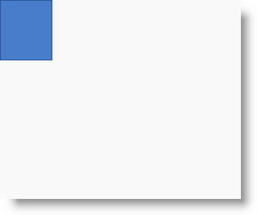

////

|metadata|
{
    "name": "xamdiagram-configuring-the-position-and-size-of-diagram-nodes",
    "tags": ["Charting","Data Presentation","How Do I"],
    "controlName": ["xamDiagram"],
    "guid": "197cf0e5-fc69-49a7-bc53-af8171cdad1c",  
    "buildFlags": [],
    "createdOn": "2014-06-16T09:30:45.5224584Z"
}
|metadata|
////

= Configuring the Position and Size of Diagram Nodes (xamDiagram)

== Topic Overview

=== Purpose

This topic explains how to control the size and position of individual diagram nodes of the  _xamDiagram_™ control. For information on how to manage the size and position of the nodes altogether, refer to the link:xamdiagram-configuring-the-layout.html[Configuring the Layout] topic.

=== Required background

The following topics are prerequisites to understanding this topic:

[options="header", cols="a,a"]
|====
|Topic|Purpose

| link:xamdiagram-general-overview.html[General Overview ( _xamDiagram_ )]
|This topic provides a conceptual overview of the _xamDiagram_ control and its main features and capabilities.

| link:xamdiagram-adding-to-a-page.html[Adding _xamDiagram_ to a Page]
|This topic explains how to add the _xamDiagram_ control to a {PlatformName} application.

|====

=== In this topic

This topic contains the following sections:

* <<_Ref385408385, Node Position and Size Configuration Summary >>

** <<_Ref388552307,Coordinate system of the diagram space>>
** <<_Ref386534590,Node position and size configuration summary>>
** <<_Ref385408391,Node position and size configuration summary chart>>

* <<_Ref388552386, Configuring the Position of a Diagram Node >>

** <<_Ref385408401,Overview>>
** <<_PropertySettings,Property settings>>
** <<_Ref385408408,Example>>

* <<_Ref385408414,>><<_Ref388552393, Configuring the Size of a Diagram Node >>

** <<_Ref385408417,Overview>>
** <<_Ref385408421,Property settings>>
** <<_Ref385408425,Example>>

* <<_Ref385408430, Related Content >>

** <<_Ref385408435,Topics>>
** <<_Ref385408439,Samples>>

[[_Ref385408385]]
== Node Position and Size Configuration Summary

[[_Ref388552307]]

=== Coordinate system of the diagram space

include::xamdiagram-coordinate-system.adoc[]

[[_Ref386534590]]

=== Node position and size configuration summary

The nodes of  _xamDiagram_   can be positioned either individually at any location on the diagram’s surface or by applying a layout algorithm (setting available through the link:{ApiPlatform}controls.charts.xamdiagram{ApiVersion}~infragistics.controls.charts.xamdiagram~layout.html[Layout] property. (For information about the latter approach, refer to the link:xamdiagram-configuring-the-layout.html[Configuring the Layout] topic.)

By default, if no explicit overriding has been applied, a newly created node is displayed at the point of origin of the coordinate system (0, 0).

The size of a diagram node can be controlled explicitly by setting its width and height. There is a default size which depends on its shape. (For reference on default sizes, see link:xamdiagram-visual-elements-overview.html#_Ref389665128[Nodes Default Sizes].)

.Note
[NOTE]
====

Note:

If the value of the node’s link:{ApiPlatform}controls.charts.xamdiagram{ApiVersion}~infragistics.controls.charts.diagramitem~content.html[Content] property does not fit within in the borders of the node, the content will overflow.
====

[[_Ref385408391]]

=== Node position and size configuration summary chart

The following table explains briefly the configurable aspects of a diagram node related to its position and size and maps them to the properties that configure them.

[options="header", cols="a,a,a"]
|====
|Configurable aspect|Details|Properties

|[[_Hlk356484826]] 

Node position
|The position of the node on the diagram represented as a point indicating the offset of the top-left corner of the node from the top-left corner of the diagram (in pixels), e.g. _“(5,25)_ _”_ .
|
* link:{ApiPlatform}controls.charts.xamdiagram{ApiVersion}~infragistics.controls.charts.diagramnode~position.html[Position] 

|Node size
|The size of the node results from setting its width and height which are managed independently by individual properties.
|
* `Width` 

* `Height` 

|Node’s behavior on resize
|When the user resizes a node, its horizontal/vertical aspect ratio can either be preserved (the node stretches or shrinks uniformly in both directions) or can be skewed according to the user’s mouse movement in horizontal or vertical direction (resulting in a new aspect ratio).
|
* link:{ApiPlatform}controls.charts.xamdiagram{ApiVersion}~infragistics.controls.charts.diagramnode~maintainaspectratio.html[MaintainAspectRatio] 

|====

[[_Ref388552386]]
== Configuring the Position of a Diagram Node

[[_Ref385408401]]

=== Overview

You specify the node position by providing the pixel values for the horizontal and vertical placement of the node on the diagram surface to the node’s `Position` property. The value format is  _“X ,Y_   _”_  , e.g.  _"75,125”_  .

[[_PropertySettings]]

=== Property settings

The following table maps the desired configuration to the property settings that manage it.

[options="header", cols="a,a,a"]
|====
|In order to:|Use this property:|And set it to:

|Configure the node position
| link:{ApiPlatform}controls.charts.xamdiagram{ApiVersion}~infragistics.controls.charts.diagramnode~position.html[Position]
|The desired X,Y coordinates in pixels, relative to the top-left edge of the diagram.

|====

[[_Ref385408408]]

=== Example

The screenshot below demonstrates node positioning as a result of the following settings:

[options="header", cols="a,a"]
|====
|Property|Value

| link:{ApiPlatform}controls.charts.xamdiagram{ApiVersion}~infragistics.controls.charts.diagramnode~position.html[Position]
| _“5, 125”_ 

|====

Following is the code that implements this example.

*In XAML:*

[source,xaml]
----
<ig:XamDiagram x:Name="diagram"
               Width="300"
               Height="250"
               Background="#F9F9F9">
    <ig:DiagramNode x:Name="node0"
                    Position="5,125"/>
</ig:XamDiagram>
----

[[_Ref388552393]]
[[_Ref385408414]]
== Configuring the Size of a Diagram Node

[[_Ref385408417]]

=== Overview

The size of a diagram node can be explicitly controlled by providing values for its `Width` and `Height` properties. By default the size depends on the node’s shape (for the pre-defined shapes).

In order to specify whether the aspect ratio of the diagram node should be preserved when resizing occurs, the link:{ApiPlatform}controls.charts.xamdiagram{ApiVersion}~infragistics.controls.charts.diagramnode~maintainaspectratio.html[MaintainAspectRatio] property should be set. For all node types apart from square, circle and rhombus, the aspect ratio is not preserved by default. The current aspect ratio of a diagram node could be obtained from the value of the link:{ApiPlatform}controls.charts.xamdiagram{ApiVersion}~infragistics.controls.charts.diagramnode~resizeratio.html[ResizeRatio] property.

[[_Ref385408421]]

=== Property settings

The following table maps the desired configuration to the property settings that manage it.

[options="header", cols="a,a,a"]
|====
|In order to set:|Use this property:|And set it to:

|Node width
|`Width`
|The desired width in pixels.

|Node height
|`Height`
|The desired height in pixels.

|Resize mode
| link:{ApiPlatform}controls.charts.xamdiagram{ApiVersion}~infragistics.controls.charts.diagramnode~maintainaspectratio.html[MaintainAspectRatio]
|
* _True_ – preserves the ratio of the shape while resizing 

* _False_ – doesn’t preserve the aspect ratio of the shape while resizing (the aspect ratio changes according to the actual changes in the dimensions while resizing) 

|====

[[_Ref385408425]]

=== Example

The screenshot below demonstrates how the node looks as a result of the following settings:

[options="header", cols="a,a"]
|====
|Property|Value

|`Width`
| _65_ 

|`Height`
| _75_ 

| link:{ApiPlatform}controls.charts.xamdiagram{ApiVersion}~infragistics.controls.charts.diagramnode~maintainaspectratio.html[MaintainAspectRatio]
| _“True”_ 

|====

Following is the code that implements this example.

*In XAML:*

[source,xaml]
----
<ig:XamDiagram x:Name="diagram"
               Width="300"
               Height="250"
               Background="#F9F9F9">
    <ig:DiagramNode x:Name="node0"
                    Width="65"
                    Height="75"
                    MaintainAspectRatio="True"/>
</ig:XamDiagram>
----

[[_Ref385408430]]
== Related Content

[[_Ref385408435]]

=== Topics

The following topics provide additional information related to this topic.

[options="header", cols="a,a"]
|====
|Topic|Purpose

| link:xamdiagram-overview.html[ _xamDiagram_ Overview]
|This topic provides a conceptual overview of the _xamDiagram_ control and its main features and capabilities.

| link:xamdiagram-configuring-the-shape-of-diagram-nodes-overview.html[Configuring the Shape of the Diagram Nodes ( _xamDiagram_ )]
|This topic explains how to configure the shape of the diagram nodes of the _xamDiagram_ control by either selecting a pre-defined shape or applying a custom shape.

| link:xamdiagram-configuring-the-diagram-items-content-visualization.html[Configuring the Visualization of the Content of the Diagram Items ( _xamDiagram_ )]
|This topic explains how to set DataTemplates for the content of diagram items and for editing that content.

|====

[[_Ref385408439]]

=== Samples

The following samples provide additional information related to this topic.

[options="header", cols="a,a"]
|====
|Sample|Purpose

| link:{SamplesURL}/diagram/tree-layout[Tree Layout]
|This sample demonstrates the built-in Tree layout algorithm and its settings.

| link:{SamplesURL}/diagram/binding-nodes-and-connections-with-keys[Binding Nodes and Connections with Keys]
|The following sample demonstrates how to bind the _xamDiagram_ to data where input data objects represent nodes and connections. Each of the node objects has a property of type object that represents a unique identifier and each of the connection objects has two properties holding the identifiers of the two node objects representing its start and end nodes.

|====