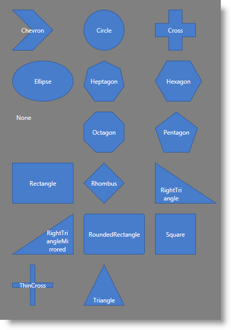

////
|metadata|
{
    "name": "xamdiagram-configuring-the-shape-of-diagram-nodes-overview",
    "tags": ["Charting","How Do I","Styling","Templating"],
    "controlName": ["xamDiagram"],
    "guid": "8e9fa21b-6445-429c-8903-b4a99889ec0f",
    "buildFlags": [],
    "createdOn": "2014-06-16T09:31:03.9789864Z"
}
|metadata|
////

= Configuring the Shape of the Diagram Nodes (xamDiagram)

== Topic Overview

=== Purpose

This topic explains how to configure the shape of the diagram nodes of the  _xamDiagram_   control by either selecting a Pre-Defined shape or applying a custom shape. If you choose to use custom shapes or a custom data template, refer to link:xamdiagram-configuring-the-diagram-items-content-visualization.html[Configuring the Visualization of the Content of the Diagram Items]. This topic explains how to set DataTemplates for the content of diagram items and for editing that content.

=== Required background

The following topics are prerequisites to understanding this topic:

[options="header", cols="a,a"]
|====
|Topic|Purpose

| link:xamdiagram-general-overview.html[General Overview ( _xamDiagram_ )]
|This topic provides a conceptual overview of the _xamDiagram_ control and its main features and capabilities.

| link:xamdiagram-adding-to-a-page.html[Adding _xamDiagram_ to a Page]
|This topic explains how to add the _xamDiagram_ control to a WPF application.

|====

=== In this topic

This topic contains the following sections:

* <<_Ref386477912, Introduction >>

** <<_Ref386477960,Diagram nodes shape configuration summary>>
** <<_DiagramNodesShapeConfigSummary,Diagram nodes shape configuration summary chart>>

* <<_Ref386478000, Configuring a Pre-Defined Shape >>

** <<_Ref386478019,Overview>>
** <<_PropertySettings,Property settings>>
** <<_Ref386478040,Example>>

* <<_Ref386478056, Configuring a Custom Shape >>

** <<_Ref386478065,Overview>>
** <<_Ref386478080,Property settings>>
** <<_Ref386478085,Example>>

* <<_Ref386478097, Related Content >>

** <<_Ref386478106,Topics>>
** <<_Ref386478113,Samples>>

[[_Ref386477912]]
== Introduction

[[_Ref386477960]]

=== Diagram nodes shape configuration summary

The  _xamDiagram_   provides a number of pre-defined shapes for the nodes. (See the link:xamdiagram-general-overview.html[General Overview] topic for details.) A pre-defined shape is selected through the link:{ApiPlatform}controls.charts.xamdiagram.v{ProductVersion}~infragistics.controls.charts.diagramnode~shapetype.html[ShapeType] property. This property accepts as a value the respective node shapes available as `ShapeType` enumeration. If the desired shape is not available as a pre-defined shape, a custom shape can be set to the link:{ApiPlatform}controls.charts.xamdiagram.v{ProductVersion}~infragistics.controls.charts.diagramnode~geometry.html[Geometry] property.

When the `Geometry` property is set, the `ShapeType` setting is disregarded. Regardless of whether the `Geometry` and `ShapeType` properties are set, the link:{ApiPlatform}controls.charts.xamdiagram.v{ProductVersion}~infragistics.controls.charts.diagramitem~displaytemplate.html[DisplayTemplate] is applied; if the `ShapeType` is set to `None` or the `Geometry` is set to an empty geometry, this results in no visible shape (only what is defined in the content and the template will be displayed).

[options="header", cols="a,a,a,a"]
|====
||Settings|Display|Notes

|`Geometry`
|Anything other than an empty geometry
|Specified geometry
|Overrides `ShapeType`
|
|An empty geometry
|
|

|`ShapeType`
|An available `ShapeType` enumeration
|Specified enumeration
|Select a pre-defined shape from a collection

| link:{ApiPlatform}controls.charts.xamdiagram.v{ProductVersion}~infragistics.controls.charts.diagramitem~displaytemplate.html[DisplayTemplate]
|
|
|Always applied

|====

Further customization of diagram nodes is possible through the link:{ApiPlatform}controls.charts.xamdiagram.v{ProductVersion}~infragistics.controls.charts.diagramitem~content.html[Content] and link:{ApiPlatform}controls.charts.xamdiagram.v{ProductVersion}~infragistics.controls.charts.diagramitem~displaytemplate.html[DisplayTemplate] properties which are independent from the `Geometry` setting. For details on how to configure a template for diagram nodes, refer to link:xamdiagram-configuring-the-diagram-items-content-visualization.html[Configuring the Visualization of the Content of the Diagram Items].

.Note:
[NOTE]
====
Templates are normally used to manage how the content of the node looks inside the shape (be it pre-defined or custom-created through the `Geometry` property) and not to define the shape itself; however, because templates support this capability, it is mentioned here for the sake of the completeness of this help content.
====

[[_DiagramNodesShapeConfigSummary]]

=== Diagram nodes shape configuration summary chart

The following table maps the desired node shape to the property settings that manage it. Further details on the green-highlighted items are available after the table.

[options="header", cols="a,a,a,a"]
|====
|In order to:||Use this property:|And set it to:

|[[_Hlk356484826]]Configure a pre-defined shape
|
|
* link:{ApiPlatform}controls.charts.xamdiagram.v{ProductVersion}~infragistics.controls.charts.diagramnode~shapetype.html[ShapeType] 

|The enum corresponding to the desired pre-defined shape.

|Configure a custom shape
|Using a geometry
|
* link:{ApiPlatform}controls.charts.xamdiagram.v{ProductVersion}~infragistics.controls.charts.diagramnode~geometry.html[Geometry] 

|The desired shape defined as a custom geometry.
|
|Using data template
|
* link:{ApiPlatform}controls.charts.xamdiagram.v{ProductVersion}~infragistics.controls.charts.diagramitem~content.html[Content] 

|The desired data object
|
|
|
* link:{ApiPlatform}controls.charts.xamdiagram.v{ProductVersion}~infragistics.controls.charts.diagramitem~displaytemplate.html[DisplayTemplate] 

|The desired `DataTemplate` for displaying the `Content`

|====

[[_Ref386478000]]
== Configuring a Pre-Defined Shape

[[_Ref386478019]]

=== Overview

To set the desired shape for the diagram nodes, specify the corresponding enum value as the value of the link:{ApiPlatform}controls.charts.xamdiagram.v{ProductVersion}~infragistics.controls.charts.diagramnode~shapetype.html[ShapeType] property.

[[_PropertySettings]]

=== Property settings

The following table maps the desired configuration to the property settings that manage it.

[options="header", cols="a,a,a"]
|====
|In order to set the node shape to:|Use this property:|And set it to:

|Chevron
| link:{ApiPlatform}controls.charts.xamdiagram.v{ProductVersion}~infragistics.controls.charts.diagramnode~shapetype.html[ShapeType]
|_“_ _Chevron_ _”_

|Circle
|`ShapeType`
|_“_ _Circle_ _”_

|Cross, thick
|`ShapeType`
|_“_ _Cross_ _”_

|Cross, thin
|`ShapeType`
|_“_ _ThinCross_ _”_

|Ellipse
|`ShapeType`
|_“_ _Ellipse_ _”_

|Heptagon
|`ShapeType`
|_“_ _Heptagon_ _”_

|Hexagon
|`ShapeType`
|_“_ _Hexagon_ _”_

|Octagon
|`ShapeType`
|_“_ _Octagon_ _”_

|Pentagon
|`ShapeType`
|_“_ _Pentagon_ _”_

|Rectangle
|`ShapeType`
|_“_ _Rectangle_ _”_

|Rectangle, rounded
|`ShapeType`
|_“_ _RoundedRectangle_ _”_

|Rhombus
|`ShapeType`
|_“_ _Rhombus_ _”_

|Square
|`ShapeType`
|_“_ _Square_ _”_

|Triangle
|`ShapeType`
|_“_ _Triangle_ ”

|Triangle, right-angled, with the right angle pointing downward-left.
|`ShapeType`
|_“_ _RightTriangle_ _”_

|Triangle, right-angled, with the right angle pointing downward-right.
|`ShapeType`
|_“_ _RightTriangleMirrored_ _”_

|====

[[_Ref386478040]]

=== Example

The screenshot below demonstrates how a  _xamDiagram_   consisting of several nodes with varying link:{ApiPlatform}controls.charts.xamdiagram.v{ProductVersion}~infragistics.controls.charts.diagramnode~shapetype.html[ShapeType] settings would look as a result of the following code:

Following is the code that implements this example.

*In XAML:*

[source,xaml]
----
<ig:XamDiagram x:Name="Diagram" Background="Gray">
    <ig:DiagramNode Position="0,0"     ShapeType="Chevron" Content="Chevron"/>
    <ig:DiagramNode Position="140,0"   ShapeType="Circle" Content="Circle"/>
    <ig:DiagramNode Position="280,0"   ShapeType="Cross" Content="Cross"/>
    <ig:DiagramNode Position="0,100"   ShapeType="Ellipse" Content="Ellipse"/>
    <ig:DiagramNode Position="140,100" ShapeType="Heptagon" Content="Heptagon"/>
    <ig:DiagramNode Position="280,100" ShapeType="Hexagon" Content="Hexagon"/>
    <ig:DiagramNode Position="0,200"   ShapeType="None" Content="None"/>
    <ig:DiagramNode Position="140,200" ShapeType="Octagon" Content="Octagon"/>
    <ig:DiagramNode Position="280,200" ShapeType="Pentagon" Content="Pentagon"/>
    <ig:DiagramNode Position="0,300"   ShapeType="Rectangle" Content="Rectangle"/>
    <ig:DiagramNode Position="140,300" ShapeType="Rhombus" Content="Rhombus"/>
    <ig:DiagramNode Position="280,300" ShapeType="RightTriangle" Content="RightTriangle"/>
    <ig:DiagramNode Position="0,400"   ShapeType="RightTriangleMirrored" Content="RightTriangleMirrored"/>
    <ig:DiagramNode Position="140,400" ShapeType="RoundedRectangle" Content="RoundedRectangle"/>
    <ig:DiagramNode Position="280,400" ShapeType="Square" Content="Square"/>
    <ig:DiagramNode Position="0,500"   ShapeType="ThinCross" Content="ThinCross"/>
    <ig:DiagramNode Position="140,500" ShapeType="Triangle" Content="Triangle"/>
</ig:XamDiagram>
----

[[_Configuring_a_Custom]]
[[_Ref386478056]]
== Configuring a Custom Shape

[[_Ref386478065]]

=== Overview

Any custom shape can be applied to a diagram node by specifying a custom geometry for the desired shape.

[[_Ref386478080]]

=== Property settings

The following table maps the desired configuration to the property settings that manage it.

[options="header", cols="a,a,a"]
|====
|In order to:|Use this property:|And set it to:

|Apply a custom geometry
| link:{ApiPlatform}controls.charts.xamdiagram.v{ProductVersion}~infragistics.controls.charts.diagramnode~geometry.html[Geometry]
|The desired geometry

|====

[[_Ref386478085]]

=== Example

The screenshot below demonstrates how a diagram node looks as a result of the following settings:

[options="header", cols="a,a"]
|====
|Property|Value

| link:{ApiPlatform}controls.charts.xamdiagram.v{ProductVersion}~infragistics.controls.charts.diagramnode~geometry.html[Geometry]
|*In XAML:* 

[source,xaml]
---- 
<GeometryGroup>  <LineGeometry StartPoint="0,0" EndPoint="40,40"/>  <LineGeometry StartPoint="40,0" EndPoint="0,40"/> </GeometryGroup> 
---- 

|====

Following is the code that implements this example.

*In XAML:*

[source,xaml]
----
<ig:XamDiagram x:Name="Diagram">
    <ig:DiagramNode Name="node2" StrokeThickness="5">
        <ig:DiagramNode.Geometry>
            <GeometryGroup>
                <LineGeometry StartPoint="0,0" EndPoint="40,40"/>
                <LineGeometry StartPoint="40,0" EndPoint="0,40"/>
            </GeometryGroup>
        </ig:DiagramNode.Geometry>
    </ig:DiagramNode>
</ig:XamDiagram>
----

[[_Ref386478097]]
== Related Content

[[_Ref386478106]]

=== Topics

The following topics provide additional information related to this topic.

[options="header", cols="a,a"]
|====
|Topic|Purpose

| link:xamdiagram-configuring-the-diagram-items-content-visualization.html[Configuring the Visualization of the Content of the Diagram Items ( _xamDiagram_ )]
|This topic explains how to configure custom diagram nodes and connections in the _xamDiagram_ control using a template.

| link:xamdiagram-binding-to-data.html[Binding _xamDiagram_ to Data]
|This topic explains how to bind the _xamDiagram_ control to data.

|====

[[_Ref386478113]]

=== Samples

The following sample provides additional information related to this topic.

[options="header", cols="a,a"]
|====
|Sample|Purpose

| link:{SamplesURL}/diagram/diagram-toolbox[Diagram Toolbox]
|This sample demonstrates how customly designed nodes, with their custom connection points, can be added in the XamDiagram and XamDiagramToolbox.

| link:{SamplesURL}/diagram/diagram-commands[Diagram Commands]
|This sample demonstrates the _XamDiagram’s_ available commands and different interactions.

|====