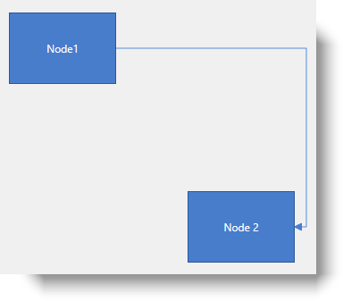
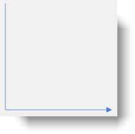

////

|metadata|
{
    "name": "xamdiagram-configuring-the-start-and-end-of-diagram-connections",
    "tags": ["Charting","How Do I"],
    "controlName": ["xamDiagram"],
    "guid": "a8c7dcb7-e126-486f-876e-b637bc4e9310",  
    "buildFlags": [],
    "createdOn": "2014-06-16T09:35:18.8015336Z"
}
|metadata|
////

= Configuring the Start and End of Diagram Connections (xamDiagram)

== Topic Overview

=== Purpose

This topic covers the alternative approaches used to configure the start and end points of diagram connections in  _xamDiagram_™, either by specifying the nodes to connect to or by specifying the coordinates of the connection’s start and end points on the diagram space.

=== Required background

The following topics are prerequisites to understanding this topic:

[options="header", cols="a,a"]
|====
|Topic|Purpose

| link:xamdiagram-general-overview.html[General Overview ( _xamDiagram_ )]
|This topic provides a conceptual overview of the _xamDiagram_ control and its main features and capabilities.

| link:xamdiagram-adding-to-a-page.html[Adding _xamDiagram_ to a Page]
|This topic explains how to add the _xamDiagram_ control to a WPF application.

|====

=== In this topic

This topic contains the following sections:

* <<_Ref388885767, Introduction >>

** <<_Ref388553009,Coordinate system of the diagram space>>
** <<_Ref388553014,Connections start/end points configuration summary>>
** <<_Ref388553019,Connections start/end points configuration summary chart>>

* <<_Ref388553048, Configuring the Start/End Points of a Connection Relatively (by Specifying Start/End Nodes) >>

** <<_Ref388553055,Overview>>
** <<_PropertySettings,Property settings>>
** <<_Ref388553066,Example>>

* <<_Ref388553075, Configuring the Start/End Points of a Connection Absolutely (by Specifying Start/End Points Coordinates) >>

** <<_Ref388553084,Overview>>
** <<_Ref388553088,Property settings>>
** <<_Ref388553093,Example>>

* <<_Ref388553107, Related Content >>

** <<_Ref388553113,Topics>>
** <<_Ref388553116,Samples>>

[[_Ref388885767]]
== Introduction

[[_Ref388553009]]

=== Coordinate system of the diagram space

include::xamdiagram-coordinate-system.adoc[]

[[_Ref388553014]]

=== Connections start/end points configuration summary

The two possible methods for configuring the start and end points of diagram connections in the  _xamDiagram_   control are:

*  *Relative*  – by specifying the nodes to connect to – the start and the end node, respectively.

This approach requires associating the connection with a start and end node. In this case, the start and end points of the connection are controlled by these nodes automatically adjusting the connection whenever the node moves.
*  *Absolute*  – by specifying the coordinates of the connection’s start and end points on the diagram space.

A mixed approach, specifying a node at one of the connection ends of and coordinates for the other end, is also allowed.

The configuration is managed in either approach, through the connection properties. With each using a different set of properties (See the <<_Ref388549185,Connections start/end points configuration summary chart>>). The latest property configuration overrides the previous setting.

[[_Ref388549185]]

=== Connections start/end points configuration summary chart

The following table briefly explains the start/end related configurable aspects of diagram connections and maps them to the properties that configure them.

[options="header", cols="a,a,a"]
|====
|Configuration approach|Details|Properties

|<<_Ref388553048,Relative>>
|Configures the connection’s start/end points by specifying start/end nodes.
|
* link:{ApiPlatform}controls.charts.xamdiagram.v{ProductVersion}~infragistics.controls.charts.diagramconnection~startnode.html[StartNode] 

* link:{ApiPlatform}controls.charts.xamdiagram.v{ProductVersion}~infragistics.controls.charts.diagramconnection~startnodekey.html[StartNodeKey] 

* link:{ApiPlatform}controls.charts.xamdiagram.v{ProductVersion}~infragistics.controls.charts.diagramconnection~startnodeconnectionpointname.html[StartNodeConnectionPointName] 

* link:{ApiPlatform}controls.charts.xamdiagram.v{ProductVersion}~infragistics.controls.charts.diagramconnection~endnode.html[EndNode] 

* link:{ApiPlatform}controls.charts.xamdiagram.v{ProductVersion}~infragistics.controls.charts.diagramconnection~endnodekey.html[EndNodeKey] 

* link:{ApiPlatform}controls.charts.xamdiagram.v{ProductVersion}~infragistics.controls.charts.diagramconnection~endnodeconnectionpointname.html[EndNodeConnectionPointName] 

|<<_Ref388553075,Absolute>>
|Configures the connection’s start/end point by specifying coordinates for the start/end points on the diagram space.
|
* link:{ApiPlatform}controls.charts.xamdiagram.v{ProductVersion}~infragistics.controls.charts.diagramconnection~startposition.html[StartPosition] 

* link:{ApiPlatform}controls.charts.xamdiagram.v{ProductVersion}~infragistics.controls.charts.diagramconnection~endposition.html[EndPosition] 

|====

[[_Ref388553048]]
== Configuring the Start/End Points of a Connection Relatively (by Specifying Start/End Nodes)

[[_Ref388553055]]

=== Overview

Associating any of a connection’s endpoints with a link:{ApiPlatform}controls.charts.xamdiagram.v{ProductVersion}~infragistics.controls.charts.diagramnode_members.html[DiagramNode], positions that endpoint with respect to the node’s position. In order to associate a connection with a node, set either its link:{ApiPlatform}controls.charts.xamdiagram.v{ProductVersion}~infragistics.controls.charts.diagramconnection~startnodekey.html[StartNodeKey]/ link:{ApiPlatform}controls.charts.xamdiagram.v{ProductVersion}~infragistics.controls.charts.diagramconnection~endnodekey.html[EndNodeKey] property to the value set to the link:{ApiPlatform}controls.charts.xamdiagram.v{ProductVersion}~infragistics.controls.charts.diagramnode~key.html[DiagramNode.Key] property of the target node or its link:{ApiPlatform}controls.charts.xamdiagram.v{ProductVersion}~infragistics.controls.charts.diagramconnection~startnode.html[StartNode]/ link:{ApiPlatform}controls.charts.xamdiagram.v{ProductVersion}~infragistics.controls.charts.diagramconnection~endnode.html[EndNode] property to the target node.

In addition to specifying a node for a connection’s end, a specific link:{ApiPlatform}controls.charts.xamdiagram.v{ProductVersion}~infragistics.controls.charts.diagramconnectionpoint_members.html[DiagramConnectionPoint] from the node’s link:{ApiPlatform}controls.charts.xamdiagram.v{ProductVersion}~infragistics.controls.charts.diagramnode~connectionpoints.html[ConnectionPoints] collection can be assigned to the connection through the link:{ApiPlatform}controls.charts.xamdiagram.v{ProductVersion}~infragistics.controls.charts.diagramconnection~startnodeconnectionpointname.html[StartNodeConnectionPointName]/ link:{ApiPlatform}controls.charts.xamdiagram.v{ProductVersion}~infragistics.controls.charts.diagramconnection~endnodeconnectionpointname.html[EndNodeConnectionPointName] properties.

The connection logic is based on whether there are connection points specified for the node that is being connected and is as follows:

*1.*  If there are connection points on the node and one of them is explicitly selected for the connection, it will be used.

*2.*  If there are connection points on the node, but the connection does not have a specific connection point set, the closest point is used

*3.*  No connection points - the middle of one of the sides of the bounding rectangle is used.

For more information on configuring connection points for a node refer to link:xamdiagram-configuring-the-connection-points-of-diagram-nodes.html[Configuring the Connection Points of Diagram Nodes].

[[_PropertySettings]]

=== Property settings

The following table maps the desired configuration to the property settings that manage it.

[options="header", cols="a,a,a"]
|====
|In order to:|Use this property:|And set it to:

.2|Associate a connection’s end with a node
| link:{ApiPlatform}controls.charts.xamdiagram.v{ProductVersion}~infragistics.controls.charts.diagramconnection~startnodekey.html[StartNodeKey] 

link:{ApiPlatform}controls.charts.xamdiagram.v{ProductVersion}~infragistics.controls.charts.diagramconnection~endnodekey.html[EndNodeKey]
|The name of the targeted node

| link:{ApiPlatform}controls.charts.xamdiagram.v{ProductVersion}~infragistics.controls.charts.diagramconnection~startnode.html[StartNode] 

link:{ApiPlatform}controls.charts.xamdiagram.v{ProductVersion}~infragistics.controls.charts.diagramconnection~endnode.html[EndNode]
|The targeted `DiagramNode`

|Associate a connection’s end with a specific connection point on a node
| link:{ApiPlatform}controls.charts.xamdiagram.v{ProductVersion}~infragistics.controls.charts.diagramconnection~startnodeconnectionpointname.html[StartNodeConnectionPointName] 

link:{ApiPlatform}controls.charts.xamdiagram.v{ProductVersion}~infragistics.controls.charts.diagramconnection~endnodeconnectionpointname.html[EndNodeConnectionPointName]
|The name of the link:{ApiPlatform}controls.charts.xamdiagram.v{ProductVersion}~infragistics.controls.charts.diagramconnectionpoint_members.html[DiagramConnectionPoint] on the targeted node

|====

[[_Ref388553066]]

=== Example

The screenshot below demonstrates how a connection in the  _xamDiagram_  would look as a result of the following settings:

[options="header", cols="a,a"]
|====
|Property|Value

| link:{ApiPlatform}controls.charts.xamdiagram.v{ProductVersion}~infragistics.controls.charts.diagramconnection~startnodekey.html[StartNodeKey]
| _Node1_ 

| link:{ApiPlatform}controls.charts.xamdiagram.v{ProductVersion}~infragistics.controls.charts.diagramconnection~endnodekey.html[EndNodeKey]
| _Node2_ 

| link:{ApiPlatform}controls.charts.xamdiagram.v{ProductVersion}~infragistics.controls.charts.diagramconnection~endnodeconnectionpointname.html[EndNodeConnectionPointName]
| _Right_ 

|====

Following is the code that implements this example.

*In XAML:*

[source,xaml]
----
<ig:XamDiagram x:Name="Diagram">
      <ig:DiagramConnection StartNodeKey="Node1" EndNodeKey="Node2" EndNodeConnectionPointName="Right"/>
      <ig:DiagramNode Name="Node1"/>
      <ig:DiagramNode Name="Node2" Position="200,200"/>
</ig:XamDiagram>
----

[[_Ref388553075]]
== Configuring the Start/End Points of a Connection Absolutely (by Specifying Start/End Points Coordinates)

[[_Ref388553084]]

=== Overview

In order to display a standalone connection, specify its start and end point coordinates. Setting the start or end point of a connection will disconnect it from the respective target node, if such exists. Similarly, setting the start/end node will override the absolute points configuration.

[[_Ref388553088]]

=== Property settings

The following table maps the desired configuration to the property settings that manage it.

[options="header", cols="a,a,a"]
|====
|In order to:|Use this property:|And set it to:

|Set a start/end point of a connection absolutely
| link:{ApiPlatform}controls.charts.xamdiagram.v{ProductVersion}~infragistics.controls.charts.diagramconnection~startposition.html[StartPosition]/ link:{ApiPlatform}controls.charts.xamdiagram.v{ProductVersion}~infragistics.controls.charts.diagramconnection~endposition.html[EndPosition]
|The coordinates of desired point in pixels

|====

[[_Ref388553093]]

=== Example

The screenshot below demonstrates how a diagram connection looks as a result of the following settings:

[options="header", cols="a,a"]
|====
|Property|Value

| link:{ApiPlatform}controls.charts.xamdiagram.v{ProductVersion}~infragistics.controls.charts.diagramconnection~startposition.html[StartPosition]
| _20,20_ 

| link:{ApiPlatform}controls.charts.xamdiagram.v{ProductVersion}~infragistics.controls.charts.diagramconnection~endposition.html[EndPosition]
| _200,200_ 

|====

Following is the code that implements this example.

*In XAML:*

[source,xaml]
----
<ig:XamDiagram x:Name="Diagram">
      <ig:DiagramConnection StartPosition="20,20" EndPosition="200,200" />
</ig:XamDiagram>
----

[[_Ref388553107]]
== Related Content

[[_Ref388553113]]

=== Topics

The following topics provide additional information related to this topic.

[options="header", cols="a,a"]
|====
|Topic|Purpose

| link:xamdiagram-configuring-the-connection-points-of-diagram-nodes.html[Configuring the Connection Points of Diagram Nodes ( _xamDiagram_ )]
|This topic explains how to configure the connection points of diagram nodes in the _xamDiagram_ control. This would be necessary if you use custom nodes or need to customize the pre-set connection points of the standard nodes.

|====

[[_Ref388553116]]

=== Samples

The following sample provides additional information related to this topic.

[options="header", cols="a,a"]
|====
|Sample|Purpose

| link:{SamplesURL}/diagram/basic-configuration[Basic Configuration]
|This sample demonstrates creating a simple flowchart diagram using the _xamDiagram_ control.

|====