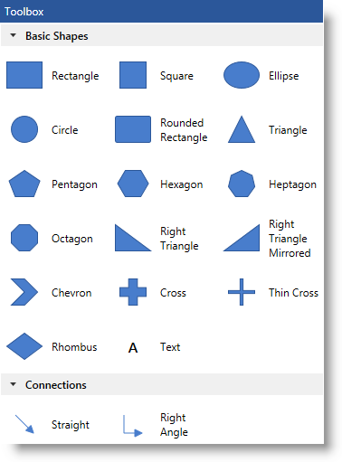
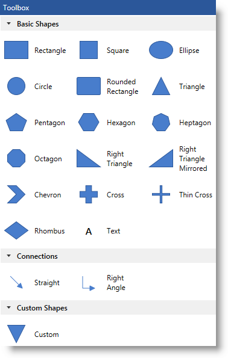

////

|metadata|
{
    "name": "xamdiagram-configuring-the-toolbox",
    "tags": ["Application Scenarios","Charting","How Do I"],
    "controlName": ["xamDiagram"],
    "guid": "7f67b9a4-137b-42ff-b37b-e631bd384e97",  
    "buildFlags": [],
    "createdOn": "2014-06-16T09:41:07.107889Z"
}
|metadata|
////

= Configuring the Toolbox (xamDiagram)

== Topic Overview

=== Purpose

This topic explains how to configure and use the  _xamDiagram_™ diagram toolbox.

=== Required background

The following topics are prerequisites to understanding this topic:

[options="header", cols="a,a"]
|====
|Topic|Purpose

| link:xamdiagram-general-overview.html[General Overview ( _xamDiagram_ )]
|This topic provides a conceptual overview of the _xamDiagram_ control and its main features and capabilities.

| link:xamdiagram-adding-to-a-page.html[Adding _xamDiagram_ to a Page]
|This topic explains how to add the _xamDiagram_ control to a {PlatformName} application.

|====

=== In this topic

This topic contains the following sections:

* <<_Ref389563895, Introduction >>

** <<_Ref386534590,Toolbox configuration summary>>
** <<_Ref385408391,Toolbox configuration summary chart>>

* <<_Ref390245325, Extending Toolbox Categories >>

** <<_Ref385408401,Overview>>
** <<_PropertySettings,Property settings>>
** <<_Ref389558458,Example>>

* <<_Ref385408430, Related Content >>

** <<_Ref385408435,Topics>>
** <<_Ref385408439,Samples>>

[[_Ref389563895]]
== Introduction

[[_Ref386534590]]

=== Toolbox configuration summary

The  _xamDiagram_   control provides functionality, which allows for dragging and dropping diagram items from a predefined set of shapes, directly on the diagram surface. This functionality is represented by the  _xamDiagramToolbox_   control. By default, it has two pre-configured shape categories:  _Basic Shapes_   and  _Connections_   which contain all currently supported diagram node types, including a node representing a label, and the two types of diagram connections.

The shape categories of the diagram toolbox can be overridden or extended. The default size dimensions of the shapes displayed in the toolbox is  _30, 30_   (width in pixels, height in pixels) or  _30, 40_   depending on the type of the shape.

The toolbox exposes two events – link:{ApiPlatform}controls.charts.xamdiagram.v{ProductVersion}~infragistics.controls.charts.xamdiagramtoolbox~categoryadding_ev.html[CategoryAdding] and link:{ApiPlatform}controls.charts.xamdiagram.v{ProductVersion}~infragistics.controls.charts.xamdiagramtoolbox~categoryadded_ev.html[CategoryAdded] which can be used to implement application-related logic.

[[_Ref385408391]]

=== Toolbox configuration summary chart

The following table explains briefly the configurable aspects of the diagram toolbox and maps them to the properties that configure them.

[options="header", cols="a,a,a"]
|====
|Configurable aspect|Details|Properties / Events

|[[_Hlk356484826]] 

Header
|The heading appears above the categories in the toolbox and is configurable in visual terms such as background, foreground etc. or entirely overridden using the `Header` property.
|
* link:{ApiPlatform}controls.charts.xamdiagram.v{ProductVersion}~infragistics.controls.charts.xamdiagramtoolbox~header.html[Header] 

* link:{ApiPlatform}controls.charts.xamdiagram.v{ProductVersion}~infragistics.controls.charts.xamdiagramtoolbox~headerbackground.html[HeaderBackground] 

* link:{ApiPlatform}controls.charts.xamdiagram.v{ProductVersion}~infragistics.controls.charts.xamdiagramtoolbox~headerborderbrush.html[HeaderBorderBrush] 

* link:{ApiPlatform}controls.charts.xamdiagram.v{ProductVersion}~infragistics.controls.charts.xamdiagramtoolbox~headerborderthickness.html[HeaderBorderThickness] 

* link:{ApiPlatform}controls.charts.xamdiagram.v{ProductVersion}~infragistics.controls.charts.xamdiagramtoolbox~headerforeground.html[HeaderForeground] 

|Toolbox Categories
|The categories in which the diagram item shapes appear. They can be overridden or extended.
|
* link:{ApiPlatform}controls.charts.xamdiagram.v{ProductVersion}~infragistics.controls.charts.xamdiagramtoolbox~categories.html[Categories] 

* link:{ApiPlatform}controls.charts.xamdiagram.v{ProductVersion}~infragistics.controls.charts.xamdiagramtoolbox~customcategories.html[CustomCategories] 

|Filtering the set of predefined shapes in the toolbox
|By handling the link:{ApiPlatform}controls.charts.xamdiagram.v{ProductVersion}~infragistics.controls.charts.xamdiagramtoolbox~categoryadding_ev.html[CategoryAdding] event, you can cancel the adding operation or filter the shapes to display in the pre-configured or custom created categories.
|
* link:{ApiPlatform}controls.charts.xamdiagram.v{ProductVersion}~infragistics.controls.charts.xamdiagramtoolbox~categoryadding_ev.html[CategoryAdding] 

|Modify an already created category
|Modification of a category, such as collapsing its view for ex., can be done after it has been created by handling the link:{ApiPlatform}controls.charts.xamdiagram.v{ProductVersion}~infragistics.controls.charts.xamdiagramtoolbox~categoryadded_ev.html[CategoryAdded] event.
|
* link:{ApiPlatform}controls.charts.xamdiagram.v{ProductVersion}~infragistics.controls.charts.xamdiagramtoolbox~categoryadded_ev.html[CategoryAdded] 

|====

[[_Ref390245325]]
== Extending Toolbox Categories

[[_Ref385408401]]

=== Overview

In order to add a new category to the diagram toolbox, you should create one and add it to the `CustomCategories` collection of  _xamDiagramToolbox_  . The new category should be populated with items by adding instances of the link:{ApiPlatform}controls.charts.xamdiagram.v{ProductVersion}~infragistics.controls.charts.diagramtoolboxitem_members.html[DiagramToolboxItem] class. These items must have their size dimensions explicitly configured in order to appear properly in the toolbox. The following example demonstrates extending the existing set of toolbox shapes by adding a new category containing a reversed triangle shape.

.Note:
[NOTE]
====
If you want to override the existing categories collection of the  _xamDiagramToolbox_   control, you should create a new link:{ApiPlatform}controls.charts.xamdiagram.v{ProductVersion}~infragistics.controls.charts.diagramtoolboxcategorycollection_members.html[DiagramToolboxCategoryCollection] instance and assign it to the `Categories` property of the toolbox.
====

[[_PropertySettings]]

=== Property settings

The following table maps the desired configuration to the property settings that manage it.

[options="header", cols="a,a,a"]
|====
|In order to:|Use this property:|And set it to:

|Configure a new category to be added to the toolbox
| link:{ApiPlatform}controls.charts.xamdiagram.v{ProductVersion}~infragistics.controls.charts.xamdiagramtoolbox~customcategories.html[CustomCategories]
|An instance of the link:{ApiPlatform}controls.charts.xamdiagram.v{ProductVersion}~infragistics.controls.charts.diagramtoolboxcategorycollection_members.html[DiagramToolboxCategoryCollection] class.

|====

[[_Ref389558458]]

=== Example

The screenshot below demonstrates options pane visibility configuration as a result of the following settings:

[options="header", cols="a,a"]
|====
|Property|Value

| link:{ApiPlatform}controls.charts.xamdiagram.v{ProductVersion}~infragistics.controls.charts.xamdiagramtoolbox~customcategories.html[CustomCategories]
|*In XAML:* 

[source,xaml]
---- 
<ig:DiagramToolboxCategory Name="Custom Shapes"
                           IsExpanded="True">
    <ig:DiagramToolboxCategory.Items>
        <ig:DiagramToolboxItem Title="Custom">
            <ig:DiagramToolboxItem.Item>
                <ig:DiagramNode Width="30" Height="30">
                    <ig:DiagramNode.ConnectionPoints>
                        <ig:DiagramConnectionPointCollection>
                            <ig:DiagramConnectionPoint Name="Point" Position="0.5,0.5" />
                        </ig:DiagramConnectionPointCollection>
                    </ig:DiagramNode.ConnectionPoints>
                                    
                    <ig:DiagramNode.Geometry>
                        <PathGeometry>
                            <PathGeometry.Figures>
                                <PathFigure IsClosed="True" StartPoint="0,0">
                                    <PathFigure.Segments>
                                        <PathSegmentCollection>
                                            <LineSegment Point="100,0" />
                                            <LineSegment Point="50,100" />
                                        </PathSegmentCollection>
                                    </PathFigure.Segments>
                                </PathFigure>
                            </PathGeometry.Figures>
                        </PathGeometry>
                    </ig:DiagramNode.Geometry>
                </ig:DiagramNode>
            </ig:DiagramToolboxItem.Item>
        </ig:DiagramToolboxItem>
    </ig:DiagramToolboxCategory.Items>
</ig:DiagramToolboxCategory>
---- 

|====

Following is the code that implements this example.

*In XAML:*

[source,xaml]
----
<ig:XamDiagramToolbox x:Name="Toolbox">
    <ig:XamDiagramToolbox.CustomCategories>
        <ig:DiagramToolboxCategory Name="Custom Shapes"
                                   IsExpanded="True">
            <ig:DiagramToolboxCategory.Items>
                <ig:DiagramToolboxItem Title="Custom">
                    <ig:DiagramToolboxItem.Item>
                        <ig:DiagramNode Width="30" Height="30">
                            <ig:DiagramNode.ConnectionPoints>
                                <ig:DiagramConnectionPointCollection>
                                    <ig:DiagramConnectionPoint Name="Point" Position="0.5,0.5" />
                                        </ig:DiagramConnectionPointCollection>
                                    </ig:DiagramNode.ConnectionPoints>
                                    <ig:DiagramNode.Geometry>
                                        <PathGeometry>
                                            <PathGeometry.Figures>
                                                <PathFigure IsClosed="True" StartPoint="0,0">
                                                    <PathFigure.Segments>
                                                        <PathSegmentCollection>
                                                            <LineSegment Point="100,0" />
                                                            <LineSegment Point="50,100" />
                                                        </PathSegmentCollection>
                                                    </PathFigure.Segments>
                                                </PathFigure>
                                            </PathGeometry.Figures>
                                        </PathGeometry>
                                    </ig:DiagramNode.Geometry>
                                </ig:DiagramNode>
                            </ig:DiagramToolboxItem.Item>
                        </ig:DiagramToolboxItem>
                    </ig:DiagramToolboxCategory.Items>
            </ig:DiagramToolboxCategory>
      </ig:XamDiagramToolbox.CustomCategories>
</ig:XamDiagramToolbox>
----

[[_Ref385408430]]
[[_Ref389058182]]
== Related Content

[[_Ref385408435]]

=== Topics

The following topic provides additional information related to this topic.

[options="header", cols="a,a"]
|====
|Topic|Purpose

| link:xamdiagram-user-interactions-configuration-overview.html[User Interactions Configuration Overview ( _xamDiagram_ )]
|This topic provides a summary of all user interaction tasks in the _xamDiagram_ control.

|====

[[_Ref385408439]]

=== Samples

The following sample provides additional information related to this topic.

[options="header", cols="a,a"]
|====
|Sample|Purpose

| link:{SamplesURL}/diagram/basic-configuration[Basic Configuration]
|This sample demonstrates creating a simple flowchart diagram using the _xamDiagram_ control.

|====