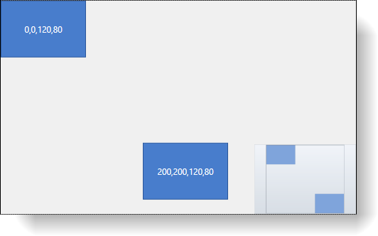
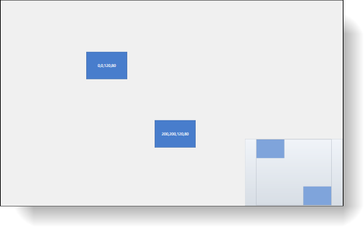
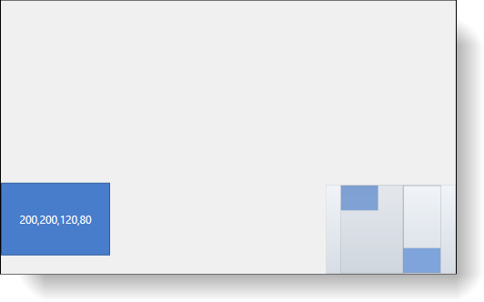

////

|metadata|
{
    "name": "xamdiagram-configuring-the-visible-portion",
    "tags": ["Charting","How Do I"],
    "controlName": ["xamDiagram"],
    "guid": "36b6f95a-588c-4349-94fb-2fa836841f61",  
    "buildFlags": [],
    "createdOn": "2014-06-16T09:42:15.4221508Z"
}
|metadata|
////

= Configuring the Visible Portion of the Diagram (xamDiagram)

== Topic Overview

=== Purpose

This topic explains how to configure the visible portion of the  _xamDiagram_™ control.

=== Required background

The following topics are prerequisites to understanding this topic:

[options="header", cols="a,a"]
|====
|Topic|Purpose

| link:xamdiagram-general-overview.html[General Overview ( _xamDiagram_ )]
|This topic provides a conceptual overview of the _xamDiagram_ control and its main features and capabilities.

| link:xamdiagram-adding-to-a-page.html[Adding _xamDiagram_ to a Page]
|This topic explains how to add the _xamDiagram_ control to a WPF application.

|====

=== In this topic

This topic contains the following sections:

* <<_Ref386568673, Introduction >>

** <<_Ref386568682,Configuring the visible portion of the diagram summary>>
** <<_Ref386568688,Configuring the visible portion of the diagram summary chart>>

* <<_Ref388264008, Configuring the Visible Portion of the Diagram >>

** <<_Ref386568700,Overview>>
** <<_PropertySettings,Property settings>>
** <<_Ref388264290,Example – default setting>>
** <<_Ref388264295,Example – zoom out>>
** <<_Ref388264299,Example – pan right>>
** <<_Ref388264302,Example – full code>>

* <<_Ref386568715, Related Content >>

** <<_Ref386568722,Topics>>

[[_Ref386568673]]
== Introduction

[[_Ref386568682]]

=== Configuring the visible portion of the diagram summary

The xamDiagram control exposes a set of properties for obtaining which is the currently visible part. The xamDiagram uses a concept of three rectangles whose position and size determine the currently visible part. Each of these rectangles is exposed as a property of the link:{ApiPlatform}controls.charts.xamdiagram.v{ProductVersion}~infragistics.controls.charts.xamdiagram_members.html[XamDiagram] class.

The link:{ApiPlatform}controls.charts.xamdiagram.v{ProductVersion}~infragistics.controls.charts.xamdiagram~viewportrect.html[ViewportRect] denotes the currently available space in the control. Margins, paddings of the control set aside, and the link:{ApiPlatform}controls.charts.xamdiagram.v{ProductVersion}~infragistics.controls.charts.xamdiagram~viewportrect.html[ViewportRect] will have exactly the same size as the  _xamDiagram_  .

The link:{ApiPlatform}controls.charts.xamdiagram.v{ProductVersion}~infragistics.controls.charts.xamdiagram~worldrect.html[WorldRect] denotes the area in which there are diagram nodes and connections, that is the rectangle representing the union of all the bound rectangles of the diagram items.

The link:{ApiPlatform}controls.charts.xamdiagram.v{ProductVersion}~infragistics.controls.charts.xamdiagram~windowrect.html[WindowRect] determines what part of the link:{ApiPlatform}controls.charts.xamdiagram.v{ProductVersion}~infragistics.controls.charts.xamdiagram~worldrect.html[WorldRect] to display in the link:{ApiPlatform}controls.charts.xamdiagram.v{ProductVersion}~infragistics.controls.charts.xamdiagram~viewportrect.html[ViewportRect].

[[_Ref386568688]]

=== Configuring the visible portion of the diagram summary chart

The following table briefly explains the configurable aspects of the  _xamDiagram_   related to controlling which is the visible portion of it.

[options="header", cols="a,a,a"]
|====
|Configurable aspect|Details|Properties

|Visible portion of the diagram
|Control the zoom level and which items are currently in view.
|
* link:{ApiPlatform}controls.charts.xamdiagram.v{ProductVersion}~infragistics.controls.charts.xamdiagram~windowrect.html[WindowRect] 

* link:{ApiPlatform}controls.charts.xamdiagram.v{ProductVersion}~infragistics.controls.charts.xamdiagram~zoomlevel.html[ZoomLevel] 

|====

[[_Ref388264008]]
== Configuring the Visible Portion of the Diagram

[[_Ref386568700]]

=== Overview

Configuring what part of the diagram is currently visible is done by setting the link:{ApiPlatform}controls.charts.xamdiagram.v{ProductVersion}~infragistics.controls.charts.xamdiagram~windowrect.html[WindowRect] property to a `Rect` object with the desired position and size. This sets both the zoom level as well as the vertical and horizontal pan positions. Setting a link:{ApiPlatform}controls.charts.xamdiagram.v{ProductVersion}~infragistics.controls.charts.xamdiagram~windowrect.html[WindowRect] with smaller size results in greater zoom level and consequently smaller visible portion of the diagram. Moving the diagram to the left is done by increasing the value of the X position of the link:{ApiPlatform}controls.charts.xamdiagram.v{ProductVersion}~infragistics.controls.charts.xamdiagram~windowrect.html[WindowRect]. Decreasing this value moves the visible portion of the diagram to the right. Similarly the Y position of the link:{ApiPlatform}controls.charts.xamdiagram.v{ProductVersion}~infragistics.controls.charts.xamdiagram~windowrect.html[WindowRect] controls the vertical scroll position of the diagram.

As a shorthand for setting just the zoom level, the link:{ApiPlatform}controls.charts.xamdiagram.v{ProductVersion}~infragistics.controls.charts.xamdiagram~zoomlevel.html[ZoomLevel] property can be used.

Additionally, the  _xamDiagram_   exposes link:{ApiPlatform}controls.charts.xamdiagram.v{ProductVersion}~infragistics.controls.charts.xamdiagram~zoomto100.html[ZoomTo100] and link:{ApiPlatform}controls.charts.xamdiagram.v{ProductVersion}~infragistics.controls.charts.xamdiagram~scaletofit.html[ScaleToFit] methods to reset the zoom level or make all items in the diagram visible.

[[_PropertySettings]]

=== Property settings

The following table maps the desired configuration to the property settings that manage it.

[options="header", cols="a,a,a"]
|====
|In order to:|Use this property:|And set it to:

|Set what portion of the diagram is currently in view
| link:{ApiPlatform}controls.charts.xamdiagram.v{ProductVersion}~infragistics.controls.charts.xamdiagram~windowrect.html[WindowRect]
|The desired rect.

|====

In the examples below, the `Width` and `Height` properties of the  _xamDiagram_   are set in order to have a fixed link:{ApiPlatform}controls.charts.xamdiagram.v{ProductVersion}~infragistics.controls.charts.xamdiagram~viewportrect.html[ViewportRect] of (0,0,500,300) and the two nodes are positioned so that the link:{ApiPlatform}controls.charts.xamdiagram.v{ProductVersion}~infragistics.controls.charts.xamdiagram~worldrect.html[WorldRect] is (0,0,320,280).

[[_Ref388264290]]

=== Example – default setting

The screenshot below demonstrates how two nodes in the  _xamDiagram_   would look as a result of the following settings:

[options="header", cols="a,a"]
|====
|Property|Value

| link:{ApiPlatform}controls.charts.xamdiagram.v{ProductVersion}~infragistics.controls.charts.xamdiagram~windowrect.html[WindowRect]
| _0,0,500,300_ 

|====

[[_Ref388264295]]

=== Example – zoom out

The screenshot below demonstrates two nodes in the  _xamDiagram_   would look as a result of the following settings:

[options="header", cols="a,a"]
|====
|Property|Value

| link:{ApiPlatform}controls.charts.xamdiagram.v{ProductVersion}~infragistics.controls.charts.xamdiagram~windowrect.html[WindowRect]
| _-250,-150,1000,600_ 

|====

[[_Ref388264299]]

=== Example – pan right

The screenshot below demonstrates how two nodes in the  _xamDiagram_   would look as a result of the following settings:

[options="header", cols="a,a"]
|====
|Property|Value

| link:{ApiPlatform}controls.charts.xamdiagram.v{ProductVersion}~infragistics.controls.charts.xamdiagram~windowrect.html[WindowRect]
| _200,0,500,300_ 

|====

[[_Ref386568709]]

=== Example – full code

The example code below shows how to perform the previous examples.

*In XAML:*

[source,xaml]
----
<ig:XamDiagram x:Name="Diagram"
               WindowRect="0,0,500,300"
               NavigationPaneVisibility="Visible"
               Width="502" Height="302" BorderThickness="1" BorderBrush="Black">
    <ig:DiagramNode Content="{Binding Bounds, RelativeSource={RelativeSource Self}}"/>
    <ig:DiagramNode Content="{Binding Bounds, RelativeSource={RelativeSource Self}}" Position="200,200"/>
</ig:XamDiagram>
----

[[_Ref386568715]]
== Related Content

[[_Ref386568722]]

=== Topics

The following topics provide additional information related to this topic.

[options="header", cols="a,a"]
|====
|Topic|Purpose

| link:xamdiagram-configuring-the-position-and-size-of-diagram-nodes.html[Configuring the Position and Size of Diagram Nodes ( _xamDiagram_ )]
|This topic explains how to control the size and position of the diagram nodes of the _xamDiagram_ control.

| link:xamdiagram-configuring-the-start-and-end-of-diagram-connections.html[Configuring the Start and End of Diagram Connections ( _xamDiagram_ )]
|This topic explains how to configure where the diagram connections start and end.

|====