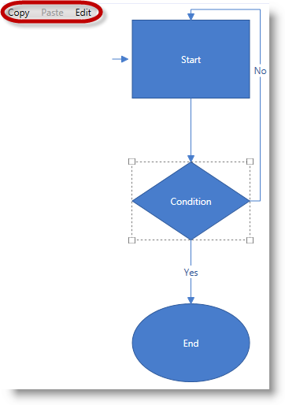

////

|metadata|
{
    "name": "xamdiagram-configuring-ui-elements-with-commands",
    "tags": ["Charting","Commands","How Do I"],
    "controlName": ["xamDiagram"],
    "guid": "30a86975-d206-44a5-aca4-3a8b27297149",  
    "buildFlags": [],
    "createdOn": "2014-06-16T09:38:00.3558436Z"
}
|metadata|
////

= Configuring UI Elements with xamDiagram Commands

== Topic Overview

=== Purpose

This topic explains how to use the commands provided by  _xamDiagram_™ in UI elements such as menus and buttons. For a list of the pre-configured keyboard shortcuts associated with the basic commands, see link:xamdiagram-configuring-keyboard-shortcuts.html[Configuring Keyboard Shortcuts].

[[_Ref387303433]]

=== Required background

The following topics are prerequisites to understanding this topic:

[options="header", cols="a,a"]
|====
|Topic|Purpose

| link:xamdiagram-general-overview.html[General Overview ( _xamDiagram_ )]
|This topic provides a conceptual overview of the _xamDiagram_ control and its main features and capabilities.

| link:xamdiagram-commands-overview.html[Commands Overview ( _xamDiagram_ )]
|This topic explains the operational logic of the commands available in the _xamDiagram_ control.

| link:xamdiagram-adding-to-a-page.html[Adding _xamDiagram_ to a Page]
|This topic explains how to add the _xamDiagram_ control to a {PlatformName} application.

|====

=== In this topic

This topic contains the following sections:

* <<_Ref389233523, Introduction >>

** <<_Ref386534590,Configuring UI elements with  _xamDiagram_  commands summary>>
** <<_Ref389314879, _xamDiagram_  commands list>>

* <<_Ref389233542, Configuring UI Elements with  _xamDiagram_  Commands – Procedure >>

** <<_Ref389233547,Introduction>>
** <<_Ref389233551,Preview>>
** <<_Prerequisites,Prerequisites>>
** <<_Overview,Overview>>
** <<_Ref389233563,Steps>>
** <<_Ref389233567,Full code>>

* <<_Ref385408430, Related Content >>

** <<_Ref385408435,Topics>>
** <<_Ref385408439,Samples>>

[[_Ref389233523]]
== Introduction

[[_Ref386534590]]

=== Configuring UI elements with xamDiagram commands summary

The  _xamDiagram_   control supports commands for performing common user operations on its items such as Copy/Paste, Select All, etc., as well as for item editing and showing/hiding its Item Options pane. By default, most of these commands are associated with keyboard shortcuts (see the link:xamdiagram-configuring-keyboard-shortcuts.html[Configuring Keyboard Shortcuts] for details), but they can also be configured to be invoked by a user interaction with another control, e.g.  _Menu_  ,  _Button_  , etc..

The basic diagram operations (Copy, Paste, Delete, Cut, Select All, Undo, Redo) are implemented in the API as `ApplicationCommands` because the effect of their invoking resembles the expected behavior of any other UI element which may be present in the application. There are also a few commands, such as the link:{ApiPlatform}controls.charts.xamdiagram{ApiVersion}~infragistics.controls.charts.diagramcommands~showoptionspane.html[ShowOptionsPane], link:{ApiPlatform}controls.charts.xamdiagram{ApiVersion}~infragistics.controls.charts.diagramcommands~entereditmode.html[EnterEditMode], and link:{ApiPlatform}controls.charts.xamdiagram{ApiVersion}~infragistics.controls.charts.diagramcommands~closeoptionspane.html[CloseOptionsPane], which carry diagram-specific logic and have been implemented as members of the link:{ApiPlatform}controls.charts.xamdiagram{ApiVersion}~infragistics.controls.charts.diagramcommands_members.html[DiagramCommands] class. This separation is reflected in the different ways of accessing the commands from the two groups.

The actions associated with the different commands are applied to the diagram or to any of its items when the control owns the focus and an interaction which invokes that command occurs.

[[_Ref387491174]]

=== Commands summary chart

include::xamdiagram-commands-summary-chart.adoc[]

[[_Ref389233542]]
== Configuring UI Elements with  _xamDiagram_  Commands – Procedure

[[_Ref389233547]]

=== Introduction

This procedure walks you through the process of configuring UI elements with some  _xamDiagram_   commands. For the sake of example, in this procedure, a  _Menu_   control is used and its three MenuItems configured to triggers Copy, Paste, and EnterEditMode commands, respectively, on  _xamDiagram_  ’s items.

[[_Ref389233551]]

=== Preview

The following screenshot demonstrates a menu with Copy, Paste, and Edit options added to the diagram added as a result of this procedure.

[[_Prerequisites]]

=== Prerequisites

To complete the procedure, you need the following:

* A Microsoft® Visual Studio® {PlatformName} application with a page.
* The required assembly references and namespaces added to the project (For details, see link:xamdiagram-adding-to-a-page.html[Adding  _xamDiagram_  to a Page].)
* A  _xamDiagram_   control added to the page. (For details, see link:xamdiagram-adding-to-a-page.html[Adding  _xamDiagram_  to a Page].)

[[_Overview]]

=== Overview

Following is a conceptual overview of the process:

*1. Adding the Menu control*

*2. Configuring the MenuItem objects interaction commands*

*3. _(Optional)_ Verifying the result of the procedure*

[[_Ref389233563]]

=== Steps

The following steps demonstrate how to configure the `MenuItems` of a  _Menu_   control to invoke  _xamDiagram_   commands.

=== 1. Add the Menu control.

*Create an instance of the Menu control and add it to the page.*

*In XAML:*

[source,xaml]
----
<Menu VerticalAlignment="Top">
</Menu>
----

=== 2. Configure the MenuItem objects interaction commands.

*1. Configure the Copy and Paste menu items.*

Because the copy and paste commands for the diagram are `ApplicationCommands`,  *configure the*  `Command`  *parameter of the respective*  `MenuItem`  *to perform copy or paste action* . The action will be applied on the item of the diagram that has the focus (and to any other UI element on the page, for that matter, if it has the focus).

*In XAML:*

[source,xaml]
----
<MenuItem Command="ApplicationCommands.Copy" />
<MenuItem Command="ApplicationCommands.Paste"/>
----

[start=2]
*2. Configure the Edit menu item.*

Because the `EnterEditMode` command belongs to the `DiagramCommands` class, to bind it to a specific `MenuItem`,  *set the*  `Command`  *and*  `CommandTarget`  *properties of the*  `MenuItem`  *object* . The latter setting is used to specify that the command binding target is the diagram object.

*In XAML:*

[source,xaml]
----
<MenuItem Header="Edit"
        Command="{x:Static ig:DiagramCommands.EnterEditMode}" 
        CommandTarget="{Binding ElementName=diagram}"/>
----

[start=3]
*3. Add the menu items to the menu.*

*In XAML:*

[source,xaml]
----
<Menu VerticalAlignment="Top">
 <MenuItem Command="ApplicationCommands.Copy" />
 <MenuItem Command="ApplicationCommands.Paste" />
 <MenuItem Header="Edit"
              Command="{x:Static ig:DiagramCommands.EnterEditMode}" 
              CommandTarget="{Binding ElementName=diagram}"/>
</Menu>
----

=== 3. (Optional) Verify the result of the procedure.

As a result of this procedure you should have a functional menu like the one demonstrated in the <<_Ref389233551,Preview>>.

You can test the functionality of the menu items, by, for example, selecting a node, clicking Copy from the menu and then pasting it again using the Paste menu item on a location in the diagram space.

[[_Ref389233567]]

=== Full code

Following is the full code for this procedure.

*In XAML:*

[source,xaml]
----
<Grid>
    <Grid.RowDefinitions>
        <RowDefinition Height="auto" />
        <RowDefinition Height="5*" />
    </Grid.RowDefinitions>
    <Menu VerticalAlignment="Top">
        <MenuItem Command="ApplicationCommands.Copy" />
        <MenuItem Command="ApplicationCommands.Paste" />
        <MenuItem Header="Edit"
                  Command="{x:Static ig:DiagramCommands.EnterEditMode}"
                  CommandTarget="{Binding ElementName=diagram}" />
    </Menu>
    <ig:XamDiagram x:Name="diagram" Grid.Row="1">
        <ig:DiagramNode Key="node1"
                        Content="Start"
                        Height="100"
                        Width="150"
                        Position="200,20" />
        <ig:DiagramNode Key="node2"
                        Content="Condition"
                        Height="100"
                        Width="100" 
                        ShapeType="Rhombus"
                        Position="225,200"
                        MaintainAspectRatio="True" />
        <ig:DiagramNode Key="node3"
                        Content="End"
                        Height="100"
                        Width="150"
                        ShapeType="Ellipse"
                        Position="200,380" />
        <ig:DiagramConnection Name="conn12"
                              StartNodeKey="node1"
                              EndNodeKey="node2"
                              ConnectionType="Straight" />
        <ig:DiagramConnection Name="conn23"
                              StartNodeKey="node2"
                              EndNodeKey="node3"
                              ConnectionType="Straight"
                              Content="Yes" />
        <ig:DiagramConnection Name="conn21"
                              StartNodeKey="node2"
                              EndNodeKey="node1"
                              StartNodeConnectionPointName="Right"
                              EndNodeConnectionPointName="Top"
                              Content="No" />
        <ig:DiagramConnection Name="connStart"
                              StartPosition="175,70"
                              EndPosition="195,70" />
    </ig:XamDiagram>
</Grid>
----

[[_Ref385408430]]
== Related Content

[[_Ref385408435]]

=== Topics

The following topics provide additional information related to this topic.

[options="header", cols="a,a"]
|====
|Topic|Purpose

| link:xamdiagram-user-interactions-configuration-overview.html[User Interactions Configuration Overview ( _xamDiagram_ )]
|This topic provides a summary of all user interaction tasks in the _xamDiagram_ control.

| link:xamdiagram-configuring-undo-redo-operations.html[Configuring Undo/Redo Operations ( _xamDiagram_ )]
|This topic explains how to configure the Undo/Redo in _xamDiagram_ . The topic covers configuring an Undo/Redo Manager that is exclusive for the _xamDiagram_ control.

| link:xamdiagram-configuring-keyboard-shortcuts.html[Configuring Keyboard Shortcuts ( _xamDiagram_ )]
|This topic explains how to change the keyboard shortcuts associated with _xamDiagram_ commands.

|====

[[_Ref385408439]]

=== Samples

The following samples provide additional information related to this topic.

[options="header", cols="a,a"]
|====
|Sample|Purpose

| link:{SamplesURL}/diagram/diagram-commands[Diagram Commands]
|This sample demonstrates the _XamDiagram’s_ available commands and different interactions.

|====