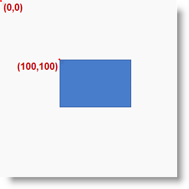

////

|metadata|
{
    "name": "xamdiagram coordinate system",
    "controlName": [],
    "tags": [],
    "guid": "b418f275-a23c-476f-883a-017003ca24b2",  
    "buildFlags": ["docx-booklet","docx-online"],
    "createdOn": "2014-06-25T05:40:35.7219853Z"
}
|metadata|
////

The position of a diagram item (node or connection) is determined relative to the coordinate system of the diagram; in this coordinate system, the top-left corner is considered the point of origin and has coordinates of 0, 0. The coordinate numbers represent an offset from the point of origin in pixels. The first number represents the horizontal offset to the right and the second number – the vertical offset in downward direction.  *The coordinates of a node represent the placement of its top-left corner. For connections, the coordinates are managed by separate properties for their start and end points or are determined by the positions of their snap points)* . The following picture represents the coordinate system of a diagram and a node positioned in it at coordinates of 100,100.

