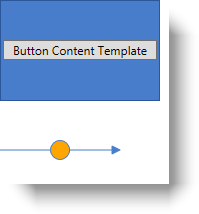

////

|metadata|
{
    "name": "xamdiagram-features-overview",
    "tags": ["Charting","Commands","Data Presentation","How Do I","Summaries"],
    "controlName": ["xamDiagram"],
    "guid": "e61f12b3-b5a2-43eb-bf17-bab72040c7fc",  
    "buildFlags": [],
    "createdOn": "2014-06-16T08:52:37.5128082Z"
}
|metadata|
////

= Features Overview (xamDiagram)

== Topic Overview

=== Purpose

This topic explains in detail the main features of the  _xamDiagram_™ control.

=== Required background

The following topic is a prerequisites to understanding this topic:

[options="header", cols="a,a"]
|====
|Topic|Purpose

| link:xamdiagram-general-overview.html[General Overview ( _xamDiagram_ )]
|This topic provides a conceptual overview of the _xamDiagram_ control and its main features and capabilities.

|====

=== In this topic

This topic contains the following sections:

* <<_Ref388439055,  _xamDiagram_  Features >>

** <<_Ref388439132, _xamDiagram_   features summary chart>>
** <<_Ref390272737,Data binding>>
** <<_Ref388439060,Navigation>>
** <<_Ref388439069,Selection>>
** <<_Ref388439075,Items interactions>>
** <<_Ref388439079,Commanding support>>
** <<_Ref388439081,Undo/Redo>>
** <<_Ref388439083,Context options pane>>
** <<_Ref388439085,Navigation pane>>
** <<_Ref388439087,Toolbox with predefined shapes>>
** <<_Ref388439090,Custom node shapes>>
** <<_Ref388439092,Custom item templates>>
** <<_Ref388439094,Virtualization>>

* <<_Ref388439099, Related Content >>

** <<_Ref386478106,Topics>>
** <<_Ref386478113,Samples>>

[[_Configuring_a_Custom]]
[[_Ref388439055]]
[[_Ref386478097]]
== _xamDiagram_   Features

[[_Hlk389761795]]

=== xamDiagram features summary

include::xamdiagram-features-summary.adoc[]

[[_Ref388439132]]

=== xamDiagram features summary chart

include::xamdiagram-feature-summary-chart.adoc[]

[[_Ref390272737]]

=== Data binding

The  _xamDiagram_   supports the following data binding schemes:

*  *Nodes only*  – the data objects contain the information about how they are interconnected. Each data object is represented as a node in the diagram. Connections are automatically displayed for the logical connections defined through the data objects.
*  *Nodes and Connections*  – two types of data objects are provided – one representing nodes and the other connections. The node objects do not contain information about how they are interconnected. For each of the data objects a node or a connection is displayed in the diagram.
*  *Mixed*  – a combination of the previous two where node data objects contain the information about how they are interconnected, but additional connection data objects can be specified as well.

==== Related Topics:

* link:xamdiagram-binding-to-data.html[Binding  _xamDiagram_  to Data]

[[_Ref388439060]]

=== Navigation

Users can navigate and zoom in and out the diagram with the mouse or the keyboard. All aspects of the navigation and zooming can be controlled through code as well.

==== Related Topics:

* link:xamdiagram-configuring-the-visible-portion.html[Configuring the visible portion of the Diagram ( _xamDiagram_ )]

[[_Ref388439069]]

=== Selection

By default, the  _xamDiagram_   allows users to select one or more nodes and connections by either clicking them or by selecting a rectangular area on the diagram surface. Programmatically, selection can be controlled through the link:{ApiPlatform}controls.charts.xamdiagram.v{ProductVersion}~infragistics.controls.charts.xamdiagram~selecteditems.html[SelectedItems] and link:{ApiPlatform}controls.charts.xamdiagram.v{ProductVersion}~infragistics.controls.charts.xamdiagram~selecteddataitems.html[SelectedDataItems] (when using data binding) properties of the  _XamDiagram_   or through the link:{ApiPlatform}controls.charts.xamdiagram.v{ProductVersion}~infragistics.controls.charts.diagramitem~isselected.html[IsSelected] property of the link:{ApiPlatform}controls.charts.xamdiagram.v{ProductVersion}~infragistics.controls.charts.diagramitem_members.html[DiagramItem] class (the base class for link:{ApiPlatform}controls.charts.xamdiagram.v{ProductVersion}~infragistics.controls.charts.diagramnode_members.html[DiagramNode] and link:{ApiPlatform}controls.charts.xamdiagram.v{ProductVersion}~infragistics.controls.charts.diagramconnection_members.html[DiagramConnection]).

The following screenshot shows selected items in the  _xamDiagram_  :

image::images/xamDiagram_Features_Overview_1.png[]

==== Related Topics:

* link:xamdiagram-configuring-selection.html[Configuring Selection ( _xamDiagram_ )]

[[_Ref388439075]]

=== Items interactions

With the selection of one or more than one item, all items can be moved simultaneously as a group by the user. Programmatically the position of nodes can be changed by their link:{ApiPlatform}controls.charts.xamdiagram.v{ProductVersion}~infragistics.controls.charts.diagramnode~position.html[Position] property. For connections, achieve this by setting their link:{ApiPlatform}controls.charts.xamdiagram.v{ProductVersion}~infragistics.controls.charts.diagramconnection~startnode.html[StartNode]/ link:{ApiPlatform}controls.charts.xamdiagram.v{ProductVersion}~infragistics.controls.charts.diagramconnection~startnodekey.html[StartNodeKey] or link:{ApiPlatform}controls.charts.xamdiagram.v{ProductVersion}~infragistics.controls.charts.diagramconnection~endnode.html[EndNode]/ link:{ApiPlatform}controls.charts.xamdiagram.v{ProductVersion}~infragistics.controls.charts.diagramconnection~endnodekey.html[EndNodeKey] properties to the string identifiers of nodes or by setting the link:{ApiPlatform}controls.charts.xamdiagram.v{ProductVersion}~infragistics.controls.charts.diagramconnection~startposition.html[StartPosition] and link:{ApiPlatform}controls.charts.xamdiagram.v{ProductVersion}~infragistics.controls.charts.diagramconnection~endposition.html[EndPosition] properties, to draw a connection between two specific points.

Selecting a single node allows users to resize it. Both proportional and free resizing are supported. When a single connection is selected, users can change its start and end points to either point to other nodes or to any place on the diagram.

The following screenshot demonstrates a node being resized.

image::images/xamDiagram_Features_Overview_2.png[]

When a diagram item is selected its content can be modified by the users by either double click or by pressing F2.

The following screenshot demonstrates a connection in edit mode.

==== Related Topics:

* link:xamdiagram-configuring-the-position-and-size-of-diagram-nodes.html[Configuring the Position and Size of Diagram Nodes ( _xamDiagram_ )]
* link:xamdiagram-configuring-the-start-and-end-of-diagram-connections.html[Configuring the Start and End of Diagram Connections ( _xamDiagram_ )]

[[_Ref388439079]]

=== Commanding support

In complance with WPF standards, the  _xamDiagram_   exposes commands that can be used in the views. Where appropriate, these are bound to the respective `ApplicationCommands` members. Below is a list of the commands exposed by the  _xamDiagram_  :

* SelectAll
* Copy
* Paste
* Cut
* Delete
* Edit
* Undo
* Redo
* ShowOptionsPane
* CloseOptionsPane
* BringForward
* BringToFront
* SendBackward
* SendToBack

==== Related Topics:

* link:xamdiagram-configuring-ui-elements-with-commands.html[Configuring UI Elements with  _xamDiagram_  Commands]
* link:xamdiagram-configuring-keyboard-shortcuts.html[Configuring Keyboard Shortcuts ( _xamDiagram_ )]

[[_Ref388439081]]

=== Undo/Redo

The  _xamDiagram_   keeps its own undo/redo stack in order to provide support for restoring the state of its items made either by user interactions or code. The undo/redo functionality uses the  _Infragistics Undo Redo Framework_   allowing easy integration into any existing application using the undo/redo framework. Disable the undo/redo functionality if not needed.

==== Related Topics:

* link:xamdiagram-configuring-undo-redo-operations.html[Configuring Undo/Redo Operations ( _xamDiagram_ )]

[[_Ref388439083]]

=== Context options pane

Selecting a single or multiple items displays a settings button for opening the context options pane. Using the options in the pane, users can customize the appearance of both nodes and connections. Some of the available customization aspects are opacity, colors for stroke and fill, thickness and dash types for the lines, font and font styling. For connections, the line type can be changed (straight or right-angle) and different start/end caps can be selected.

The following screenshot demonstrates the stroke color being edited for the selected connection and node.

==== Related Topics:

* link:xamdiagram-configuring-the-context-menu.html[Configuring the Context Menu ( _xamDiagram_ )]

[[_Ref388439085]]

=== Navigation pane

The  _xamDiagram_   uses the  _xamOverviewPlusDetailsPane_   control to display an overview of the diagram and to provide quick navigation options.

The following screenshot demonstrates the enabled navigation pane in a diagram.

==== Related Topics:

* link:xamdiagram-configuring-the-navigation-pane.html[Configuring the Navigation Pane ( _xamDiagram_ )]

[[_Ref388439087]]

=== Toolbox with predefined shapes

The  _xamDiagram_   provides a helper toolbox control which can be used together with the diagram to provide a better diagram authoring experience. The toolbox contains multiple predefined shapes that can be dragged onto the diagram; moreover, it can also be easily extended to provide custom shapes.

The following screenshot demonstrates an ellipse node being dropped from the toolbox to an empty diagram.

==== Related Topics:

* link:xamdiagram-configuring-the-toolbox.html[Configuring the Toolbox ( _xamDiagram_ )]

[[_Ref388439090]]

=== Custom node shapes

The  _xamDiagram_   provides a number of pre-defined shapes for the nodes. If the desired shape is not available as a pre-defined shape, a custom shape can be set to the link:{ApiPlatform}controls.charts.xamdiagram.v{ProductVersion}~infragistics.controls.charts.diagramnode~geometry.html[Geometry] property.

The following screenshot demonstrates some of the predefined shapes.

==== Related Topics:

* link:xamdiagram-configuring-the-shape-of-diagram-nodes-overview.html[Configuring the Shape of the Diagram Nodes ( _xamDiagram_ )]

[[_Ref388439092]]

=== Custom item templates

Any custom data template can be specified for displaying the diagram nodes’ and connections’ content. A separate template can be applied for editing.

The following screenshot demonstrates a node and connection with applied custom content template.

==== Related Topics:

* link:xamdiagram-configuring-the-diagram-items-content-visualization.html[Configuring the Visualization of the Content of the Diagram Items ( _xamDiagram_ )]

[[_Ref388439094]]

=== Virtualization

In order to support large amounts of data and keep performance high, the  _xamDiagram_   virtualizes items that are not currently in view and removes them from the visual tree; thus, improving performance.

[[_Ref388439099]]
== Related Content

[[_Ref386478106]]

=== Topics

The following topic provides additional information related to this topic.

[options="header", cols="a,a"]
|====
|Topic|Purpose

| link:xamdiagram-visual-elements-overview.html[Visual Elements Overview ( _xamDiagram_ )]
|This topic provides an overview of the visual elements of the _xamDiagram_ control.

|====

[[_Ref386478113]]

=== Samples

The following sample provides additional information related to this topic.

[options="header", cols="a,a"]
|====
|Sample|Purpose

| link:{SamplesURL}/diagram/basic-configuration[Basic Configuration]
|This sample demonstrates how to create a simple flow diagram using the _xamDiagram_ .

|====