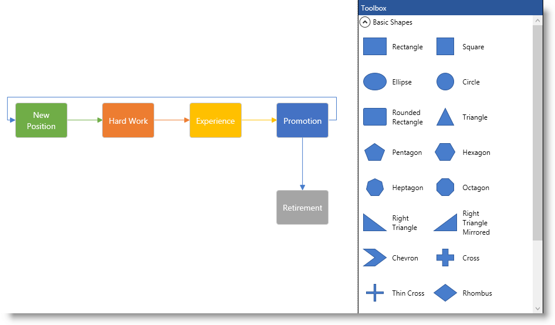

////

|metadata|
{
    "name": "xamdiagram-general-overview",
    "tags": ["API","Charting","Commands","Data Presentation","How Do I","Summaries","Virtualization"],
    "controlName": ["xamDiagram"],
    "guid": "799f85af-ff23-4fad-9a23-7dd871c049ea",  
    "buildFlags": [],
    "createdOn": "2014-06-16T08:51:54.4248334Z"
}
|metadata|
////

= General Overview (xamDiagram)

== Topic Overview

=== Purpose

This topic provides a conceptual overview of the  _xamDiagram_™ control and its main features and capabilities.

=== In this topic

This topic contains the following sections:

* <<_Ref391566716,  _xamDiagram_  Conceptual Overview >>

** <<_ConceptualOverviewSummary, _xamDiagram_  conceptual overview summary>>

* <<_Ref388439055,  _xamDiagram_  Features >>

** <<_Ref391566797, _xamDiagram_   features summary>>
** <<_Ref388439132, _xamDiagram_  features summary chart>>

* <<_Ref391566809,  _xamDiagram_  Visual Elements >>

** <<_Ref391566815,Visual elements summary>>

* <<_Ref391566819, User Interactions and Usability >>

** <<_Ref391566823,User interactions summary chart>>

* <<OLE_LINK79,  _xamDiagram_  Commands >>

** <<_CommandsSummary,Commands summary>>

* <<_Ref391566837, Configuring  _xamDiagram_  >>

** <<_ConfigSummary, _xamDiagram_  configuration summary>>
** <<_ConfigSummaryChart, _xamDiagram_  configuration summary chart>>
** <<_ItemsConfigSummaryChart, _xamDiagram_  items configuration summary chart>>
** <<_NodesConfigSummaryChart, _xamDiagram_  nodes configuration summary chart>>
** <<_ConnectionsConfigSummaryChart, _xamDiagram_  connections configuration summary chart>>
** <<_UserInteractionsConfigSummaryChart, _xamDiagram_  user interactions configuration summary chart>>

* <<_LargeDataOptimization, Optimizing for Large Data >>

** <<_PerformanceOptimizationRefChart,Commands summary>>

* <<_Ref388439099, Related Content >>

** <<_Ref386478106,Topics>>
** <<_Ref386478113,Samples>>

[[_Configuring_a_Custom]]
[[_Ref386478097]]
[[_Ref391566716]]
== xamDiagram Conceptual Overview

[[_ConceptualOverviewSummary]]

=== xamDiagram conceptual overview summary

The  _xamDiagram_   control is a diagramming component providing user interaction capabilities comparable to those of a stand-alone diagraming tool.

The  _xamDiagram_   displays two types of items – nodes and connections. A node can be displayed as various shapes such rectangle, ellipse, triangle etc. A connection either connects two nodes, two arbitrary points on the diagram, or a node and a point. Connections are displayed as lines that optionally start and end with a cap such as arrow, circle, dash etc..

Users can easily interact with the  _xamDiagram_   via mouse and keyboard. The most common operations such as Copy/Cut/Paste are accessible through the universally accepted keyboard shourtcuts (Ctrl+C, Ctrl+X, Ctrl+V). In addition to that, a Toolbox ( _xamDiagramToolbox_   control) is available to aid adding new nodes and connection to the diagram surface (See the picture above.).

The following screenshot demonstrates a  _xamDiagram_   displaying a simple flow diagram. The  _xamDiagramToolbox_   control is visible as well.

[[_Ref388439055]]
== _xamDiagram_  Features

[[_Ref391566797]]

=== xamDiagram features summary

include::xamdiagram-features-summary.adoc[]

[[_Ref388439132]]

=== xamDiagram features summary chart

include::xamdiagram-feature-summary-chart.adoc[]

[[_Ref391566809]]
== _xamDiagram_  Visual Elements

[[_Ref391566815]]

=== Visual elements summary

include::xamdiagram-visual-elements-summary.adoc[]

[[_Ref391566819]]
== User Interactions and Usability

[[_Ref391566823]]

=== User interactions summary chart

The following table summarizes the user interaction capabilities of the  _xamDiagram_   control.

[options="header", cols="a,a,a,a"]
|====
|The user can…|Using…|Details|Configurable?

|Pan the diagram surface
|
* Ctrl + mouse drag 

* Keyboard arrow keys 

The navigation pane controls
|Changes the currently visible portion of the diagram.
|image::images/Yes.png[] 

* link:xamdiagram-configuring-the-visible-portion.html[Configuring the Visible Portion of the Diagram ( _xamDiagram_ )] 

* link:xamdiagram-configuring-the-mouse-tool-and-default-interaction.html[Configuring the Mouse Tool and Default Drag Interaction ( _xamDiagram_ )] 

|Zoom in and out
|
* The mouse wheel 

* Mouse drag when the link:{ApiPlatform}controls.charts.xamdiagram{ApiVersion}~infragistics.controls.charts.diagramdraginteraction.html[Zoom] drag interaction is engaged 

* Ctrl + Shift + mouse drag 

The navigation pane navigators
|Changes the zoom level.
|image::images/Yes.png[] 

* link:xamdiagram-configuring-the-visible-portion.html[Configuring the Visible Portion of the Diagram ( _xamDiagram_ )] 

* link:xamdiagram-configuring-the-mouse-tool-and-default-interaction.html[Configuring the Mouse Tool and Default Drag Interaction ( _xamDiagram_ )] 

|Select one or more items
|
* Mouse drag 

* Click on an item 

* Ctrl + A 

|When dragging to select, all the items that are entirely in the rectangular selection area are selected. 

When clicking an item it is selected and the previous selection is cleared. 

Selecting all items is done via the Ctrl + A keyboard shortcut.
|image::images/Yes.png[] 

* link:xamdiagram-configuring-selection.html[Configuring Selection ( _xamDiagram_ )] 

|Move items
|Mouse drag over an item
|When the selection is not empty dragging one of the selected items will move all selected items.
|image::images/No.png[] 

* link:xamdiagram-configuring-the-position-and-size-of-diagram-nodes.html[Configuring the Position and Size of Diagram Nodes ( _xamDiagram_ )] 

|Resize nodes
|Mouse drag the resize handles
|When a single node is selected, resize indicators appear at its edges and sides. Dragging from one of the sides, resizes the node just from that side. Dragging from one of the corners resizes the node proportionally. 

If the Shift key is held down, these behaviors are reversed.
|image::images/Yes.png[] 

* link:xamdiagram-configuring-the-position-and-size-of-diagram-nodes.html[Configuring the Position and Size of Diagram Nodes ( _xamDiagram_ )] 

|Move connections’ start and end points
|Mouse drag the start/end point handles
|When a single connection is selected, draggable indicators appear at its ends. These can be dragged either to a point on the diagram or to a node.
|image::images/No.png[] 

* link:xamdiagram-configuring-the-start-and-end-of-diagram-connections.html[Configuring the Start and End of Diagram Connections ( _xamDiagram_ )] 

|Draw connection
|
* Mouse drag from a connection point on a node 

* Mouse drag from any point on the diagram when the link:{ApiPlatform}controls.charts.xamdiagram{ApiVersion}~infragistics.controls.charts.diagramtool.html[Connector] tool is engaged. 

|
|image::images/Yes.png[] 

* link:xamdiagram-configuring-the-visible-portion.html[Configuring the Visible Portion of the Diagram ( _xamDiagram_ )] 

* link:xamdiagram-configuring-the-mouse-tool-and-default-interaction.html[Configuring the Mouse Tool and Default Drag Interaction ( _xamDiagram_ )] 

|Edit the items’ content
|
* Mouse double click 

* F2 key 

|Begins an edit operation of a node or connection’s content.
|image::images/Yes.png[] 

* link:xamdiagram-configuring-the-diagram-items-content-visualization.html[Configuring the Visualization of the Content of the Diagram Items ( _xamDiagram_ )] 

|Show/Hide the options pane
|
* Clicking the “settings” icon (image:images/xamDiagram_Overview_16.png[]) next to the selected items 

* Esc/ Mouse click on the diagram’s surface 

|Shows/hides the context menu providing options for editing the appearance and content of the diagram items.
|image::images/Yes.png[] 

* link:xamdiagram-configuring-the-context-menu.html[Configuring the Context Menu ( _xamDiagram_ )] 

|Undo/Redo a change
|
* Ctrl + Z 

* Ctrl + U 

|Performs an undo/redo operation.
|image::images/Yes.png[] 

* link:xamdiagram-configuring-undo-redo-operations.html[Configuring Undo/Redo Operations ( _xamDiagram_ )] 

|[[_Hlk377147553]] 

Copy, Cut, Paste, Delete an item
|
* Ctrl + C 

* Ctrl + X 

* Ctrl + V 

* Delete 

|Standard Clipboard-like operations are supported for items in the diagram.
|image::images/Yes.png[] 

* link:xamdiagram-configuring-keyboard-shortcuts.html[Configuring Keyboard Shortcuts ( _xamDiagram_ )] 

* link:xamdiagram-configuring-ui-elements-with-commands.html[Configuring UI Elements with _xamDiagram_ Commands] 

|====

[[OLE_LINK79]]
== _xamDiagram_  Commands

[[_CommandsSummary]]

=== Commands summary

include::xamdiagram-commands-summary.adoc[]

[[_Ref391566837]]
== Configuring  _xamDiagram_

[[_ConfigSummary]]

=== xamDiagram configuration summary

include::xamdiagram-configuration-summary.adoc[]

[[_ConfigSummaryChart]]

=== xamDiagram configuration summary chart

include::xamdiagram-configuration-summary-chart.adoc[]

[[_ItemsConfigSummaryChart]]

=== xamDiagram items configuration summary chart

include::xamdiagram-items-configuration-summary-chart.adoc[]

[[_NodesConfigSummaryChart]]

=== xamDiagram nodes configuration summary chart

include::xamdiagram-nodes-configuration-summary-chart.adoc[]

[[_ConnectionsConfigSummaryChart]]

=== xamDiagram connections configuration summary chart

include::xamdiagram-connections-configuration-summary-chart.adoc[]

[[_UserInteractionsConfigSummaryChart]]

=== xamDiagram user interactions configuration summary chart

include::xamdiagram-user-interactions-configuration-summary-chart.adoc[]

[[_LargeDataOptimization]]
== Optimizing for Large Data

[[_PerformanceOptimizationRefChart]]

=== xamDiagram performance optimization suggestions reference chart

include::xamdiagram-performance-optimization-reference-chart.adoc[]

[[_Ref388439099]]
== Related Content

[[_Ref386478106]]

=== Topics

The following topics provide additional information related to this topic.

[options="header", cols="a,a"]
|====
|Topic|Purpose

| link:xamdiagram-features-overview.html[Features Overview ( _xamDiagram_ )]
|This topic explains in detail the main features of the _xamDiagram_ control.

| link:xamdiagram-visual-elements-overview.html[Visual Elements Overview ( _xamDiagram_ )]
|This topic provides an overview of the visual elements of the _xamDiagram_ control.

| link:xamdiagram-commands-overview.html[Commands Overview ( _xamDiagram_ )]
|This topic explains the operational logic of the commands available in the _xamDiagram_ control.

|====

[[_Ref386478113]]

=== Samples

The following samples provide additional information related to this topic.

[options="header", cols="a,a"]
|====
|Sample|Purpose

| link:{SamplesURL}/diagram/basic-configuration[Basic Configuration]
|This sample demonstrates creating a simple flowchart diagram using the _xamDiagram_ control.

|====