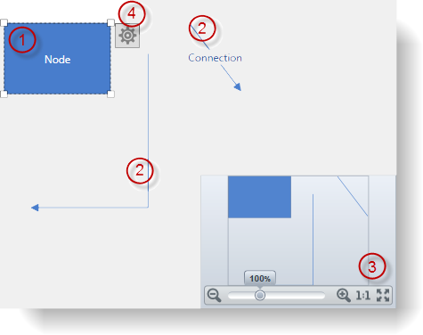
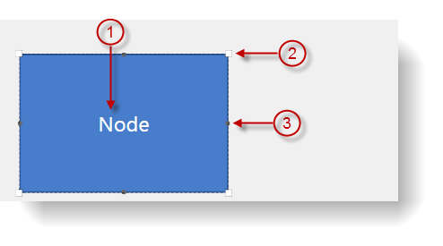
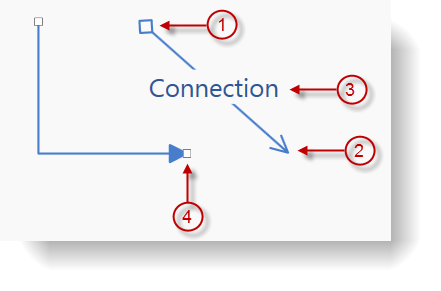
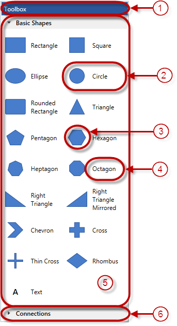

////

|metadata|
{
    "name": "xamdiagram-visual-elements-overview",
    "tags": ["Charting","Commands","How Do I","Summaries"],
    "controlName": ["xamDiagram"],
    "guid": "9a6c6b6c-84ac-466e-a080-3bdb27a1bd3d",  
    "buildFlags": [],
    "createdOn": "2014-06-16T09:13:16.8956656Z"
}
|metadata|
////

= Visual Elements Overview (xamDiagram)

== Topic Overview

=== Purpose

This topic provides an overview of the visual elements of the  _xamDiagram_™ control.

=== Required background

The following topics are prerequisites to understanding this topic:

[options="header", cols="a,a"]
|====
|Topic|Purpose

| link:xamdiagram-general-overview.html[General Overview ( _xamDiagram_ )]
|This topic provides a conceptual overview of the _xamDiagram_ control and its main features and capabilities.

| link:xamdiagram-features-overview.html[Features Overview ( _xamDiagram_ )]
|This topic explains in detail the main features of the _xamDiagram_ control.

|====

=== In this topic

This topic contains the following sections:

* <<_Ref389665005, Introduction >>

** <<_VisualElementsSummary,Visual elements summary>>

* <<_Ref389665048, Visual Elements of the Diagram and Related Properties >>

** <<_Ref389665054,Diagram’s visual elements summary>>
** <<_Ref389665059,Diagram’s visual elements and related properties>>

* <<_Ref389665068, Visual Elements of the Diagram Nodes and Related Properties >>

** <<_Ref389665104,Nodes’ visual elements summary>>
** <<_Ref389665110,Nodes’ visual elements and related properties>>
** <<_Ref389665128,Nodes’ default sizes>>

* <<_Ref389665283, Visual Elements of the Diagram Connections and Related Properties >>

** <<_Ref389665289,Connections’ visual elements summary>>
** <<_Ref389665293,Connections’ visual elements and related properties>>

* <<_Ref389665311, Visual Elements of the Toolbox and Related Properties >>

** <<_Ref389665366,Toolbox visual elements summary>>
** <<_Ref389665371,Toolbox visual elements and related properties>>

* <<_Ref389665417, Related Content >>

** <<_Ref386478106,Topics>>
** <<_Ref386478113,Samples>>

[[_Ref389665005]]
== Introduction

[[_VisualElementsSummary]]

=== Visual elements summary

include::xamdiagram-visual-elements-summary.adoc[]

[[_Ref389665048]]
== Visual Elements of  __the Diagram__  and Related Properties

[[_Ref389665054]]

=== Diagram’s visual elements summary

The following screenshot shows the visual elements of the diagram. The configurable elements are listed after the image.

[[_Ref389665059]]

=== Diagram’s visual elements and related properties

The following table maps the visual elements of the link:{ApiPlatform}controls.charts.xamdiagram{ApiVersion}~infragistics.controls.charts.xamdiagram_members.html[XamDiagram] control and the properties that configure them.

[options="header", cols="a,a,a"]
|====
|#|Visual Element|Property

|1
|Node
| link:{ApiPlatform}controls.charts.xamdiagram{ApiVersion}~infragistics.controls.charts.xamdiagram~items.html[Items]

|2
|Connection
| link:{ApiPlatform}controls.charts.xamdiagram{ApiVersion}~infragistics.controls.charts.xamdiagram~items.html[Items]

|3
|Navigation pane ( _XamOverviewPlusDetailPane_ control)
| link:{ApiPlatform}controls.charts.xamdiagram{ApiVersion}~infragistics.controls.charts.xamdiagram~navigationpanevisibility.html[NavigationPaneVisibility] 

link:{ApiPlatform}controls.charts.xamdiagram{ApiVersion}~infragistics.controls.charts.xamdiagram~navigationpanehorizontalalignment.html[NavigationPaneHorizontalAlignment] 

link:{ApiPlatform}controls.charts.xamdiagram{ApiVersion}~infragistics.controls.charts.xamdiagram~navigationpaneverticalalignment.html[NavigationPaneVerticalAlignment]

|4
|Options pane button
| link:{ApiPlatform}controls.charts.xamdiagram{ApiVersion}~infragistics.controls.charts.xamdiagram~optionspanevisibility.html[OptionsPaneVisibility] 

link:{ApiPlatform}controls.charts.xamdiagram{ApiVersion}~infragistics.controls.charts.xamdiagram~optionspaneplacement.html[OptionsPanePlacement]

|====

[[_Configuring_a_Custom]]
[[_Ref389665068]]
[[_Ref386478097]]
[[_Ref388439099]]
== Visual Elements of the Diagram Nodes and Related Properties

[[_Ref389665104]]

=== Nodes’ visual elements summary

The following screenshot depicts the visual elements of diagram nodes. The configurable elements are listed after the image.

[[_Ref389665110]]

=== Nodes’ visual elements and related properties

The following table maps the visual elements of link:{ApiPlatform}controls.charts.xamdiagram{ApiVersion}~infragistics.controls.charts.diagramnode_members.html[DiagramNode]s and the properties that configure them.

[options="header", cols="a,a,a"]
|====
|#|Visual Element|API Members

|1
|Content
| link:{ApiPlatform}controls.charts.xamdiagram{ApiVersion}~infragistics.controls.charts.diagramitem~content.html[Content] 

link:{ApiPlatform}controls.charts.xamdiagram{ApiVersion}~infragistics.controls.charts.diagramitem~displaytemplate.html[DisplayTemplate] 

link:{ApiPlatform}controls.charts.xamdiagram{ApiVersion}~infragistics.controls.charts.diagramitem~edittemplate.html[EditTemplate]

|2
|Resize handle
| link:{ApiPlatform}controls.charts.xamdiagram{ApiVersion}~infragistics.controls.charts.primitives.diagramresizehandle.html[DiagramResizeHandle] 

link:{ApiPlatform}controls.charts.xamdiagram{ApiVersion}~infragistics.controls.charts.primitives.diagramresizehandleline.html[DiagramResizeHandleLine]

|3
|Connection point
| link:{ApiPlatform}controls.charts.xamdiagram{ApiVersion}~infragistics.controls.charts.diagramnode~connectionpoints.html[ConnectionPoints]

|====

[[_Ref389665128]]

=== Nodes’ default sizes

The following table summarizes the default node sizes in pixels. The default sizes vary depending on the node’s shape. (The default sizes are in effect if no explicit overriding has been applied to a node.)

[options="header", cols="a,a,a"]
|====
|Node shape|Width|Height

|Chevron
| _80_ 
| _80_ 

|Circle
| _80_ 
| _80_ 

|Cross, thick
| _80_ 
| _80_ 

|Cross, thin
| _80_ 
| _80_ 

|Ellipse
| _120_ 
| _80_ 

|Heptagon
| _80_ 
| _80_ 

|Hexagon
| _92_ 
| _80_ 

|None
| _NaN_ 
| _NaN_ 

|Octagon
| _80_ 
| _80_ 

|Pentagon
| _84_ 
| _80_ 

|Rectangle
| _120_ 
| _80_ 

|Rectangle, rounded
| _120_ 
| _80_ 

|Rhombus
| _80_ 
| _80_ 

|Square
| _80_ 
| _80_ 

|Triangle
| _80_ 
| _80_ 

|Triangle, right-angled, with the right angle pointing at 45 degrees downward-left
| _120_ 
| _80_ 

|Triangle, right-angled, with the right angle pointing at 45 degrees downward-right
| _120_ 
| _80_ 

|====

.Note:
[NOTE]
====
Content overflows if the value of the node’s `Content` property does not fit within the borders of the node.
====

[[_Ref389665283]]
== Visual Elements of the Diagram Connections and Related Properties

[[_Ref389665289]]

=== Connections’ visual elements summary

The following screenshot depicts the visual elements of the diagram connections. The configurable elements are listed after the image.

[[_Ref389665293]]

=== Connections’ visual elements and related properties

The following table maps the visual elements of the link:{ApiPlatform}controls.charts.xamdiagram{ApiVersion}~infragistics.controls.charts.diagramconnection_members.html[DiagramConnection]s and the properties that configure them.

[options="header", cols="a,a,a"]
|====
|#|Visual Element|API Members

|1
|Start cap
| link:{ApiPlatform}controls.charts.xamdiagram{ApiVersion}~infragistics.controls.charts.diagramconnection~startcaptype.html[StartCapType] 

link:{ApiPlatform}controls.charts.xamdiagram{ApiVersion}~infragistics.controls.charts.diagramconnection~startcapsize.html[StartCapSize] 

link:{ApiPlatform}controls.charts.xamdiagram{ApiVersion}~infragistics.controls.charts.diagramconnection~startcapstyle.html[StartCapStyle]

|2
|End cap
| link:{ApiPlatform}controls.charts.xamdiagram{ApiVersion}~infragistics.controls.charts.diagramconnection~endcaptype.html[EndCapType] 

link:{ApiPlatform}controls.charts.xamdiagram{ApiVersion}~infragistics.controls.charts.diagramconnection~endcapsize.html[EndCapSize] 

link:{ApiPlatform}controls.charts.xamdiagram{ApiVersion}~infragistics.controls.charts.diagramconnection~endcapstyle.html[EndCapStyle]

|3
|Content
| link:{ApiPlatform}controls.charts.xamdiagram{ApiVersion}~infragistics.controls.charts.diagramitem~content.html[Content] 

link:{ApiPlatform}controls.charts.xamdiagram{ApiVersion}~infragistics.controls.charts.diagramitem~displaytemplate.html[DisplayTemplate] 

link:{ApiPlatform}controls.charts.xamdiagram{ApiVersion}~infragistics.controls.charts.diagramitem~edittemplate.html[EditTemplate]

|4
|Connection handle
| link:{ApiPlatform}controls.charts.xamdiagram{ApiVersion}~infragistics.controls.charts.primitives.diagramconnectionhandle.html[DiagramConnectionHandle]

|====

[[_Ref389665311]]
[[_Ref389665652]]
== Visual Elements of the Toolbox and Related Properties

[[_Ref389665366]]

=== Toolbox visual elements summary

The  _xamDiagramToolbox_   provides functionality for adding items to the  _xamDiagram_   via drag-drop. This control consists of a header and several categories (2 by default). Each of the categories has its own header is capable of containing any number of items representing a diagram item and a caption. The following screenshot shows the visual elements of the  _link:{ApiPlatform}controls.charts.xamdiagram{ApiVersion}~infragistics.controls.charts.xamdiagramtoolbox_members.html[XamDiagramToolbox]_  control. The configurable elements are listed after the image.

[[_Ref389665371]]

=== Toolbox visual elements and related properties

The following table maps the visual elements of the link:{ApiPlatform}controls.charts.xamdiagram{ApiVersion}~infragistics.controls.charts.xamdiagramtoolbox_members.html[XamDiagramToolbox] control and the properties that configure them.

[options="header", cols="a,a,a"]
|====
|#|Visual Element|Property

|1
|Header
| link:{ApiPlatform}controls.charts.xamdiagram{ApiVersion}~infragistics.controls.charts.xamdiagramtoolbox~header.html[Header]

|2
|Toolbox item
| link:{ApiPlatform}controls.charts.xamdiagram{ApiVersion}~infragistics.controls.charts.diagramtoolboxcategory~items.html[DiagramToolboxCategory.Items]

|3
|Toolbox item diagram item
| link:{ApiPlatform}controls.charts.xamdiagram{ApiVersion}~infragistics.controls.charts.diagramtoolboxitem~item.html[DiagramToolboxItem.Item]

|4
|Toolbox item title
| link:{ApiPlatform}controls.charts.xamdiagram{ApiVersion}~infragistics.controls.charts.diagramtoolboxitem~title.html[DiagramToolboxItem.Title]

|5
|Category
| link:{ApiPlatform}controls.charts.xamdiagram{ApiVersion}~infragistics.controls.charts.xamdiagramtoolbox~categories.html[Categories] 

link:{ApiPlatform}controls.charts.xamdiagram{ApiVersion}~infragistics.controls.charts.xamdiagramtoolbox~customcategories.html[CustomCategories]

|6
|Category name
| link:{ApiPlatform}controls.charts.xamdiagram{ApiVersion}~infragistics.controls.charts.diagramtoolboxcategory~name.html[DiagramToolboxCategory.Name]

|====

[[_Ref389665417]]
== Related Content

[[_Ref386478106]]

=== Topics

The following topics provide additional information related to this topic.

[options="header", cols="a,a"]
|====
|Topic|Purpose

| link:xamdiagram-adding-to-a-page.html[Adding _xamDiagram_ to a Page]
|This topic explains how to add the _xamDiagram_ control to a {PlatformName} application.

| link:xamdiagram-binding-to-data.html[Binding _xamDiagram_ to Data]
|This topic provides an overview of the data binding scenarios supported by the _xamDiagram_ control.

| link:xamdiagram-configuring-nodes.html[Configuring Nodes ( _xamDiagram_ )]
|The topics in this group explain how to configure the nodes of the _xamDiagram_ control.

| link:xamdiagram-configuring-diagram-connections.html[Configuring Connections ( _xamDiagram_ )]
|The topics in this group explain how to configure the connections of the _xamDiagram_ control.

| link:xamdiagram-configuring-the-navigation-pane.html[Configuring the Navigation Pane ( _xamDiagram_ )]
|This topic explains how to configure the Navigation pane of the _xamDiagram_ control.

| link:xamdiagram-configuring-the-toolbox.html[Configuring the Toolbox ( _xamDiagram_ )]
|This topic explains how to configure and use the _xamDiagram_ diagram toolbox.

|====

[[_Ref386478113]]

=== Samples

The following sample provides additional information related to this topic.

[options="header", cols="a,a"]
|====
|Sample|Purpose

| link:{SamplesURL}/diagram/basic-configuration[Basic Configuration]
|This sample demonstrates creating a simple flowchart diagram using the _xamDiagram_ control.

|====