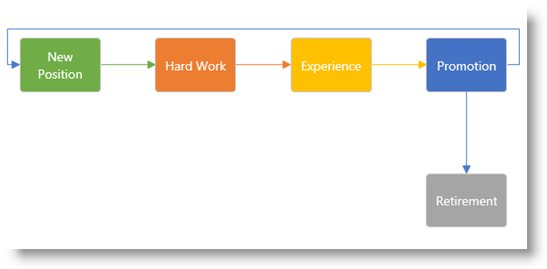

////

|metadata|
{
    "name": "xamdiagram",
    "tags": ["Getting Started","How Do I"],
    "controlName": ["xamDiagram"],
    "guid": "b11f055b-cfd4-46dc-a7c2-baa9d266352e",  
    "buildFlags": [],
    "createdOn": "2014-03-20T06:32:44.1996382Z"
}
|metadata|
////

= xamDiagram

== In This Group of Topics

=== Introduction

The topics in this group cover the  _xamDiagram_™ control and its use.

The  _xamDiagram_   control is intended to serve as a flexible high-performance diagramming component with a wide variety of applications. It can be used in data visualization scenarios however it also provides all the interactions expected from a stand-alone diagraming tool.

=== Topics

[options="header", cols="a,a"]
|====
|Topic|Purpose

| link:xamdiagram-overview.html[xamDiagram Overview]
|The topics in this group provide an overview of the functionality of the _xamDiagram_ control and its features.

| link:xamdiagram-adding-to-a-page.html[Adding xamDiagram to a Page]
|This topic explains how to add the _xamDiagram_ control to a {PlatformName} application.

| link:xamdiagram-binding-to-data.html[Binding xamDiagram to Data]
|This topic provides an overview of the data binding scenarios supported by the _xamDiagram_ control.

| link:xamdiagram-configuring.html[Configuring xamDiagram]
|The topics in this group explain how to configure the _xamDiagram_ control and its features.

| link:xamdiagram-styling.html[Styling xamDiagram]
|The topics in this group explain how to style the _xamDiagram_ control.

| link:xamdiagram-optimizing-for-handling-large-data.html[Optimizing xamDiagram for Handling Large Data]
|This topic provides guidance about tuning the _xamDiagram_ control for large data handling.

| link:xamdiagram-known-issues-and-limitations.html[Known Issues and Limitations (xamDiagram)]
|This topic explains _xamDiagram_ known issues and limitations.

| link:xamdiagram-api-reference.html[API Reference (xamDiagram)]
|This topic provides an overview of the most notable API members related to the _xamDiagram_ control.

|====