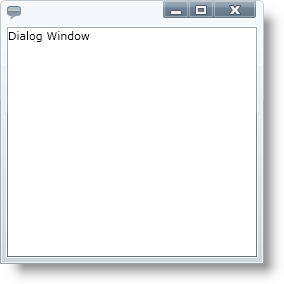

////
|metadata|
{
    "name": "xamdialogwindow-about-xamdialogwindow",
    "controlName": ["xamDialogWindow"],
    "tags": ["Getting Started","Layouts"],
    "guid": "{27932702-D38A-4E9E-A9A5-DCCAACFC4E12}",
    "buildFlags": [],
    "createdOn": "2016-05-25T18:21:54.9641472Z"
}
|metadata|
////

= About xamDialogWindow

The xamDialogWindow™ control is a complete {PlatformName} dialog window control for displaying rich, desktop-style pop-up windows within your {PlatformName} applications.

Your end user can maximize, minimize, restore or close the dialog window. The xamDialogWindow control is also fully customizable so you can maintain the same look and feel throughout your entire application.

The following is a list of key features of the xamDialogWindow control:

* Modal or Non Modal - The xamDialogWindow controls allows you to create modal or non modal dialog windows to control the flow of your application.
* Customizable Header and Content - The header and content of the xamDialogWindow control is 100% templatable which allows you to style the dialog window to maintain consistency with the rest of your application.
* Resizable – Your end users can drag the borders on the xamDialogWindow control to resize it.
* Location – You can set the xamDialogWindow control to open anywhere you want, and you can even set it to minimize to anywhere you want,even to a different panel.
* Restrict in Container – You can restrict the xamDialogWindow control to a container; the dialog window cannot be moved, maximized or positioned outside of this container.

== Related Topics

link:xamdialogwindow-adding-xamdialogwindow-to-your-page.html[Adding xamDialogWindow to Your Application]

link:xamdialogwindow-using-xamdialogwindow.html[Using xamDialogWindow]