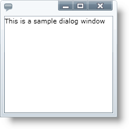

////
|metadata|
{
    "name": "xamdialogwindow-adding-xamdialogwindow-to-your-page",
    "controlName": ["xamDialogWindow"],
    "tags": ["Getting Started"],
    "guid": "789ab412-cf0f-4c16-b80e-3c050ac2f004",
    "buildFlags": [],
    "createdOn": "2016-05-25T18:21:55.0351114Z"
}
|metadata|
////

= Adding xamDialogWindow to Your Application

== Before You Begin

This topic is designed to get you up and running as quickly as possible by describing the basic steps required for adding the xamDialogWindow™ control to your page using XAML.

== What You Will Accomplish

You will add a basic xamDialogWindow control to your page.

== Follow these Steps

[start=1]
. Create a Microsoft® {PlatformName}™ application.

[start=2]
. In the Solution Explorer, add the following references to your project:

** {ApiPlatform}{ApiVersion}dll
** {ApiPlatform}Controls.Interactions.XamDialogWindow{ApiVersion}.dll

[start=3]
. Add the following using/Import directives in the code-behind and a namespace declaration in the opening  pick:[sl="UserControl"]  pick:[wpf="Window"]  tag.
+
*In XAML:*
+
[source,xaml]
----
xmlns:ig="http://schemas.infragistics.com/xaml"
----
+
*In Visual Basic:*
+
[source,vb]
----
Imports Infragistics.Controls.Interaction
----
+
*In C#:*
+
[source,csharp]
----
using Infragistics.Controls.Interactions;
----

[start=4]
. Add the xamDialogWindow control to a Grid container named LayoutRoot.
+
--
** Set the Width and Height properties.
** Set the Content property of the dialog window.
** Set the link:{ApiPlatform}controls.interactions.xamdialogwindow{ApiVersion}~infragistics.controls.interactions.xamdialogwindow~ismodal.html[IsModal] property to True to create a modal dialog window. For more information see link:xamdialogwindow-modal-and-modeless-dialog-windows.html[Modal and Modeless Dialog Windows] topic.
** Set the link:{ApiPlatform}controls.interactions.xamdialogwindow{ApiVersion}~infragistics.controls.interactions.startupposition.html[StartupPosition] to Center.
--
+
*In XAML:*
+
[source,xaml]
----
<Grid x:Name="LayoutRoot">
    <ig:XamDialogWindow 
        Width="200" Height="200" 
        Content="This is a sample dialog window" 
        IsModal="True" StartupPosition="Center" />
</Grid>
----
+
Create an instance of the xamDialogWindow control in the page constructor after the InitializeComponent method and add it to the Grid panel's Children collection.
+
*In Visual Basic:*
+
[source,vb]
----
Dim xamDialogWindow As New XamDialogWindow()
xamDialogWindow.Width = 200
xamDialogWindow.Height = 200
xamDialogWindow.Content = "This is a sample dialog window"
xamDialogWindow.IsModal = True
xamDialogWindow.StartupPosition = StartupPosition.Center
LayoutRoot.Children.Add(xamDialogWindow)
----
+
*In C#:*
+
[source,csharp]
----
XamDialogWindow xamDialogWindow = new XamDialogWindow();
xamDialogWindow.Width = 200;
xamDialogWindow.Height = 200;
xamDialogWindow.Content = "This is a sample dialog window";
xamDialogWindow.IsModal = true;
xamDialogWindow.StartupPosition = StartupPosition.Center;
LayoutRoot.Children.Add(xamDialogWindow);
----

[start=5]
. Save and run your application.
+

== Related Topics

link:xamdialogwindow-about-xamdialogwindow.html[About xamDialogWindow]

link:xamdialogwindow-using-xamdialogwindow.html[Using xamDialogWindow]