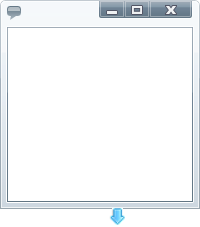

////

|metadata|
{
    "name": "xamdialogwindow-custom-cursors",
    "controlName": ["xamTagCloud"],
    "tags": ["How Do I","Styling","Templating"],
    "guid": "{2EE9F1FB-63C7-4782-8177-EEAE7FB1379D}",  
    "buildFlags": [],
    "createdOn": "2016-05-25T18:21:59.6044069Z"
}
|metadata|
////

= Custom Cursors

== Before You Begin

You can override the default cursors that are used when your end users resize the xamDialogWindow control. This can be achieved by setting the link:{ApiPlatform}controls.interactions.xamdialogwindow.v{ProductVersion}~infragistics.controls.interactions.customcursors.html[CustomCursors] object’s link:{ApiPlatform}controls.interactions.xamdialogwindow.v{ProductVersion}~infragistics.controls.interactions.customcursors~diagonalresizecursor.html[DiagonalResizeCursor], link:{ApiPlatform}controls.interactions.xamdialogwindow.v{ProductVersion}~infragistics.controls.interactions.customcursors~horizontalresizecursor.html[HorizontalResizeCursor] and link:{ApiPlatform}controls.interactions.xamdialogwindow.v{ProductVersion}~infragistics.controls.interactions.customcursors~verticalresizecursor.html[VerticalResizeCursor] properties.

_Assumptions_

_This topic assumes that you already have a xamDialogWindow control on your page._   _For more information, see the_   _link:xamdialogwindow-adding-xamdialogwindow-to-your-page.html[Adding xamDialogWindow to Your Page]_   _topic._

== What You Will Accomplish

You will customize the resizing cursors by setting the CustomCursors object’s DiagonalResizeCursor, HorizontalResizeCursor, VerticalResizeCursor properties to custom templates.

== Follow these Steps

[start=1]
. Create a resource dictionary on your page.

*In XAML:*

----
<UserControl.Resources>
   <!-- TODO: Add DataTemplate -->
</UserControl.Resources>
----

[start=2]
. Create a DataTemplate. Set the x:Name property to HorizontalResizeCustomCursor.

*In XAML:*

----
<DataTemplate x:Key="HorizontalResizeCustomCursor">
   <!-- TODO: Add Grid Panel -->
</DataTemplate>
----

[start=3]
. Add a Grid panel to the DataTemplate. Set the following properties:

** Height - 20
** Width - 20

*In XAML:*

----
<Grid Height="20" Width="20"
   <!-- TODO: Add Button -->
</Grid>
----

[start=4]
. Add an Image to the Grid panel. Set the following properties:

** Stretch - Fill
** Source - /Images/HorizontalResizeCursor

*In XAML:*

----
<Image Stretch="Fill"
       Source="/Images/HorizontalResizeCursor.png">
</Image>
----

[start=5]
. Create a DataTemplate. Set the x:Name property to VerticalResizeCustomCursor.

*In XAML:*

----
<DataTemplate x:Key="VerticalResizeCustomCursor">
   <!-- TODO: Add Grid Panel -->
</DataTemplate>
----

[start=6]
. Add a Grid panel to the DataTemplate. Set the following properties:

** Height - 20
** Width - 20

*In XAML:*

----
<Grid Height="20" Width="20">
   <!-- TODO: Add Image -->
</Grid>
----

[start=7]
. Add an Image to the Grid panel. Set the following properties:

** Stretch - Fill
** Source - /Images/VerticalResizeCursor

*In XAML:*

----
<Image Stretch="Fill"
       Source="/Images/VerticalResizeCursor.png">
</Image>
----

[start=8]
. Create a DataTemplate. Set the x:Name property to DiagonalResizeCustomCursor.

*In XAML:*

----
<DataTemplate x:Key="DiagonalResizeCustomCursor">
   <!-- TODO: Add Grid Panel -->
</DataTemplate>
----

[start=9]
. Add a Grid panel to the DataTemplate. Set the following properties:

** Height - 20
** Width - 20

*In XAML:*

----
<Grid Height="20" Width="20">
   <!-- TODO: Add Image -->
</Grid>
----

[start=10]
. Add an Image to the Grid panel. Set the following properties:

** Stretch - Fill
** Source - /Images/DiagonalResizeCursor

*In XAML:*

----
<Image Stretch="Fill"
       Source="/Images/DiagonalResizeCursor.png">
</Image>
----

[start=11]
. Set the following CustomCursors object’s properties:

** DiagonalResizeCursor – {StaticResource DiagonalResizeCustomCursor}
** HorizontalResizeCursor – {StaticResource HorizontalResizeCustomCursor}
** VerticalResizeCursor – {StaticResource VerticalResizeCustomCursor}

*In XAML:*

----
<Grid x:Name="LayoutRoot" Background="White">
   <ig:XamDialogWindow x:Name="DialogWindow" Width="200" 
       Height="200" IsModal="True"        Content="This is a sample dialog">
      <ig:XamDialogWindow.CustomCursors>
         <ig:CustomCursors 
             DiagonalResizeCursor="{StaticResource DiagonalResizeCustomCursor}"    
             HorizontalResizeCursor="{StaticResource HorizontalResizeCustomCursor}" 
             VerticalResizeCursor="{StaticResource VerticalResizeCustomCursor}" />
      </ig:XamDialogWindow.CustomCursors>        
   </ig:XamDialogWindow>
</Grid>
----

[start=12]
. Save and run your application.

== Related Topics

link:xamdialogwindow-customize-modal-dialog-window-background.html[Customize Modal Dialog Window Background]

link:xamdialogwindow-customize-the-window-header-icon.html[Customize the Window Header Icon]

link:xamdialogwindow-handle-moving-events.html[Handle Moving Events]

link:xamdialogwindow-handle-window-state-changing-events.html[Handle Window State Changing Events]

link:xamdialogwindow-keyboard-settings.html[Keyboard Settings]

link:xamdialogwindow-modal-and-modeless-dialog-windows.html[Modal and Modeless Dialog Windows]

link:xamdialogwindow-position-minimized-dialog-window.html[Position Minimized Dialog Window]

link:xamdialogwindow-set-the-dialog-windows-height-and-width-when-minimized.html[Set the Dialog Window's Height and Width When Minimized]

link:xamdialogwindow-start-up-position-of-xamdialogwindow.html[Start Up Position of xamDialogWindow]

link:xamdialogwindow-the-xamdialogwindow-controls-behavior.html[The xamDialogWindow Control's Behavior]

link:xamdialogwindow-window-header-controls.html[Window Header Controls]