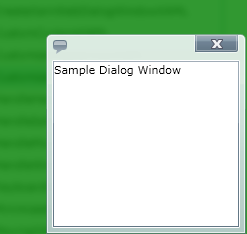

////

|metadata|
{
    "name": "xamdialogwindow-customize-modal-dialog-window-background",
    "controlName": ["xamDialogWindow"],
    "tags": ["How Do I","Styling"],
    "guid": "{DEBF02B3-CD4E-4C1E-B692-6FFCFC15DB6C}",  
    "buildFlags": [],
    "createdOn": "2016-05-25T18:21:54.9751468Z"
}
|metadata|
////

= Customize Modal Dialog Window Background

A modal dialog window always maintains the active window status until it is closed. When a modal dialog window is opened, your end user cannot interact with any other part of the application until the dialog window is closed.

When a dialog window is open, the rest of the application is grayed out. However, you can change this default style by setting the xamDialogWindow control’s link:{ApiPlatform}controls.interactions.xamdialogwindow.v{ProductVersion}~infragistics.controls.interactions.xamdialogwindow~modalbackground.html[ModalBackground], link:{ApiPlatform}controls.interactions.xamdialogwindow.v{ProductVersion}~infragistics.controls.interactions.xamdialogwindow~modalbackgroundopacity.html[ModalBackgroundOpacity] and link:{ApiPlatform}controls.interactions.xamdialogwindow.v{ProductVersion}~infragistics.controls.interactions.xamdialogwindow~modalbackgroundeffect.html[ModalBackgroundEffect] properties.

The following code demonstrates how to set these modal dialog properties.

*In XAML:*

[source,xaml]
----
<Grid x:Name="LayoutRoot" Background="White">
   <ig:XamDialogWindow x:Name="DialogWindow" Width="200" 
       Height="200" Content="This is a sample dialog" 
       IsModal="True"  
       ModalBackground="Green" ModalBackgroundOpacity="0.8">
      <ig:XamDialogWindow.ModalBackgroundEffect>
         <BlurEffect Radius="10"/>
      </ig:XamDialogWindow.ModalBackgroundEffect>
   </ig:XamDialogWindow>    
</Grid>
----

*In Visual Basic:*

[source,vb]
----
Imports System.Windows.Media.Effects
...
Dim modalBrush As New SolidColorBrush()
modalBrush.Color = Colors.Green
DialogWindow.ModalBackground = modalBrush
DialogWindow.ModalBackgroundOpacity = 0.8

Dim myBlurEffect As New BlurEffect()
blurEffectModal.Radius = 10
DialogWindow.ModalBackgroundEffect = blurEffectModal  
----

*In C#:*

[source,csharp]
----
using System.Windows.Media.Effects;
...
SolidColorBrush colorModal = new SolidColorBrush();
colorModal.Color = Colors.Green;
DialogWindow.ModalBackground = colorModal;
DialogWindow.ModalBackgroundOpacity = 0.8;
BlurEffect blurEffectModal = new BlurEffect();
blurEffectModal.Radius = 10;
DialogWindow.ModalBackgroundEffect = blurEffectModal;
----

==== Related Topics

link:xamdialogwindow-custom-cursors.html[Custom Cursors]

link:xamdialogwindow-customize-the-window-header-icon.html[Customize the Window Header Icon]

link:xamdialogwindow-handle-moving-events.html[Handle Moving Events]

link:xamdialogwindow-handle-window-state-changing-events.html[Handle Window State Changing Events]

link:xamdialogwindow-keyboard-settings.html[Keyboard Settings]

link:xamdialogwindow-modal-and-modeless-dialog-windows.html[Modal and Modeless Dialog Windows]

link:xamdialogwindow-position-minimized-dialog-window.html[Position Minimized Dialog Window]

link:xamdialogwindow-set-the-dialog-windows-height-and-width-when-minimized.html[Set the Dialog Window's Height and Width When Minimized]

link:xamdialogwindow-start-up-position-of-xamdialogwindow.html[Start Up Position of xamDialogWindow]

link:xamdialogwindow-the-xamdialogwindow-controls-behavior.html[The xamDialogWindow Control's Behavior]

link:xamdialogwindow-window-header-controls.html[Window Header Controls]