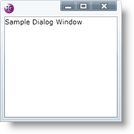

////
|metadata|
{
    "name": "xamdialogwindow-customize-the-window-header-icon",
    "controlName": ["xamDialogWindow"],
    "tags": ["How Do I","Styling"],
    "guid": "{9E8D1D01-FA4E-4401-BC5B-06E06D111105}",
    "buildFlags": [],
    "createdOn": "2016-05-25T18:21:54.9751468Z"
}
|metadata|
////

= Customize the Window Header Icon

== Before You Begin

Another key feature of the xamDialogWindow™ control is the ability to display an image in the header of the dialog window.

_Assumptions_

_This topic assumes that you already have a xamDialogWindow control on your page. For more information, see the link:xamdialogwindow-adding-xamdialogwindow-to-your-page.html[Adding xamDialogWindow to Your Page] topic._

== What You Will Accomplish

You will override the default image displayed in the header by setting the xamDialogWindow control’s link:{ApiPlatform}controls.interactions.xamdialogwindow.v{ProductVersion}~infragistics.controls.interactions.xamdialogwindow~headericontemplate.html[HeaderIconTemplate] property to a custom data template.

== Follow these Steps

[start=1]
. Create a resource dictionary on your page.
+
*In XAML:*
+
[source,xaml]
----
<UserControl.Resources>
   <!-- TODO: Add DataTemplate -->
</UserControl.Resources>
----

[start=2]
. Create a Data Template. Set the x:Name property to HeaderIconImg.
+
*In XAML:*
+
[source,xaml]
----
<DataTemplate x:Name="HeaderIconImg">
   <!-- TODO: Add Grid Panel -->
</DataTemplate>
----

[start=3]
. Add a Grid panel to the DataTemplate. Add an Ellipse to the Grid panel. Set the following properties:
+
--
** Width – 16
** Height – 16
--
+
*In XAML:*
+
[source,xaml]
----
<Grid>
   <Ellipse Width="16" Height="16">
      <!--TODO: Add Ellipse Properties --> 
   </Ellipse>
</Grid>
----

[start=4]
. Set the Ellipse element’s Fill attribute. Add a RadialGradientBrush element and set the GradientOrigin property to .1,.1.
+
*In XAML:*
+
[source,xaml]
----
<Ellipse.Fill>
   <RadialGradientBrush GradientOrigin=".1,.1">
      <!--TODO: Add GradientStops -->
   </RadialGradientBrush>
</Ellipse.Fill>
----

[start=5]
. Add two GradientStop elements. Set the following properties:
+
--
** Offset – 0.3, Color – White
** Offset – 1, Color – Purple
--
+
*In XAML:*
+
[source,xaml]
----
<GradientStop Offset="0.3" Color="White"/>
<GradientStop Offset="1" Color="Purple"/>
----

[start=6]
. Add a TextBlock control to the Grid panel. Set the following properties:
+
--
** Text – IG
** FontSize – 9
** HorizontalAlignment – Center
** VerticalAlignment – Center
--
+
*In XAML:*
+
[source,xaml]
----
<TextBlock Text="IG" FontSize="9" HorizontalAlignment="Center"  VerticalAlignment="Center"/>
----

[start=7]
. Set the xamDialogWindow control’s HeaderIconTemplate property to the data template you created.
+
*In XAML:*
+
[source,xaml]
----
<Grid x:Name="LayoutRoot" Width="600" Height="400">
   <ig:XamDialogWindow x:Name="DialogWindow" Width="200" 
                Height="200" Content="Sample Dialog Window" IsModal="True"  
                HeaderIconTemplate="{StaticResource HeaderIconImg}">
   </ig:XamDialogWindow>
</Grid>
----

[start=8]
. Save and run your application.
+

== Related Topics

link:xamdialogwindow-custom-cursors.html[Custom Cursors]

link:xamdialogwindow-customize-modal-dialog-window-background.html[Customize Modal Dialog Window Background]

link:xamdialogwindow-handle-moving-events.html[Handle Moving Events]

link:xamdialogwindow-handle-window-state-changing-events.html[Handle Window State Changing Events]

link:xamdialogwindow-keyboard-settings.html[Keyboard Settings]

link:xamdialogwindow-modal-and-modeless-dialog-windows.html[Modal and Modeless Dialog Windows]

link:xamdialogwindow-position-minimized-dialog-window.html[Position Minimized Dialog Window]

link:xamdialogwindow-set-the-dialog-windows-height-and-width-when-minimized.html[Set the Dialog Window's Height and Width When Minimized]

link:xamdialogwindow-start-up-position-of-xamdialogwindow.html[Start Up Position of xamDialogWindow]

link:xamdialogwindow-the-xamdialogwindow-controls-behavior.html[The xamDialogWindow Control's Behavior]

link:xamdialogwindow-window-header-controls.html[Window Header Controls]