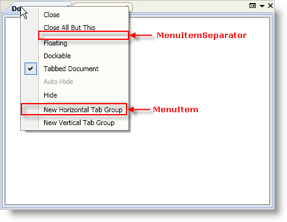

////

|metadata|
{
    "name": "xamdockmanager-about-styling",
    "controlName": ["xamDockManager"],
    "tags": ["Styling"],
    "guid": "{D08A76C2-32DA-4E89-A672-1D0DB855B52A}",  
    "buildFlags": [],
    "createdOn": "2012-01-30T19:39:53.4840499Z"
}
|metadata|
////

= About Styling

You can restyle xamDockManager™ using Styles and ControlTemplates just like any control in Microsoft® Windows® Presentation Foundation. However, the various classes that make up xamDockManager make styling easier by exposing a static property that you can use as the Key property of a Style or ControlTemplate. If the xamDockManager finds a Style or ControlTemplate that is using a predefined key, the xamDockManager control will automatically use the Style or ControlTemplate you created.

The tables below list the static properties that you can use as keys when creating your Styles and ControlTemplates. The heading for each section is the class that exposes the property. If the property name ends with "TemplateKey", you have to create a ControlTemplate to style that element. If the property name ends with "StyleKey", you have to create a Style to style that element. For example, if you want to style the tab headers of content panes in the link:{ApiPlatform}dockmanager.v{ProductVersion}~infragistics.windows.dockmanager.documentcontenthost.html[DocumentContentHost] object, you will first find the class and property name using the tables below. Once you find the property, create a ControlTemplate or a Style based on the name of the property. Set the Key property of the ControlTemplate or Style to the property using a markup extension.

*In XAML:*

----
<!--
Create a control template since the property name ends with "TemplateKey".
Set the Key property of the control template to the static property exposed by the PaneTabItem class.
Set the TargetType property of the control template to PaneTabItem.
-->
<ControlTemplate 
    x:Key="{x:Static igDock:PaneTabItem.DocumentTabItemTemplateKey}" 
    TargetType="{x:Type igDock:PaneTabItem}">
    <!--
    TODO: Create your template here and xamDockManager will automatically use this ControlTemplate for tab headers in the DocumentContentHost object.
    -->
</ControlTemplate>
----

== link:{ApiPlatform}dockmanager.v{ProductVersion}~infragistics.windows.dockmanager.panetabitem.html[PaneTabItem] Class

[options="header", cols="a,a"]
|====
|Property Name|Target Type

| link:{ApiPlatform}dockmanager.v{ProductVersion}~infragistics.windows.dockmanager.panetabitem~documenttabitemtemplatekey.html[DocumentTabItemTemplateKey]
|PaneTabItem

| link:{ApiPlatform}dockmanager.v{ProductVersion}~infragistics.windows.dockmanager.panetabitem~dockabletabitemtemplatekey.html[DockableTabItemTemplateKey]
|PaneTabItem

| link:{ApiPlatform}dockmanager.v{ProductVersion}~infragistics.windows.dockmanager.panetabitem~unpinnedtabitemtemplatekey.html[UnpinnedTabItemTemplateKey]
|PaneTabItem

|====

== link:{ApiPlatform}dockmanager.v{ProductVersion}~infragistics.windows.dockmanager.tabgrouppane.html[TabGroupPane] Class

[options="header", cols="a,a"]
|====
|Property Name|Target Type

| link:{ApiPlatform}dockmanager.v{ProductVersion}~infragistics.windows.dockmanager.tabgrouppane~documenttabgrouptemplatekey.html[DocumentTabGroupTemplateKey]
|TabGroupPane

| link:{ApiPlatform}dockmanager.v{ProductVersion}~infragistics.windows.dockmanager.tabgrouppane~dockabletabgrouptemplatekey.html[DockableTabGroupTemplateKey]
|TabGroupPane

| link:{ApiPlatform}dockmanager.v{ProductVersion}~infragistics.windows.dockmanager.tabgrouppane~documentpanenavigatorbuttonstylekey.html[DocumentPaneNavigatorButtonStyleKey]
|Button

| link:{ApiPlatform}dockmanager.v{ProductVersion}~infragistics.windows.dockmanager.tabgrouppane~documentclosebuttonstylekey.html[DocumentCloseButtonStyleKey]
|Button

| link:{ApiPlatform}dockmanager.v{ProductVersion}~infragistics.windows.dockmanager.tabgrouppane~documentfilesmenuitemstylekey.html[DocumentFilesMenuItemStyleKey]
|MenuItem

|====

== link:{ApiPlatform}dockmanager.v{ProductVersion}~infragistics.windows.dockmanager.paneheaderpresenter.html[PaneHeaderPresenter] Class

[options="header", cols="a,a"]
|====
|Property Name|Target Type

| link:{ApiPlatform}dockmanager.v{ProductVersion}~infragistics.windows.dockmanager.paneheaderpresenter~closebuttonstylekey.html[CloseButtonStyleKey]
|Button

| link:{ApiPlatform}dockmanager.v{ProductVersion}~infragistics.windows.dockmanager.paneheaderpresenter~pinbuttonstylekey.html[PinButtonStyleKey]
|Button

| link:{ApiPlatform}dockmanager.v{ProductVersion}~infragistics.windows.dockmanager.paneheaderpresenter~positionmenuitemstylekey.html[PositionMenuItemStyleKey]
|MenuItem

|====

== link:{ApiPlatform}dockmanager.v{ProductVersion}~infragistics.windows.dockmanager.panesplitter.html[PaneSplitter] Class

[options="header", cols="a,a"]
|====
|Property Name|Target Type

| link:{ApiPlatform}dockmanager.v{ProductVersion}~infragistics.windows.dockmanager.panesplitter~previewstylekey.html[PreviewStyleKey]
|Control

|====

== link:{ApiPlatform}dockmanager.v{ProductVersion}~infragistics.windows.dockmanager.xamdockmanager.html[XamDockManager] Class

[options="header", cols="a,a"]
|====
|Property Name|Target Type

| link:{ApiPlatform}dockmanager.v{ProductVersion}~infragistics.windows.dockmanager.xamdockmanager~droppreviewstylekey.html[DropPreviewStyleKey]
|Control

| link:{ApiPlatform}dockmanager.v{ProductVersion}~infragistics.windows.dockmanager.xamdockmanager~menuitemseparatorstylekey.html[MenuItemSeparatorStyleKey]
|Separator

| link:{ApiPlatform}dockmanager.v{ProductVersion}~infragistics.windows.dockmanager.xamdockmanager~menuitemstylekey.html[MenuItemStyleKey]
|MenuItem

| link:{ApiPlatform}dockmanager.v{ProductVersion}~infragistics.windows.dockmanager.xamdockmanager~tooltipstylekey.html[ToolTipStyleKey]
|ToolTip

|====

.Note
[NOTE]
====
The DropPreview control is not part of xamDockManager's visual tree; therefore, you must add the style to xamDockManager's local resource dictionary.
====

== Related Topics

link:xamdockmanager-styling-the-docking-indicators.html[Styling the Docking Indicators]

link:xamdockmanager-using-xamdockmanager.html[Using xamDockManager]