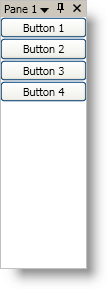

////

|metadata|
{
    "name": "xamdockmanager-add-content-to-a-contentpane",
    "controlName": ["xamDockManager"],
    "tags": ["How Do I"],
    "guid": "{EBC7F0CD-11B5-48A3-9A5A-31AB27D51152}",  
    "buildFlags": [],
    "createdOn": "2012-01-30T19:39:53.4860503Z"
}
|metadata|
////

= Add Content to a ContentPane

The link:{ApiPlatform}dockmanager{ApiVersion}~infragistics.windows.dockmanager.contentpane.html[ContentPane] object derives from HeaderedContentControl; therefore, using it will be similar to any headered content control found in Microsoft® Windows® Presentation Foundation. Just like any content control in Windows Presentation Foundation, you can set the link:{ApiPlatform}dockmanager{ApiVersion}~infragistics.windows.dockmanager.contentpane.html[Content] property of a content pane to an instance of an object. In many cases, you will use a layout container, such as a StackPanel, as the root element -- adding additional elements to the layout container.

Not only can you set the Content property of a content pane, but you can also set the link:{ApiPlatform}dockmanager{ApiVersion}~infragistics.windows.dockmanager.contentpane.html[Header] property to display text in the pane's header. If you unpin and hide a content pane, the tab header will automatically display the header text. You can override this default behavior by setting the content pane's link:{ApiPlatform}dockmanager{ApiVersion}~infragistics.windows.dockmanager.contentpane~tabheader.html[TabHeader] property.

You will also find the following properties that restrict docking related behaviors of the content pane:

* link:{ApiPlatform}dockmanager{ApiVersion}~infragistics.windows.dockmanager.contentpane~allowdocking.html[AllowDocking]
* link:{ApiPlatform}dockmanager{ApiVersion}~infragistics.windows.dockmanager.contentpane~allowdockingbottom.html[AllowDockingBottom]
* link:{ApiPlatform}dockmanager{ApiVersion}~infragistics.windows.dockmanager.contentpane~allowdockingfloating.html[AllowDockingFloating]
* link:{ApiPlatform}dockmanager{ApiVersion}~infragistics.windows.dockmanager.contentpane~allowdockingintabgroup.html[AllowDockingInTabGroup]
* link:{ApiPlatform}dockmanager{ApiVersion}~infragistics.windows.dockmanager.contentpane~allowdockingleft.html[AllowDockingLeft]
* link:{ApiPlatform}dockmanager{ApiVersion}~infragistics.windows.dockmanager.contentpane~allowdockingtop.html[AllowDockingTop]
* link:{ApiPlatform}dockmanager{ApiVersion}~infragistics.windows.dockmanager.contentpane~allowfloatingonly.html[AllowFloatingOnly]
* link:{ApiPlatform}dockmanager{ApiVersion}~infragistics.windows.dockmanager.contentpane~allowindocumenthost.html[AllowInDocumentHost]
* link:{ApiPlatform}dockmanager{ApiVersion}~infragistics.windows.dockmanager.contentpane~allowpinning.html[AllowPinning]
* link:{ApiPlatform}dockmanager{ApiVersion}~infragistics.windows.dockmanager.contentpane~ispinned.html[IsPinned]

The following example code demonstrates how to add content to a content pane.

*In XAML:*

----
...
<igDock:XamDockManager Name="xamDockManager1">
    <igDock:XamDockManager.Panes>
        <igDock:SplitPane>
            <igDock:ContentPane Header="Pane 1">
                <StackPanel>
                    <Button Content="Button 1" />
                    <Button Content="Button 2" />
                    <Button Content="Button 3" />
                    <Button Content="Button 4" />
                </StackPanel>
            </igDock:ContentPane>
        </igDock:SplitPane>
    </igDock:XamDockManager.Panes>
</igDock:XamDockManager>
...
----

*In Visual Basic:*

----
Imports Infragistics.Windows.DockManager
...
'Create a SplitPane object
Dim splitPane1 As New SplitPane() 
'Add the SplitPane to xamDockManager's Panes collection
Me.xamDockManager1.Panes.Add(splitPane1) 
'Create a ContentPane and set its Header property
Dim buttonPane As New ContentPane() 
buttonPane.Header = "Pane 1" 
'Add the ContentPane to the SplitPane's Panes collection
splitPane1.Panes.Add(buttonPane) 
'Create a StackPanel
Dim panel As New StackPanel() 
'Set the ContentPane's Content property to the panel
buttonPane.Content = panel 
'Create four Button controls and add it to the StackPanel's Children collection
For i As Integer = 1 To 4 
    Dim b As New Button() 
    b.Content = "Button " + i.ToString() 
    panel.Children.Add(b) 
Next
...
----

*In C#:*

----
using Infragistics.Windows.DockManager;
...
//Create a SplitPane object
SplitPane splitPane1 = new SplitPane();
//Add the SplitPane to xamDockManager's Panes collection
this.xamDockManager1.Panes.Add(splitPane1);
//Create a ContentPane and set its Header property
ContentPane buttonPane = new ContentPane();
buttonPane.Header = "Pane 1";
//Add the ContentPane to the SplitPane's Panes collection
splitPane1.Panes.Add(buttonPane);
//Create a StackPanel
StackPanel panel = new StackPanel();
//Set the ContentPane's Content property to the panel
buttonPane.Content = panel;
//Create four Button controls and add it to the StackPanel's Children collection
for (int i = 1; i < 5; i++)
{
    Button b = new Button();
    b.Content = "Button " + i.ToString();
    panel.Children.Add(b);
}
....
----

== Related Topics

link:xamdockmanager-about-opening-and-closing-panes.html[About Opening and Closing Panes]

link:xamdockmanager-add-panes-to-the-documentcontenthost-object.html[Add Panes to the DocumentContentHost Object]

link:xamdockmanager-add-panes-to-xamdockmanager.html[Add Panes to xamDockManager]

link:xamdockmanager-creating-a-tabbed-mdi-application.html[Creating a Tabbed MDI Application]

link:xamdockmanager-pin-and-unpin-a-pane.html[Pin and Unpin a Pane]

link:xamdockmanager-prevent-end-users-from-resizing-floating-panes.html[Prevent End Users From Resizing Floating Panes]

link:xamdockmanager-set-the-location-of-a-floating-pane.html[Set the Location of a Floating Pane]

link:xamdockmanager-set-the-initial-location-of-a-pane.html[Set the Initial Location of a Pane]

link:xamdockmanager-set-the-size-of-a-floating-pane.html[Set the Size of a Floating Pane]

link:xamdockmanager-show-the-pane-navigator-programmatically.html[Show the Pane Navigator Programmatically]

link:xamdockmanager-end-user-settings.html[End User Settings]

link:xamdockmanager-styling-xamdockmanager.html[Styling xamDockManager]