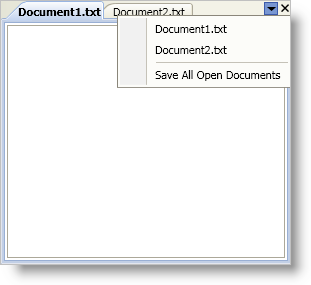

////

|metadata|
{
    "name": "xamdockmanager-add-menu-items-to-the-file-menu",
    "controlName": ["xamDockManager"],
    "tags": ["How Do I"],
    "guid": "{15B31903-1717-48EB-A72B-B3CA7AA63C89}",  
    "buildFlags": [],
    "createdOn": "2012-01-30T19:39:53.4880507Z"
}
|metadata|
////

= Add Menu Items to the File Menu

When you or your end users add panes to the xamDockManager™ control's document area, a small triangular button appears in the upper-right hand corner of the tabbed document area called the files menu. By default, the files menu lists all the panes within a particular tab group in the document area and allows your end users to switch between panes. You can also add your own items to the files menu by handling the link:{ApiPlatform}dockmanager{ApiVersion}~infragistics.windows.dockmanager.tabgrouppane.html[TabGroupPane] object's link:{ApiPlatform}dockmanager{ApiVersion}~infragistics.windows.dockmanager.tabgrouppane~filesmenuopening_ev.html[FilesMenuOpening] event and adding MenuItem objects to the link:{ApiPlatform}dockmanager{ApiVersion}~infragistics.windows.dockmanager.events.filesmenuopeningeventargs.html[FilesMenuOpeningEventArgs] object's link:{ApiPlatform}dockmanager{ApiVersion}~infragistics.windows.dockmanager.events.filesmenuopeningeventargs~items.html[Items] property.

The menu items that you add to the files menu will use Microsoft® Windows® Presentation Foundation's default styling. To keep the menu items' styling consistent with the rest of the control, simply set the MenuItem object's Style property to the static link:{ApiPlatform}dockmanager{ApiVersion}~infragistics.windows.dockmanager.xamdockmanager~menuitemstylekey.html[MenuItemStyleKey] property exposed by xamDockManager. This also applies to any Separator objects that you add to the files menu. However, instead of using the MenuItemStyleKey property, you have to use the link:{ApiPlatform}dockmanager{ApiVersion}~infragistics.windows.dockmanager.xamdockmanager~menuitemseparatorstylekey.html[MenuItemSeparatorStyleKey] property.

The following example code demonstrates how to add a separator and a menu item to the file menu.

*In XAML:*

----
<igDock:XamDockManager 
    Name="xamDockManager1" 
    igDock:TabGroupPane.FilesMenuOpening="xamDockManager1_FilesMenuOpening">
    <igDock:DocumentContentHost>
        <igDock:SplitPane>
            <igDock:TabGroupPane>
                <igDock:ContentPane Header="Document1.txt" />
                <igDock:ContentPane Header="Document2.txt" />
            </igDock:TabGroupPane>
        </igDock:SplitPane>
    </igDock:DocumentContentHost>
</igDock:XamDockManager>
----

*In Visual Basic:*

----
Imports Infragistics.Windows.DockManager
Imports Infragistics.Windows.DockManager.Events
...
Private Sub xamDockManager1_FilesMenuOpening(ByVal sender As Object, ByVal e As FilesMenuOpeningEventArgs)
    'Separator to differentiate between your own menu items and those created by xamDockManager
    Dim separator1 As New Separator()
    'Set the separator's style property to xamDockManager's static MenuItemSeparatorStyleKey property
    separator1.SetResourceReference(StyleProperty, XamDockManager.MenuItemSeparatorStyleKey)
    e.Items.Add(separator1)
    Dim menuItemSaveAll As New MenuItem()
    menuItemSaveAll.Header = "Save All Open Documents"
    'Set the menu item's style property to xamDockManager's static MenuItemStyleKey property
    menuItemSaveAll.SetResourceReference(StyleProperty, XamDockManager.MenuItemStyleKey)
    AddHandler menuItemSaveAll.Click, AddressOf menuItemSaveAll_Click
    e.Items.Add(menuItemSaveAll)
End Sub
Private Sub menuItemSaveAll_Click(ByVal sender As Object, ByVal e As RoutedEventArgs)
    'TODO: Add application logic here
End Sub
...
----

*In C#:*

----
using Infragistics.Windows.DockManager;
using Infragistics.Windows.DockManager.Events;
...
private void xamDockManager1_FilesMenuOpening(object sender, FilesMenuOpeningEventArgs e)
{
    //Separator to differentiate between your own menu items and those created by xamDockManager
    Separator separator1 = new Separator();
    //Set the separator's style property to xamDockManager's static MenuItemSeparatorStyleKey property
    separator1.SetResourceReference(StyleProperty, XamDockManager.MenuItemSeparatorStyleKey);
    e.Items.Add(separator1);
    MenuItem menuItemSaveAll = new MenuItem();
    menuItemSaveAll.Header = "Save All Open Documents";
    //Set the menu item's style property to xamDockManager's static MenuItemStyleKey property
    menuItemSaveAll.SetResourceReference(StyleProperty, XamDockManager.MenuItemStyleKey);
    menuItemSaveAll.Click += new RoutedEventHandler(menuItemSaveAll_Click);
    e.Items.Add(menuItemSaveAll);
}
private void menuItemSaveAll_Click(object sender, RoutedEventArgs e)
{
    //TODO: Add application logic here
}
...
----

== Related Topics

link:xamdockmanager-add-panes-to-the-documentcontenthost-object.html[Add Panes to the DocumentContentHost Object]

link:xamdockmanager-add-content-to-a-contentpane.html[Add Content to a ContentPane]

link:xamdockmanager-creating-a-tabbed-mdi-application.html[Creating a Tabbed MDI Application]