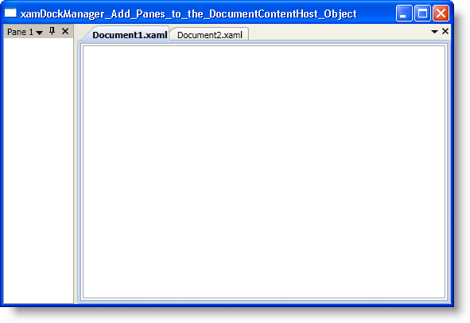

////

|metadata|
{
    "name": "xamdockmanager-add-panes-to-the-documentcontenthost-object",
    "controlName": ["xamDockManager"],
    "tags": ["How Do I","Layouts"],
    "guid": "{6984A929-A0DB-47E9-B302-5ED1C09D5DAA}",  
    "buildFlags": [],
    "createdOn": "2012-01-30T19:39:53.4910513Z"
}
|metadata|
////

= Add Panes to the DocumentContentHost Object

The xamDockManager™ control can display content in addition to content in docked panes and floating panes. You can set xamDockManager's link:{ApiPlatform}dockmanager{ApiVersion}~infragistics.windows.dockmanager.xamdockmanager.html[Content] property using the same pattern as any other content control in Microsoft® Windows® Presentation Foundation. This pattern normally involves setting the Content property to an instance of a layout container and then adding controls to the layout container's Children collection. However, xamDockManager also offers a second solution for adding content by means of the link:{ApiPlatform}dockmanager{ApiVersion}~infragistics.windows.dockmanager.documentcontenthost.html[DocumentContentHost] object.

The DocumentContentHost object is a specialized container for displaying content panes within a tab. The DocumentContentHost object will also allow your end users to move panes into xamDockManager's tabbed area. If you do not use a DocumentContentHost object as the content of xamDockManager, your end users will not be able to move a pane into the tabbed area.

The following example code demonstrates how to add panes to the DocumentContentHost object.

*In XAML:*

----
...
<igDock:XamDockManager Name="xamDockManager1">
    <igDock:XamDockManager.Panes>
        <igDock:SplitPane>
            <igDock:ContentPane Header="Pane 1">
            </igDock:ContentPane>
        </igDock:SplitPane>
    </igDock:XamDockManager.Panes>
    <igDock:DocumentContentHost>
        <igDock:SplitPane>
            <igDock:TabGroupPane>
                <igDock:ContentPane Header="Document1.xaml">
                    <RichTextBox />
                </igDock:ContentPane>
                <igDock:ContentPane Header="Document2.xaml">
                    <RichTextBox />
                </igDock:ContentPane>
            </igDock:TabGroupPane>
        </igDock:SplitPane>
    </igDock:DocumentContentHost>
</igDock:XamDockManager>
...
----

*In Visual Basic:*

----
Imports Infragistics.Windows.DockManager
...
Dim documentContentHost1 As New DocumentContentHost()
Me.xamDockManager1.Content = documentContentHost1
Dim splitPane1 As New SplitPane() 
documentContentHost1.Panes.Add(splitPane1) 
Dim tabGroupPane1 As New TabGroupPane() 
splitPane1.Panes.Add(tabGroupPane1) 
Dim contentPane1 As New ContentPane() 
contentPane1.Header = "Document1.xaml" 
contentPane1.Content = New RichTextBox()
Dim contentPane2 As New ContentPane() 
contentPane2.Header = "Document2.xaml" 
contentPane2.Content = New RichTextBox()
tabGroupPane1.Items.Add(contentPane1) 
tabGroupPane1.Items.Add(contentPane2)
'You can also achieve the same results using the following three lines of code:
'Me.xamDockManager1.Content = New DocumentContentHost()
'Me.xamDockManager1.AddDocument("Document1.xaml", New RichTextBox())
'Me.xamDockManager1.AddDocument("Document2.xaml", New RichTextBox())
...
----

*In C#:*

----
using Infragistics.Windows.DockManager;
...
DocumentContentHost documentContentHost1 = new DocumentContentHost();
this.xamDockManager1.Content = documentContentHost1;
SplitPane splitPane1 = new SplitPane();
documentContentHost1.Panes.Add(splitPane1);
TabGroupPane tabGroupPane1 = new TabGroupPane();
splitPane1.Panes.Add(tabGroupPane1);
ContentPane contentPane1 = new ContentPane();
contentPane1.Header = "Document1.xaml";
ContentPane contentPane2 = new ContentPane();
contentPane2.Header = "Document2.xaml";
tabGroupPane1.Items.Add(contentPane1);
tabGroupPane1.Items.Add(contentPane2);
//You can also achieve the same results using the following three lines of code:
//this.xamDockManager1.Content = new DocumentContentHost();
//this.xamDockManager1.AddDocument("Document1.xaml", new RichTextBox())
//this.xamDockManager1.AddDocument("Document2.xaml", new RichTextBox())
...
----

== Related Topics

link:xamdockmanager-about-opening-and-closing-panes.html[About Opening and Closing Panes]

link:xamdockmanager-add-content-to-a-contentpane.html[Add Content to a ContentPane]

link:xamdockmanager-add-panes-to-xamdockmanager.html[Add Panes to xamDockManager]

link:xamdockmanager-creating-a-tabbed-mdi-application.html[Creating a Tabbed MDI Application]

link:xamdockmanager-pin-and-unpin-a-pane.html[Pin and Unpin a Pane]

link:xamdockmanager-prevent-end-users-from-resizing-floating-panes.html[Prevent End Users From Resizing Floating Panes]

link:xamdockmanager-set-the-location-of-a-floating-pane.html[Set the Location of a Floating Pane]

link:xamdockmanager-set-the-initial-location-of-a-pane.html[Set the Initial Location of a Pane]

link:xamdockmanager-set-the-size-of-a-floating-pane.html[Set the Size of a Floating Pane]

link:xamdockmanager-show-the-pane-navigator-programmatically.html[Show the Pane Navigator Programmatically]

link:xamdockmanager-end-user-settings.html[End User Settings]

link:xamdockmanager-styling-xamdockmanager.html[Styling xamDockManager]