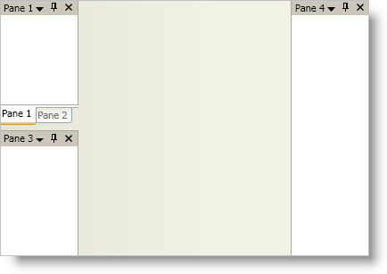

////

|metadata|
{
    "name": "xamdockmanager-add-panes-to-xamdockmanager",
    "controlName": ["xamDockManager"],
    "tags": ["How Do I"],
    "guid": "{05E7B167-F5FF-497D-812D-F696E96EA1A5}",  
    "buildFlags": [],
    "createdOn": "2012-01-30T19:39:53.4930517Z"
}
|metadata|
////

= Add Panes to xamDockManager

In order to use the xamDockManager™ control's docking functionality, you need to add panes to xamDockManager's link:{ApiPlatform}dockmanager{ApiVersion}~infragistics.windows.dockmanager.xamdockmanager~panes.html[Panes collection]. However, if you don't add panes to the Panes collection, you can still use the control to link:xamdockmanager-creating-a-tabbed-mdi-application.html[create a tabbed MDI application]. For more information on the three types of panes, see link:xamdockmanager-understanding-xamdockmanager.html[this topic].

The root-level panes in xamDockManager's Panes collection must be split panes. Once you add split panes to xamDockManager's Panes collection, you can add child panes to the split pane's link:{ApiPlatform}dockmanager{ApiVersion}~infragistics.windows.dockmanager.splitpane~panes.html[Panes collection].

The following code demonstrates how to add a couple different types of panes to xamDockManager.

*In XAML:*

----
...
<igDock:XamDockManager Name="xamDockManager1">
    <igDock:XamDockManager.Panes>
        <!-- Panes added to this SplitPane will be docked on the left -->
        <igDock:SplitPane SplitterOrientation="Horizontal">
            <igDock:TabGroupPane>
                <igDock:ContentPane Header="Pane 1">
                    <!--TODO: Add content here-->
                </igDock:ContentPane>
                <igDock:ContentPane Header="Pane 2">
                    <!--TODO: Add content here-->
                </igDock:ContentPane>
            </igDock:TabGroupPane>
            <igDock:ContentPane Header="Pane 3">
                <!--TODO: Add content here-->
            </igDock:ContentPane>
        </igDock:SplitPane>
        <!--Panes added to this SplitPane will be docked on the right-->
        <igDock:SplitPane igDock:XamDockManager.InitialLocation="DockedRight">
            <igDock:ContentPane Header="Pane 4">
                <!--TODO: Add content here-->
            </igDock:ContentPane>
        </igDock:SplitPane>
    </igDock:XamDockManager.Panes>
</igDock:XamDockManager>
...
----

*In Visual Basic:*

----
Imports Infragistics.Windows.DockManager
...
'Create two SplitPanes and set the orientation and/or location properties 
Dim splitPane1 As New SplitPane() 
splitPane1.SplitterOrientation = Orientation.Horizontal 
Dim splitPane2 As New SplitPane() 
XamDockManager.SetInitialLocation(splitPane2, InitialPaneLocation.DockedRight) 
'Add both SplitPanes to xamDockManager's Panes collection 
Me.xamDockManager1.Panes.Add(splitPane1) 
Me.xamDockManager1.Panes.Add(splitPane2) 
'Create a TabGroupPane 
Dim tabGroupPane1 As New TabGroupPane() 
'Create a Content Pane and set its Header property 
Dim contentPane3 As New ContentPane() 
contentPane3.Header = "Pane 3" 
'Add both the TabGroupPane and the ContentPane to splitPane1's Panes collection 
splitPane1.Panes.Add(tabGroupPane1) 
splitPane1.Panes.Add(contentPane3) 
'Create two ContentPanes and set their Header property 
Dim contentPane1 As New ContentPane() 
contentPane1.Header = "Pane 1" 
Dim contentPane2 As New ContentPane() 
contentPane2.Header = "Pane 2" 
'Add both ContentPanes to the TabGroupPane's Items collection 
tabGroupPane1.Items.Add(contentPane1) 
tabGroupPane1.Items.Add(contentPane2) 
'Create another ContentPane and set its Header property 
Dim contentPane4 As New ContentPane() 
contentPane4.Header = "Pane 4" 
'Add the ContentPane to splitPane2's Panes collection 
splitPane2.Panes.Add(contentPane4)
...
----

*In C#:*

----
using Infragistics.Windows.DockManager;
...
//Create two SplitPanes and set the orientation and/or location properties
SplitPane splitPane1 = new SplitPane();
splitPane1.SplitterOrientation = Orientation.Horizontal;
SplitPane splitPane2 = new SplitPane();
XamDockManager.SetInitialLocation(splitPane2, InitialPaneLocation.DockedRight);
//Add both SplitPanes to xamDockManager's Panes collection
this.xamDockManager1.Panes.Add(splitPane1);
this.xamDockManager1.Panes.Add(splitPane2);
//Create a TabGroupPane
TabGroupPane tabGroupPane1 = new TabGroupPane();
//Create a Content Pane and set its Header property
ContentPane contentPane3 = new ContentPane();
contentPane3.Header = "Pane 3";
//Add both the TabGroupPane and the ContentPane to splitPane1's Panes collection
splitPane1.Panes.Add(tabGroupPane1);
splitPane1.Panes.Add(contentPane3);
//Create two ContentPanes and set their Header property
ContentPane contentPane1 = new ContentPane();
contentPane1.Header = "Pane 1";
ContentPane contentPane2 = new ContentPane();
contentPane2.Header = "Pane 2";
//Add both ContentPanes to the TabGroupPane's Items collection
tabGroupPane1.Items.Add(contentPane1);
tabGroupPane1.Items.Add(contentPane2);
//Create another ContentPane and set its Header property
ContentPane contentPane4 = new ContentPane();
contentPane4.Header = "Pane 4";
//Add the ContentPane to splitPane2's Panes collection
splitPane2.Panes.Add(contentPane4);
...
----

== Related Topics

link:xamdockmanager-about-opening-and-closing-panes.html[About Opening and Closing Panes]

link:xamdockmanager-add-content-to-a-contentpane.html[Add Content to a ContentPane]

link:xamdockmanager-add-panes-to-the-documentcontenthost-object.html[Add Panes to the DocumentContentHost Object]

link:xamdockmanager-creating-a-tabbed-mdi-application.html[Creating a Tabbed MDI Application]

link:xamdockmanager-pin-and-unpin-a-pane.html[Pin and Unpin a Pane]

link:xamdockmanager-prevent-end-users-from-resizing-floating-panes.html[Prevent End Users From Resizing Floating Panes]

link:xamdockmanager-set-the-location-of-a-floating-pane.html[Set the Location of a Floating Pane]

link:xamdockmanager-set-the-initial-location-of-a-pane.html[Set the Initial Location of a Pane]

link:xamdockmanager-set-the-size-of-a-floating-pane.html[Set the Size of a Floating Pane]

link:xamdockmanager-show-the-pane-navigator-programmatically.html[Show the Pane Navigator Programmatically]

link:xamdockmanager-end-user-settings.html[End User Settings]

link:xamdockmanager-styling-xamdockmanager.html[Styling xamDockManager]