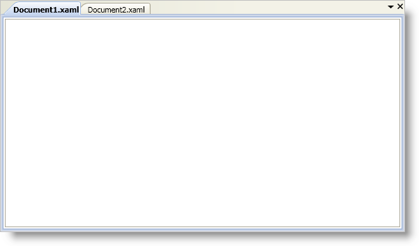

////

|metadata|
{
    "name": "xamdockmanager-creating-a-tabbed-mdi-application",
    "controlName": ["xamDockManager"],
    "tags": ["Getting Started","How Do I"],
    "guid": "{F32D2875-BB1D-4678-BDF4-036A5AC5A723}",  
    "buildFlags": [],
    "createdOn": "2012-01-30T19:39:53.5020535Z"
}
|metadata|
////

= Creating a Tabbed MDI Application

== Before You Begin

You don't have to learn a new object model to create a tabbed Multiple Document Interface (MDI) application with xamDockManager™. You can leverage your existing knowledge of xamDockManager and Microsoft® Windows® Presentation Foundation to create a tabbed MDI application.

== What You Will Accomplish

You will use content panes and the link:{ApiPlatform}dockmanager.v{ProductVersion}~infragistics.windows.dockmanager.documentcontenthost.html[DocumentContentHost] object to create a tabbed MDI application. Each content pane in the DocumentContentHost object will be displayed in a separate tab.

== Follow these Steps

[start=1]
. Add a xamDockManager control to your Window and name it.

*In XAML:*

----
<igDock:XamDockManager Name="xamDockManager1">
    <!--TODO: Add a DocumentContentHost here-->
</igDock:XamDockManager>
----

[start=2]
. Set xamDockManager's link:{ApiPlatform}dockmanager.v{ProductVersion}~infragistics.windows.dockmanager.xamdockmanager.html[Content] property to an instance of a DocumentContentHost. In XAML, you do not have to explicitly declare the tags for the Content property.

*In XAML:*

----
<igDock:DocumentContentHost>
    <!--TODO: Add a SplitPane here-->
</igDock:DocumentContentHost>
----

*In Visual Basic:*

----
Imports Infragistics.Windows.DockManager
...
Dim documentContentHost1 As New DocumentContentHost()
Me.xamDockManager1.Content = documentContentHost1
----

*In C#:*

----
using Infragistics.Windows.DockManager;
...
DocumentContentHost documentContentHost1 = new DocumentContentHost();
this.xamDockManager1.Content = documentContentHost1;
----

[start=3]
. Add a link:{ApiPlatform}dockmanager.v{ProductVersion}~infragistics.windows.dockmanager.splitpane.html[SplitPane] object to the DocumentContentHost object's link:{ApiPlatform}dockmanager.v{ProductVersion}~infragistics.windows.dockmanager.documentcontenthost~panes.html[Panes] collection. You do not have to explicitly declare tags for the DocumentContentHost object's Panes collection.

*In XAML:*

----
<igDock:SplitPane>
    <!--TODO: Add a TabGroupPane here-->
</igDock:SplitPane>
----

*In Visual Basic:*

----
Dim splitPane1 As New SplitPane()
documentContentHost1.Panes.Add(splitPane1)
----

*In C#:*

----
SplitPane splitPane1 = new SplitPane();
documentContentHost1.Panes.Add(splitPane1);
----

[start=4]
. Add a link:{ApiPlatform}dockmanager.v{ProductVersion}~infragistics.windows.dockmanager.tabgrouppane.html[TabGroupPane] object to the SplitPane object's link:{ApiPlatform}dockmanager.v{ProductVersion}~infragistics.windows.dockmanager.splitpane~panes.html[Panes] collection. You do not have to explicitly declare tags for the SplitPane object's Panes collection.

*In XAML:*

----
<igDock:TabGroupPane>
    <!--TODO: Add ContentPanes here-->
</igDock:TabGroupPane>
----

*In Visual Basic:*

----
Dim tabGroupPane1 As New TabGroupPane()
splitPane1.Panes.Add(tabGroupPane1)
----

*In C#:*

----
TabGroupPane tabGroupPane1 = new TabGroupPane();
splitPane1.Panes.Add(tabGroupPane1);
----

[start=5]
. Add a link:{ApiPlatform}dockmanager.v{ProductVersion}~infragistics.windows.dockmanager.contentpane.html[ContentPane] object to the TabGroupPane object's link:{ApiPlatform}dockmanager.v{ProductVersion}~infragistics.windows.dockmanager.tabgrouppane.html[Items] collection. You do not have to explicitly declare tags for the TabGroupPane object's Items collection.

The content panes in the DocumentContentHost object behave like regular content panes. This means your end users will be able to dock or float them at run time. You can restrict this behavior by setting the link:{ApiPlatform}dockmanager.v{ProductVersion}~infragistics.windows.dockmanager.contentpane~allowdocking.html[AllowDocking] property and the link:{ApiPlatform}dockmanager.v{ProductVersion}~infragistics.windows.dockmanager.contentpane~allowfloatingonly.html[AllowFloatingOnly] property of the content pane to False.

*In XAML:*

----
<!--You can set the AllowDocking and AllowFloatingOnly properties using a Style instead of setting them on each content pane-->
<igDock:ContentPane Header="Document1.xaml" AllowDocking=" AllowFloatingOnly=">
    <!--TODO: Add content here-->
</igDock:ContentPane>
----

*In Visual Basic:*

----
Dim contentPane1 As New ContentPane()
contentPane1.Header = "Document1.xaml"
'If you created a Style to set the AllowDocking and AllowFloatingOnly properties of a content pane, you do not have to set them here
contentPane1.AllowDocking = False
contentPane1.AllowFloatingOnly = False
tabGroupPane1.Items.Add(contentPane1)
----

*In C#:*

----
ContentPane contentPane1 = new ContentPane();
contentPane1.Header = "Document1.xaml";
//If you created a Style to set the AllowDocking and AllowFloatingOnly properties of a content pane, you do not have to set them here
contentPane1.AllowDocking = false;
contentPane1.AllowFloatingOnly = false;
tabGroupPane1.Items.Add(contentPane1);
----

[start=6]
. Set the ContentPane's link:{ApiPlatform}dockmanager.v{ProductVersion}~infragistics.windows.dockmanager.contentpane.html[Content] property. The ContentPane object is a content control; therefore, you can use it just like any content control in Windows Presentation Foundation.

*In XAML:*

----
<RichTextBox VerticalScrollBarVisibility="Auto" />
----

*In Visual Basic:*

----
Dim richTextBox1 As New RichTextBox()
richTextBox1.VerticalScrollBarVisibility = ScrollBarVisibility.Auto
contentPane1.Content = richTextBox1
----

*In C#:*

----
RichTextBox richTextBox1 = new RichTextBox();
richTextBox1.VerticalScrollBarVisibility = ScrollBarVisibility.Auto;
contentPane1.Content = richTextBox1;
----

[start=7]
. Dynamically add a second content pane (tab) to the DocumentContentHost object.

The example code below demonstrates how to add a content pane (tab) by calling the link:{ApiPlatform}dockmanager.v{ProductVersion}~infragistics.windows.dockmanager.xamdockmanager~adddocument.html[AddDocument] method. Calling the AddDocument method is a convenient way of dynamically adding a new content pane to the DocumentContentHost object. You can also instantiate a new ContentPane object and add it to the TabGroupPane object's Items collection if you do not want to use the AddDocument method.

*In Visual Basic:*

----
Dim richTextBox2 As New RichTextBox() 
richTextBox2.VerticalScrollBarVisibility = ScrollBarVisibility.Auto 
Dim contentPane2 As ContentPane = Me.xamDockManager1.AddDocument("Document2.xaml", richTextBox2) 
contentPane2.AllowDocking = False 
contentPane2.AllowFloatingOnly = False
----

*In C#:*

----
RichTextBox richTextBox2 = new RichTextBox();
richTextBox2.VerticalScrollBarVisibility = ScrollBarVisibility.Auto;
ContentPane contentPane2 = this.xamDockManager1.AddDocument("Document2.xaml", richTextBox2);
contentPane2.AllowDocking = false;
contentPane2.AllowFloatingOnly = false;
----

[start=8]
. Run the project to see two tabs named "Document1.xaml" and "Document2.xaml".

== Related Topics

link:xamdockmanager-about-opening-and-closing-panes.html[About Opening and Closing Panes]

link:xamdockmanager-add-content-to-a-contentpane.html[Add Content to a ContentPane]

link:xamdockmanager-add-panes-to-the-documentcontenthost-object.html[Add Panes to the DocumentContentHost Object]

link:xamdockmanager-add-panes-to-xamdockmanager.html[Add Panes to xamDockManager]

link:xamdockmanager-pin-and-unpin-a-pane.html[Pin and Unpin a Pane]

link:xamdockmanager-prevent-end-users-from-resizing-floating-panes.html[Prevent End Users From Resizing Floating Panes]

link:xamdockmanager-set-the-location-of-a-floating-pane.html[Set the Location of a Floating Pane]

link:xamdockmanager-set-the-initial-location-of-a-pane.html[Set the Initial Location of a Pane]

link:xamdockmanager-set-the-size-of-a-floating-pane.html[Set the Size of a Floating Pane]

link:xamdockmanager-show-the-pane-navigator-programmatically.html[Show the Pane Navigator Programmatically]

link:xamdockmanager-end-user-settings.html[End User Settings]

link:xamdockmanager-styling-xamdockmanager.html[Styling xamDockManager]