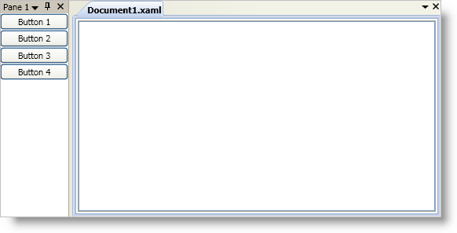

////

|metadata|
{
    "name": "xamdockmanager-getting-started-with-xamdockmanager",
    "controlName": ["xamDockManager"],
    "tags": ["Getting Started","How Do I"],
    "guid": "{5771DA8B-9B0C-48AD-9019-336866BF0DD0}",  
    "buildFlags": [],
    "createdOn": "2012-01-30T19:39:53.5070545Z"
}
|metadata|
////

= Adding xamDockManager to Your Application

== Before You Begin

You can add xamDockManager™ to a Window just as you would add any other control found in Microsoft® Windows® Presentation Foundation. This procedure involves using a layout container as the main content of the Window and then adding a control to the layout container.

== What You Will Accomplish

You will add a xamDockManager to a Window. You will then dock a set of buttons to the left side of xamDockManager using a combination of panes. Finally, you will create a tabbed document in the main content area.

== Follow these Steps

[start=1]
. Create a Microsoft® Windows® Presentation Foundation Window project.
[start=2]
. Add references to your project. In the Solution Explorer, add the following references:

** {ApiPlatform}v{ProductVersion}.dll
** {ApiPlatform}DockManager.v{ProductVersion}.dll

[start=3]
. Add a namespace declaration for xamDockManager.

*In XAML:*

----
xmlns:igDock="http://infragistics.com/DockManager"
----

*In Visual Basic:*

----
Imports Infragistics.Windows.DockManager
----

*In C#:*

----
using Infragistics.Windows.DockManager;
----

[start=4]
. Name the default Grid layout panel in the Window so that you can reference it in the code-behind.

*In XAML:*

----
<Grid Name="layoutRoot">
</Grid>
----

[start=5]
. Create an instanceof the xamDockManager. Declare tags for the link:{ApiPlatform}dockmanager{ApiVersion}~infragistics.windows.dockmanager.xamdockmanager~panes.html[Panes collection] within the xamDockManager control tags. All root-level panes in the Panes collection must be an instance of a link:{ApiPlatform}dockmanager{ApiVersion}~infragistics.windows.dockmanager.splitpane.html[SplitPane] object.

Add a SplitPane object to xamDockManager's Panes collection.The split pane will position its children from left to right. You can modify this default behavior by setting the link:{ApiPlatform}dockmanager{ApiVersion}~infragistics.windows.dockmanager.splitpane~splitterorientation.html[SplitterOrientation] property to Horizontal. Setting the SplitterOrientation property to Horizontal will create a horizontal splitter bar instead of a vertical splitter bar between panes. The result is that the split pane will position its children from top to bottom instead of left to right.

Add a link:{ApiPlatform}dockmanager{ApiVersion}~infragistics.windows.dockmanager.contentpane.html[ContentPane] object to the SplitPane object's link:{ApiPlatform}dockmanager{ApiVersion}~infragistics.windows.dockmanager.splitpane~panes.html[Panes collection] and set the ContentPane's link:{ApiPlatform}dockmanager{ApiVersion}~infragistics.windows.dockmanager.contentpane.html[Header] property. You do not have to explicitly declare tags for the Panes collection.

Add content to the ContentPane object - a StackPanel and four Button controls in it.

Add a link:{ApiPlatform}dockmanager{ApiVersion}~infragistics.windows.dockmanager.documentcontenthost.html[DocumentContentHost] object within the xamDockManager control tags. You must declare the tags for the DocumentContentHost object outside of xamDockManager's Panes collection. For more information about the DocumentContentHost object, see link:xamdockmanager-understanding-xamdockmanager.html[About xamDockManager].

Add a SplitPane object to the DocumentContentHost object's link:{ApiPlatform}dockmanager{ApiVersion}~infragistics.windows.dockmanager.documentcontenthost~panes.html[Panes collection]. You do not have to explicitly declare tags for the DocumentContentHost object's Panes collection.

Add a link:{ApiPlatform}dockmanager{ApiVersion}~infragistics.windows.dockmanager.tabgrouppane.html[TabGroupPane] object to the SplitPane object's Panes collection. You do not have to explicitly declare tags for the SplitPane object's Panes collection.Each content pane that you add to the tab group pane will be a tabbed document similar to the code view or design view in Microsoft Visual Studio®.

Add a ContentPane object to the TabGroupPane object's link:{ApiPlatform}dockmanager{ApiVersion}~infragistics.windows.dockmanager.tabgrouppane.html[Items collection] and set the ContentPane object's Header property.You do not have to explicitly declare tags for the TabGroupPane object's Items collection.

Add a RichTextBox control to the ContentPane object.

*In XAML:*

----
<Grid Name="layoutRoot">
  <igDock:XamDockManager Name="xamDockManager1">
    <!--Declaring tags for the Panes collection-->
    <igDock:XamDockManager.Panes>
      <!--Adding SplitPanes-->
      <igDock:SplitPane>
        <!--Adding panes-->
        <igDock:ContentPane Header="Pane 1">
          <!--Adding content-->
          <StackPanel>
            <Button Content="Button 1" />
            <Button Content="Button 2" />
            <Button Content="Button 3" />
            <Button Content="Button 4" />
          </StackPanel>
        </igDock:ContentPane>
      </igDock:SplitPane>
    </igDock:XamDockManager.Panes>
    <!--Adding a layout container or a DocumentContentHost-->
    <igDock:DocumentContentHost>
      <!--Adding a SplitPane-->
      <igDock:SplitPane>
        <!--Adding a TabGroupPane-->
        <igDock:TabGroupPane>
          <!--Adding ContentPanes-->
          <igDock:ContentPane Header="Document1.xaml">
            <!--TODO: Add content here-->
            <RichTextBox VerticalScrollBarVisibility="Auto" />
          </igDock:ContentPane>
        </igDock:TabGroupPane>
      </igDock:SplitPane>
    </igDock:DocumentContentHost>
  </igDock:XamDockManager>
</Grid>
----

*In Visual Basic:*

----
Private Sub Window_Loaded(ByVal sender As Object, ByVal e As EventArgs) 
    Private xamDockManager1 As XamDockManager
    xamDockManager1 = New XamDockManager() 
    ' Adding SplitPanes to xamDockManager's Panes collection
    Dim splitPane1 As New SplitPane()
    xamDockManager1.Panes.Add(splitPane1)
    Dim contentPane1 as New ContentPane()
    contentPane1.Header = "Pane 1"
    splitPane1.Panes.Add(contentPane1)
    Dim stackPanel1 As New StackPanel()
    contentPane1.Content = stackPanel1
    For i As Integer = 1 To 4 
      Dim b As New Button() 
      b.Content = "Button " + i.ToString() 
      stackPanel1.Children.Add(b) 
    Next
    ' Setting xamDockManager's Content property to an instance of a DocumentContentHost
    Dim documentContentHost1 As New DocumentContentHost()
    xamDockManager1.Content = documentContentHost1
    Dim splitPane2 As New SplitPane()
    documentContentHost1.Panes.Add(splitPane2)
    Dim tabGroupPane1 As New TabGroupPane()
    splitPane2.Panes.Add(tabGroupPane1)
    Dim contentPane2 As New ContentPane()
    contentPane2.Header = "Document1.xaml"
    tabGroupPane1.Items.Add(contentPane2)
    Dim richTextBox1 As New RichTextBox()
    contentPane2.Content = richTextBox1
    ' Adding xamDockManager to the layout container's Children collection
    Me.layoutRoot.Children.Add(xamDockManager1)
End Sub
----

*In C#:*

----
private void Window_Loaded(object sender, EventArgs e)
{
    private XamDockManager xamDockManager1;    
    xamDockManager1 = new XamDockManager();
    // Adding SplitPanes to xamDockManager's Panes collection
    SplitPane splitPane1 = new SplitPane();
    xamDockManager1.Panes.Add(splitPane1);
    ContentPane contentPane1 = new ContentPane();
    contentPane1.Header = "Pane 1";
    splitPane1.Panes.Add(contentPane1);
    StackPanel stackPanel1 = new StackPanel();
    contentPane1.Content = stackPanel1;
    for (int i = 1; i < 5; i++)
    {
        Button b = new Button();
        b.Content = "Button " + i.ToString();
        stackPanel1.Children.Add(b);
    }
    // Setting xamDockManager's Content property to an instance of a DocumentContentHost
    DocumentContentHost documentContentHost1 = new DocumentContentHost();
    xamDockManager1.Content = documentContentHost1;
    SplitPane splitPane2 = new SplitPane();
    documentContentHost1.Panes.Add(splitPane2);
    TabGroupPane tabGroupPane1 = new TabGroupPane();
    splitPane2.Panes.Add(tabGroupPane1);
    ContentPane contentPane2 = new ContentPane();
    contentPane2.Header = "Document1.xaml";
    tabGroupPane1.Items.Add(contentPane2);
    RichTextBox richTextBox1 = new RichTextBox();
    contentPane2.Content = richTextBox1;
    // Adding xamDockManager to the layout container's Children collection
    this.layoutRoot.Children.Add(xamDockManager1);
}
----

[start=6]
. Run the project to see four buttons docked to the left side of the application and a tabbed document named "Document1.xaml".

