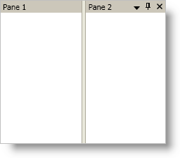

////

|metadata|
{
    "name": "xamdockmanager-hide-the-controls-in-a-content-panes-header",
    "controlName": ["xamDockManager"],
    "tags": ["How Do I"],
    "guid": "{0E3350A8-B614-4FE5-A36A-4CE72FC42521}",  
    "buildFlags": [],
    "createdOn": "2012-01-30T19:39:53.5090549Z"
}
|metadata|
////

= Hide the Controls in a Content Pane's Header

You can hide the controls in a content pane's header by setting a visibility property that corresponds to a control in the header. For example, a content pane contains three separate controls in its header, a close button, a pin button, and a window-position button. The link:{ApiPlatform}dockmanager.v{ProductVersion}~infragistics.windows.dockmanager.contentpane.html[ContentPane] object exposes visibility properties that correspond to these buttons, i.e., the link:{ApiPlatform}dockmanager.v{ProductVersion}~infragistics.windows.dockmanager.contentpane~closebuttonvisibility.html[CloseButtonVisibility], link:{ApiPlatform}dockmanager.v{ProductVersion}~infragistics.windows.dockmanager.contentpane~pinbuttonvisibility.html[PinButtonVisibility], and link:{ApiPlatform}dockmanager.v{ProductVersion}~infragistics.windows.dockmanager.contentpane~windowpositionmenuvisibility.html[WindowPositionMenuVisibility] properties so that you can easily hide the controls.

The following example code demonstrates how to hide the controls in a content pane's header.

*In XAML:*

----
<igDock:XamDockManager Name="xamDockManager1">
    <igDock:XamDockManager.Panes>
        <igDock:SplitPane>
            <igDock:ContentPane 
                Header="Pane 1" 
                Name="paneWithNoButtons" 
                CloseButtonVisibility="Collapsed" 
                PinButtonVisibility="Collapsed" 
                WindowPositionMenuVisibility="Collapsed">
            </igDock:ContentPane>
            <igDock:ContentPane Header="Pane 2" Name="paneWithButtons">
            </igDock:ContentPane>
        </igDock:SplitPane>
    </igDock:XamDockManager.Panes>
</igDock:XamDockManager>
----

*In Visual Basic:*

----
Me.paneWithNoButtons.CloseButtonVisibility = Visibility.Collapsed
Me.paneWithNoButtons.PinButtonVisibility = Visibility.Collapsed
Me.paneWithNoButtons.WindowPositionMenuButtonVisibility = Visibility.Collapsed
----

*In C#:*

----
this.paneWithNoButtons.CloseButtonVisibility = Visibility.Collapsed;
this.paneWithNoButtons.PinButtonVisibility = Visibility.Collapsed;
this.paneWithNoButtons.WindowPositionMenuButtonVisibility = Visibility.Collapsed;
----

== Related Topics

link:xamdockmanager-about-opening-and-closing-panes.html[About Opening and Closing Panes]

link:xamdockmanager-add-panes-to-xamdockmanager.html[Add Panes to xamDockManager]

link:xamdockmanager-add-content-to-a-contentpane.html[Add Content to a ContentPane]

link:xamdockmanager-pin-and-unpin-a-pane.html[Pin and Unpin a Pane]