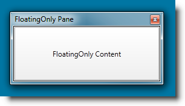

////
|metadata|
{
    "name": "xamdockmanager-min-max",
    "controlName": ["xamDockManager"],
    "tags": ["How Do I","Layouts"],
    "guid": "ae59b171-14d2-4331-9016-bdf2fb8c0f2f",
    "buildFlags": [],
    "createdOn": "2012-01-30T19:39:53.5460623Z"
}
|metadata|
////

= Minimizing and Maximizing of Floating Panes

You can allow the user to minimize and maximize the floating xamDockManager panes. Figure 1 and Figure 2 compare the end-user look of panes with allowed and disallowed minimization/maximization.

[cols="a,a"]
|====
| 

| 

|Figure 1: Floating pane with minimization and maximization allowed
|Figure 2: Floating pane with minimization and maximization disallowed

|====

The minimization/maximization behavior of the floating panes of the link:{ApiPlatform}dockmanager{ApiVersion}~infragistics.windows.dockmanager.xamdockmanager.html[xamDockManager] is configured with the link:{ApiPlatform}dockmanager{ApiVersion}~infragistics.windows.dockmanager.xamdockmanager~allowmaximizefloatingwindows.html[AllowMaximizeFloatingWindows] and link:{ApiPlatform}dockmanager{ApiVersion}~infragistics.windows.dockmanager.xamdockmanager~allowminimizefloatingwindows.html[AllowMinimizeFloatingWindows] properties:

*In XAML:*
[source, xaml]
----
<igDock:XamDockManager
    x:Name="dockManager"
    AllowMaximizeFloatingWindows="True"
    AllowMinimizeFloatingWindows="True">
...
</igDock:XamDockManager>
----

*In Visual Basic:*
[source, vb]
----
Me.dockManager.AllowMaximizeFloatingWindows = True
Me.dockManager.AllowMinimizeFloatingWindows = True
----

*In C#:*
[source, csharp]
----
this.dockManager.AllowMaximizeFloatingWindows = true;
this.dockManager.AllowMinimizeFloatingWindows = true;
----

In addition to that, you can configure the minimization / maximization permissions for each floating pane individually by setting the link:{RootAssembly}{ApiVersion}~infragistics.windows.controls.toolwindow~allowmaximize.html[AllowMaximize] and link:{RootAssembly}{ApiVersion}~infragistics.windows.controls.toolwindow~allowminimize.html[AllowMinimize] Boolean properties of the parent link:{ApiPlatform}dockmanager{ApiVersion}~infragistics.windows.dockmanager.panetoolwindow.html[PaneToolWindow] of your float pane:

*In XAML:*
[source, xaml]
----
<igDock:XamDockManager
    AllowMaximizeFloatingWindows="True"
    AllowMinimizeFloatingWindows="True">
    <igDock:XamDockManager.Panes>
       <igDock:SplitPane 
           igDock:XamDockManager.InitialLocation="FloatingOnly"
           igDock:XamDockManager.FloatingLocation="300,300">
           <igDock:ContentPane x:Name="floatingOnly">
               <locCtls:XdmSamplePaneContent Content="Some Content" />
           </igDock:ContentPane>
       </igDock:SplitPane>
    </igDock:XamDockManager.Panes>
</igDock:XamDockManager>
----

*In Visual Basic:*
[source, vb]
----
Dim tw As ToolWindow = ToolWindow.GetToolWindow(Me.floatingOnly)
If tw IsNot Nothing Then
        tw.AllowMinimize = False
        tw.AllowMaximize = False
End If
----

*In C#:*
[source, csharp]
----
ToolWindow tw = ToolWindow.GetToolWindow(this.floatingOnly);
if (tw != null)
{
    tw.AllowMinimize = false;
    tw.AllowMaximize = false;
}
----