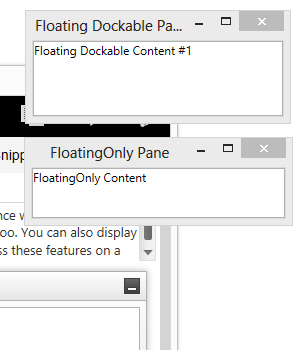
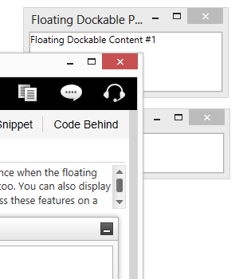
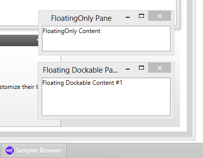
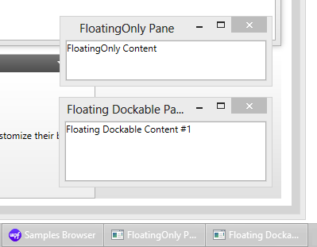

////
|metadata|
{
    "name": "xamdockmanager-owned-panes",
    "controlName": ["xamDockManager"],
    "tags": ["Getting Started","How Do I","Layouts"],
    "guid": "5aafa44f-5e19-4917-a4dc-d73d5221fcaf",
    "buildFlags": [],
    "createdOn": "2012-01-30T19:39:53.5490629Z"
}
|metadata|
////

= Owned Panes vs. Non-Owned Panes

Owned panes cannot be rendered behind their parent pane and always minimize with it. This is the standard behavior of owned panes and it is supported by the xamDockManger. Figure 1 and Figure 2 below compare the behavior of owned and non-owned panes in xamDockManger.

[cols="a,a"]
|====
|Owned panes cannot go behind the parent pane even when the parent window is selected. In Figure 1, the two "Floating…" panes remain on top of their parent pane, xamFeatureBrowser, even though it has been selected:
|Non-owned windows can go behind the parent window:

| 

Figure 1: Two owned panes in front of their parent pane
| 

Figure 2: Two non-owned panes behind their parent pane

|====

== Configuring Floating Panes as Owned

You can configure the floating panes as owned by setting the link:{ApiPlatform}dockmanager{ApiVersion}~infragistics.windows.dockmanager.xamdockmanager~useownedfloatingwindows.html[UseOwnedFloatingWindows] property of the link:{ApiPlatform}dockmanager{ApiVersion}~infragistics.windows.dockmanager.xamdockmanager.html[xamDockManager] to True. To set or retrieve the owned window settings for each floating pane, use the following code:

*In XAML:*
[source, xaml]
----
<igDock:XamDockManager
    UseOwnedFloatingWindows="True">
    <igDock:XamDockManager.Panes>
        <igDock:SplitPane 
            igDock:XamDockManager.InitialLocation="FloatingOnly"
            igDock:XamDockManager.FloatingLocation="300,300">
            <igDock:ContentPane x:Name="floatingOnly">
                <locCtls:XdmSamplePaneContent Content="Some Content" />
            </igDock:ContentPane>
        </igDock:SplitPane>
    </igDock:XamDockManager.Panes>
</igDock:XamDockManager>
----

*In Visual Basic:*
[source, vb]
----
Dim tw As ToolWindow = ToolWindow.GetToolWindow(Me.floatingOnly)
If tw IsNot Nothing Then
    Dim isOwned As Boolean = tw.IsOwnedWindow
End If
----

*In C#:*
[source, csharp]
----
ToolWindow tw = ToolWindow.GetToolWindow(this.floatingOnly);
if (tw != null)
{
    bool isOwned = tw.IsOwnedWindow;
}
----

== Displaying Floating Panes as Separate Tasks

You can show the floating windows as separate tasks on the Task Bar of the operating system. (Compare Figure 3 and Figure 4.)

[cols="a,a"]
|====
| 

| 

|Figure 3: Floating windows not shown on the Task Bar of the OS
|Figure 4: Floating windows displayed on the Task Bar of the OS

|====

This behavior is achieved by setting the link:{ApiPlatform}dockmanager{ApiVersion}~infragistics.windows.dockmanager.xamdockmanager~showfloatingwindowsintaskbar.html[ShowFloatingWindowsInTaskbar] property of the xamDockManger to True:

*In XAML:*
[source, xaml]
----
<igDock:XamDockManager
    ShowFloatingWindowsInTaskbar="True">
</igDock:XamDockManager>
----

*In Visual Basic:*
[source, vb]
----
Me.dockManager.ShowFloatingWindowsInTaskbar = True
----

*In C#:*
[source, csharp]
----
this.dockManager.ShowFloatingWindowsInTaskbar = true;
----