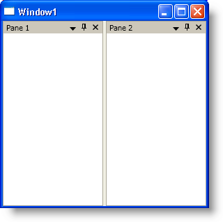

////

|metadata|
{
    "name": "xamdockmanager-prevent-xamdockmanager-from-reserving-space-for-content",
    "controlName": ["xamDockManager"],
    "tags": ["How Do I"],
    "guid": "{897B24D4-AAAE-493C-B023-135C743E5997}",  
    "buildFlags": [],
    "createdOn": "2012-01-30T19:39:53.5210573Z"
}
|metadata|
////

= Prevent xamDockManager from Reserving Space for Content

You can set the xamDockManager™ control's link:{ApiPlatform}dockmanager{ApiVersion}~infragistics.windows.dockmanager.xamdockmanager~layoutmode.html[LayoutMode] property to FillContainer so that the panes occupy all the available space in the xamDockManager control. However, if you set xamDockManager's link:{ApiPlatform}dockmanager{ApiVersion}~infragistics.windows.dockmanager.xamdockmanager.html[Content] property, xamDockManager will automatically use its standard layout mode and reserve space for the content.

The following example code demonstrates how to prevent xamDockManager from reserving space for content.

*In XAML:*

----
<igDock:XamDockManager Name="xamDockManager1" LayoutMode="FillContainer">
    <igDock:XamDockManager.Panes>
        <igDock:SplitPane>
            <igDock:ContentPane Header="Pane 1">
            </igDock:ContentPane>
            <igDock:ContentPane Header="Pane 2">
            </igDock:ContentPane>
        </igDock:SplitPane>
    </igDock:XamDockManager.Panes>
</igDock:XamDockManager>
----

*In Visual Basic:*

----
Imports Infragistics.Windows.DockManager
...
Me.xamDockManager1.LayoutMode = DockedPaneLayoutMode.FillContainer
...
----

*In C#:*

----
using Infragistics.Windows.DockManager;
...
this.xamDockManager1.LayoutMode = DockedPaneLayoutMode.FillContainer;
...
----

== Related Topics

link:xamdockmanager-add-panes-to-the-documentcontenthost-object.html[Add Panes to the DocumentContentHost Object]

link:xamdockmanager-add-panes-to-xamdockmanager.html[Add Panes to xamDockManager]

link:xamdockmanager-add-content-to-a-contentpane.html[Add Content to a ContentPane]