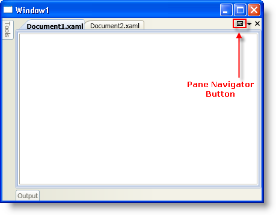
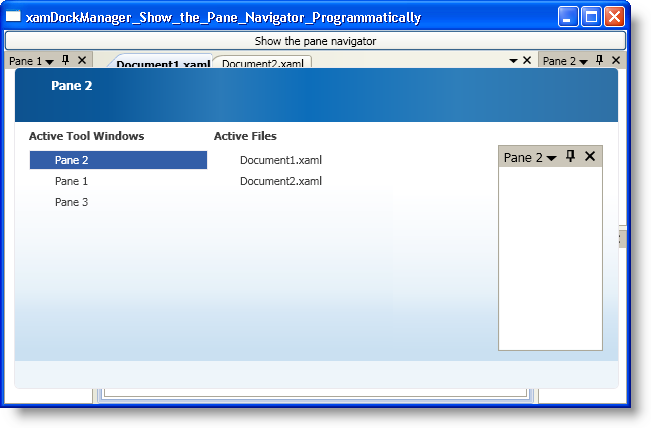

////

|metadata|
{
    "name": "xamdockmanager-show-the-pane-navigator-programmatically",
    "controlName": ["xamDockManager"],
    "tags": ["How Do I"],
    "guid": "{D5018473-014A-4C29-A592-5E112BB42488}",  
    "buildFlags": [],
    "createdOn": "2012-01-30T19:39:53.5320595Z"
}
|metadata|
////

= Show the Pane Navigator Programmatically

The xamDockManager™ control features a pane navigator similar to the IDE Navigator found in Microsoft® Visual Studio® 2008. Your end users can navigate to a pane using the pane navigator by pressing CTRL + TAB or ALT +F7. You can also set xamDockManager's link:{ApiPlatform}dockmanager{ApiVersion}~infragistics.windows.dockmanager.xamdockmanager~panenavigatorbuttondisplaymode.html[PaneNavigatorButtonDisplayMode] property to Always to display a button in the DocumentContentHost object that your end users can click in order to display the pane navigator. In addition to the built-in options for displaying the pane navigator, you can also display the pane navigator programmatically.The first screen shot shows the pane navigator button in the Document object when you set xamDockManager's PaneNavigatorButtonDisplayMode property to Always. The second screen shot is an example of the pane navigator.

The following example code demonstrates how to display the pane navigator programmatically.

*In XAML:*

----
...
<Button 
    Content="Show Pane Navigator" 
    Command="{x:Static igDock:DockManagerCommands.ShowPaneNavigator}" 
    CommandTarget="{Binding ElementName=xamDockManager1}" />
<igDock:XamDockManager Name="xamDockManager1" />
...
----

*In Visual Basic:*

----
Imports Infragistics.Windows.DockManager
...
Me.xamDockManager1.ExecuteCommand(DockManagerCommands.ShowPaneNavigator)
...
----

*In C#:*

----
using Infragistics.Windows.DockManager;
...
this.xamDockManager1.ExecuteCommand(DockManagerCommands.ShowPaneNavigator);
...
----

== Related Topics

link:xamdockmanager-about-opening-and-closing-panes.html[About Opening and Closing Panes]

link:xamdockmanager-add-content-to-a-contentpane.html[Add Content to a ContentPane]

link:xamdockmanager-add-panes-to-the-documentcontenthost-object.html[Add Panes to the DocumentContentHost Object]

link:xamdockmanager-add-panes-to-xamdockmanager.html[Add Panes to xamDockManager]

link:xamdockmanager-creating-a-tabbed-mdi-application.html[Creating a Tabbed MDI Application]

link:xamdockmanager-pin-and-unpin-a-pane.html[Pin and Unpin a Pane]

link:xamdockmanager-prevent-end-users-from-resizing-floating-panes.html[Prevent End Users From Resizing Floating Panes]

link:xamdockmanager-set-the-location-of-a-floating-pane.html[Set the Location of a Floating Pane]

link:xamdockmanager-set-the-initial-location-of-a-pane.html[Set the Initial Location of a Pane]

link:xamdockmanager-set-the-size-of-a-floating-pane.html[Set the Size of a Floating Pane]

link:xamdockmanager-end-user-settings.html[End User Settings]

link:xamdockmanager-styling-xamdockmanager.html[Styling xamDockManager]