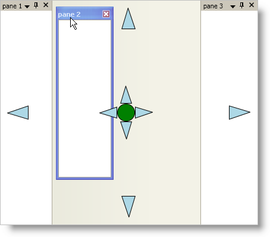
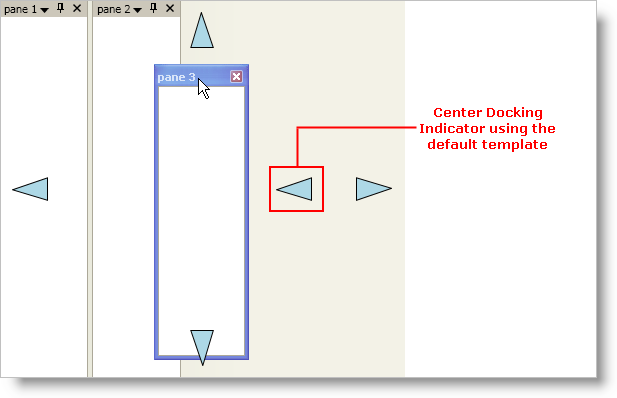

////

|metadata|
{
    "name": "xamdockmanager-styling-the-docking-indicators",
    "controlName": ["xamDockManager"],
    "tags": ["How Do I","Styling"],
    "guid": "{74BB0A9E-BB23-4FD1-815F-4F57C0ABA627}",  
    "buildFlags": [],
    "createdOn": "2012-01-30T19:39:53.5340599Z"
}
|metadata|
////

= Styling the Docking Indicators

== Before You Begin

The xamDockManager™ control displays docking indicators whenever an end user starts dragging a dockable pane. The default style of the docking indicators replicates the look and feel of the docking indicators found in Microsoft® Visual Studio® 2008. However, you can also create your own control template to restyle the docking indicators.

== What You Will Accomplish

You will create your own control template to restyle xamDockManager's default docking indicators similar to the screen shot below.

== Follow these Steps

[start=1]
. Add tags for the Window's local resource dictionary.

*In XAML:*

----
...
<Window.Resources>
    <!--TODO: Add control templates here-->
</Window.Resources>
...
----

[start=2]
. Create a control template that targets the link:{ApiPlatform}dockmanager.v{ProductVersion}~infragistics.windows.dockmanager.dockingindicator.html[DockingIndicator] control in the Window's resource dictionary.

The DockingIndicator control has five separate docking indicators, one on each side and one in the center. When you create a control template and assign it to the link:{ApiPlatform}dockmanager.v{ProductVersion}~infragistics.windows.dockmanager.dockingindicator.html[Template] property of the DockingIndicator control, all five docking indicators will use the same control template. However, the docking indicator in the center will not work because it requires more visual elements in the control template than the docking indicators on the sides. Step five will help you create a separate control template for the docking indicator in the center.

*In XAML:*

----
...
<ControlTemplate x:Key="dockingIndicators" TargetType="{x:Type igDock:DockingIndicator}">
    <Grid Width="36" Height="36">
        <!--This path object points to the left by default-->
        <Path 
            Name="DockingIndicatorGlyph" 
            Fill="LightBlue" 
            Stretch="Uniform" 
            Stroke="Black" 
            Data="M277,116 L227,133 277,148 z" />
    </Grid>
    <ControlTemplate.Triggers>
        <!--TODO: Add Triggers here to rotate the Path object-->
    </ControlTemplate.Triggers>
</ControlTemplate>
...
----

[start=3]
. Add triggers to modify the Path object based on the link:{ApiPlatform}dockmanager.v{ProductVersion}~infragistics.windows.dockmanager.dockingindicator~position.html[Position] property of the DockingIndicator control.

Since the DockingIndicator control uses the control template for all docking indicators along its edges, you have to add triggers to modify the visual elements in the control template. For instance, in this example, the docking indicator is an arrowhead that points to the left. When the docking indicator is on the right-hand side of the DockingIndicator control, you should rotate the arrowhead to point to the right.

*In XAML:*

----
...
<!--Trigger to rotate the path object so that it points to the right-->
<Trigger Property="Position" Value="Right">
    <Setter TargetName="DockingIndicatorGlyph" Property="LayoutTransform">
        <Setter.Value>
            <RotateTransform Angle="180" />
        </Setter.Value>
    </Setter>
</Trigger>
<!--Trigger to rotate the path object so that it points up-->
<Trigger Property="Position" Value="Top">
    <Setter TargetName="DockingIndicatorGlyph" Property="LayoutTransform">
        <Setter.Value>
            <RotateTransform Angle="90" />
        </Setter.Value>
    </Setter>
</Trigger>
<!--Trigger to rotate the path object so that it points down-->
<Trigger Property="Position" Value="Bottom">
    <Setter TargetName="DockingIndicatorGlyph" Property="LayoutTransform">
        <Setter.Value>
            <RotateTransform Angle="-90" />
        </Setter.Value>
    </Setter>
</Trigger>
...
----

[start=4]
. Add triggers to modify the Path object based on the link:{ApiPlatform}dockmanager.v{ProductVersion}~infragistics.windows.dockmanager.dockingindicator~hottrackposition.html[HotTrackPosition] property of the DockingIndicator control.

You can implement hot-tracking to give your end users visual feedback based on their action; however, you do not have to implement this in order for the docking indicators to work.

*In XAML:*

----
...
<Trigger Property="HotTrackPosition" Value="Left">
    <Setter TargetName="DockingIndicatorGlyph" Property="Fill" Value="Blue" />
</Trigger>
<Trigger Property="HotTrackPosition" Value="Right">
    <Setter TargetName="DockingIndicatorGlyph" Property="Fill" Value="Blue" />
</Trigger>
<Trigger Property="HotTrackPosition" Value="Top">
    <Setter TargetName="DockingIndicatorGlyph" Property="Fill" Value="Blue" />
</Trigger>
<Trigger Property="HotTrackPosition" Value="Bottom">
    <Setter TargetName="DockingIndicatorGlyph" Property="Fill" Value="Blue" />
</Trigger>
...
----

[start=5]
. Create a second control template that targets the DockingIndicator control in the Window's resource dictionary.

The docking indicator in the center of the DockingIndicator control is a combination of docking indicators that allows an end user to dock a pane to an edge of xamDockManager or to dock a pane within another pane (tab group). You will need five visual elements to represent each of these docking locations.

.Note
[NOTE]
====
You must name the visual elements that an end user will drop content panes on using a PART_DockLocation naming scheme. For example, if you have a visual element that docks panes to the left whenever an end user drops a content pane on it, you must name it "PART_DockLeft".
====

*In XAML:*

----
...
<ControlTemplate x:Key="centerDockingIndicator" TargetType="{x:Type igDock:DockingIndicator}">
    <Grid>
        <Grid.RowDefinitions>
            <RowDefinition Height="30" />
            <RowDefinition Height="30" />
            <RowDefinition Height="30" />
        </Grid.RowDefinitions>
        <Grid.ColumnDefinitions>
            <ColumnDefinition Width="30" />
            <ColumnDefinition Width="30" />
            <ColumnDefinition Width="30" />
        </Grid.ColumnDefinitions>
<!--
This ellipse is the center of the docking indicator and goes in the center square of the grid.
This visual element will dock a pane within another pane (tab group) and must be named "PART_DockCenter".
-->
        <Ellipse 
            Name="PART_DockCenter"
            Stroke="Black" 
            Grid.Row="1"
            Grid.Column="1"
            Fill="Green" />
<!--
This path object is a triangle that points left and goes in the first column, second row of the grid.
Since it will accept and dock a pane to the left, you must name it "PART_DockLeft".
-->
        <Path 
            Name="PART_DockLeft"
            Grid.Row="1" 
            Grid.Column="0" 
            Fill="LightBlue" 
            Stretch="Uniform" 
            Stroke="Black" 
            Data="M277,116 L227,133 277,148 z"/>
<!--
This path object is a triangle that points right and goes in the third column, second row of the grid.
Since it will accept and dock a pane to the right, you must name it "PART_DockRight"
-->
        <Path 
            Name="PART_DockRight" 
            Grid.Row="1" 
            Grid.Column="2" 
            Fill="LightBlue" 
            Stretch="Uniform" 
            Stroke="Black" 
            Data="M277,116 L227,133 277,148 z">
            <Path.LayoutTransform>
                <RotateTransform Angle="180" />
            </Path.LayoutTransform>
        </Path>
<!--
This path object is a triangle that points up and goes in the second column, first row of the grid.
Since it will accept and dock a pane to the top, you must name it "PART_DockTop".
-->
        <Path 
            Name="PART_DockTop" 
            Grid.Row="0" 
            Grid.Column="1" 
            Fill="LightBlue" 
            Stretch="Uniform" 
            Stroke="Black" 
            Data="M277,116 L227,133 277,148 z">
            <Path.LayoutTransform>
                <RotateTransform Angle="90" />
            </Path.LayoutTransform>
        </Path>
<!--
This path object is a triangle that points down and goes in the second column, third row of the grid.
Since it will accept and dock a pane to the bottom, you must name it "PART_DockBottom".
-->
        <Path 
            Name="PART_DockBottom" 
            Grid.Row="2" 
            Grid.Column="1" 
            Fill="LightBlue" 
            Stretch="Uniform" 
            Stroke="Black" 
            Data="M277,116 L227,133 277,148 z">
            <Path.LayoutTransform>
                <RotateTransform Angle="-90" />
            </Path.LayoutTransform>
        </Path>
    </Grid>
<!--
You can add triggers to the control template to implement hot-tracking functionality using XAML that is similar to XAML found in step four.
Simply change the TargetName property of the setter to one of the visual elements in this control template.
-->
</ControlTemplate>
...
----

[start=6]
. Add the following XAML for xamDockManager to your Window.

The XAML adds a xamDockManager control to your Window along with three empty content panes and a link:{ApiPlatform}dockmanager.v{ProductVersion}~infragistics.windows.dockmanager.documentcontenthost.html[DocumentContentHost] object.

*In XAML:*

----
...
<igDock:XamDockManager Name="xamDockManager1">
    <igDock:XamDockManager.Panes>
        <igDock:SplitPane>
            <igDock:ContentPane Header="pane 1" />
            <igDock:ContentPane Header="pane 2" />
            <igDock:ContentPane Header="pane 3" />
        </igDock:SplitPane>
    </igDock:XamDockManager.Panes>
    <igDock:DocumentContentHost />
</igDock:XamDockManager>
...
----

[start=7]
. Add tags for xamDockManager's local resource dictionary.

*In XAML:*

----
...
<igDock:XamDockManager.Resources>
    <!--TODO: Create a Style here-->
</igDock:XamDockManager.Resources>
...
----

[start=8]
. Create a style that targets the DockingIndicator control in xamDockManager's resource dictionary.

.Note
[NOTE]
====
The DockingIndicator control is not part of xamDockManager's visual tree; therefore, you must add the style to xamDockManager's local resource dictionary.
====

*In XAML:*

----
...

...
----

[start=9]
. Add a Setter object to the style that sets the Template property to the control template you created in step two.

This setter specifies the template for all docking indicators. You can add triggers that change the template based on the Position property of the DockingIndicator control. If you run your project now and drag a content pane, you should see something similar to the screen shot below. Notice that the docking indicator in the center is using the same template as the other docking indicators. You will also notice that it does not work. In order to get the docking indicator in the center working, you will have to add a trigger to the style that changes the template whenever the Position property's value is Center.

*In XAML:*

----
...
<Setter Property="Template" Value="{StaticResource dockingIndicators}" />
...
----

[start=10]
. Add a Trigger object to the style that changes the Template property when the value of the Position property is Center.

The template that you set in the previous step will not work for the docking indicator in the center of the DockingIndicator control. You will have to use the template you created in step five in order for the docking indicator in the center of the DockingIndicator control to work.

*In XAML:*

----
...
<Style.Triggers>
    <Trigger Property="Position" Value="Center">
        <Setter Property="Template" Value="{StaticResource centerDockingIndicator}" />
    </Trigger>
</Style.Triggers>
...
----

[start=11]
. Run your project and drag a content pane to see the docking indicators.

== Related Topics

link:xamdockmanager-about-styling.html[About Styling]

link:xamdockmanager-using-xamdockmanager.html[Using xamDockManager]