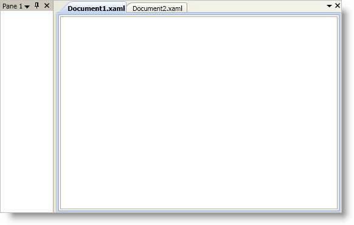
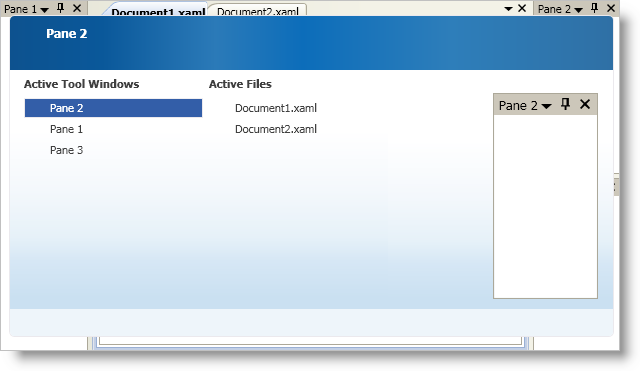
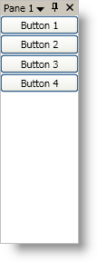
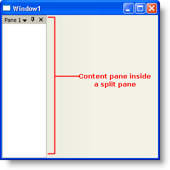
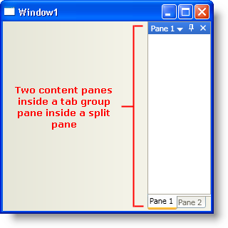

////

|metadata|
{
    "name": "xamdockmanager-understanding-xamdockmanager",
    "controlName": ["xamDockManager"],
    "tags": ["Getting Started"],
    "guid": "{26E0E5B9-2BBE-4706-88A6-51F0852407B8}",  
    "buildFlags": [],
    "createdOn": "2012-01-30T19:39:53.5390609Z"
}
|metadata|
////

= About xamDockManager

This is a great place for you to get an introduction to the xamDockManager™ control, and its key features and functionalities. The topics in this section will give you a better idea of why you would want to use xamDockManager in your applications.

* <<xamDockManager,About xamDockManager>>
* <<FloatingPanes,About Floating Panes>>
* <<AboutPanes,About Panes>>
* <<DocumentContentHost,About the DocumentContentHost Object>>

[[xamDockManager]]

== About xamDockManager

The xamDockManager™ control is a content control that uses a collection of panes to manage your application's layout. With xamDockManager, you can control the layout of your user interface while allowing your end users to customize it for usability. For instance, you can create a set of docked controls that your end user can unpin and hide while working on a task. This allows your end user to maximize their screen real estate for tasks they are working on without losing any of the application's functionality. As a user of Microsoft® Visual Studio®, you may already realize how important pinning/unpinning windows are to your productivity. You can provide this same functionality to your end users by using xamDockManager.

== Tabs and Tabbed Multiple Document Interface (MDI)

In addition to docked and floating panes, xamDockManager can display content in its remaining client area. The xamDockManager control derives from ContentControl; therefore, using it will be similar to other content controls in Microsoft Windows® Presentation Foundation. However, xamDockManager also provides a way to add and display content within a set of tabs, similar to code view and design view in Visual Studio. For more information, see link:xamdockmanager-creating-a-tabbed-mdi-application.html[Creating a Tabbed MDI Application] or link:xamdockmanager-add-panes-to-the-documentcontenthost-object.html[Add Panes to the DocumentContentHost Object].

== Pane Navigation

The pane navigator allows you to switch between open panes by pressing ALT + F7 (non-document panes) or CTRL + TAB (document panes). The pane navigator window displays the title of the pane and a small preview similar to the IDE Navigator found in Visual Studio 2008.

[[FloatingPanes]]

== About Floating Panes

Panes are containers that are the basic building blocks for the xamDockManager™ control. The xamDockManager control uses three different panes to manage layout.

== Content Pane

The link:{ApiPlatform}dockmanager{ApiVersion}~infragistics.windows.dockmanager.contentpane.html[ContentPane] object is a pane for containing content. The ContentPane object derives from HeaderedContentControl; therefore, using a content pane is the same as any headered content control found in Microsoft® Windows® Presentation Foundation. The content pane also exposes many properties to modify docking related behaviors.

== Split Pane

The link:{ApiPlatform}dockmanager{ApiVersion}~infragistics.windows.dockmanager.splitpane.html[SplitPane] object is not a content control; it is a container that manages a collection of child panes. The SplitPane object exposes the link:{ApiPlatform}dockmanager{ApiVersion}~infragistics.windows.dockmanager.splitpane~splitterorientation.html[SplitterOrientation] property and the link:{ApiPlatform}dockmanager{ApiVersion}~infragistics.windows.dockmanager.splitpane~relativesizeproperty.html[RelativeSize] attached property so that you can modify the orientation and size of child panes, respectively. You can also resize child panes at run time using the split pane's splitter bar.

All root-level split panes you add to xamDockManager's link:{ApiPlatform}dockmanager{ApiVersion}~infragistics.windows.dockmanager.xamdockmanager~panes.html[Panes collection] will be docked to the left side by default. You can set xamDockManager's link:{ApiPlatform}dockmanager{ApiVersion}~infragistics.windows.dockmanager.xamdockmanager~initiallocationproperty.html[InitialLocation] attached property to modify the default docking location of the root-level split panes.

== Tab Group Pane

The link:{ApiPlatform}dockmanager{ApiVersion}~infragistics.windows.dockmanager.tabgrouppane.html[TabGroupPane] object is a pane that displays content panes as tabs. Just like the split pane, this pane is not a content control; it is a container for other panes.

[[AboutPanes]]

== About Panes

An end user can float a content pane by selecting the Floating option from the content pane's drop-down menu, by dragging a content pane, or by double-clicking a content pane's header. You can also programmatically float a content pane by executing the link:{ApiPlatform}dockmanager{ApiVersion}~infragistics.windows.dockmanager.contentpanecommands~changetofloatingonly.html[ChangeToFloatingOnly] or link:{ApiPlatform}dockmanager{ApiVersion}~infragistics.windows.dockmanager.contentpanecommands~toggledockedstate.html[ToggleDockedState] commands in the link:{ApiPlatform}dockmanager{ApiVersion}~infragistics.windows.dockmanager.contentpanecommands.html[ContentPaneCommands] class.

Floating panes can have the following two possible states:

* FloatingOnly - This state prevents the floating pane from docking with any other panes; this includes dropping other panes into the floating pane to create a floating tab group
* DockableFloating - This state allows the floating pane to dock with other panes.

The previously mentioned commands, ChangeToFloatingOnly and ToggleDockedState, float a pane into the FloatingOnly state and DockableFloating state, respectively.

== Floating Pane Restrictions

* When an end user floats a pane, the floating pane is no longer part of the xamDockManager™ control's visual tree. Two side effects are that routed events will not bubble up to the main window and styles defined in the main window will not apply to elements in a floating pane; fortunately, xamDockManager exposes the link:{ApiPlatform}dockmanager{ApiVersion}~infragistics.windows.dockmanager.xamdockmanager~toolwindowloaded_ev.html[ToolWindowLoaded] and link:{ApiPlatform}dockmanager{ApiVersion}~infragistics.windows.dockmanager.xamdockmanager~toolwindowunloaded_ev.html[ToolWindowUnloaded] events to counter these effects. You can handle the ToolWindowLoaded event to set styles or to attach event handlers when an end user floats panes. You can handle the ToolWindowUnloaded event to remove event handlers when an end user docks a floating pane.
* In an XBAP application, floating panes are restricted by the browser's client area; therefore, your end users will not be able to drag floating panes outside of the browser.

[[DocumentContentHost]]

== About the DocumentContentHost Object

The xamDockManager™ control arranges content in floating panes or panes docked to one of its four sides, leaving the entire center area of xamDockManager for content. You can add content to xamDockManager using a layout container or a link:{ApiPlatform}dockmanager{ApiVersion}~infragistics.windows.dockmanager.documentcontenthost.html[DocumentContentHost] object.

The DocumentContentHost object is a specialized control for displaying content in tabs. If you have worked with Microsoft® Visual Studio®, the tabbed user interface is something you see whenever you edit a code file or modify the design surface. In addition to a tabbed user interface, if you set the link:https://msdn.microsoft.com/en-us/library/system.windows.controls.contentcontrol.content.aspx[Content] property of xamDockManager to an instance of a DocumentContentHost, you will be able to move panes in and out of the tabbed area. If you use a layout container instead of a DocumentContentHost object, you will not be able to drag a pane into the tabbed area.