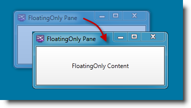
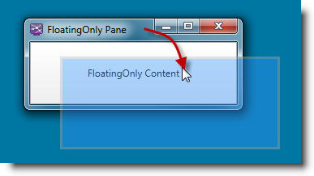
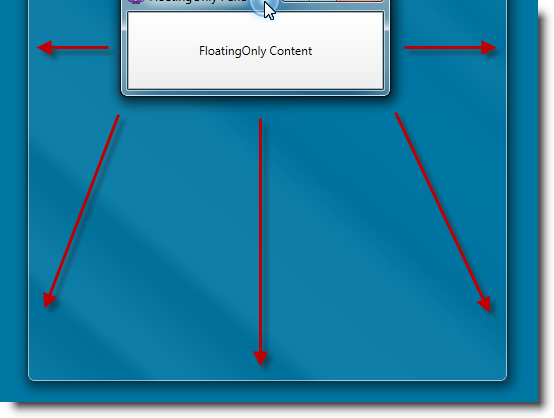

////

|metadata|
{
    "name": "xamdockmanger-dragging-panes",
    "controlName": ["xamDockManager"],
    "tags": ["Getting Started","How Do I","Layouts"],
    "guid": "33d970fe-f846-400c-9a58-877ff1710623",  
    "buildFlags": [],
    "createdOn": "2012-01-30T19:39:53.5510633Z"
}
|metadata|
////

= Modes of Pane Dragging

The xamDockManager supports several different modes of floating pane dragging. You can control which one to make available to the user by setting the respective value of the link:{ApiPlatform}dockmanager.v{ProductVersion}~infragistics.windows.dockmanager.xamdockmanager~floatingwindowdragmode.html[FloatingWindowDragMode] property of the link:{ApiPlatform}dockmanager.v{ProductVersion}~infragistics.windows.dockmanager.xamdockmanager.html[xamDockManager]. Following is a list of these values with a description of the dragging mode the value sets:

* link:{ApiPlatform}dockmanager.v{ProductVersion}~infragistics.windows.dockmanager.floatingwindowdragmode.html[Immediate] – the window is moved in synch with the dragging

Figure 1: Immediate dragging
* link:{ApiPlatform}dockmanager.v{ProductVersion}~infragistics.windows.dockmanager.floatingwindowdragmode.html[Deferred] – the window’s content is moved when the dragging is finished and the mouse button is released. During the dragging, a transparent or semi-transparent window frame is moved instead.

Figure 2: Deferred dragging
* link:{ApiPlatform}dockmanager.v{ProductVersion}~infragistics.windows.dockmanager.floatingwindowdragmode.html[UseDragFullWindowsSystemSettings] – selecting this option means that the link:http://msdn.microsoft.com/en-us/library/system.windows.systemparameters.dragfullwindows.aspx[System.Windows.SystemParameters.DragFullWindows] property will be used.
link:{ApiPlatform}dockmanager.v{ProductVersion}~infragistics.windows.dockmanager.floatingwindowdragmode.html[UseSystemWindowDrag] – the drag operation is handled by the operating system based on its Show Window Contents While Dragging setting.*Note on Windows® 7:*

When the Show Window Contents While Dragging setting allows it, the UseSystemWindowDrag setting will allow dragging windows into and out of a maximized state, but in this case some functionalities, such as setting the link:{ApiPlatform}dockmanager.v{ProductVersion}~infragistics.windows.dockmanager.dragging.movewindowaction~newlocation.html[Infragistics.Windows.DockManager.Dragging.MoveWindowAction.NewLocation], will not be supported.

Figure 3: Dragging a window into maximized state (Windows 7)