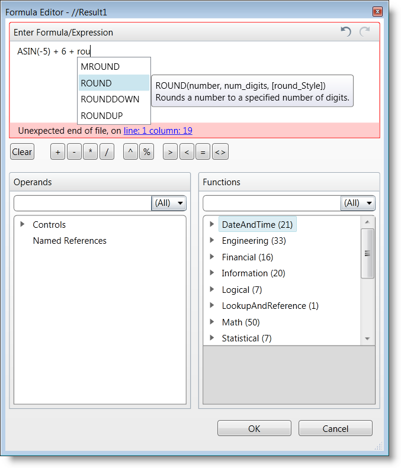

////

|metadata|
{
    "name": "xamformulaeditor-about",
    "controlName": ["xamFormulaEditor"],
    "tags": ["Calculations","Editing","Getting Started","Validation"],
    "guid": "6562ddd7-9dfd-40b4-af98-d01b7cc7f7a0",  
    "buildFlags": [],
    "createdOn": "2016-05-25T18:21:55.0781513Z"
}
|metadata|
////

= About xamFormulaEditor

== Purpose

This topic introduces you to the xamFormulaEditor™ control.

== In this topic

This document contains the following sections:

* Introduction
* Main Features

** xamFormulaEditor
** FormulaEditorDialog

* Related Topics

== Required background

You need to first read the following topics:

* link:xamcalculationmanager-getting-started-with-xamcalculationmanager.html[Getting Started with xamCalculationManager]
* link:xamcalculationmanager-using-xamcalculationmanager.html[Using xamCalculationManager]

== Introduction

The xamFormulaEditor control provides users with a full-fledged formula editing experience. It is related to and built upon the xamCalcualtionManager, which manages sources and targets of formulas as well as various pre-defined and custom functions. A formula is a complex expression using the sources, functions and/or build-in operators. A source serves as a variable in a formula expression. Sources and targets for formulas can be any public property of any object for item calculations. The results of calculations are applied to targets.

The xamFormulaEditor control has two main interfaces for editing formulas – the xamFormulaEditor and the FormulaEditorDialog. The following examples demonstrate how to use the control through both the xamFormulaEditor and the FormulaEditorDialog.

== Main Features

== Features overview

The table below briefly explains the main features of the xamFormulaEditor.

[options="header", cols="a,a"]
|====
|Feature|Description

|xamFormulaEditor
|A standalone editor where users can define formulas and assign them to a predefined target.

|FormulaEditorDialog
|A dialog window containing text area for editing a formula, buttons for inserting the most commonly used operators and lists of sources and functions.

|====

== About the xamFormulaEditor

The xamFormulaEditor is an editor control that assists users in entering and editing formulas for a pre-defined target. The target of the xamFormulaEditor can be another control in the same page (e.g. a TextBox, TextBlock, ComboBox etc.) that is registered in a xamCalculationManager.  pick:[wpf="The xamFormulaEditor can also be used to edit the formula for a field in a xamDataGrid control."]

The xamFormulaEditor contains two main parts. The first is the formula editing area where users enter the formula expression and the second is the dialog button that, when clicked displays the FormulaEditorDialog. As the user types in the xamFormulaEditor, it displays auto-completion suggestions and contextual help about functions and operands. Furthermore if there is an error in the formula expression, the editor is highlighted in red and hovering over the error indicator displays a tooltip with the error description.

image::images/xamFormulaEditor_About_1.png[]

== Related Topics

* link:xamformulaeditor-using.html[Using xamFormulaEditor and FormulaEditorDialog with xamCalculationManager]
* link:xamformulaeditor-contextualhelp.html[Contextual Help]

== About the FormulaEditorDialog

The FormulaEditorDialog is the second main interface of the xamFormulaEditor. When a user clicks the button in the xamFormulaEditor a FormulaEditorDialog containing the xamFormulaEditor’s formula is displayed. The FormulaEditorDialog can also be used as a standalone control.

The dialog has a main text editing area where a formula can be edited by the user. There are also buttons available to insert the most commonly used operators and two lists – one containing the available operands and one containing functions. The functions list is made up of pre-defined functions as well as custom functions you can register using the xamCaluculationManager control’s link:{ApiPlatform}calculations.xamcalculationmanager.v{ProductVersion}~infragistics.calculations.xamcalculationmanager~registeruserdefinedfunction.html[RegisterUserDefinedFunction method].

While the list can grow quite long, users can search the list by typing into the search text boxes. When users type in the text editing area, contextual help and auto-completion suggestions are displayed in the xamFormulaEditor control. In case of a syntax error, the editing area is highlighted in red and an error is displayed under the text box. Error messages contain the exact error and its place in the formula.

If the FormulaEditorDialog was called from the xamFormulaEditor control after pressing the OK button, the Formula is updated in the xamFormulaEditor, the Target’s value is recalculated and the FormulaEditorDialog is dismissed.

== Related Topics

Following are some other topics you may find useful.

* link:xamformulaeditor-using.html[Using xamFormulaEditor and FormulaEditorDialog with xamCalculationManager]
* link:xamformulaeditor-contextualhelp.html[Contextual Help]
* link:xamcalculationmanager-getting-started-with-xamcalculationmanager.html[Getting Started with xamCalculationManager]
* link:xamcalculationmanager-using-xamcalculationmanager.html[Using xamCalculationManager]