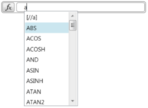

////

|metadata|
{
    "name": "xamformulaeditor-contextualhelp",
    "controlName": ["xamFormulaEditor"],
    "tags": ["Calculations","Editing","Getting Started","Validation"],
    "guid": "3de68bca-115c-49d3-9e08-05173d57c6f3",  
    "buildFlags": [],
    "createdOn": "2016-05-25T18:21:55.0831145Z"
}
|metadata|
////

= Contextual Help

== Purpose

This topic introduces you to the contextual help and autocomplete features of the xamFormulaEditor control.

== Required background

You need to first read the following topic:

* link:xamformulaeditor-about.html[About xamFormulaEditor]

== Contextual help types

The content below briefly explains the types of contextual help that the xamFormulaEditor and FormulaEditorDialog display when users enter and edit formulas using the controls.

=== Mouseover help

The mouseover help displays the signature and description of a function when the user moves the mouse over a function’s name and leaves it there for a short delay. If the mouseover help is showing and the user moves the mouse off of the function name, the mouseover help close. 

If a function has one or more arguments, the mouseover help displays the number of arguments defined while hovering over the function name. The same is true for optional arguments;only the provided arguments are displayed in the function signature. 

 

=== Function Signature Help

The function signature help is displayed while the user is typing in a function and they type an open parenthesis '(' or an argument separator ','. The function signature help displays the signature of the function with the current argument highlighted, the description of the function, and a description of the current argument. 

=== Autocomplete List Help

[options="header", cols="a,a"]
|====
|When this Action Occurs|The result is...

|User starts typing a function or operand name 

|All possible functions appear as a list under the function editor box 

Navigation of the list is available via the scrollbar, mouse or arrow keys 

List contents are filtered as more characters are entered in the editor box 

Matches in the list are found based off the exact text entered in the box 

If no items match, then the most recently matched item (or first item in the list if there are no previous matches) is selected 

|User double-clicks on an item in the list 

|Function name is autocompleted 

|User hits Enter or Tab 

|Currently selected autocomplete item is committed 

|User types a character that cannot appear in a function or operand name e.g. ‘(‘ 

|Currently selected autocomplete item is committed 

The typed text is sent to the editor 

|User hits Ctrl+Space in an area where a function or reference name can be typed 

|Autocomplete list is displayed 

|User hits the Escape key 

User clicks anywhere on screen outside of the list 

Use the left or right arrow keys to leave the function or reference name with the text cursor 

|The list is closed and the text is left the way it is 

|==== 

=== Autocomplete Item help

The autocomplete item help is displayed only while the autocomplete list is open. If an item remains selected for a short delay, if available, an item description appears. If the item stays selected for longer than 10 seconds, the autocomplete item help will close. 

.Note:
[NOTE]
====
If you don’t want contextual help to display in the xamFormulaEditor and the FormulaEditorDialog controls, you can disable it by setting the link:{ApiPlatform}controls.interactions.xamformulaeditor{ApiVersion}~infragistics.controls.interactions.formulaeditorbase~showcontextualhelp.html[ShowContextualHelp] property to False.
====

== Related Topics

Following are some other topics you may find useful.

* link:xamformulaeditor-about.html[About xamFormulaEditor]
* link:xamformulaeditor-using.html[Using xamFormulaEditor and FormulaEditorDialog with xamCalculationManager]