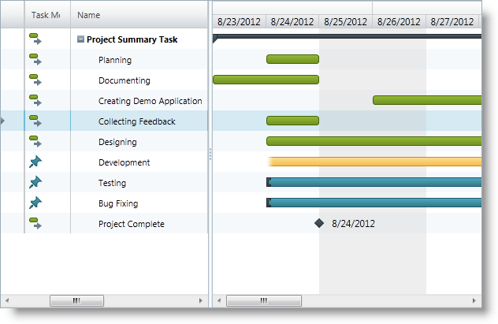

////
|metadata|
{
    "name": "xamgantt-adding-xamgantt-to-a-page",
    "controlName": ["xamGantt"],
    "tags": [],
    "guid": "0b1c1105-87ea-4ff4-be66-c1977f19898d","buildFlags": [],
    "createdOn": "2016-05-25T18:21:55.2331598Z"
}
|metadata|
////

= Adding xamGantt to a Page

== Topic Overview

=== Purpose

This topic describes how to add the  _xamGantt_™ control to a page.

=== In this topic

This topic contains the following sections:

* <<_Ref333582293, Adding  _xamGantt_   to a Page >>

** <<_Ref333582311,Introduction>>
** <<Preview,Preview>>
** <<Prerequisites,Prerequisites>>
** <<Overview,Overview>>
** <<_Ref333582325,Steps>>

* link:xamgantt-adding-xamgantt-to-a-page.html#viewModel[*Code Example: ProjectViewModel class* ]
* <<_Ref334688042, Related Content >>

** <<_Ref333582329,Topics>>

[[_Ref333582293]]
== Adding  _xamGantt_   to a Page

[[_Ref333582311]]

=== Introduction

The procedure explains how you can add the  _xamGantt_   control to a page and which required references you should include in your project.

=== Preview

The following screenshot previews the result.

=== Prerequisites

To complete the procedure, you need the following:

* A project with the following required references:

** {ApiPlatform}Controls.Editors.XamCalendar.dll
** {ApiPlatform}Controls.Grids.XamGrid.dll
** {ApiPlatform}Controls.Menus.XamMenu.dll
** {ApiPlatform}Controls.Schedules.dll
** {ApiPlatform}Controls.Schedules.XamGantt.dll
** {ApiPlatform}.DataManager.dll
** {ApiPlatform}dll

* A project with the link:xamgantt-projectdatahelper.html[ProjectDataHelper] class containing sample project data.

=== Overview

Following is a conceptual overview of the process:

[start=1]
. <<step1, Add the required namespaces >>
[start=2]
. <<step2, Create a ViewModel class >>
[start=3]
. <<step3, Add  _xamGantt_   control to the page >>

[[_Ref333582325]]

=== Steps

The following steps demonstrate how to add  _xamGantt_   control to a page and bind it to sample project data.

[[step1]]
[start=1]
. Add the required namespaces
+
Add the following namespaces:
+
*In XAML:*
+
[source,xaml]
----
xmlns:ig="http://schemas.infragistics.com/xaml"
xmlns:local="clr-namespace:[Your ViewModel Namespace]"
----

[[step2]]
[start=2]
. Create a ViewModel class
+
Create a ViewModel class that exposes a public property Project of type link:{ApiPlatform}controls.schedules.xamgantt.v{ProductVersion}~infragistics.controls.schedules.project_members.html[Project]. This class inherits ObservableModel class that implements the INotifyPropertyChanged interface. The project sample data is loaded in the class constructor.
+
See the link:xamgantt-adding-xamgantt-to-a-page.html#viewModel[Code Example: ProjectViewModel class] for more details.

[[step3]]
[start=3]
. Add xamGantt control to the page
+
Add the  _xamGantt_   control in the page Grid container and bind it to the project data provided by the ProjectViewModel:
+
*In XAML:*
+
[source,xaml]
----
<Grid>
  <Grid.Resources>
  <!--Create a static Grid resource of type ProjectViewModel-->
    <local:ProjectViewModel x:Key="viewmodel" />
  </Grid.Resources>
  <Grid.DataContext>
  <!--Bind the Grid DataContext 
      to the created data resource -->
    <Binding Source="{StaticResource viewmodel}" />
  </Grid.DataContext>
  <!— Add a xamGantt and bind it to the data -->
    <ig:XamGantt x:Name="gantt" 
                 Project="{Binding Project}"/>
</Grid>
----

[[_Ref333582298]]
[[viewModel]]
== Code Example: ProjectViewModel class

=== Description

The ProjectViewModel class exposes a public property Project of type `Project`. This property is initialized and populated with sample project data in the constructor of the ViewModel class.

=== Code

*In C#:*

[source,csharp]
----
using System;
using System.ComponentModel;
using Infragistics.Controls.Schedules;
public class ProjectViewModel : ObservableModel
{
    public ProjectViewModel()
    {
        this._project = ProjectDataHelper.GenerateProjectData();
    }
    private Project _project;
    public Project Project
    {
        get
        {
            return this._project;
        }
        set
        {
            if (this._project != value)
            {
                this._project = value;
                this.NotifyPropertyChanged("Project");
            }
        }
    }
}
public class ObservableModel : INotifyPropertyChanged
{
    public event PropertyChangedEventHandler PropertyChanged;
    protected void NotifyPropertyChanged(String info)
    {
        if (PropertyChanged != null)
        {
            PropertyChanged(this, new PropertyChangedEventArgs(info));
        }
    }
}
----

*In Visual Basic:*

[source,vb]
----
Imports System.ComponentModel
Imports Infragistics.Controls.Schedules
Public Class ProjectViewModel
    Inherits ObservableModel
    Public Sub New()
        Me._project = ProjectDataHelper.GenerateProjectData()
    End Sub
    Private _project As Project
    Public Property Project() As Project
        Get
            Return Me._project
        End Get
        Set(value As Project)
            Me._project = value
            Me.NotifyPropertyChanged("Project")
        End Set
    End Property
End Class
Public Class ObservableModel
    Implements INotifyPropertyChanged
    Public Event PropertyChanged(ByVal sender As Object, ByVal e As PropertyChangedEventArgs) Implements INotifyPropertyChanged.PropertyChanged
    Protected Overridable Sub NotifyPropertyChanged(ByVal propertyName As String)
        RaiseEvent PropertyChanged(Me, New PropertyChangedEventArgs(propertyName))
    End Sub
End Class
----

[[_Ref334688042]]
== Related Content

[[_Ref333582329]]

=== Topics

The following topics provide additional information related to this topic.

[options="header", cols="a,a"]
|====
|Topic|Purpose

| link:xamgantt-xamgantt-overview.html[xamGantt Overview]
|This topic describes basic conceptual information about _xamGantt_, project, tasks and other _xamGantt_ elements.

| link:xamgantt-xamgantt-in-detail.html[xamGantt in Detail]
|This group of topics describes the _xamGantt_ control in details.

| link:xamgantt-xamgantt-data-binding.html[xamGantt Data Binding]
|The topics in this group explain data binding using the _xamGantt_ control.

| link:xamgantt-configuring-xamgantt.html[Configuring xamGantt]
|The topics in this group explain the main configurable aspects of the _xamGantt_ control.

|====