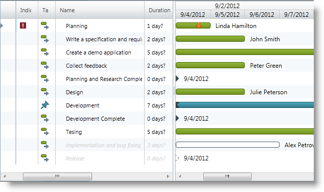

////
|metadata|
{
    "name": "xamgantt-binding-arbitrary-tasks-collection-listbackedproject",
    "controlName": ["xamGantt"],
    "tags": ["Data Binding","How Do I"],
    "guid": "bc7de55a-2030-4029-9280-b408a622413f",
    "buildFlags": [],
    "createdOn": "2016-05-25T18:21:55.2281617Z"
}
|metadata|
////

= Binding to Arbitrary Tasks Collection Using ListBackedProject

== Topic Overview

=== Purpose

This topic describes how the  _xamGantt™_   control is bound to an arbitrary tasks collection via ListBackedProject.

=== In this topic

This topic contains the following sections:

* <<start, Binding to Arbitrary Tasks Collection Using ListBackedProject >>

** <<intro,Introduction>>
** <<Preview,Preview>>
** <<Prerequisites,Prerequisites>>
** <<overview,Overview>>
** <<steps,Steps>>

* <<CodeExamples,Code Examples>>
* <<ObservableModel,Code Example: Observable Model>>
* <<CustomTaskModel,Code Example: Custom Task Model>>
* <<ViewModel,Code Example: ViewModel class>>
* <<bindingCode,Code Example: Binding xamGantt to Custom Tasks Data in XAML via ListBackedProject>>
* <<related, Related Content >>

** <<_Ref334042155,Topics>>
** <<_Ref334042160,Samples>>

[[start]]
== Binding to Arbitrary Tasks Collection Using ListBackedProject

[[intro]]

=== Introduction

The  _xamGantt_   control can be bound to a collection of custom tasks. In this case, create an instance of link:{ApiPlatform}controls.schedules.xamgantt{ApiVersion}~infragistics.controls.schedules.listbackedproject_members.html[ListBackedProject] and set it to the  _xamGantt_   link:{ApiPlatform}controls.schedules.xamgantt{ApiVersion}~infragistics.controls.schedules.projectcontrolbase~project.html[Project] property.

Provide a flat collection of custom tasks to the ListBackedProject, via its link:{ApiPlatform}controls.schedules.xamgantt{ApiVersion}~infragistics.controls.schedules.listbackedproject~taskitemssource.html[TaskItemsSource] property and use the link:{ApiPlatform}controls.schedules.xamgantt{ApiVersion}~infragistics.controls.schedules.listbackedproject~taskpropertymappings.html[TaskPropertyMappings] collection to define mappings between the custom task properties and the corresponding link:{ApiPlatform}controls.schedules.xamgantt{ApiVersion}~infragistics.controls.schedules.projecttask_members.html[ProjectTask] properties.

The following procedure illustrates populating a custom tasks collection from an XML file. This also results in the creation of a custom task Model and a ViewModel class that handles XML file operations.

===  Preview

The following screenshot previews the result.

===  Prerequisites

To complete the procedure, you need the following:

* A project with the following required references:
** {ApiPlatform}Controls.Editors.XamCalendar{ApiVersion}.dll
** {ApiPlatform}Controls.Grids.XamGrid{ApiVersion}.dll

ifdef::sl[]
** {ApiPlatform}Controls.Interactions.XamDialogWindow{ApiVersion}.dll

endif::sl[]

** {ApiPlatform}Controls.Menus.XamMenu{ApiVersion}.dll
** {ApiPlatform}Controls.Schedules{ApiVersion}.dll
** {ApiPlatform}Controls.Schedules.XamGantt{ApiVersion}.dll

ifdef::wpf[]
** InfragisticsWPF.DataManager.dll

endif::wpf[]

** {ApiPlatform}{ApiVersion}dll
** link:{ApiPlatform}controls.schedules.xamgantt{ApiVersion}~infragistics.controls.schedules.listbackedproject_members.html[ListBackedProject]

* A project with the link:xelementextension.html[XElementExtension] class containing extension methods for working with xml data
* A sample xml data source - link:xamgantt-taskdata-xml.html[TaskData.xml]

[[overview]]

=== Overview

Following is a conceptual overview of the process:

[start=1]
. <<step1,Create a custom task Model class>>
[start=2]
. <<step2,Create a ViewModel class>>
[start=3]
. <<step3,Add the required namespaces in the XAML page>>
[start=4]
. <<step4,Add a Grid in the page and bind its DataContext to the created ViewModel>>
[start=5]
. <<step5,Create a ListBackedProject and bind it to data>>
[start=6]
. <<step6,Create project task property to custom task property mappings>>
[start=7]
. <<step7,Set the xamGantt Project property to the created ListBackedProject>>

[[steps]]

=== Steps

The following steps demonstrate how to bind a  _xamGantt_   control to a collection of custom tasks.

. Create a custom task Model class
+
Create a custom task model that represents your data and implements the INotifyPropertyChanged interface.
+
See the <<_Ref334542792,>><<CustomTaskModel,Code Example: Custom Task Model>> for more details.

. Create a ViewModel class
+
Create a ViewModel class that handles the xml data loading and has a public member Tasks of type ObservableCollection of TaskModel that stores the custom task’s data.
+
See the <<_Ref334543560,>><<ViewModel,Code Example: ViewModel class>> for more details.

. Add the required namespaces in the XAML page
+
Add the following namespaces at the beginning of the XAML page:
+
*In XAML:*
+
[source,xaml]
----
xmlns:ig="http://schemas.infragistics.com/xaml"
xmlns:viewmodel="clr-namespace:<Your ViewModel Namespace>"
----

. Add a Grid in the page and bind its DataContext to the created ViewModel
+
Add a Grid container in the page and bind the Grid `DataContext` property to the custom tasks view model class `ListBackedProjectViewModel`.
+
*In XAML:*
+
[source,xaml]
----
<Grid x:Name="LayoutRoot">
  <Grid.Resources>
    <viewmodel:ListBackedProjectViewModel x:Key="viewmodel"/>
  </Grid.Resources>
  <Grid.DataContext>
    <Binding Source="{StaticResource viewmodel}" />
  </Grid.DataContext>
…
</Grid>
----

. Create a ListBackedProject and bind it to data
+
The link:{ApiPlatform}controls.schedules.xamgantt{ApiVersion}~infragistics.controls.schedules.listbackedproject_members.html[ListBackedProject] is a derived link:{ApiPlatform}controls.schedules.xamgantt{ApiVersion}~infragistics.controls.schedules.project_members.html[Project] class that enables populating the tasks, based upon a provided flat collection of task information.
+
The `ListBackedProject` is bound to the created custom tasks data stored in the Tasks public member via its link:{ApiPlatform}controls.schedules.xamgantt{ApiVersion}~infragistics.controls.schedules.listbackedproject~taskitemssource.html[TaskItemsSource] property.
+
*In XAML:*
+
[source,xaml]
----
<ig:ListBackedProject x:Name="dataProvider" 
                      TaskItemsSource="{Binding Tasks}">
<!-- Add ProjectTask Property Mappings Here -->
</ig:ListBackedProject>
----

. Create project task property to custom task property mappings
+
Create a mappings collection using link:{ApiPlatform}controls.schedules.xamgantt{ApiVersion}~infragistics.controls.schedules.listbackedproject~taskpropertymappings.html[TaskPropertyMappings].
+
In every link:{ApiPlatform}controls.schedules.xamgantt{ApiVersion}~infragistics.controls.schedules.projecttaskpropertymapping_members.html[ProjectTaskPropertyMapping], the link:{ApiPlatform}controls.schedules.xamgantt{ApiVersion}~infragistics.controls.schedules.projecttaskpropertymapping~taskproperty.html[TaskProperty] specifies a link:{ApiPlatform}controls.schedules.xamgantt{ApiVersion}~infragistics.controls.schedules.projecttask_members.html[ProjectTask] property and the link:{ApiPlatform}controls.schedules.xamgantt{ApiVersion}~infragistics.controls.schedules.projecttaskpropertymapping~dataobjectproperty.html[DataObjectProperty] specifies the corresponding custom task property.
+
For example, mapping the link:{ApiPlatform}controls.schedules.xamgantt{ApiVersion}~infragistics.controls.schedules.projecttask_members.html[ProjectTask] DataItemId property to the TaskID property defined in the custom TaskModel class.
+
*In XAML:*
+
[source,xaml]
----
<ig:ListBackedProject.TaskPropertyMappings>               
  <ig:ProjectTaskPropertyMappingCollection 
      UseDefaultMappings="True">
  <!--Start Mandatory Project Task Property Mappings-->
  <ig:ProjectTaskPropertyMapping 
      TaskProperty="DataItemId" 
      DataObjectProperty="TaskID" />
  <ig:ProjectTaskPropertyMapping 
      TaskProperty="Tasks" 
      DataObjectProperty="Tasks" />
  <ig:ProjectTaskPropertyMapping 
      TaskProperty="ConstraintType" 
      DataObjectProperty="ConstraintType" />
  <ig:ProjectTaskPropertyMapping 
      TaskProperty="ConstraintDate" 
      DataObjectProperty="ConstraintDate" />
  <ig:ProjectTaskPropertyMapping 
      TaskProperty="DurationFormat" 
      DataObjectProperty="DurationFormat" />
  <!--End Mandatory Project Task Property Mappings-->
  <!--Add the other Project Task Property Mappings-->
  </ig:ProjectTaskPropertyMappingCollection>
</ig:ListBackedProject.TaskPropertyMappings>
----
+
See the <<_Ref334546439,>><<bindingCode,Code Example: Binding xamGantt to Custom Tasks Data in XAML via ListBackedProject>> for the full mappings list.
+
.Note
[NOTE]
====
The following mappings are mandatory:

* DataItemId – to uniquely identify the task
* Tasks – to store the child tasks of a task
* ConstraintType/ConstraintDate
* DurationFormat – to specify the units for the duration and to track whether the duration is an elapsed duration.
====
+
.Note
[NOTE]
====
The following mappings are mandatory if you want to support task progress:

* ActualStart and PercentComplete
* or ActualStart and ActualDuration
====
+
.Note
[NOTE]
====
The following mappings are mandatory if you want to support manual tasks:

* IsManual
* Start
* Duration
* Finish

====
+
.Note
[NOTE]
====
The following mappings are mandatory if you want to create links between tasks:

* Predecessors

====
+
.Note
[NOTE]
====
The following mappings are mandatory if you want to assign resources:

* Resources

====

. Set the xamGantt Project property to the created ListBackedProject
+
Set the  _xamGantt_   `Project` property to the existing ListBackedProject:
+
*In XAML:*
+
[source,xaml]
----
<ig:XamGantt x:Name="gantt" 
    Project="{Binding ElementName=dataProvider}" />
----

[[CodeExamples]]
== Code Examples

=== Code examples summary

The following table lists the code examples included in this topic.

[options="header", cols="a,a"]
|====
|Example|Description

|<<ObservableModel,Code Example: Observable Model>>
|The code example demonstrates a class that implements the INotifyPropertyChanged interface. Both the TaskModel and ListBackedProjectViewModel classes use this class to notify of properties changes.

|<<_Ref334542792,>><<CustomTaskModel,Code Example: Custom Task Model>>
|The code example demonstrates a custom task Model and inherits the ObservableModel class.

|<<ViewModel,Code Example: ViewModel class>>
|The code example demonstrates a ViewModel class that handles the xml data loading and inherits the `ObservableModel` class.

|<<binding,>><<bindingCode,Code Example: Binding xamGantt to Custom Tasks Data in XAML via ListBackedProject>>
|The code example demonstrates creating of a ListBackedProject, adding and binding a _xamGantt_ control to data.

|====

[[ObservableModel]]
== Code Example: Observable Model

=== Description

This code example demonstrates a class that implements the INotifyPropertyChanged interface. Both the TaskModel and ListBackedProjectViewModel classes use this to notify the clients of properties changes.

[[_Ref334542792]]

=== Code

*In C#:*

[source,csharp]
----
public class ObservableModel : INotifyPropertyChanged
{
    public event PropertyChangedEventHandler PropertyChanged;
    protected void NotifyPropertyChanged(String info)
    {
        if (PropertyChanged != null)
        {
            PropertyChanged(this, new PropertyChangedEventArgs(info));
        }
    }
}
----

*In Visual Basic:*

[source,vb]
----
Public Class ObservableModel
    Implements INotifyPropertyChanged
    Public Event PropertyChanged(ByVal sender As Object, ByVal e As PropertyChangedEventArgs) Implements INotifyPropertyChanged.PropertyChanged
    Protected Overridable Sub NotifyPropertyChanged(ByVal propertyName As String)
        RaiseEvent PropertyChanged(Me, New PropertyChangedEventArgs(propertyName))
    End Sub
End Class
----

[[CustomTaskModel]]

== Code Example: Custom Task Model

=== Description

The code example demonstrates a custom task Model that inherits the ObservableModel class.

[[_Ref334543560]]

=== Code

*In C#:*

[source,csharp]
----
using Infragistics.Controls.Schedules;
public class TaskModel : ObservableModel
{
    private string _taskId;
    public string TaskID
    {
        get
        {
            return _taskId;
        }
        set
        {
            if (_taskId != value)
            {
                _taskId = value;
                this.NotifyPropertyChanged("TaskID");
            }
        }
    }
    private string _tasks;
    public string Tasks
    {
        get
        {
            return _tasks;
        }
        set
        {
            if (_tasks != value)
            {
                _tasks = value;
                this.NotifyPropertyChanged("Tasks");
            }
        }
    }
    private string _name;
    public string Name
    {
        get
        {
            return _name;
        }
        set
        {
            if (_name != value)
            {
                _name = value;
                this.NotifyPropertyChanged("Name");
            }
        }
    }
    private ProjectTaskConstraintType _constraintType;
    public ProjectTaskConstraintType ConstraintType
    {
        get
        {
            return _constraintType;
        }
        set
        {
            if (_constraintType != value)
            {
                _constraintType = value;
                this.NotifyPropertyChanged("ConstraintType");
            }
        }
    }
    private DateTime? _constraintDate;
    public DateTime? ConstraintDate
    {
        get
        {
            return _constraintDate;
        }
        set
        {
            if (_constraintDate != value)
            {
                _constraintDate = value;
                this.NotifyPropertyChanged("ConstraintDate");
            }
        }
    }
    private ProjectDurationFormat _durationFormat;
    public ProjectDurationFormat DurationFormat
    {
        get
        {
            return _durationFormat;
        }
        set
        {
            if (_durationFormat != value)
            {
                _durationFormat = value;
                this.NotifyPropertyChanged("DurationFormat");
            }
        }
    }
    private TimeSpan _durationInHours;
    public TimeSpan DurationInHours
    {
        get
        {
            return _durationInHours;
        }
        set
        {
            if (_durationInHours != value)
            {
                _durationInHours = value;
                this.NotifyPropertyChanged("DurationInHours");
            }
        }
    }
    private DateTime _start;
    public DateTime Start
    {
        get
        {
            return _start;
        }
        set
        {
            if (_start != value)
            {
                _start = value;
                this.NotifyPropertyChanged("Start");
            }
        }
    }
    private bool _isMilestone = false;
    public bool IsMilestone
    {
        get
        {
            return _isMilestone;
        }
        set
        {
            if (_isMilestone != value)
            {
                _isMilestone = value;
                this.NotifyPropertyChanged("IsMilestone");
            }
        }
    }
    private bool _isInProgress = true;
    public bool IsInProgress
    {
        get
        {
            return _isInProgress;
        }
        set
        {
            if (_isInProgress != value)
            {
                _isInProgress = value;
                this.NotifyPropertyChanged("IsInProgress");
            }
        }
    }
    private DateTime? _deadlineDate;
    public DateTime? DeadlineDate
    {
        get
        {
            return _deadlineDate;
        }
        set
        {
            if (_deadlineDate != value)
            {
                _deadlineDate = value;
                this.NotifyPropertyChanged("DeadlineDate");
            }
        }
    }
    private bool _isUndetermined = false;
    public bool IsUndetermined
    {
        get
        {
            return _isUndetermined;
        }
        set
        {
            if (_isUndetermined != value)
            {
                _isUndetermined = value;
                this.NotifyPropertyChanged("IsUndetermined");
            }
        }
    }
    private string _resourceName;
    public string ResourceName
    {
        get
        {
            return _resourceName;
        }
        set
        {
            if (_resourceName != value)
            {
                _resourceName = value;
                this.NotifyPropertyChanged("ResourceName");
            }
        }
    }
}
----

*In Visual Basic:*

[source,vb]
----
Imports Infragistics.Controls.Schedules
Public Class TaskModel
    Inherits ObservableModel
    Private _taskId As String
    Public Property TaskID() As String
        Get
            Return _taskId
        End Get
        Set(value As String)
            If _taskId <> value Then
                _taskId = value
                Me.NotifyPropertyChanged("TaskID")
            End If
        End Set
    End Property
    Private _tasks As String
    Public Property Tasks() As String
        Get
            Return _tasks
        End Get
        Set(value As String)
            If _tasks <> value Then
                _tasks = value
                Me.NotifyPropertyChanged("Tasks")
            End If
        End Set
    End Property
    Private _name As String
    Public Property Name() As String
        Get
            Return _name
        End Get
        Set(value As String)
            If _name <> value Then
                _name = value
                Me.NotifyPropertyChanged("Name")
            End If
        End Set
    End Property
    Private _constraintType As ProjectTaskConstraintType
    Public Property ConstraintType() As ProjectTaskConstraintType
        Get
            Return _constraintType
        End Get
        Set(value As ProjectTaskConstraintType)
            If _constraintType <> value Then
                _constraintType = value
                Me.NotifyPropertyChanged("ConstraintType")
            End If
        End Set
    End Property
    Private _constraintDate As System.Nullable(Of DateTime)
    Public Property ConstraintDate() As System.Nullable(Of DateTime)
        Get
            Return _constraintDate
        End Get
        Set(value As System.Nullable(Of DateTime))
            If _constraintDate <> value Then
                _constraintDate = value
                Me.NotifyPropertyChanged("ConstraintDate")
            End If
        End Set
    End Property
    Private _durationFormat As ProjectDurationFormat
    Public Property DurationFormat() As ProjectDurationFormat
        Get
            Return _durationFormat
        End Get
        Set(value As ProjectDurationFormat)
            If _durationFormat <> value Then
                _durationFormat = value
                Me.NotifyPropertyChanged("DurationFormat")
            End If
        End Set
    End Property
    Private _durationInHours As TimeSpan
    Public Property DurationInHours() As TimeSpan
        Get
            Return _durationInHours
        End Get
        Set(value As TimeSpan)
            If _durationInHours <> value Then
                _durationInHours = value
                Me.NotifyPropertyChanged("DurationInHours")
            End If
        End Set
    End Property
    Private _start As DateTime
    Public Property Start() As DateTime
        Get
            Return _start
        End Get
        Set(value As DateTime)
            If _start <> value Then
                _start = value
                Me.NotifyPropertyChanged("Start")
            End If
        End Set
    End Property
    Private _isMilestone As Boolean = False
    Public Property IsMilestone() As Boolean
        Get
            Return _isMilestone
        End Get
        Set(value As Boolean)
            If _isMilestone <> value Then
                _isMilestone = value
                Me.NotifyPropertyChanged("IsMilestone")
            End If
        End Set
    End Property
    Private _isInProgress As Boolean = True
    Public Property IsInProgress() As Boolean
        Get
            Return _isInProgress
        End Get
        Set(value As Boolean)
            If _isInProgress <> value Then
                _isInProgress = value
                Me.NotifyPropertyChanged("IsInProgress")
            End If
        End Set
    End Property
    Private _deadlineDate As System.Nullable(Of DateTime)
    Public Property DeadlineDate() As System.Nullable(Of DateTime)
        Get
            Return _deadlineDate
        End Get
        Set(value As System.Nullable(Of DateTime))
            If _deadlineDate <> value Then
                _deadlineDate = value
                Me.NotifyPropertyChanged("DeadlineDate")
            End If
        End Set
    End Property
    Private _isUndetermined As Boolean = False
    Public Property IsUndetermined() As Boolean
        Get
            Return _isUndetermined
        End Get
        Set(value As Boolean)
            If _isUndetermined <> value Then
                _isUndetermined = value
                Me.NotifyPropertyChanged("IsUndetermined")
            End If
        End Set
    End Property
    Private _resourceName As String
    Public Property ResourceName() As String
        Get
            Return _resourceName
        End Get
        Set(value As String)
            If _resourceName <> value Then
                _resourceName = value
                Me.NotifyPropertyChanged("ResourceName")
            End If
        End Set
    End Property
End Class
----

[[ViewModel]]

== Code Example: ViewModel class

=== Description

The code example demonstrates a ViewModel class that handles xml data loading and inherits the ObservableModel class.

A public property Tasks of type ObservableCollection of TaskModel objects is created and populated with data from XML file. The code uses extension methods implemented in the link:xelementextension.html[XElementExtension] class.

[[_Ref334546439]]

=== Code

*In C#:*

[source,csharp]
----
using Infragistics.Controls.Schedules;
public class ListBackedProjectViewModel : ObservableModel
{
    public ListBackedProjectViewModel()
    {
        this.DownloadDataSource();
    }
    private ObservableCollection<TaskModel> _tasks;
    public ObservableCollection<TaskModel> Tasks
    {
        get
        {
            return _tasks;
        }
        set
        {
            if (value != null)
            {
                _tasks = value;
            }
            NotifyPropertyChanged("Tasks");
        }
    }
    private void DownloadDataSource()
    {
        ObservableCollection<TaskModel> dataSource = new ObservableCollection<TaskModel>();
        XDocument xmlDoc = XDocument.Load("TaskData.xml");
        IEnumerable<XElement> elements = xmlDoc.Root.Elements();
        foreach (XElement el in elements)
        {
            TaskModel task = new TaskModel();
            task.TaskID = el.Element("TaskID").GetString();
            task.Name = el.Element("Name").GetString();
            task.IsInProgress = el.Element("IsInProgress").GetBool();
            task.Start = DateTime.Today.ToUniversalTime();
            task.IsMilestone = el.Element("IsMilestone").GetBool();
            task.DurationInHours = TimeSpan.FromHours(el.Element("DurationInHours").GetDouble());
            task.IsUndetermined = el.Element("IsUndetermined").GetBool();
            task.ResourceName = el.Element("ResourceName").GetString();
            task.DurationFormat = ProjectDurationFormat.Days;
            if (el.Element("DeadlineDateInHours").GetInt() != 0)
            {
                task.DeadlineDate = DateTime.Today.AddHours(el.Element("DeadlineDateInHours").GetInt()).ToUniversalTime();
            }
            dataSource.Add(task);
        }
        this._tasks = dataSource;
    }        
}
----

*In Visual Basic:*

[source,vb]
----
Imports Infragistics.Controls.Schedules
Public Class ListBackedProjectViewModel
    Inherits ObservableModel
    Public Sub New()
        Me.DownloadDataSource()
    End Sub
    Private _tasks As ObservableCollection(Of TaskModel)
    Public Property Tasks() As ObservableCollection(Of TaskModel)
        Get
            Return _tasks
        End Get
        Set(value As ObservableCollection(Of TaskModel))
            If value IsNot Nothing Then
                _tasks = value
            End If
            NotifyPropertyChanged("Tasks")
        End Set
    End Property
    Private Sub DownloadDataSource()
        Dim dataSource As New ObservableCollection(Of TaskModel)()
        Dim xmlDoc As XDocument = XDocument.Load("TaskData.xml")
        Dim elements As IEnumerable(Of XElement) = xmlDoc.Root.Elements()
        For Each el As XElement In elements
            Dim task As New TaskModel()
            task.TaskID = el.Element("TaskID").GetString()
            task.Name = el.Element("Name").GetString()
            task.IsInProgress = el.Element("IsInProgress").GetBool()
            task.Start = DateTime.Today.ToUniversalTime()
            task.IsMilestone = el.Element("IsMilestone").GetBool()
            task.DurationInHours = TimeSpan.FromHours(el.Element("DurationInHours").GetDouble())
            task.IsUndetermined = el.Element("IsUndetermined").GetBool()
            task.ResourceName = el.Element("ResourceName").GetString()
            task.DurationFormat = ProjectDurationFormat.Days
            If el.Element("DeadlineDateInHours").GetInt() <> 0 Then
                task.DeadlineDate = DateTime.Today.AddHours(el.Element("DeadlineDateInHours").GetInt()).ToUniversalTime()
            End If
            dataSource.Add(task)
        Next
        Me._tasks = dataSource
    End Sub
End Class
----

[[bindingCode]]

== Code Example: Binding  _xamGantt_   to Custom Tasks Data in XAML via ListBackedProject

=== Description

The code example demonstrates creating a ListBackedProject, adding and binding a  _xamGantt_   control to data.

=== Code

*In XAML:*

[source,xaml]
----
Code
<Grid x:Name="LayoutRoot" Background="White">
  <Grid.Resources>
    <viewmodel:ListBackedProjectViewModel x:Key="viewmodel" />
  </Grid.Resources>
  <Grid.DataContext>
    <Binding Source="{StaticResource viewmodel}" />
  </Grid.DataContext>
  <ig:ListBackedProject x:Name="dataProvider" 
                        TaskItemsSource="{Binding Tasks}">
    <ig:ListBackedProject.TaskPropertyMappings>
      <!-- Add Project Task Property Mappings Here -->
      <ig:ProjectTaskPropertyMappingCollection UseDefaultMappings="True">
        <!-- Start Mandatory Project Task Property Mappings -->
        <ig:ProjectTaskPropertyMapping TaskProperty="DataItemId" 
                                       DataObjectProperty="TaskID" />
        <ig:ProjectTaskPropertyMapping TaskProperty="Tasks" 
                                       DataObjectProperty="Tasks" />
        <ig:ProjectTaskPropertyMapping TaskProperty="ConstraintType" 
                                       DataObjectProperty="ConstraintType" />
        <ig:ProjectTaskPropertyMapping TaskProperty="ConstraintDate" 
                                       DataObjectProperty="ConstraintDate" />
        <ig:ProjectTaskPropertyMapping TaskProperty="DurationFormat" 
                                       DataObjectProperty="DurationFormat" />
        <!-- End Mandatory Project Task Property Mappings -->
        <ig:ProjectTaskPropertyMapping TaskProperty="TaskName" 
                                       DataObjectProperty="Name" />
        <ig:ProjectTaskPropertyMapping TaskProperty="Start" 
                                       DataObjectProperty="Start" />
        <ig:ProjectTaskPropertyMapping TaskProperty="IsMilestone" 
                                       DataObjectProperty="IsMilestone" />
        <ig:ProjectTaskPropertyMapping TaskProperty="IsActive" 
                                       DataObjectProperty="IsInProgress" />
        <ig:ProjectTaskPropertyMapping TaskProperty="Duration" 
                                       DataObjectProperty="DurationInHours" />
        <ig:ProjectTaskPropertyMapping TaskProperty="Deadline" 
                                       DataObjectProperty="DeadlineDate" />
        <ig:ProjectTaskPropertyMapping TaskProperty="IsManual" 
                                       DataObjectProperty="IsUndetermined" />
        <ig:ProjectTaskPropertyMapping TaskProperty="Resources" 
                                       DataObjectProperty="ResourceName" />
      </ig:ProjectTaskPropertyMappingCollection>
    </ig:ListBackedProject.TaskPropertyMappings>
  </ig:ListBackedProject>
  <ig:XamGantt x:Name="gantt" 
               Project="{Binding ElementName=dataProvider}"/>
</Grid>
----

[[related]]
== Related Content

[[_Ref334042155]]

=== Topics

The following topics provide additional information related to this topic.

[options="header", cols="a,a"]
|====
|Topic|Purpose

| link:xamgantt-data-binding-overview.html[Data Binding Overview]
|This topic gives an overview of _xamGantt_ control data binding.

| link:xamgantt-binding-to-data-using-project.html[Binding to Data Using Project]
|This topic describes how the _xamGantt_ control is bound to data via Project property.

| link:xamgantt-loading-project-plan-from-ms-project-xml-file.html[Loading a Project Plan from a MS Project XML File]
|This topic describes how an already created project plan saved in a Microsoft Project™ 2010 XML file is loaded in the _xamGantt_ control.

|====

[[_Ref334042160]]

=== Samples

The following samples provide additional information related to this topic.

[options="header", cols="a,a"]
|====
|Sample|Purpose

| link:{SamplesURL}/gantt/binding-to-arbitrary-tasks-collection[Binding to Arbitrary Tasks Collection]
|This sample demonstrates how you can bind the _xamGantt_ control to arbitrary data collection using the ListBackedProject’s TaskItemsSource property.

|====