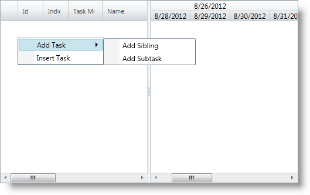

////
|metadata|
{
    "name": "xamgantt-binding-to-data-using-project",
    "controlName": ["xamGantt"],
    "tags": ["Data Binding","How Do I"],
    "guid": "94205b56-f277-4222-b11f-aa7acc6221cc",
    "buildFlags": [],
    "createdOn": "2016-05-25T18:21:55.2161599Z"
}
|metadata|
////

= Binding to Data Using Project

== Topic Overview

=== Purpose

This topic describes how the  _xamGantt™_   control is bound to data via link:{ApiPlatform}controls.schedules.xamgantt{ApiVersion}~infragistics.controls.schedules.projectcontrolbase~project.html[Project] property.

=== In this topic

This topic contains the following sections:

* <<_Ref333932699, Binding  _xamGantt_   to Data Using Project >>

** <<_Ref333932708,Introduction>>
** <<_Ref333934084,Preview>>
** <<Overview,Overview>>
** <<_Ref333932716,Steps>>

* <<_Ref333932730, Related Content >>

** <<_Ref333932734,Topics>>
** <<_Ref333932738,Samples>>

[[_Ref333932699]]
== Binding  _xamGantt_   to Data Using Project

[[_Ref333932708]]

=== Introduction

If you want to load a data from a Microsoft Project 2010 XML file or you want to create an empty project and fill the tasks later, you may use the link:{ApiPlatform}controls.schedules.xamgantt{ApiVersion}~infragistics.controls.schedules.xamgantt_members.html[XamGantt] link:{ApiPlatform}controls.schedules.xamgantt{ApiVersion}~infragistics.controls.schedules.projectcontrolbase~project.html[Project] property.

To do this, create a link:{ApiPlatform}controls.schedules.xamgantt{ApiVersion}~infragistics.controls.schedules.project_members.html[Project] instance first and then set the  _xamGantt_   `Project` property to this instance.

=== Prerequisites

To complete the procedure, you need the following:

* A project with the following required references:

** {ApiPlatform}Controls.Editors.XamCalendar.dll
** {ApiPlatform}Controls.Grids.XamGrid.dll
** InfragisticsSL.Controls.Interactions.XamDialogWindow.dll (Only required for Silverlight projects)
** {ApiPlatform}Controls.Menus.XamMenu.dll
** {ApiPlatform}Controls.Schedules.dll
** {ApiPlatform}Controls.Schedules.XamGantt.dll
** InfragisticsWPF.DataManager.dll (Only required for WPF projects)
** {ApiPlatform}dll

[[_Ref333934084]]

=== Preview

The following screenshot previews the result.

=== Overview

Following is a conceptual overview of the process:

[start=1]
. <<step1,Add required namespace(s) using/Imports in code-behind>>
[start=2]
. <<step2,Create an instance of the xamGantt>>
[start=3]
. <<step3,Create an instance of Project>>
[start=4]
. <<step4,Set the xamGantt Project property to the created Project instance>>
[start=5]
. <<step5,Add the xamGantt control to a Grid container in a page>>

[[_Ref333932716]]

=== Steps

The following steps demonstrate how to instantiate a Project and add it to the  _xamGantt_   Project property.

. Add required namespace(s) using/Imports in code-behind
+
Add the following using/Imports namespaces in the code-behind:
+
*In C#:*
+
[source,csharp]
----
using Infragistics.Controls.Schedules;
----
+
*In Visual Basic:*
+
[source,vb]
----
Imports Infragistics.Controls.Schedules
----

. Create an instance of the xamGantt
+
Create a  _xamGantt_   instance in the code-behind:
+
*In C#:*
+
[source,csharp]
----
XamGantt gantt = new XamGantt();
----
+
*In Visual Basic:*
+
[source,vb]
----
Dim gantt As New XamGantt()
----

. Create an instance of Project
+
Create a `Project` instance in the code-behind:
+
*In C#:*
+
[source,csharp]
----
Project project = new Project();
----
+
*In Visual Basic:*
+
[source,vb]
----
Dim project As New Project
----

. Set the xamGantt Project property to the created Project instance
+
Set the  _xamGantt_   `Project` property to the newly created `Project` instance in code-behind:
+
*In C#:*
+
[source,csharp]
----
gantt.Project = project;
----
+
*In Visual Basic:*
+
[source,vb]
----
gantt.Project = project
----

. Add the xamGantt control to a Grid container in a page
+
Add the  _xamGantt_   control as a child of a Grid container named LayoutRoot:
+
*In C#:*
+
[source,csharp]
----
this.LayoutRoot.Children.Add(gantt);
----
+
*In Visual Basic:*
+
[source,vb]
----
Me.LayoutRoot.Children.Add(gantt)
----

[[_Ref333932730]]
== Related Content

[[_Ref333932734]]
=== Topics

The following topics provide additional information related to this topic.

[options="header", cols="a,a"]
|====
|Topic|Purpose

| link:xamgantt-data-binding-overview.html[Data Binding Overview]
|This topic gives an overview of _xamGantt_ control data binding.

| link:xamgantt-binding-arbitrary-tasks-collection-listbackedproject.html[Binding to Arbitrary Task Collection Using ListBackedProject]
|This topic describes how the _xamGantt_ control is bound to an arbitrary tasks collection via ListBackedProject.

| link:xamgantt-loading-project-plan-from-ms-project-xml-file.html[Loading a Project Plan from a MS Project XML File]
|This topic describes how an already created project plan saved in a Microsoft Project™ 2010 XML file can be loaded in the _xamGantt_ control.

|====

[[_Ref333932738]]
=== Samples

The following samples provide additional information related to this topic.

[options="header", cols="a,a"]
|====
|Sample|Purpose

| pick:[sl=" link:{SamplesURL}/gantt/#/binding-using-xamgantt-project[Binding Using xamGantt Project]"] pick:[wpf=" link:{SamplesURL}/gantt/binding-using-xamgantt-project[Binding Using xamGantt Project]"] 
|This sample demonstrates how project data can be managed using the _xamGantt_ Project class. To bind the project data you have to set the _xamGantt_ Project property to a Project class instance.

|====