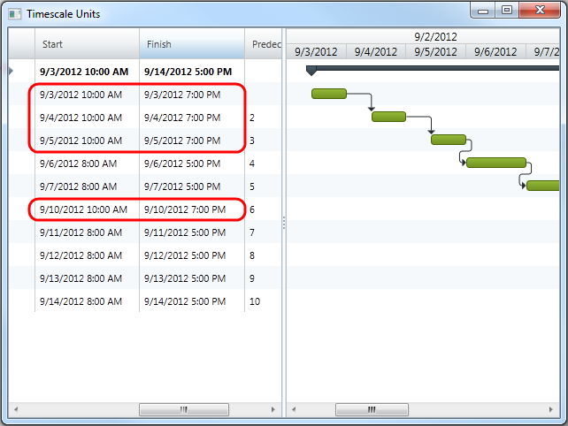

////

|metadata|
{
    "name": "xamgantt-code-example-changing-the-working-time",
    "controlName": ["xamGantt"],
    "tags": ["Data Presentation","Formatting","Grids","Patterns and Practices","Scheduling"],
    "guid": "b45870e3-51e0-45ac-8878-c13d16cd068e",  
    "buildFlags": [],
    "createdOn": "2016-05-25T18:21:55.4921747Z"
}
|metadata|
////

= Code Example Changing the Working Time (xamGantt)

== Topic Overview

=== Purpose

You can specify working times for each day of the week and specify whether day of the week is working or not.

=== Required background

The following topics are prerequisites to understanding this topic:

[options="header", cols="a,a"]
|====
|Topic|Purpose

| link:xamgantt-adding-xamgantt-to-a-page.html[Adding _xamGantt_ to a Page]
|This topic describes how you can add the xamGantt™ control to a page.

|====

=== In this topic

This topic contains the following sections:

* <<_Code_Example_Changing_the_working_time, Code Example: Changing the working time >>

** <<_Ref334464968,Description>>

** <<_Ref334102005,Prerequisites>>

** <<_Ref334102013,Preview>>

** <<_Ref334464995,Code>>

* <<_Related_Content, Related Content >>

** <<_Ref333763550,Topics>>

** <<_Ref333763850,Samples>>

[[_Code_Example_Changing_the_working_time]]
== Code Example: Changing the working time

[[_Ref334464968]]

=== Description

The code example below creates a link:{ApiPlatform}controls.schedules.xamgantt.v{ProductVersion}~infragistics.controls.schedules.projectcalendar_members.html[ProjectCalendar]. Then, it creates three instances of link:{ApiPlatform}controls.schedules.v{ProductVersion}~infragistics.controls.schedules.scheduledayofweek_members.html[ScheduleDayOfWeek] and array of TimeRanges, which is used to specify the working times. Then, it sets new link:{ApiPlatform}controls.schedules.v{ProductVersion}~infragistics.controls.schedules.daysettings_members.html[DaySettings] for Monday, Tuesday and Wednesday, specifying the new working time. Later, a link:{ApiPlatform}controls.schedules.xamgantt.v{ProductVersion}~infragistics.controls.schedules.projectcalendarworkweek_members.html[ProjectCalendarWorkWeek] is used in order to state Date range, on which those custom settings will be applied.

In code example is included collection of tasks in order to emphasis better the days with changed working time to those ones with the default working time.

[[_Ref334102005]]

=== Prerequisites

To complete the code example, you should have a xamGantt project . You can follow the instructions in link:xamgantt-adding-xamgantt-to-a-page.html[Adding  _xamGantt_  to a Page] in order to create sample xamGantt project. Then, you must replace the ViewModel and set the ViewModel class, `ProjectViewModel`, show in this topic.

[[_Ref334102013]]

=== Preview

This is a preview of completed sample project. You can see that there are days with different working time. According to code the project calendar should apply for seven days. The screen-shot is taken on application, executed on Monday and the affected days are Monday, Tuesday and Wednesday for the current week and Monday for the next one.

.Note
[NOTE]
====
If you execute application on other working day, the screen-shot will be slightly different. Besided the dates that will be different, if you execute the application on Tuesday and it is a working day, the affected days will be Tuesday and Wednesday for the current week and Monday and Tuesday for the next one.
====

[[_Ref334464995]]

=== Code

*In C#:*

[source,csharp]
----
public class WorkingTimeViewModel : INotifyPropertyChanged
    {
        private Project project;
        public Project Project
        {
            get
            {
                if (project == null)
                {
                    project = ProjectChangedWorkingTime();
                }
                return project;
            }
        }
        public Project ProjectChangedWorkingTime()
        {
            Project project = new Project();
            ProjectCalendar projectCalendar = new ProjectCalendar() { UniqueId = "Shift calendar" };
            ScheduleDayOfWeek monday = new ScheduleDayOfWeek();
            ScheduleDayOfWeek tuesday = new ScheduleDayOfWeek();
            ScheduleDayOfWeek wednesday = new ScheduleDayOfWeek();
            TimeRange[] ranges10to19 = new TimeRange[] { 
                new TimeRange { Start = new TimeSpan(10, 00, 0), End = new TimeSpan(14, 0, 0) }, 
                new TimeRange { Start = new TimeSpan(15,00, 0), End = new TimeSpan(19, 0, 0) }};
            DaySettings daySettings = new DaySettings { WorkingHours = new WorkingHoursCollection(ranges10to19) };
            monday.DaySettings = daySettings;
            tuesday.DaySettings = daySettings;
            wednesday.DaySettings = daySettings;
            ScheduleDaysOfWeek scheduleWeek = new ScheduleDaysOfWeek { Monday = monday, Tuesday = tuesday, Wednesday = wednesday };
            ProjectCalendarWorkWeek projectWorkWeek = new ProjectCalendarWorkWeek
            {
                DateRange = new DateRange(DateTime.Today, DateTime.Today.AddDays(7)),
                DaysOfWeek = scheduleWeek
            };
            projectCalendar.WorkWeeks.Add(projectWorkWeek);
            project.Calendars.Add(projectCalendar);
            project.CalendarId = "Shift calendar";
            project.Start = DateTime.Today;
            AddSampleWorkingHours(project);
            return project;
        }
        // This is a helper method. It add ten tasks and make relations for them.
        private Project AddSampleWorkingHours(Project project)
        {
            ProjectTask root = new ProjectTask { TaskName = "Summary", IsManual = false };
            project.RootTask.Tasks.Add(root);
            for (int i = 0; i < 10; i++)
            {
                root.Tasks.Add(new ProjectTask
                {
                    TaskName = String.Format("Task {0:00}", i.ToString()),
                    IsManual = false,
                    ManualDuration = ProjectDuration.FromFormatUnits(8.0, ProjectDurationFormat.Hours),
                    Notes = String.Format("Notes {0:00}", i.ToString())
                });
            }
            for (int i = 1; i < 10; i++)
            {
                root.Tasks[i].Predecessors.Add(root.Tasks[i - 1]);
            }
            return project;
        }
        #region INotifyPropertyChanged
        public event PropertyChangedEventHandler PropertyChanged;
        public void OnPropertyChanged(string propertyName)
        {
            if (PropertyChanged != null)
            {
                PropertyChanged(this, new PropertyChangedEventArgs(propertyName));
            }
        }
        #endregion // INotifyPropertyChanged
    }
----

*In Visual Basic:*

[source,vb]
----
Public Class WorkingTimeViewModel
      Implements INotifyPropertyChanged
      Private m_project As Project
      Public ReadOnly Property Project() As Project
            Get
                  If m_project Is Nothing Then
                        m_project = ProjectChangedWorkingTime()
                  End If
                  Return m_project
            End Get
      End Property
      Public Function ProjectChangedWorkingTime() As Project
            Dim project As New Project()
            Dim projectCalendar As New ProjectCalendar() With { _
                  Key .UniqueId = "Shift calendar" _
            }
            Dim monday As New ScheduleDayOfWeek()
            Dim tuesday As New ScheduleDayOfWeek()
            Dim wednesday As New ScheduleDayOfWeek()
            Dim ranges10to19 As TimeRange() = New TimeRange() {New TimeRange() With { _
                  Key .Start = New TimeSpan(10, 0, 0), _
                  Key .[End] = New TimeSpan(14, 0, 0) _
            }, New TimeRange() With { _
                  Key .Start = New TimeSpan(15, 0, 0), _
                  Key .[End] = New TimeSpan(19, 0, 0) _
            }}
            Dim daySettings As New DaySettings() With { _
                  Key .WorkingHours = New WorkingHoursCollection(ranges10to19) _
            }
            monday.DaySettings = daySettings
            tuesday.DaySettings = daySettings
            wednesday.DaySettings = daySettings
            Dim scheduleWeek As New ScheduleDaysOfWeek() With { _
                  Key .Monday = monday, _
                  Key .Tuesday = tuesday, _
                  Key .Wednesday = wednesday _
            }
            Dim projectWorkWeek As New ProjectCalendarWorkWeek() With { _
                  Key .DateRange = New DateRange(DateTime.Today, DateTime.Today.AddDays(7)), _
                  Key .DaysOfWeek = scheduleWeek _
            }
            projectCalendar.WorkWeeks.Add(projectWorkWeek)
            project.Calendars.Add(projectCalendar)
            project.CalendarId = "Shift calendar"
            project.Start = DateTime.Today
            AddSampleWorkingHours(project)
            Return project
      End Function
      ' This is a helper method. It add ten tasks and make relations for them.
      Private Function AddSampleWorkingHours(project As Project) As Project
            Dim root As New ProjectTask() With { _
                  Key .TaskName = "Summary", _
                  Key .IsManual = False _
            }
            project.RootTask.Tasks.Add(root)
            Dim i As Integer = 0
            While i < 10
                  root.Tasks.Add(New ProjectTask() With { _
                        Key .TaskName = [String].Format("Task {0:00}", i.ToString()), _
                        Key .IsManual = False, _
                        Key .ManualDuration = ProjectDuration.FromFormatUnits(8.0, ProjectDurationFormat.Hours), _
                        Key .Notes = [String].Format("Notes {0:00}", i.ToString()) _
                  })
                  i
            End While
            Dim i As Integer = 1
            While i < 10
                  root.Tasks(i).Predecessors.Add(root.Tasks(i - 1))
                  i
            End While
            Return project
      End Function
      #Region "INotifyPropertyChanged"
      Public Event PropertyChanged As PropertyChangedEventHandler
      Public Sub OnPropertyChanged(propertyName As String)
            RaiseEvent PropertyChanged(Me, New PropertyChangedEventArgs(propertyName))
      End Sub
      #End Region
End Class
----

[[_Related_Content]]
== Related Content

[[_Ref333763550]]

=== Topics

The following topics provide additional information related to this topic.

[options="header", cols="a,a"]
|====
|Topic|Purpose

| link:xamgantt-configuring-the-xamgantt-calendars.html[Configuring the xamGantt Calendars]
|The topics in this group contains information about xamGantt™ Calendars.

| _link:xamgantt-calendars-configuration-overview.html[xamGantt Calendars Configuration Overview]_ 
|This topic gives an overview of the main features of _xamGantt_™ Calendars. xamGantt makes time calculations using calendars.

| link:xamgantt-configuring-the-xamgantt-project-calendar.html[Configuring the xamGantt Project Calendar]
|This topics describes how you can use Project Calendar to specify working time information.

|====

[[_Ref333763850]]

=== Samples

The following samples provide additional information related to this topic.

[options="header", cols="a,a"]
|====
|Sample|Purpose

| pick:[sl=" link:{SamplesURL}/gantt/#/project-calendar[Project Calendars]"] pick:[wpf=" link:{SamplesURL}/gantt/project-calendar[Project Calendars]"] 
|This sample demonstrates how you can customize the project calendar and set a non-working day.

| pick:[sl=" link:{SamplesURL}/gantt/#/calendar-working-times[Calendar Working Times]"] pick:[wpf=" link:{SamplesURL}/gantt/calendar-working-times[Calendar Working Times]"] 
|This sample demonstrates how you can create a fully customized project calendar.

|====