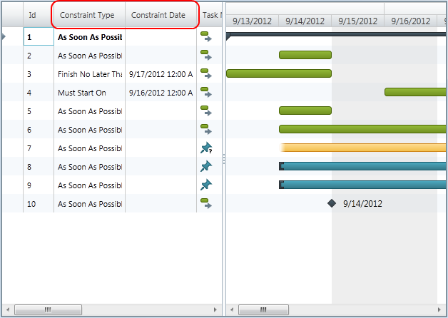

////

|metadata|
{
    "name": "xamgantt-code-example-changing-xamgantt-column-set",
    "controlName": ["xamGantt"],
    "tags": ["Data Presentation","Extending","Grids","Layouts","Scheduling"],
    "guid": "e57eefe2-c9f2-4479-b7a2-5543b1a71be9",  
    "buildFlags": [],
    "createdOn": "2016-05-25T18:21:55.5391394Z"
}
|metadata|
////

= Code Example Changing xamGantt Column Set

== Topic Overview

=== Purpose

You can specify the set of predefined columns shown in the  _xamGantt™_   grid section by using ListBackedProjectViewProvider.

=== Required background

The following topics are prerequisites to understanding this topic:

[options="header", cols="a,a"]
|====
|Topic|Purpose

| link:xamgantt-adding-xamgantt-to-a-page.html[Adding _xamGantt_ to a Page]
|This topic describes how you can add the _xamGantt_ control to a page.

|====

=== In this topic

This topic contains the following sections:

* <<_Code_Example_Changing_the_xamGantt_Columns, Code Example: Changing the  _xamGantt_  Columns >>

** <<_Ref333763526,Description>>

** <<_Ref334102005,Prerequisites>>

** <<_Ref334102013,Preview>>

** <<_Ref334464995,Code>>

* <<_Related_Content, Related Content >>

** <<_Ref333763550,Topics>>

** <<_Ref333763850,Samples>>

[[_Code_Example_Changing_the_xamGantt_Columns]]
== Code Example: Changing the xamGantt columns

[[_Ref333763526]]

=== Description

The code example shows you how to modify the columns set. It creates a project table and sets the desired project columns. Then, the project table is specified in the Project view and it is used by the  _xamGantt_  .

The code example includes a collection of tasks that can be used to better emphasis the days with changed working time when compared to those ones with the default working time.

[[_Ref334102005]]

=== Prerequisites

To complete the code example, you should have a  _xamGantt_   project . You can follow the instructions in link:xamgantt-adding-xamgantt-to-a-page.html[Adding  _xamGantt_   to a Page] in order to create a sample  _xamGantt_   project.

Then, you need to change the view model of the sample project. The following classes should be present:

* `ProjectTableCollection` - To see the code for this class, please refer to the ProjectTableCollection code section below.

* `ProjectViewCollection` - To see the code for this class, please refer to ProjectViewCollection code section below.

After you change the view model of the sample project, then you have to replace the mark-up with those one shown in this topic.

[[_Ref334102013]]

=== Preview

This is a preview of the completed sample project. You can see that right after the ID column, the Constraint Type and Constraint Date columns are displayed. This is a different arrangement from the default.

=== Project Table Collection code

*In C#:*

[source,csharp]
----
public class ProjectTableCollection : ObservableCollection<ProjectTable>
{
}
----

*In Visual Basic:*

[source,vb]
----
Public Class ProjectTableCollection
      Inherits ObservableCollection(Of ProjectTable)
End Class
----

=== Project View Collection Code

*In C#:*

[source,csharp]
----
public class ProjectViewCollection : ObservableCollection<ProjectView>
{
}
----

*In Visual Basic:*

[source,vb]
----
Public Class ProjectViewCollection
      Inherits ObservableCollection(Of ProjectView)
End Class
----

[[_Ref334464995]]

=== Code

*In XAML:*

[source,xaml]
----
<Grid>
        <Grid.Resources>
            <local:ProjectViewModel x:Key="viewmodel" />
        </Grid.Resources>
        <Grid.DataContext>
            <Binding Source="{StaticResource viewmodel}" />
        </Grid.DataContext>
        <!-- Add a xamGantt and bind it to the data -->
        <ig:XamGantt x:Name="gantt" Project="{Binding Project}">
            <ig:XamGantt.ViewProvider>
                <ig:ListBackedProjectViewProvider>
                    <ig:ListBackedProjectViewProvider.ViewItemsSource>
                        <!-- Defining the Project View -->
                        <local:ProjectViewCollection>
                            <ig:ProjectView Key="GanttChart" TableKey="Basic" />
                        </local:ProjectViewCollection>
                    </ig:ListBackedProjectViewProvider.ViewItemsSource>
                    <ig:ListBackedProjectViewProvider.TableItemsSource>
                        <local:ProjectTableCollection>
                            <!-- Defining the Project Table-->
                            <ig:ProjectTable Key="Basic">
                                <ig:ProjectTable.Columns>
                                    <!-- Setting the columns-->
                                    <ig:ProjectColumn Key="Id" Width="43" />
                                    <ig:ProjectColumn Key="ConstraintType" Width="100" />
                                    <ig:ProjectColumn Key="ConstraintDate" Width="100" />
                                    <ig:ProjectColumn Key="IsManual" Width="58" />
                                    <ig:ProjectColumn Key="TaskName" Width="174" />
                                    <ig:ProjectColumn Key="ManualDuration" Width="80" />
                                    <ig:ProjectColumn Key="ManualStart" Width="94" />
                                    <ig:ProjectColumn Key="ManualFinish" Width="94" />
                                    <ig:ProjectColumn Key="PredecessorsIdText" Width="102" />
                                    <ig:ProjectColumn Key="ResourcesText" Width="124" />
                                </ig:ProjectTable.Columns>
                            </ig:ProjectTable>
                        </local:ProjectTableCollection>
                    </ig:ListBackedProjectViewProvider.TableItemsSource>
                </ig:ListBackedProjectViewProvider>
            </ig:XamGantt.ViewProvider>
        </ig:XamGantt>
</Grid>
----

*In C#:*

[source,csharp]
----
…
public class ProjectTableCollection : ObservableCollection<ProjectTable>
{
}
public class ProjectViewCollection : ObservableCollection<ProjectView>
{
}
…
----

*In Visual Basic:*

[source,vb]
----
…
Public Class ProjectTableCollection
      Inherits ObservableCollection(Of ProjectTable)
End Class
Public Class ProjectViewCollection
      Inherits ObservableCollection(Of ProjectView)
End Class
…
----

[[_Related_Content]]
== Related Content

[[_Ref333763550]]

=== Topics

The following topics provide additional information related to this topic:

[options="header", cols="a,a"]
|====
|Topic|Purpose

| link:xamgantt-configuring-the-listbackedproject-viewprovider-for-xamgantt.html[Configuring the ListBacked ViewProvider for _xamGantt_ ]
|The topics in this group contain information about the _xamGantt_ ListBackedProject ViewProvider.

| link:xamgantt-configuring-the-listbackedproject-viewprovider-overview.html[ _xamGantt_ ListBacked ViewProvider Overview]
|This topic gives an overview of the main features of the _xamGantt_ Calendars. _xamGantt_ makes time calculations using calendars.

|====

[[_Ref333763850]]

=== Samples

The following samples provide additional information related to this topic:

[options="header", cols="a,a"]
|====
|Sample|Purpose

| pick:[sl=" link:{SamplesURL}/gantt/#/custom-view-provider[Custom View Provider]"] pick:[wpf=" link:{SamplesURL}/gantt/custom-view-provider[Custom View Provider]"] 
|This sample demonstrates how you can create your project column, project table and project view classes and use them with the _xamGantt_ control.

|====