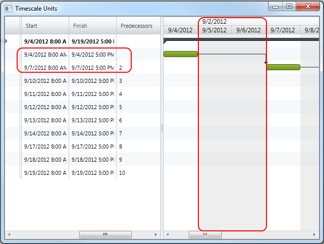

////

|metadata|
{
    "name": "xamgantt-code-example-create-calendar-exceptions",
    "controlName": ["xamGantt"],
    "tags": ["Data Presentation","Extending","Grids","How Do I","Scheduling"],
    "guid": "0784e37c-3f48-496b-a4eb-e4b6569cbb49",  
    "buildFlags": [],
    "createdOn": "2016-05-25T18:21:55.498137Z"
}
|metadata|
////

= xamGantt Code Example Create Calendar Exceptions (xamGantt)

== Topic Overview

=== Purpose

You can create specific reccurent custom adjustment to the working time using Project Calendar Exception.

=== Required background

The following topics are prerequisites to understanding this topic:

[options="header", cols="a,a"]
|====
|Topic|Purpose

| link:xamgantt-adding-xamgantt-to-a-page.html[Adding _xamGantt_ to a Page]
|This topic describes how you can add the xamGantt™ control to a page.

|====

=== In this topic

This topic contains the following sections:

* <<_Code_Example_Create_Calendar_Exceptions, Code Example: Create Calendar Exceptions >>

** <<_Ref334464968,Description>>

** <<_Ref334102005,Prerequisites>>

** <<_Ref334102013,Preview>>

** <<_Ref334464995,Code>>

* <<_Related_Content, Related Content >>

** <<_Ref333763550,Topics>>

** <<_Ref333763850,Samples>>

[[_Code_Example_Create_Calendar_Exceptions]]
== Code Example: Create Calendar Exceptions

[[_Ref334464968]]

=== Description

The code example below creates instances of link:{ApiPlatform}controls.schedules.xamgantt.v{ProductVersion}~infragistics.controls.schedules.projectcalendar_members.html[ProjectCalendar] and link:{ApiPlatform}controls.schedules.xamgantt.v{ProductVersion}~infragistics.controls.schedules.projectcalendarexception_members.html[ProjectCalendarException] classes. Then, it sets a DateRange, DaySettings and DateRecurrence for the project calendar exception. Finally, the project calendar exception is added to the project calendar and project calendar is added to the project.

In code example is included collection of tasks in order to emphasis better the days for which the exceptions applied and those ones who are not affected.

[[_Ref334102005]]

=== Prerequisites

To complete the code example, you should have a xamGantt project . You can follow the instructions in link:xamgantt-adding-xamgantt-to-a-page.html[Adding  _xamGantt_  to a Page] in order to create sample xamGantt project. Then, you must replace the ViewModel and set the ViewModel class, `ProjectViewModel`, show in this topic.

[[_Ref334102013]]

=== Preview

This is a preview of completed sample project. This application was run on Tuesday and you can see that Wednesday and Thursday who should be working days are now set as a nonworking days.

.Note
[NOTE]
====
If you execute this on other working day, the screen-shot will be slightly different. Besides the dates that will be different, if you execute application on Friday, the next two days who will be set as a nonworking will be Saturday and Sunday, who are by default as a nonworking days.
====

[[_Ref334464995]]

=== Code

*In C#:*

[source,csharp]
----
 public class ProjectViewModel : 
INotifyPropertyChanged
    {
        private Project project;
        public Project Project
        {
            get
            {
                if (project == null)
                {
                    project = GenerateExceptionCalendarProject();
                }
                return project;
            }
        }
        public Project GenerateExceptionCalendarProject()
        {
            Project project = new Project();
            ProjectCalendar projectCalendar = new ProjectCalendar() { UniqueId = "pce" };
            ProjectCalendarException pce = new ProjectCalendarException();
            pce.DateRange = new DateRange(DateTime.Today.AddDays(1), DateTime.Today.AddDays(7));
            pce.DaySettings = new DaySettings { IsWorkday = false };
            pce.Recurrence = new DateRecurrence { Count = 2, Frequency = DateRecurrenceFrequency.Daily 
};
            projectCalendar.Exceptions.Add(pce);
            project.Calendars.Add(projectCalendar);
            project.CalendarId = "pce";
            project.Start = DateTime.Today;
            AddSampleWorkingHours(project);
            return project;
        }
        // This is a helper method. It add ten tasks and make relations for them.
        private Project AddSampleWorkingHours(Project project)
        {
            ProjectTask root = new ProjectTask { TaskName = "Summary", 
IsManual = false };
            project.RootTask.Tasks.Add(root);
            for (int i = 0; i < 10; i++)
            {
                root.Tasks.Add(new ProjectTask
                {
                    TaskName = String.Format("Task {0:00}", i.ToString()),
                    IsManual = false,
                    ManualDuration = ProjectDuration.FromFormatUnits(8.0, ProjectDurationFormat.Hours),
                    Notes = String.Format("Notes {0:00}", i.ToString())
                });
            }
            for (int i = 1; i < 10; i++)
            {
                root.Tasks[i].Predecessors.Add(root.Tasks[i - 1]);
            }
            return project;
        }
        #region INotifyPropertyChanged
        public event PropertyChangedEventHandler PropertyChanged;
        public void OnPropertyChanged(string 
propertyName)
        {
            if (PropertyChanged != null)
            {
                PropertyChanged(this, new PropertyChangedEventArgs
(propertyName));
            }
        }
        #endregion // INotifyPropertyChanged
    }
----

*In Visual Basic:*

[source,vb]
----
Public Class ProjectViewModel
      Implements INotifyPropertyChanged
      Private m_project As Project
      Public ReadOnly Property Project() As Project
            Get
                  If m_project Is Nothing 
Then
                        m_project = GenerateExceptionCalendarProject()
                  End If
                  Return m_project
            End Get
      End Property
      Public Function GenerateExceptionCalendarProject() As Project
            Dim project As New Project()
            Dim projectCalendar As New 
ProjectCalendar() With { _
                  Key .UniqueId = "pce" _
            }
            Dim pce As New 
ProjectCalendarException()
            pce.DateRange = New DateRange(DateTime.Today.AddDays(1), DateTime.Today.AddDays(7))
            pce.DaySettings = New DaySettings() With { _
                  Key .IsWorkday = False _
            }
            pce.Recurrence = New DateRecurrence() With { _
                  Key .Count = 2, _
                  Key .Frequency = DateRecurrenceFrequency.Daily _
            }
            projectCalendar.Exceptions.Add(pce)
            project.Calendars.Add(projectCalendar)
            project.CalendarId = "pce"
            project.Start = DateTime.Today
            AddSampleWorkingHours(project)
            Return project
      End Function
      ' This is a helper method. It add ten tasks and make relations for them.
      Private Function AddSampleWorkingHours(project As Project) As Project
            Dim root As New ProjectTask() 
With { _
                  Key .TaskName = "Summary", _
                  Key .IsManual = False _
            }
            project.RootTask.Tasks.Add(root)
            Dim i As Integer = 0
            While i < 10
                  root.Tasks.Add(New ProjectTask() With { _
                        Key .TaskName = [String].Format("Task {0:00}", 
i.ToString()), _
                        Key .IsManual = False, _
                        Key .ManualDuration = ProjectDuration.FromFormatUnits(8.0, ProjectDurationFormat.Hours), _
                        Key .Notes = [String].Format("Notes {0:00}", 
i.ToString()) _
                  })
                  i
            End While
            Dim i As Integer = 1
            While i < 10
                  root.Tasks(i).Predecessors.Add(root.Tasks(i - 1))
                  i
            End While
            Return project
      End Function
      #Region "INotifyPropertyChanged"
      Public Event PropertyChanged As 
PropertyChangedEventHandler
      Public Sub OnPropertyChanged(propertyName As String)
            RaiseEvent PropertyChanged(Me, New 
PropertyChangedEventArgs(propertyName))
      End Sub
      #End Region
End Class
----

[[_Related_Content]]
== Related Content

[[_Ref333763550]]

=== Topics

The following topics provide additional information related to this topic.

[options="header", cols="a,a"]
|====
|Topic|Purpose

| link:xamgantt-configuring-the-xamgantt-calendars.html[Configuring the xamGantt Calendars]
|The topics in this group contains information about xamGantt™ Calendars.

| _link:xamgantt-calendars-configuration-overview.html[xamGantt Calendars Configuration Overview]_ 
|This topic gives an overview of the main features of _xamGantt_™ Calendars. xamGantt makes time calculations using calendars.

| link:xamgantt-configuring-the-xamgantt-project-calendar.html[Configuring the xamGantt Project Calendar]
|This topics describes how you can use Project Calendar to specify working time information.

|====

[[_Ref333763850]]

=== Samples

The following samples provide additional information related to this topic.

[options="header", cols="a,a"]
|====
|Sample|Purpose

| pick:[sl=" link:{SamplesURL}/gantt/#/project-calendar[Project Calendars]"] pick:[wpf=" link:{SamplesURL}/gantt/project-calendar[Project Calendars]"] 
|This sample demonstrates how you can customize the project calendar and set a non-working day.

| pick:[sl=" link:{SamplesURL}/gantt/#/calendar-working-times[Calendar Working Times]"] pick:[wpf=" link:{SamplesURL}/gantt/calendar-working-times[Calendar Working Times]"] 
|This sample demonstrates how you can create a fully customized project calendar.

|====