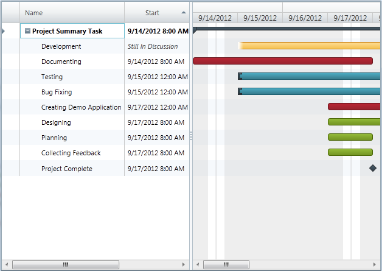

////

|metadata|
{
    "name": "xamgantt-code-example-creating-customized-view-for-xamgantt",
    "controlName": ["xamGantt"],
    "tags": ["Data Binding","Extending","Grids","Layouts","Scheduling"],
    "guid": "20730917-94c5-4a3c-b9f9-e3b489f78690",  
    "buildFlags": [],
    "createdOn": "2016-05-25T18:21:55.5441395Z"
}
|metadata|
////

= Code Example Creating Customized View for xamGantt

== Topic Overview

=== Purpose

You can create customize the  _xamGantt_   view by using the link:{ApiPlatform}controls.schedules.xamgantt.v{ProductVersion}~infragistics.controls.schedules.listbackedprojectviewprovider_members.html[ListBackedProjectViewProvider] and built-in project column, project table and project view classes.

=== Required background

The following topics are prerequisites to understanding this topic:

[options="header", cols="a,a"]
|====
|Topic|Purpose

| link:xamgantt-adding-xamgantt-to-a-page.html[Adding _xamGantt_ to a Page]
|This topic describes how you can add the _xamGantt_ control to a page.

|====

=== In this topic

This topic contains the following sections:

* <<_Code_Example_Creating_Customizing_View_for_xamGantt, Code Example: Creating Customized View for  _xamGantt_   >>

** <<_Ref333763526,Description>>

** <<_Ref334102005,Prerequisites>>

** <<_Ref334102013,Preview>>

** <<_Ref334464995,Code>>

* <<_Related_Content, Related Content >>

** <<_Ref333763550,Topics>>

** <<_Ref333763850,Samples>>

[[_Code_Example_Creating_Customizing_View_for_xamGantt]]
== Code Example: Creating Customized View for xamGantt

[[_Ref333763526]]

=== Description

The code example shows you how to customize  _xamGantt_   view by using built-in link:{ApiPlatform}controls.schedules.xamgantt.v{ProductVersion}~infragistics.controls.schedules.projectcolumn_members.html[ProjectColumn], link:{ApiPlatform}controls.schedules.xamgantt.v{ProductVersion}~infragistics.controls.schedules.projecttable_members.html[ProjectTable] and link:{ApiPlatform}controls.schedules.xamgantt.v{ProductVersion}~infragistics.controls.schedules.projectview_members.html[ProjectView] classes. Then you create the link:{ApiPlatform}controls.schedules.xamgantt.v{ProductVersion}~infragistics.controls.schedules.listbackedprojectviewprovider_members.html[ListBackedProjectViewProvider] in XAML and set its link:{ApiPlatform}controls.schedules.xamgantt.v{ProductVersion}~infragistics.controls.schedules.listbackedprojectviewprovider~tableitemssource.html[TableItemsSource] and link:{ApiPlatform}controls.schedules.xamgantt.v{ProductVersion}~infragistics.controls.schedules.listbackedprojectviewprovider~viewitemssource.html[ViewItemsSource] to the corresponding collections of project tables and project views. The mapping between custom classes is made with the link:{ApiPlatform}controls.schedules.xamgantt.v{ProductVersion}~infragistics.controls.schedules.listbackedprojectviewprovider~tablepropertymappings.html[TablePropertyMappings] and link:{ApiPlatform}controls.schedules.xamgantt.v{ProductVersion}~infragistics.controls.schedules.listbackedprojectviewprovider~viewpropertymappings.html[ViewPropertyMappings] properties of `ListBackedProjectViewProvider`.

Finally, the link:{ApiPlatform}controls.schedules.xamgantt.v{ProductVersion}~infragistics.controls.schedules.projectcontrolbase~viewprovider.html[ViewProvider] property of the xamGantt is set to the `ListBackedProjectViewProvider` instance.

.Note
[NOTE]
====

When you use the `ProjectColumn` and `ProjectTable` classes, you do not need to set the link:{ApiPlatform}controls.schedules.xamgantt.v{ProductVersion}~infragistics.controls.schedules.listbackedprojectviewprovider~columnitemssource.html[ColumnItemsSource] of `ListBackedProjectViewProvider`, because columns can be provided by `ProjectTable` link:{ApiPlatform}controls.schedules.xamgantt.v{ProductVersion}~infragistics.controls.schedules.projecttable~columns.html[Columns] property.

You may bind to columns if you want to predefine columns in `ColumnItemsSource`. This way, if users choose to show a column that is not already in the table, the column items source will be searched first, and if column is not found, a new one will be created.
====

[[_Ref334102005]]

=== Prerequisites

To complete the code example, you should have a  _xamGantt_   project . You can follow the instructions in link:xamgantt-adding-xamgantt-to-a-page.html[Adding  _xamGantt_   to a Page] in order to create sample  _xamGantt_   project. You have to replace the mark-up and the `ProjectViewModel` class with those ones shown in the code section.

[[_Ref334102013]]

=== Preview

This is a preview of the completed sample project. The screen-shot is taken with the `ViewKey``=”Standard01”`. The instance of the `ProjectView` class with the `Key=“Standard01”` sets the  _xamGantt_   to show critical tasks as well as summary tasks. The column set is specified by the `Columns` property.

[[_Ref334464995]]

=== Code

*In XAML:*

[source,xaml]
----
 <Grid>
        <Grid.Resources>
            <local:ProjectViewModel x:Key="dc" />
        </Grid.Resources>
        <Grid.DataContext>
            <Binding Source="{StaticResource dc}" />
        </Grid.DataContext>
        <!-- ListBackedProjectViewProvider Setup-->
        <ig:ListBackedProjectViewProvider x:Name="lbpViewProvider" TableItemsSource="{Binding Tables}" ViewItemsSource="{Binding Views}">
            <ig:ListBackedProjectViewProvider.TablePropertyMappings>
                <ig:ProjectTablePropertyMappingCollection UseDefaultMappings="True" />
            </ig:ListBackedProjectViewProvider.TablePropertyMappings>
            <ig:ListBackedProjectViewProvider.ViewPropertyMappings>
                <ig:ProjectViewPropertyMappingCollection UseDefaultMappings="True" />
            </ig:ListBackedProjectViewProvider.ViewPropertyMappings>
        </ig:ListBackedProjectViewProvider>
        <ig:XamGantt x:Name="xamGantt" ViewProvider="{Binding ElementName=lbpViewProvider}" Project="{Binding Project}" ViewKey="Standard01" />
    </Grid>
----

*In C#:*

[source,csharp]
----
 public class ProjectViewModel : 
INotifyPropertyChanged
    {
        #region Private variables
        private ObservableCollection<ProjectView> views;
        private ObservableCollection<ProjectTable> tables;
        private ObservableCollection<ProjectColumn> columns;
        private Project project;
        #endregion // Private variables
        #region Public Properties
        public Project Project
        {
            get
            {
                if (project == null)
                {
                    project = ProjectDataHelper.GenerateProjectData();
                }
                return project;
            }
            set
            {
                if (value != project)
                {
                    project = value;
                    OnPropertyChanged("Project");
                }
            }
        }
        public ObservableCollection<ProjectColumn> Columns
        {
            get
            {
                if (columns == null)
                {
                    columns = GenerateColumns();
                }
                return columns;
            }
        }
        public ObservableCollection<ProjectTable> Tables
        {
            get
            {
                if (tables == null)
                {
                    tables = GenerateTables();
                }
                return tables;
            }
        }
        public ObservableCollection<ProjectView> Views
        {
            get
            {
                if (views == null)
                {
                    views = GenerateViews();
                }
                return views;
            }
        }
        #endregion // Public Properties
        #region Private helper methods
        private ObservableCollection<ProjectView> GenerateViews()
        {
            ObservableCollection<ProjectView> views = new ObservableCollection<ProjectView>
();
            ProjectView view = new ProjectView
            {
                Key = "Standard01",
                TableKey = "Table 01",
                Settings = new ProjectViewSettings
                {
                    AreSummaryTasksVisible = true,
                    AreCriticalTasksHighlighted = true,
                    IsOutlineStructurePreservedWhenSorting = true,
                    NonWorkingTimeHighlightStyle = NonWorkingTimeHighlightStyle.ActualNonWorkingHours
                }
            };
            view.SortedColumns.Add(new ProjectColumnSortDescription { ColumnKey = "ManualStart" });
            view.SortedColumns.Add(new ProjectColumnSortDescription { ColumnKey = "ManualFinish", Direction = ListSortDirection.Descending });
            views.Add(view);
            view = new ProjectView { Key = "Standard02", TableKey = "Table 02" };
            views.Add(view);
            return views;
        }
        private ObservableCollection<ProjectTable> GenerateTables()
        {
            var columnsMap = Columns.ToDictionary(c => c.Key);
            ObservableCollection<ProjectTable> tables = new 
ObservableCollection<ProjectTable>();
            ProjectTable table = new ProjectTable { Key = "Table 01", 
ShowInMenu = true };
            table.Columns.Add(columnsMap["TaskName"]);
            table.Columns.Add(columnsMap["ManualStart"]);
            table.Columns.Add(columnsMap["ManualDuration"]);
            table.Columns.Add(columnsMap["ManualFinish"]);
            tables.Add(table);
            table = new ProjectTable { Key = "Table 02", ShowInMenu = true };
            table.Columns.Add(columnsMap["TaskName"]);
            table.Columns.Add(columnsMap["ManualStart"]);
            table.Columns.Add(columnsMap["ManualFinish"]);
            table.Columns.Add(columnsMap["Notes"]);
            tables.Add(table);
            return tables;
        }
        private ObservableCollection<ProjectColumn> GenerateColumns()
        {
            return new ObservableCollection<ProjectColumn>()
            {
                new ProjectColumn { Key = "TaskName", HeaderText = "Name"},
                new ProjectColumn { Key = "ManualStart", HeaderText = "Start", 
                    Settings = new ProjectColumnSettings { HeaderTextHorizontalAlignment = 
HorizontalAlignment.Center}},
                new ProjectColumn { Key = "ManualFinish", HeaderText = "Finish", 
                    Settings = new ProjectColumnSettings { HeaderTextHorizontalAlignment = 
HorizontalAlignment.Center}},
                    new ProjectColumn { Key = "ManualDuration", HeaderText = 
"Duration"},
                    new ProjectColumn { Key = "Notes", HeaderText = "Notes"}
            };
        }
        #endregion // Private helper methods
        #region INotifyPropertyChanged
        public event PropertyChangedEventHandler PropertyChanged;
        public void OnPropertyChanged(string 
propertyName)
        {
            if (PropertyChanged != null)
            {
                PropertyChanged(this, new PropertyChangedEventArgs
(propertyName));
            }
        }
        #endregion // INotifyPropertyChanged
    }
----

*In Visual Basic:*

[source,vb]
----
Public Class ProjectViewModel
      Implements INotifyPropertyChanged
      #Region "Private variables"
      Private m_views As ObservableCollection(Of ProjectView)
      Private m_tables As ObservableCollection(Of ProjectTable)
      Private m_columns As ObservableCollection(Of ProjectColumn)
      Private m_project As Project
      #End Region
      #Region "Public Properties"
      Public Property Project() As Project
            Get
                  If m_project Is Nothing 
Then
                        m_project = ProjectDataHelper.GenerateProjectData()
                  End If
                  Return m_project
            End Get
            Set
                  If value <> m_project Then
                        m_project = value
                        OnPropertyChanged("Project")
                  End If
            End Set
      End Property
      Public ReadOnly Property Columns() As ObservableCollection(Of ProjectColumn)
            Get
                  If m_columns Is Nothing 
Then
                        m_columns = GenerateColumns()
                  End If
                  Return m_columns
            End Get
      End Property
      Public ReadOnly Property Tables() As ObservableCollection(Of ProjectTable)
            Get
                  If m_tables Is Nothing Then
                        m_tables = GenerateTables()
                  End If
                  Return m_tables
            End Get
      End Property
      Public ReadOnly Property Views() As ObservableCollection(Of ProjectView)
            Get
                  If m_views Is Nothing Then
                        m_views = GenerateViews()
                  End If
                  Return m_views
            End Get
      End Property
      #End Region
      #Region "Private helper methods"
      Private Function GenerateViews() As 
ObservableCollection(Of ProjectView)
            Dim views As New 
ObservableCollection(Of ProjectView)()
            Dim view As New ProjectView() 
With { _
                  Key .Key = "Standard01", _
                  Key .TableKey = "Table 01", _
                  Key .Settings = New ProjectViewSettings() With { _
                        Key .AreSummaryTasksVisible = True, _
                        Key .AreCriticalTasksHighlighted = True, _
                        Key .IsOutlineStructurePreservedWhenSorting = True, _
                        Key .NonWorkingTimeHighlightStyle = NonWorkingTimeHighlightStyle.ActualNonWorkingHours _
                  } _
            }
            view.SortedColumns.Add(New ProjectColumnSortDescription() With 
{ _
                  Key .ColumnKey = "ManualStart" _
            })
            view.SortedColumns.Add(New ProjectColumnSortDescription() With 
{ _
                  Key .ColumnKey = "ManualFinish", _
                  Key .Direction = ListSortDirection.Descending _
            })
            views.Add(view)
            view = New ProjectView() With { _
                  Key .Key = "Standard02", _
                  Key .TableKey = "Table 02" _
            }
            views.Add(view)
            Return views
      End Function
      Private Function GenerateTables() As 
ObservableCollection(Of ProjectTable)
            Dim columnsMap = Columns.ToDictionary(Function(c) c.Key)
            Dim tables As New 
ObservableCollection(Of ProjectTable)()
            Dim table As New ProjectTable() 
With { _
                  Key .Key = "Table 01", _
                  Key .ShowInMenu = True _
            }
            table.Columns.Add(columnsMap("TaskName"))
            table.Columns.Add(columnsMap("ManualStart"))
            table.Columns.Add(columnsMap("ManualDuration"))
            table.Columns.Add(columnsMap("ManualFinish"))
            tables.Add(table)
            table = New ProjectTable() With { _
                  Key .Key = "Table 02", _
                  Key .ShowInMenu = True _
            }
            table.Columns.Add(columnsMap("TaskName"))
            table.Columns.Add(columnsMap("ManualStart"))
            table.Columns.Add(columnsMap("ManualFinish"))
            table.Columns.Add(columnsMap("Notes"))
            tables.Add(table)
            Return tables
      End Function
      Private Function GenerateColumns() As 
ObservableCollection(Of ProjectColumn)
            Return New ObservableCollection(Of ProjectColumn)() From { _
                  New ProjectColumn() With { _
                        Key .Key = "TaskName", _
                        Key .HeaderText = "Name" _
                  }, _
                  New ProjectColumn() With { _
                        Key .Key = "ManualStart", _
                        Key .HeaderText = "Start", _
                        Key .Settings = New ProjectColumnSettings() With { 
_
                              Key .HeaderTextHorizontalAlignment = HorizontalAlignment.Center _
                        } _
                  }, _
                  New ProjectColumn() With { _
                        Key .Key = "ManualFinish", _
                        Key .HeaderText = "Finish", _
                        Key .Settings = New ProjectColumnSettings() With { 
_
                              Key .HeaderTextHorizontalAlignment = HorizontalAlignment.Center _
                        } _
                  }, _
                  New ProjectColumn() With { _
                        Key .Key = "ManualDuration", _
                        Key .HeaderText = "Duration" _
                  }, _
                  New ProjectColumn() With { _
                        Key .Key = "Notes", _
                        Key .HeaderText = "Notes" _
                  } _
            }
      End Function
      #End Region
      #Region "INotifyPropertyChanged"
      Public Event PropertyChanged As 
PropertyChangedEventHandler
      Public Sub OnPropertyChanged(propertyName As String)
            RaiseEvent PropertyChanged(Me, New 
PropertyChangedEventArgs(propertyName))
      End Sub
      #End Region
End Class
----

[[_Related_Content]]
== Related Content

[[_Ref333763550]]

=== Topics

The following topics provide additional information related to this topic:

[options="header", cols="a,a"]
|====
|Topic|Purpose

| link:xamgantt-configuring-the-listbackedproject-viewprovider-for-xamgantt.html[Configuring the ListBacked ViewProvider for _xamGantt_ ]
|The topics in this group contain information about the _xamGantt_ `ListBackedProjectViewProvider`.

| link:xamgantt-configuring-the-listbackedproject-viewprovider-overview.html[ _xamGantt_ ListBacked ViewProvider Overview]
|This topic gives an overview of the main features of the _xamGantt_ Calendars. _xamGantt_ makes time calculations using calendars.

| link:xamgantt-code-example-creating-view-for-xamgantt-using-custom-classes.html[Code Example: Creating View for xamGantt using Custom Classes]
|You can create custom classes for project columns, project tables and project views and use those classes to customize the _xamGantt’s_ appearance.

|====

[[_Ref333763850]]

=== Samples

The following samples provide additional information related to this topic:

[options="header", cols="a,a"]
|====
|Sample|Purpose

| pick:[sl=" link:{SamplesURL}/gantt/#/custom-view-provider[Custom View Provider]"] pick:[wpf=" link:{SamplesURL}/gantt/custom-view-provider[Custom View Provider]"] 
|This sample demonstrates how you can create your project column, project table and project view classes and use them with the _xamGantt_ control.

|====