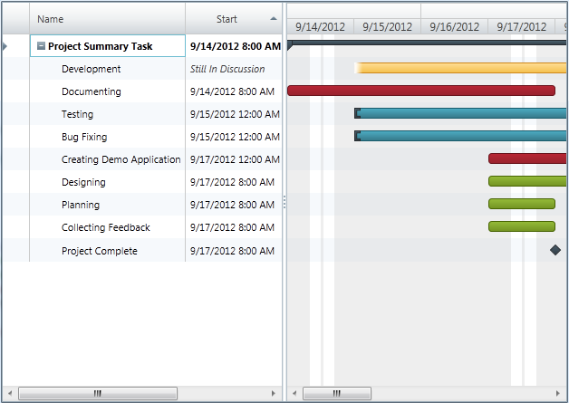

////

|metadata|
{
    "name": "xamgantt-code-example-creating-view-for-xamgantt-using-custom-classes",
    "controlName": ["xamGantt"],
    "tags": ["Charting","Data Binding","Data Presentation","Editing","Scheduling"],
    "guid": "74062d7a-af66-4450-90ee-e8a31ffd67a6",  
    "buildFlags": [],
    "createdOn": "2016-05-25T18:21:55.5681462Z"
}
|metadata|
////

= Code Example Creating View for xamGantt using Custom Classes

== Topic Overview

=== Purpose

You can create custom classes for project columns, project tables and project views and use those classes to customize the appearance of your  _xamGantt_  _™_ .

=== Required background

The following topics are prerequisites to understanding this topic:

[options="header", cols="a,a"]
|====
|Topic|Purpose

|* link:xamgantt-adding-xamgantt-to-a-page.html[Adding _xamGantt_ to a Page]*
|This topic describes how you can add the _xamGantt_ control to a page.

|====

=== In this topic

This topic contains the following sections:

* <<_Code_Example_Creating_Customized_View_for_xamGantt, Code Example: Creating Customized View for  _xamGantt_   >>

** <<_Ref333763526,Description>>

** <<_Ref334102005,Prerequisites>>

** <<_Ref334102013,Preview>>

** <<_Ref334464995,Code>>

* <<_Related_Content, Related Content >>

** <<_Ref333763550,Topics>>

** <<_Ref333763850,Samples>>

[[_Code_Example_Creating_Customized_View_for_xamGantt]]
== Code Example: Creating Customized View for xamGantt

[[_Ref333763526]]

=== Description

The code example shows you how to create custom project column classes, custom project table classes and custom project view classes. Then you can create a link:{ApiPlatform}controls.schedules.xamgantt{ApiVersion}~infragistics.controls.schedules.listbackedprojectviewprovider_members.html[ListBackedProjectViewProvider] in XAML and set its link:{ApiPlatform}controls.schedules.xamgantt{ApiVersion}~infragistics.controls.schedules.listbackedprojectviewprovider~columnitemssource.html[ColumnItemsSource], link:{ApiPlatform}controls.schedules.xamgantt{ApiVersion}~infragistics.controls.schedules.listbackedprojectviewprovider~tableitemssource.html[TableItemsSource] and link:{ApiPlatform}controls.schedules.xamgantt{ApiVersion}~infragistics.controls.schedules.listbackedprojectviewprovider~viewitemssource.html[ViewItemsSource] to the corresponding collections of those custom objects. The mapping between custom classes is made with link:{ApiPlatform}controls.schedules.xamgantt{ApiVersion}~infragistics.controls.schedules.listbackedprojectviewprovider~columnpropertymappings.html[ColumnPropertyMappings], link:{ApiPlatform}controls.schedules.xamgantt{ApiVersion}~infragistics.controls.schedules.listbackedprojectviewprovider~tablepropertymappings.html[TablePropertyMappings] and link:{ApiPlatform}controls.schedules.xamgantt{ApiVersion}~infragistics.controls.schedules.listbackedprojectviewprovider~viewpropertymappings.html[ViewPropertyMappings] properties of the `ListBackedProjectViewProvider`.

Finally, the link:{ApiPlatform}controls.schedules.xamgantt{ApiVersion}~infragistics.controls.schedules.projectcontrolbase~viewprovider.html[ViewProvider] property of the  _xamGantt_   is set to the `ListBackedProjectViewProvider` instance.

This code example includes a collection of sample custom tasks.

[[_Ref334102005]]

=== Prerequisites

To complete the code example, you should have a  _xamGantt_   project . You can follow the instructions in  * link:xamgantt-adding-xamgantt-to-a-page.html[Adding  _xamGantt_   to a Page]*  in order to create a sample  _xamGantt_   project.

Then you need to modify the project. The following classes should be included in your project:

* `CustomProjectColumn` - To see the complete code for this class, please refer to the link:resources-xamgantt-custom-project-column-code-example.html[Custom Project Column Code Example].

* `CustomProjectTable` - To see the complete code for this class, please refer to the link:resources-xamgantt-custom-project-table-code-example.html[Custom Project Table Code Example].

* `CustomProjectView` - To see the complete code for this class, please refer to the link:resources-xamgantt-custom-project-view-code-example.html[Custom Project View Code Example].

You have to replace the mark-up and the `ProjectViewModel` class with those ones shown in the code section.

[[_Ref334102013]]

=== Preview

This is a preview of the completed sample project. The screen-shot is taken with the ViewKey="View01". This instance of the `CustomProjectView` class with `Id=”View01”` sets the  _xamGantt_   to show critical tasks as well as the summary task. The column set is specified by the `ColumnIds` property of the `CustomProjectTable` class instance, used by the custom view.

[[_Ref334464995]]

=== Code

*In XAML:*

[source,xaml]
----
<Grid>
        <Grid.Resources>
            <local:ProjectViewModel x:Key="dc" />
        </Grid.Resources>
        <Grid.DataContext>
            <Binding Source="{StaticResource dc}" />
        </Grid.DataContext>
        <!-- ListBackedProjectViewProvider Setup-->
        <ig:ListBackedProjectViewProvider x:Name="lbpViewProvider" ColumnItemsSource="{Binding Columns}" 
                                          TableItemsSource="{Binding Tables}" ViewItemsSource="{Binding CustomViews}">
            <ig:ListBackedProjectViewProvider.ColumnPropertyMappings>
                <ig:ProjectColumnPropertyMappingCollection UseDefaultMappings="True">
                    <ig:ProjectColumnPropertyMapping ColumnProperty="Id" DataObjectProperty="Id" />
                </ig:ProjectColumnPropertyMappingCollection>
            </ig:ListBackedProjectViewProvider.ColumnPropertyMappings>
            <ig:ListBackedProjectViewProvider.TablePropertyMappings>
                <ig:ProjectTablePropertyMappingCollection UseDefaultMappings="True" />
            </ig:ListBackedProjectViewProvider.TablePropertyMappings>
            <ig:ListBackedProjectViewProvider.ViewPropertyMappings>
                <ig:ProjectViewPropertyMappingCollection UseDefaultMappings="True" />
            </ig:ListBackedProjectViewProvider.ViewPropertyMappings>
        </ig:ListBackedProjectViewProvider>
        <ig:XamGantt x:Name="xamGantt" Grid.Row="0" Project="{Binding SampleProject}" 
                     ViewProvider="{Binding ElementName=lbpViewProvider}" ViewKey="View01" />
</Grid>
----

*In C#:*

[source,csharp]
----
public class ProjectViewModel : 
INotifyPropertyChanged
    {
        #region Private variables
        private Project project;
        private ObservableCollection<CustomProjectView> views;
        private ObservableCollection<CustomProjectTable> tables;
        private ObservableCollection<CustomProjectColumn> columns;
        private CustomProjectView selectedView;
        #endregion // Private variables
        #region Public Properties
        public Project SampleProject
        {
            get
            {
                if (project == null)
                {
                    project = ProjectDataHelper.GenerateProjectData();
                }
                return project;
            }
            set
            {
                if (project != value)
                {
                    project = value;
                    OnPropertyChanged("SampleProject");
                }
            }
        }
        public CustomProjectView SelectedView
        {
            get
            {
                return selectedView;
            }
            set
            {
                if (value != selectedView)
                {
                    selectedView = value;
                    OnPropertyChanged("SelectedView");
                }
            }
        }
        public ObservableCollection<CustomProjectColumn> Columns
        {
            get
            {
                if (columns == null)
                {
                    columns = GenerateColumns();
                }
                return columns;
            }
        }
        public ObservableCollection<CustomProjectTable> Tables
        {
            get
            {
                if (tables == null)
                {
                    tables = GenerateTables();
                }
                return tables;
            }
            set
            {
                if (tables != value)
                {
                    tables = value;
                }
            }
        }
        public ObservableCollection<CustomProjectView> CustomViews
        {
            get
            {
                if (views == null)
                {
                    views = GenerateViews();
                }
                return views;
            }
            set
            {
                if (views != value)
                {
                    views = value;
                    OnPropertyChanged("CustomViews");
                }
            }
        }
        #endregion // Public properties
        #region Private helpers
        private ObservableCollection<CustomProjectColumn> GenerateColumns()
        {
            return new ObservableCollection<CustomProjectColumn>()
            {
                new CustomProjectColumn
                {
                    Id = "idTaskName",
                    Key = "TaskName",
                    HeaderText = "Name"
                },
                new CustomProjectColumn
                {
                    Id = "idStart",
                    Key = "ManualStart",
                    HeaderText = "Start",
                    HeaderTextHorizontalAlignment = "Center"
                },
                new CustomProjectColumn
                {
                    Id = "idFinish",
                    Key = "ManualFinish",
                    HeaderText = "Finish",
                    HeaderTextHorizontalAlignment = "Center"
                },
                new CustomProjectColumn
                {
                    Id = "idDuration",
                    Key = "ManualDuration",
                    HeaderText = "Duration"
                },
                new CustomProjectColumn
                {
                    Id = "idPredecessors",
                    Key = "PredecessorsIdText",
                    HeaderText = "Predecessors"
                },
                new CustomProjectColumn
                {
                    Id="idIsCritical",
                    Key = "IsCritical",
                    HeaderText = "Is Critical"
                }
            };
        }
        private ObservableCollection<CustomProjectTable> GenerateTables()
        {
            return new ObservableCollection<CustomProjectTable>()
            {
                new CustomProjectTable
                {
                    Key = "Table01",
                    // Comma separated column ids, which are provided by the ProjectColumnProperty.DataItemId 
property mapping
                    ColumnIds = "idTaskName, idStart, idDuration, idFinish, idPredecessors, 
idIsCritical",
                    ShowInMenu = true
                },
                new CustomProjectTable
                {
                    Key = "Table02",
                    ColumnIds = "idTaskName, idStart, idFinish, idIsCritical",
                    ShowInMenu = true
                },
                new CustomProjectTable
                {
                    Key = "Table03",
                    ColumnIds = "idTaskName, idDuration, idPredecessors",
                    ShowInMenu = true
                }
            };
        }
        private ObservableCollection<CustomProjectView> GenerateViews()
        {
            return new ObservableCollection<CustomProjectView>()
            {
                new CustomProjectView
                {
                    Key = "View01",
                    AreSummaryTasksVisible = true,
                    AreCriticalTasksHighlighted = true,
                    // Comma separated column keys, where each key can optionally be followed by 'Ascending' or 
'Descending' word to indicate 
                    // that the column should be sorted ascending or descending
                    SortedColumns = "ManualStart, ManualFinish:Descending",
                    IsOutlineStructurePreservedWhenSorting = true,
                    TableKey = "Table01",
                    NonWorkingTimeHighlightStyle = "ActualNonWorkingHours"
                },
                new CustomProjectView
                {
                    Key = "View02",
                    TableKey = "Table02",
                    AreCriticalTasksHighlighted = false,
                    AreSummaryTasksVisible = false
                },
                new CustomProjectView
                {
                    Key = "View03",
                    TableKey = "Table03",
                    AreCriticalTasksHighlighted = true
                }
            };
        }
        #endregion // Private helpers
        #region INotifyPropertyChanged
        public event PropertyChangedEventHandler PropertyChanged;
        public void OnPropertyChanged(string 
propertyName)
        {
            if (PropertyChanged != null)
            {
                PropertyChanged(this, new PropertyChangedEventArgs
(propertyName));
            }
        }
        #endregion // INotifyPropertyChanged
    }
----

*In Visual Basic:*

[source,vb]
----
Public Class ProjectViewModel
      Implements INotifyPropertyChanged
      #Region "Private variables"
      Private project As Project
      Private views As ObservableCollection(Of CustomProjectView)
      Private m_tables As ObservableCollection(Of CustomProjectTable)
      Private m_columns As ObservableCollection(Of CustomProjectColumn)
      Private m_selectedView As CustomProjectView
      #End Region
      #Region "Public Properties"
      Public Property SampleProject() As 
Project
            Get
                  If project Is Nothing Then
                        project = ProjectDataHelper.GenerateProjectData()
                  End If
                  Return project
            End Get
            Set
                  If project <> value Then
                        project = value
                        OnPropertyChanged("SampleProject")
                  End If
            End Set
      End Property
      Public Property SelectedView() As 
CustomProjectView
            Get
                  Return m_selectedView
            End Get
            Set
                  If value <> m_selectedView Then
                        m_selectedView = value
                        OnPropertyChanged("SelectedView")
                  End If
            End Set
      End Property
      Public ReadOnly Property Columns() As ObservableCollection(Of CustomProjectColumn)
            Get
                  If m_columns Is Nothing 
Then
                        m_columns = GenerateColumns()
                  End If
                  Return m_columns
            End Get
      End Property
      Public Property Tables() As 
ObservableCollection(Of CustomProjectTable)
            Get
                  If m_tables Is Nothing Then
                        m_tables = GenerateTables()
                  End If
                  Return m_tables
            End Get
            Set
                  If m_tables <> value Then
                        m_tables = value
                  End If
            End Set
      End Property
      Public Property CustomViews() As 
ObservableCollection(Of CustomProjectView)
            Get
                  If views Is Nothing Then
                        views = GenerateViews()
                  End If
                  Return views
            End Get
            Set
                  If views <> value Then
                        views = value
                        OnPropertyChanged("CustomViews")
                  End If
            End Set
      End Property
      #End Region
      #Region "Private helpers"
      Private Function GenerateColumns() As 
ObservableCollection(Of CustomProjectColumn)
            Return New ObservableCollection(Of CustomProjectColumn)() From 
{ _
                  New CustomProjectColumn() With { _
                        Key .Id = "idTaskName", _
                        Key .Key = "TaskName", _
                        Key .HeaderText = "Name" _
                  }, _
                  New CustomProjectColumn() With { _
                        Key .Id = "idStart", _
                        Key .Key = "ManualStart", _
                        Key .HeaderText = "Start", _
                        Key .HeaderTextHorizontalAlignment = "Center" _
                  }, _
                  New CustomProjectColumn() With { _
                        Key .Id = "idFinish", _
                        Key .Key = "ManualFinish", _
                        Key .HeaderText = "Finish", _
                        Key .HeaderTextHorizontalAlignment = "Center" _
                  }, _
                  New CustomProjectColumn() With { _
                        Key .Id = "idDuration", _
                        Key .Key = "ManualDuration", _
                        Key .HeaderText = "Duration" _
                  }, _
                  New CustomProjectColumn() With { _
                        Key .Id = "idPredecessors", _
                        Key .Key = "PredecessorsIdText", _
                        Key .HeaderText = "Predecessors" _
                  }, _
                  New CustomProjectColumn() With { _
                        Key .Id = "idIsCritical", _
                        Key .Key = "IsCritical", _
                        Key .HeaderText = "Is Critical" _
                  } _
            }
      End Function
      Private Function GenerateTables() As 
ObservableCollection(Of CustomProjectTable)
                        ' Comma separated column ids, which are provided by the 
ProjectColumnProperty.DataItemId property mapping
            Return New ObservableCollection(Of CustomProjectTable)() From { 
_
                  New CustomProjectTable() With { _
                        Key .Key = "Table01", _
                        Key .ColumnIds = "idTaskName, idStart, idDuration, idFinish, idPredecessors, 
idIsCritical", _
                        Key .ShowInMenu = True _
                  }, _
                  New CustomProjectTable() With { _
                        Key .Key = "Table02", _
                        Key .ColumnIds = "idTaskName, idStart, idFinish, idIsCritical", _
                        Key .ShowInMenu = True _
                  }, _
                  New CustomProjectTable() With { _
                        Key .Key = "Table03", _
                        Key .ColumnIds = "idTaskName, idDuration, idPredecessors", _
                        Key .ShowInMenu = True _
                  } _
            }
      End Function
      Private Function GenerateViews() As 
ObservableCollection(Of CustomProjectView)
                        ' Comma separated column keys, where each key can optionally be followed by 'Ascending' 
or 'Descending' word to indicate 
                        ' that the column should be sorted ascending or descending
            Return New ObservableCollection(Of CustomProjectView)() From { 
_
                  New CustomProjectView() With { _
                        Key .Key = "View01", _
                        Key .AreSummaryTasksVisible = True, _
                        Key .AreCriticalTasksHighlighted = True, _
                        Key .SortedColumns = "ManualStart, ManualFinish:Descending", _
                        Key .IsOutlineStructurePreservedWhenSorting = True, _
                        Key .TableKey = "Table01", _
                        Key .NonWorkingTimeHighlightStyle = "ActualNonWorkingHours" _
                  }, _
                  New CustomProjectView() With { _
                        Key .Key = "View02", _
                        Key .TableKey = "Table02", _
                        Key .AreCriticalTasksHighlighted = False, _
                        Key .AreSummaryTasksVisible = False _
                  }, _
                  New CustomProjectView() With { _
                        Key .Key = "View03", _
                        Key .TableKey = "Table03", _
                        Key .AreCriticalTasksHighlighted = True _
                  } _
            }
      End Function
      #End Region
      #Region "INotifyPropertyChanged"
      Public Event PropertyChanged As 
PropertyChangedEventHandler
      Public Sub OnPropertyChanged(propertyName As String)
            RaiseEvent PropertyChanged(Me, New 
PropertyChangedEventArgs(propertyName))
      End Sub
      #End Region
End Class
----

[[_Related_Content]]
== Related Content

[[_Ref333763550]]

=== Topics

The following topics provide additional information related to this topic:

[options="header", cols="a,a"]
|====
|Topic|Purpose

| link:xamgantt-configuring-the-listbackedproject-viewprovider-for-xamgantt.html[Configuring the ListBacked ViewProvider for _xamGantt_ ]
|The topics in this group contain information about the _xamGantt_ ListBackedProject ViewProvider.

| link:xamgantt-configuring-the-listbackedproject-viewprovider-overview.html[ _xamGantt_ ListBacked ViewProvider Overview]
|This topic gives an overview of the main features of the _xamGantt_ Calendars. _xamGantt_ makes time calculations using calendars.

| link:xamgantt-code-example-creating-customized-view-for-xamgantt.html[Code Example Creating Customized View for _xamGantt_ ]
|You can create customize the _xamGantt_ view by using ListBackedProject ViewProvider and built-in project column, project table and project view classes.

|====

[[_Ref333763850]]

=== Samples

The following samples provide additional information related to this topic:

[options="header", cols="a,a"]
|====
|Sample|Purpose

| pick:[sl=" link:{SamplesURL}/gantt/#/custom-view-provider[Custom View Provider]"] pick:[wpf=" link:{SamplesURL}/gantt/custom-view-provider[Custom View Provider]"] 
|This sample demonstrates how you can create your project column; project table and project view classes and use them with the _xamGantt_ control.

|====