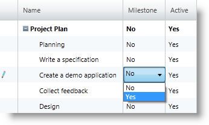

////

|metadata|
{
    "name": "xamgantt-columns-editing",
    "controlName": ["xamGantt"],
    "tags": ["Data Presentation","Editing","Getting Started","How Do I"],
    "guid": "4cf549f2-7cfa-4c71-a041-7f9067c14880",  
    "buildFlags": [],
    "createdOn": "2016-05-25T18:21:55.1931577Z"
}
|metadata|
////

= xamGantt Columns Editing

== Topic Overview

=== Purpose

This topic describes the editing features available in some of the important grid columns in the  _xamGantt™_   control.

=== In this topic

This topic contains the following sections:

* <<_Ref335207203, Columns Editing >>

** <<_Ref335207208,User interactions summary>>
** <<predefStrings,Predefined strings for date fields>>
** <<predefUnits,Predefined unit strings>>
** <<_Ref335145303,Edit task mode (auto/ manual)>>
** <<_Ref335145437,Edit task name>>
** <<_Ref335151013,Edit task duration>>
** <<_Ref335151173,Edit task dates fields>>
** <<_Ref335151872,Edit task dependencies>>
** <<_Ref335151882,Edit task resources>>
** <<_Ref335206465,Edit task constraint type and date>>
** <<_Ref335206498,Edit task progress>>
** <<_Ref335206613,Edit task state (active/inactive)>>
** <<_Ref335206863,Create a milestone>>

* <<_Ref335207263, Related Content >>

[[_Ref335207203]]
== Columns Editing

[[_Ref335207208]]

=== User interactions summary

The following table summarizes some of the user options for editing project tasks fields in the  _xamGantt_   control. Additional details follow later in this topic.

[options="header", cols="a,a,a"]
|====
|The user can…|Using the…|Details

|<<_Ref335145303,Edit task mode (auto/manual)>>
|corresponding combo box in the *Task Mode* column
|To edit the selected cell: 

* Click 

* Double click 

* Start typing 

* Press *Enter*

* Press *F2*

To commit changes, press the *Enter* . 

To cancel changes, press the *Escape* .

|<<_Ref335145437,Edit task name>>
|corresponding text field in the *Name* column
|To edit the selected cell: 

* Click 

* Double click 

* Start typing 

* Press *Enter*

* Press *F2*

To commit changes, press *Enter* . 

To cancel changes, press *Escape* .

|<<_Ref335151013,Edit task duration>>
|corresponding text field in the *Duration* column
|To edit the selected cell: 

* Click 

* Double click 

* Start typing 

* Press *Enter*

* Press *F2*

To commit changes, press *Enter* . 

To cancel changes, press *Escape* . 

You can also use the keyboard arrow keys to edit.

|<<_Ref335151173,Edit task dates fields>>
|Corresponding date time input in the following columns: *Start* , *Finish* , *Actual Start* , *Actual Finish, Deadline* and so on.
|To edit the selected cell: 

* Click 

* Double click 

* Start typing 

* Press *Enter*

* Press *F2*

To commit changes, press *Enter* . 

To cancel changes, press *Escape* . 

Use the date time input to enter dates.

|<<_Ref335151872,Edit task dependencies>>
|corresponding text field in the *Predecessors* or *Successors* column
|To edit the selected cell: 

* Click 

* Double click 

* Start typing 

* Press *Enter*

* Press *F2*

To commit changes, press *Enter* . 

To cancel changes, press *Escape* .

|<<_Ref335151882,Edit task resources>>
|corresponding text field in the *Resource Names* column
|To edit the selected cell: 

* Click 

* Double click 

* Start typing 

* Press *Enter*

* Press *F2*

To commit changes, press *Enter* . 

To cancel changes, press *Escape* .

|<<_Ref335206465,Edit task constraint type and date>>
|corresponding combo box in the *Constraint Type* column and the date-time input in the *Constraint Date* column
|To edit the selected cell: 

* Click 

* Double click 

* Start typing 

* Press *Enter*

* Press *F2*

To commit changes, press *Enter* . 

To cancel changes, press *Escape* .

|<<_Ref335206498,Edit task progress>>
|corresponding numeric input in the *% Complete* column
|To edit the selected cell: 

* Click 

* Double click 

* Start typing 

* Press *Enter*

* Press *F2*

To commit changes, press *Enter* . 

To cancel changes, press *Escape* .

|<<_Ref335206613,Edit task state (active/inactive)>>
|corresponding combo box in the *Active* column
|To edit the selected cell: 

* Click 

* Double click 

* Start typing 

* Press *Enter*

* Press *F2*

To commit changes, press *Enter* . 

To cancel changes, press *Escape* .

|<<_Ref335206863,Create a milestone>>
|corresponding combo box in the *Milestone* column
|To edit the selected cell: 

* Click 

* Double click 

* Start typing 

* Press *Enter*

* Press *F2*

To commit changes, press *Enter* . 

To cancel changes, press *Escape* .

|====

[[predefStrings]]

=== Predefined strings for date fields

There is a set of predefined strings that have special meaning entered in the  _xamGantt_   control’s date-time fields. These predefined strings update to the corresponding date after exiting edit mode.

These predefined strings represent the special strings available in Microsoft Project 2010.

Available predefined strings are listed below:

* “today” – sets the date to the current day
* “tomorrow” – sets the date to the next calendar date
* number from 1 to 31 – sets the day number in the current month
* name of the day of the week – sets the date for the specified day of the week starting from the current date (for example, if today is Sunday, Sept 9 and you type “Sunday”, it is transformed to 9/9 but if today is Monday, Sept 10 and you type “Sunday”, it is transformed to 9/16 (the next Sunday))

[[predefUnits]]

=== Predefined unit strings

A set of predefined unit strings with special meaning is available in the  _xamGantt_   control.

These predefined unit strings represent the unit strings available in Microsoft Project 2010.

Available predefined unit strings are listed below:

[options="header", cols="a,a,a"]
|====
|Format/Unit Type|Normal Unit Strings|Elapsed Unit Strings

|Minutes
|m, min, mins, minute, minutes
|em, emin, eminute, eminutes

|Hours
|h, hr, hrs, hour, hours
|eh, ehr, ehrs, ehour, ehours

|Days
|d, dy, dys, day, days
|ed, edy, edys, eday, edays

|Weeks
|w, wk, wks, week, weeks
|ew, ewk, ewks, eweek, eweeks

|Months
|mo, mon, mons, month, months
|emo, emon, emons, emonth, emonths

|Percent
|%
|e%

|====

.Note
[NOTE]
====

Percent only has meaning when is used for the lag of a task dependency where it represents the % of the predecessor duration.

A 24-hour days and 7-day week, that is to say, they do not consider working or off time, forms the basis for Elapsed duration calculations.

You can use also the question mark  *(?)*  sign after the specified unit to indicate that this is estimated time.
====

[[_Ref335145303]]

=== Edit task mode (auto/manual)

To edit the task mode, use the corresponding combo box in the  *Task Mode*  column and select one of the options: Automatically Scheduled or Manually Scheduled.

[[_Ref335145437]]

=== Edit task name

To edit the task name, use the corresponding field in the  *Name*  column.

[[_Ref335151013]]

=== Edit task duration

To edit the task duration, use the corresponding field in the  *Duration*  column.

You can type directly, use the numeric editor's Up and Down arrows or keyboard Up and Down buttons to change the value in the field.

For manually scheduled tasks, you can enter also free formed text.

See the <<predefUnits,Predefined unit strings>> for more information about acceptable input.

[[_Ref335151173]]

=== Edit task dates fields

To edit the task dates fields, open the corresponding date-time input to enter a date.

See the link:xamgantt-columns-editing.html#predefStrings[Predefined strings for date fields] for more information about the valid date time input.

[[_Ref335151872]]

=== Edit task dependencies

To edit the tasks dependencies, use the corresponding field in the Predecessors or Successors column.

You create dependencies by entering:

* successors/predecessors ID (the default link type is Finish To Start and there is no need to be specified)
* successors/predecessors ID and specific link type
* successors/predecessors ID-s, specific link type and lead/lag time

You can add multiple dependencies separated by the current culture separator (for example, “,” for en-US).

Available link types are:

[options="header", cols="a,a,a"]
|====
|Link type notation in editor|Link type|Description

|FS
|Finish To Start
|This is the default link type if one is not specified. 

The successor's Start Date is dependent upon the predecessor's Finish date.

|FF
|Finish To Finish
|The successor's Finish date is dependent upon the predecessor's Finish date.

|SF
|Start To Finish
|The successor's Finish date is dependent upon the predecessor's Start date.

|SS
|Start To Start
|The successor's Start date is dependent upon the predecessor's Start date.

|====

You can specify lead-time that is a negative value and indicates the amount of overlap between the tasks.

You can specify lag time that is a positive value and indicates a delay between the tasks.

The lead and lag time can be defined as a duration or as a percentage of the predecessor task duration. *Example:* 

If you enter for the task with ID 4 “3FS-2 days” in the  *Predecessors*  column, this means that the task with ID 4 has a predecessor with ID 3. The start date of the task with ID 4 depends on the finish date of the predecessor with ID 3. There is a 2 days lead-time meaning that the task with ID 4 must start 2 days before the finish of the task with ID 3.

.Note
[NOTE]
====

The task ID used in the tasks dependencies automatically calculates, based on the index of the task in, the flattened collection of tasks. This collection starts with id 0 for the project summary task and id 1 for the first root level task.

The tasks Id-s update automatically as you add and delete tasks. This does not result in any changes to the actual dependencies. Their textual representation in the predecessors/successors cells in the grid also updates.
====

[[_Ref335151882]]

=== Edit task resources

To edit the task resources, use the corresponding field in the  *Resource Names*  column.

The list separator separates resources when entering multiple resources.

Depending on the  _xamGantt_   control configuration, you can add new resources to the project when entering the resource name in the field.

If this operation is unavailable, an error tooltip appears.

[[_Ref335151890]]

=== Edit task constraint type and date

To edit the task constraint type, use the corresponding field in the  *Constraint Type*  column and select one of the listed constraint types from the combo box.

The  _xamGantt_   control exposes the same constraint types available in Microsoft Project 2010.

.Note
[NOTE]
====
If the task you are editing is a manually scheduled task, then this disables the constraint type editing. Only automatically scheduled tasks constraint type is editable.
====

For the summary tasks, the combo box list provides only the valid options for constraint types.

The valid constraints for summary tasks are:

* Start No Earlier Than
* Finish No Later Than
* As soon as possible or as late as possible (depending on the project’s scheduling –if it is from start date or from finish date).

To edit the task constraint date, use the corresponding field in the  *Constraint Date*  column and select a date from the date-time input.

See the <<predefStrings,Predefined strings for date fields>> for more information about the valid date time input.

[[_Ref335206498]]

=== Edit task progress

To edit the task progress, use the corresponding field in the  *% Complete*  column. Directly Enter percent, use the numeric input’s arrow keys or Up and Down keyboard buttons.

[[_Ref335206613]]

=== Edit task state (active/inactive)

To edit the task state (active/inactive), use the corresponding combo box in the  *Active*  column and select one of the options: Yes or No.

[[_Ref335206863]]

=== Create a milestone

To edit if a task is a milestone, use the corresponding combo box in the  *Milestone*  column and select one of the available options: Yes or No.

[[_Ref335207263]]
== Related Content

=== Topics

The following topics provide additional information related to this topic.

[options="header", cols="a,a"]
|====
|Topic|Purpose

| link:xamgantt-xamgantt-user-interactions-in-the-grid-section.html[xamGantt User Interactions in the Grid Section]
|This topic describes the user interactions available in the _xamGantt_ control’s grid section.

| link:xamgantt-xamgantt-user-interactions-in-the-chart-section.html[xamGantt User Interactions in the Chart Section]
|This topic describes the user interactions available in the _xamGantt_ control’s chart section.

| link:xamgantt-keyboard-support.html[Keyboard Support]
|This topic describes the _xamGantt_ control’s built-in keyboard support and lists the user actions that have a keyboard shortcut associated with them.

|====