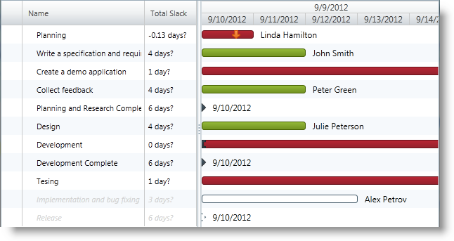

////

|metadata|
{
    "name": "xamgantt-configuring-critical-slack-limit",
    "controlName": ["xamGantt"],
    "tags": ["Data Presentation","How Do I","Scheduling"],
    "guid": "f7643b8f-3cad-4fa1-aa6c-e8f20b223938",  
    "buildFlags": [],
    "createdOn": "2016-05-25T18:21:55.3391661Z"
}
|metadata|
////

= Configuring Critical Slack Limit

== Topic Overview

=== Purpose

This topic explains how to configure the critical slack limit for a project task using the  _xamGantt™_   control.

=== Required background

The following topics are prerequisites to understanding this topic:

[options="header", cols="a,a"]
|====
|Topic|Purpose

| link:xamgantt-binding-arbitrary-tasks-collection-listbackedproject.html[Binding to Arbitrary Tasks Collection Using ListBackedProject]
|This topic describes how the _xamGantt_ control is bound to an arbitrary tasks collection via ListBackedProject.

|====

=== In this topic

This topic contains the following sections:

* <<_Ref334907374, Configuring Critical Slack Limit >>
* <<_Ref334907386, Related Content >>

** <<_Ref334907390,Topics>>
** <<_Ref334907396,Samples>>

[[_Ref334907374]]
== Configuring Critical Slack Limit

=== Overview

The  _xamGantt_   control’s scheduling engine calculates the critical state for a link:{ApiPlatform}controls.schedules.xamgantt.v{ProductVersion}~infragistics.controls.schedules.projecttask_members.html[ProjectTask] based on whether the task is considered to be the critical path for the project.

Project tasks with zero days of slack are considered critical; however, you can specify a custom configuration of the slack limit.

The link:{ApiPlatform}controls.schedules.xamgantt.v{ProductVersion}~infragistics.controls.schedules.projectsettings_members.html[ProjectSettings] link:{ApiPlatform}controls.schedules.xamgantt.v{ProductVersion}~infragistics.controls.schedules.projectsettings~criticalslacklimit.html[CriticalSlackLimit] property determines the amount of slack a task requires to be critical, and stores the task’s critical state in the `ProjectTask` link:{ApiPlatform}controls.schedules.xamgantt.v{ProductVersion}~infragistics.controls.schedules.projecttask~iscritical.html[IsCritical] read-only property.

In order to highlight the project critical tasks using the  _xamGantt_   control user interface, use the link:{ApiPlatform}controls.schedules.xamgantt.v{ProductVersion}~infragistics.controls.schedules.projectviewsettings_members.html[ProjectViewSettings] link:{ApiPlatform}controls.schedules.xamgantt.v{ProductVersion}~infragistics.controls.schedules.projectviewsettings~arecriticaltaskshighlighted.html[AreCriticalTasksHighlighted] property.

=== Property settings

The following table maps the desired configuration to property settings.

[options="header", cols="a,a,a"]
|====
|In order to:|Use this property:|And set it to:

|Specify task’s critical slack limit
| link:{ApiPlatform}controls.schedules.xamgantt.v{ProductVersion}~infragistics.controls.schedules.projectsettings~criticalslacklimit.html[CriticalSlackLimit]
|`int`

|Highlight the project’s critical tasks
| link:{ApiPlatform}controls.schedules.xamgantt.v{ProductVersion}~infragistics.controls.schedules.projectviewsettings~arecriticaltaskshighlighted.html[AreCriticalTasksHighlighted]
|`bool`

|====

=== Example

The screen shot below illustrates how critical tasks are determined and highlighted according to the critical slack limit; achieved using the following settings:

[options="header", cols="a,a"]
|====
|Property|Value

|`CriticalSlackLimit`
|2

|`AreCriticalTasksHighlighted`
|`True`

|====

*In XAML:*

[source,xaml]
----
<ig:ListBackedProject x:Name="dataProvider" 
                      TaskItemsSource="{Binding Tasks}">
    <!-- Add ProjectTask Property Mappings Here -->
    <!-- Specify Project Settings Here -->
    <ig:ListBackedProject.Settings>
        <ig:ProjectSettings CriticalSlackLimit="2" />
    </ig:ListBackedProject.Settings>
</ig:ListBackedProject>
<ig:XamGantt x:Name="gantt" 
             Project="{Binding ElementName=dataProvider}">
    <ig:XamGantt.ViewSettings>
        <!-- Highlight the critical tasks -->
        <ig:ProjectViewSettings AreCriticalTasksHighlighted="True" />
    </ig:XamGantt.ViewSettings>
</ig:XamGantt>
----

[[_Ref334907386]]
== Related Content

[[_Ref334907390]]

=== Topics

The following topics provide additional information related to this topic.

[options="header", cols="a,a"]
|====
|Topic|Purpose

| link:xamgantt-project-settings-configuration-overview.html[Project Settings Configuration Overview]
|This topic gives an overview of the _xamGantt_ ProjectSettings class and its configurable aspects.

|====

[[_Ref334907396]]

=== Samples

The following samples provide additional information related to this topic.

[options="header", cols="a,a"]
|====
|Sample|Purpose

| pick:[sl=" link:{SamplesURL}/gantt/#/critical-tasks[Critical Tasks]"] pick:[wpf=" link:{SamplesURL}/gantt/critical-tasks[Critical Tasks]"] 
|This sample demonstrates the highlighting of the critical tasks that define the start and the finish date of the project and configuring of the critical slack limit.

|====