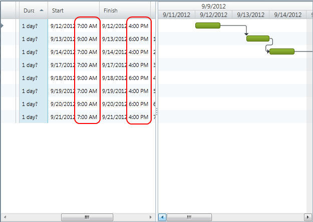

////

|metadata|
{
    "name": "xamgantt-configuring-custom-calendars-for-xamgantt",
    "controlName": ["xamGantt"],
    "tags": ["Data Binding","Data Presentation","Extending","Grids","Scheduling"],
    "guid": "5ca8fb2c-9d88-480a-bbaa-5b1c5769fb08",  
    "buildFlags": [],
    "createdOn": "2016-05-25T18:21:55.4801759Z"
}
|metadata|
////

= Configuring Custom Calendars for xamGantt

== Topic Overview

=== Purpose

This topics describes how you can create your custom calendar class and use it with  _xamGantt_   _._

=== Required background

The following topics are prerequisites to understanding this topic:

[options="header", cols="a,a"]
|====
|Topic|Purpose

| link:xamgantt-adding-xamgantt-to-a-page.html[Adding _xamGantt_ to a Page]
|This topic describes how you can add the _xamGantt_ control to a page.

|====

=== In this topic

This topic contains the following sections:

* <<_Custom_Calendar_Introduction, Custom Calendars Introduction >>

** <<_Introduction,Introduction>>

** <<_Calendar_Property_Mapping,Calendar Property Mapping>>

** <<_Start,Start>>

* <<_Code_Example_Creating_a_Custom_Calendar, Code Example: Creating a Custom Calendar >>

** <<_Ref335220180,Description>>

** <<_Ref334102005,Prerequisites>>

** <<_Ref334102013,Preview>>

** <<_Ref334464995,Code>>

* <<_Related_Content, Related Content >>

** <<_Ref333763550,Topics>>

** <<_Ref333763850,Samples>>

[[_Custom_Calendar_Introduction]]
== Custom Calendars Introduction

[[_Introduction]]

=== Introduction

You can use your custom calendar class with xamGantt link:{ApiPlatform}controls.schedules.xamgantt{ApiVersion}~infragistics.controls.schedules.listbackedproject_members.html[ListBackedProject]. `ListBackedProject` is a project that obtains the task information from a specified link:{ApiPlatform}controls.schedules.xamgantt{ApiVersion}~infragistics.controls.schedules.listbackedproject~taskitemssource.html[TaskItemsSource]. In order to use custom calendars, you set the link:{ApiPlatform}controls.schedules.xamgantt{ApiVersion}~infragistics.controls.schedules.listbackedproject~calendaritemssource.html[CalendarItemsSource] and link:{ApiPlatform}controls.schedules.xamgantt{ApiVersion}~infragistics.controls.schedules.project~calendarid.html[CalendarId] properties of `ListBackedProject`.

The table below summarizes the main properties of ListBackedProject when used with custom calendars:

[options="header", cols="a,a"]
|====
|Property|Description

| link:{ApiPlatform}controls.schedules.xamgantt{ApiVersion}~infragistics.controls.schedules.listbackedproject~calendarpropertymappings.html[CalendarPropertyMappings]
|This property gets or sets a collection used to provide the mappings from the properties in the items of the `CalendarItemsSource` to properties on the link:{ApiPlatform}controls.schedules.xamgantt{ApiVersion}~infragistics.controls.schedules.projectcalendar_members.html[ProjectCalendar].

|`CalendarItemsSource`
|This property gets or sets the collection that provides the calendar information.

|`CalendarId`
|This property gets or sets the string for the unique id of the calendar. If you have multiple calendars in CalendarItemsSource collection, you can use this property to specify which of them is the calendar in use.

| link:{ApiPlatform}controls.schedules.xamgantt{ApiVersion}~infragistics.controls.schedules.project~start.html[Start]
|This property gets or sets the UTC start date for the project. If it is not set, project will use its defaults, which are today’s date at 8:00 AM. 

The Start will be set by project scheduling engine if the link:{ApiPlatform}controls.schedules.xamgantt{ApiVersion}~infragistics.controls.schedules.project~isscheduledfromstart.html[IsScheduledFromStart] is set to false.

| link:{ApiPlatform}controls.schedules.xamgantt{ApiVersion}~infragistics.controls.schedules.project~finish.html[Finish]
|This property gets or sets the UTC finish date for the project. 

When the IsScheduledFromStart is true, which is the default value, the Finish will be set to the calculated finish for the project.

|====

[[_Calendar_Property_Mapping]]

=== Calendar Property Mapping

Usage of `CalendarPropertyMapping` consist of setting a link:{ApiPlatform}controls.schedules.xamgantt{ApiVersion}~infragistics.controls.schedules.projectcalendarpropertymapping_members.html[ProjectCalendarPropertyMapping] objects. `ProjectCalendarPropertyMapping` contains information regarding specific field in the data source, specified by CalendarItemsSource and which property of the `ProjectCalendar` objects it maps to.

The property of the `ProjectCalendar` object is identified by the link:{ApiPlatform}controls.schedules.xamgantt{ApiVersion}~infragistics.controls.schedules.projectcalendarpropertymapping~calendarproperty.html[CalendarProperty], and the field in the data source is identified by the link:{ApiPlatform}controls.schedules.xamgantt{ApiVersion}~infragistics.controls.schedules.projectcalendarpropertymapping~dataobjectproperty.html[DataObjectProperty].

[options="header", cols="a,a"]
|====
|Calendar property values|Description

| _BaseCalendarId_ 
|This indicates that field set in Data Object Property will be mapped to link:{ApiPlatform}controls.schedules.xamgantt{ApiVersion}~infragistics.controls.schedules.projectcalendar~basecalendarid.html[BaseCalendarId] property of the `ProjectCalendar`.

| _DaysOfWeek_ 
|This indicates that field set in Data Object Property will be mapped to link:{ApiPlatform}controls.schedules.xamgantt{ApiVersion}~infragistics.controls.schedules.projectcalendar~daysofweek.html[DaysOfWeek] property of the `ProjectCalendar`.

| _DisplayName_ 
|This indicates that field set in Data Object Property will be mapped to link:{ApiPlatform}controls.schedules.xamgantt{ApiVersion}~infragistics.controls.schedules.projectcalendar~displayname.html[DisplayName] property of the `ProjectCalendar`.

| _Exceptions_ 
|This indicates that field set in Data Object Property will be mapped to link:{ApiPlatform}controls.schedules.xamgantt{ApiVersion}~infragistics.controls.schedules.projectcalendar~exceptions.html[Exceptions] property of the `ProjectCalendar`.

| _IsBaseCalendar_ 
|This indicates that field set in Data Object Property will be mapped to link:{ApiPlatform}controls.schedules.xamgantt{ApiVersion}~infragistics.controls.schedules.projectcalendar~isbasecalendar.html[IsBaseCalendar] property of the `ProjectCalendar`.

| _UniqueId_ 
|This indicates that field set in Data Object Property will be mapped to link:{ApiPlatform}controls.schedules.xamgantt{ApiVersion}~infragistics.controls.schedules.projectcalendar~uniqueid.html[UniqueId] property of the `ProjectCalendar`.

| _WorkWeeks_ 
|This indicates that field set in Data Object Property will be mapped to link:{ApiPlatform}controls.schedules.xamgantt{ApiVersion}~infragistics.controls.schedules.projectcalendar~workweeks.html[WorkWeeks] property of the `ProjectCalendar`.

|====

[[_Start]]

=== Start

Usage of custom calendars is affected by start date of the project. If you do not set the start time, the default one, today’s date at 8:00 AM is used. For example, if you create a custom calendar and its working time start earlier than 8:00 AM, let’s say 7:00 AM and you use auto-scheduled tasks, the first task will start not from 7:00 AM, but from 8:00 AM.

[[_Code_Example_Creating_a_Custom_Calendar]]
== Code Example: Creating a Custom Calendar

[[_Ref335220180]]

=== Description

This code example creates two instances of custom calendar class and set them as CalendarItemSource of a ListBackedProject. By setting the CalendarId property the second calendar is made the current project calendar.

In code example is included collection of tasks in order to show how they account the calendar in use.

[[_Ref334102005]]

=== Prerequisites

To complete the code example, you should have a xamGantt project. You can follow the instructions in link:xamgantt-adding-xamgantt-to-a-page.html[Adding  _xamGantt_  to a Page] in order to create sample xamGantt project.

Then you need to change the project a little bit. The following classes should be present:

* `CustomCalendar`. To see the complete code for this class, please refer to the link:resources-xamgantt-custom-calendar-code-example.html[CustomCalendar CodeExample].

* `CustomTask`. To see the complete code for this class, please refer to the link:resources-xamgantt-custom-task-code-example.html[CustomTask CodeExample].

* And then you have to replace the mark-up and theViewModel with those ones shown in this topic.

[[_Ref334102013]]

=== Preview

This is a preview of completed sample project. For Monday, Wednesday and Friday the working time is from 7:00 AM to 4:00 PM with one hour break between 11:00 AM and 12:00 AM, and for Tuesday and Thursday the working time is from 9:00 AM to 6:00 AM, with an one hour break between 1:00 PM and 2:00 PM.

[[_Ref334464995]]

=== Code

*In XAML:*

[source,xaml]
----
<Grid>
        <Grid.Resources>
            <local:CustomCalendarViewModel x:Key="dc" />
        </Grid.Resources>
        <Grid.DataContext>
            <Binding Source="{StaticResource dc}" />
        </Grid.DataContext>
        <ig:XamGantt x:Name="xamGantt">
            <ig:XamGantt.Project>
                <ig:ListBackedProject TaskItemsSource="{Binding Tasks}" CalendarItemsSource="{Binding Calendars}" 
                                      CalendarId="C2" Start="{Binding Today}">
                    <ig:ListBackedProject.TaskPropertyMappings>
                        <ig:ProjectTaskPropertyMapping TaskProperty="DataItemId" DataObjectProperty="DataItemId" />
                        <ig:ProjectTaskPropertyMapping TaskProperty="TaskName" DataObjectProperty="TaskName" />
                        <ig:ProjectTaskPropertyMapping TaskProperty="Start" DataObjectProperty="Start" />
                        <ig:ProjectTaskPropertyMapping TaskProperty="Duration" DataObjectProperty="Duration" />
                        <ig:ProjectTaskPropertyMapping TaskProperty="Tasks" DataObjectProperty="Tasks" />
                        <ig:ProjectTaskPropertyMapping TaskProperty="Predecessors" DataObjectProperty="Predecessors" />
                        <ig:ProjectTaskPropertyMapping TaskProperty="ConstraintDate" DataObjectProperty="ConstraintDate" />
                        <ig:ProjectTaskPropertyMapping TaskProperty="ConstraintType" DataObjectProperty="ConstraintType" />
                        <ig:ProjectTaskPropertyMapping TaskProperty="DurationFormat" DataObjectProperty="DurationFormat" />
                    </ig:ListBackedProject.TaskPropertyMappings>
                    <ig:ListBackedProject.CalendarPropertyMappings>
                        <ig:ProjectCalendarPropertyMapping CalendarProperty="UniqueId" DataObjectProperty="Id" />
                        <ig:ProjectCalendarPropertyMapping CalendarProperty="DaysOfWeek" DataObjectProperty="DaysOfWeek" />
                        <ig:ProjectCalendarPropertyMapping CalendarProperty="DisplayName" DataObjectProperty="DisplayName" />
                    </ig:ListBackedProject.CalendarPropertyMappings>
                </ig:ListBackedProject>
            </ig:XamGantt.Project>
        </ig:XamGantt>
    </Grid>
----

*In C#:*

[source,csharp]
----
 public class CustomCalendarViewModel : INotifyPropertyChanged
    {
        private ObservableCollection<CustomCalendar> calendars;
        private ObservableCollection<CustomTask> tasks;
        public ObservableCollection<CustomCalendar> Calendars
        {
            get
            {
                if (calendars == null)
                {
                    calendars = GenerateCustomCalendars();
                }
                return calendars;
            }
            set { calendars = value; }
        }
        public ObservableCollection<CustomTask> Tasks
        {
            get
            {
                if (tasks == null)
                {
                    tasks = GenerateCustomTasks();
                }
                return tasks;
            }
            set { tasks = value; }
        }
        public DateTime Today
        {
            get { return DateTime.Today; }
        }
        private ObservableCollection<CustomTask> GenerateCustomTasks()
        {
            return new ObservableCollection<CustomTask>()
                  {
                        new CustomTask { DataItemId = "t1", TaskName = "Task 1", Duration = TimeSpan.FromHours(8), DurationFormat = "Days" },
                new CustomTask { DataItemId = "t2", TaskName = "Task 2", Duration = TimeSpan.FromHours(24), Predecessors = "t1", DurationFormat = "ElapsedDays" },
                        new CustomTask { DataItemId = "t3", TaskName = "Task 3", Duration = TimeSpan.FromHours(8), Predecessors = "t2", DurationFormat = "Days" },
                        new CustomTask { DataItemId = "t4", TaskName = "Task 4", Duration = TimeSpan.FromHours(48), Predecessors = "t3", DurationFormat = "ElapsedDays" },
                        new CustomTask { DataItemId = "t5", TaskName = "Task 5", Duration = TimeSpan.FromDays(1), Predecessors = "t4", DurationFormat = "Days" },
                new CustomTask { DataItemId = "t6", TaskName = "Task 6", Duration = TimeSpan.FromDays(1), Predecessors = "t5", DurationFormat = "ElapsedDays" },
                new CustomTask { DataItemId = "t7", TaskName = "Task 7", Duration = TimeSpan.FromHours(8), Predecessors = "t6", DurationFormat = "Days" },
                new CustomTask { DataItemId = "t8", TaskName = "Task 8", Duration = TimeSpan.FromHours(8), Predecessors = "t7", DurationFormat = "ElapsedDays" }
                  };
        }
        #region Private helper methods
        private ObservableCollection<CustomCalendar> GenerateCustomCalendars()
        {
            return new ObservableCollection<CustomCalendar>()
            {
                new CustomCalendar
                {
                    Id = "C1",
                    Name = "Calendar 1",
                    DaysOfWeek=@"
                                    <ScheduleDaysOfWeek>
                                          <Monday>
                                          <ScheduleDayOfWeek>
                                                <DaySettings>
                                                      <DaySettings IsWorkday=""false"" />
                                                </DaySettings>
                                          </ScheduleDayOfWeek>
                                          </Monday>
                                          <Saturday>
                                          <ScheduleDayOfWeek>
                                                <DaySettings>
                                                      <DaySettings IsWorkday=""true"">
                                                            <WorkingHours>
                                                                  <WorkingHoursCollection>
                                                                        <TimeRange Start=""PT8H"" End=""PT12H"" />
                                                                        <TimeRange Start=""PT13H"" End=""PT17H"" />
                                                                  </WorkingHoursCollection>
                                                            </WorkingHours>
                                                      </DaySettings>
                                                </DaySettings>
                                          </ScheduleDayOfWeek>
                                          </Saturday>
                                    </ScheduleDaysOfWeek>",
                    CustomDescription = "This custom calendar has a Monday as a nonworking day and Saturday as a working day"
                },
                new CustomCalendar
                {
                    Id = "C2",
                    Name = "Calendar 2",
                    DaysOfWeek = @"
                                    <ScheduleDaysOfWeek>
                                          <Monday>
                                          <ScheduleDayOfWeek>
                                                <DaySettings>
                                                      <DaySettings IsWorkday=""true"">
                                                            <WorkingHours>
                                                                  <WorkingHoursCollection>
                                                                        <TimeRange Start=""PT7H"" End=""PT11H"" />
                                                                        <TimeRange Start=""PT12H"" End=""PT16H"" />
                                                                  </WorkingHoursCollection>
                                                            </WorkingHours>
                                                      </DaySettings>
                                                </DaySettings>
                                          </ScheduleDayOfWeek>
                                          </Monday>
                                          <Tuesday>
                                          <ScheduleDayOfWeek>
                                                <DaySettings>
                                                      <DaySettings IsWorkday=""true"">
                                                            <WorkingHours>
                                                                  <WorkingHoursCollection>
                                                                        <TimeRange Start=""PT9H"" End=""PT13H"" />
                                                                        <TimeRange Start=""PT14H"" End=""PT18H"" />
                                                                  </WorkingHoursCollection>
                                                            </WorkingHours>
                                                      </DaySettings>
                                                </DaySettings>
                                          </ScheduleDayOfWeek>
                                          </Tuesday>
                                          <Wednesday>
                                          <ScheduleDayOfWeek>
                                                <DaySettings>
                                                      <DaySettings IsWorkday=""true"">
                                                            <WorkingHours>
                                                                  <WorkingHoursCollection>
                                                                        <TimeRange Start=""PT7H"" End=""PT11H"" />
                                                                        <TimeRange Start=""PT12H"" End=""PT16H"" />
                                                                  </WorkingHoursCollection>
                                                            </WorkingHours>
                                                      </DaySettings>
                                                </DaySettings>
                                          </ScheduleDayOfWeek>
                                          </Wednesday>
                                          <Thursday>
                                          <ScheduleDayOfWeek>
                                                <DaySettings>
                                                      <DaySettings IsWorkday=""true"">
                                                            <WorkingHours>
                                                                  <WorkingHoursCollection>
                                                                        <TimeRange Start=""PT9H"" End=""PT13H"" />
                                                                        <TimeRange Start=""PT14H"" End=""PT18H"" />
                                                                  </WorkingHoursCollection>
                                                            </WorkingHours>
                                                      </DaySettings>
                                                </DaySettings>
                                          </ScheduleDayOfWeek>
                                          </Thursday>
                                          <Friday>
                                          <ScheduleDayOfWeek>
                                                <DaySettings>
                                                      <DaySettings IsWorkday=""true"">
                                                            <WorkingHours>
                                                                  <WorkingHoursCollection>
                                                                        <TimeRange Start=""PT7H"" End=""PT11H"" />
                                                                        <TimeRange Start=""PT12H"" End=""PT16H"" />
                                                                  </WorkingHoursCollection>
                                                            </WorkingHours>
                                                      </DaySettings>
                                                </DaySettings>
                                          </ScheduleDayOfWeek>
                                          </Friday>
                                    </ScheduleDaysOfWeek>",
                CustomDescription = "This custom calendar sets the following working times: From 9:00to 13:00 and from 14:00 to 18:00"
                }
            };
        }
        #endregion // Private helper methods
        #region INotifyPropertyChanged
        public event PropertyChangedEventHandler PropertyChanged;
        public void OnPropertyChanged(string propertyName)
        {
            if (PropertyChanged != null)
            {
                PropertyChanged(this, new PropertyChangedEventArgs(propertyName));
            }
        }
        #endregion // INotifyPropertyChanged
    }
----

*In Visual Basic:*

[source,vb]
----
Public Class CustomCalendarViewModel
      Implements INotifyPropertyChanged
      Private m_calendars As ObservableCollection(Of CustomCalendar)
      Private m_tasks As ObservableCollection(Of CustomTask)
      Public Property Calendars() As ObservableCollection(Of CustomCalendar)
            Get
                  If m_calendars Is Nothing Then
                        m_calendars = GenerateCustomCalendars()
                  End If
                  Return m_calendars
            End Get
            Set
                  m_calendars = value
            End Set
      End Property
      Public Property Tasks() As ObservableCollection(Of CustomTask)
            Get
                  If m_tasks Is Nothing Then
                        m_tasks = GenerateCustomTasks()
                  End If
                  Return m_tasks
            End Get
            Set
                  m_tasks = value
            End Set
      End Property
      Public ReadOnly Property Today() As DateTime
            Get
                  Return DateTime.Today
            End Get
      End Property
      Private Function GenerateCustomTasks() As ObservableCollection(Of CustomTask)
            Return New ObservableCollection(Of CustomTask)() With { _
                  New CustomTask() With { _
                        .DataItemId = "t1", _
                        .TaskName = "Task 1", _
                        .Duration = TimeSpan.FromHours(8), _
                        .DurationFormat = "Days" _
                  }, _
                  New CustomTask() With { _
                        .DataItemId = "t2", _
                        .TaskName = "Task 2", _
                        .Duration = TimeSpan.FromHours(24), _
                        .Predecessors = "t1", _
                        .DurationFormat = "ElapsedDays" _
                  }, _
                  New CustomTask() With { _
                        .DataItemId = "t3", _
                        .TaskName = "Task 3", _
                        .Duration = TimeSpan.FromHours(8), _
                        .Predecessors = "t2", _
                        .DurationFormat = "Days" _
                  }, _
                  New CustomTask() With { _
                        .DataItemId = "t4", _
                        .TaskName = "Task 4", _
                        .Duration = TimeSpan.FromHours(48), _
                        .Predecessors = "t3", _
                        .DurationFormat = "ElapsedDays" _
                  }, _
                  New CustomTask() With { _
                        .DataItemId = "t5", _
                        .TaskName = "Task 5", _
                        .Duration = TimeSpan.FromDays(1), _
                        .Predecessors = "t4", _
                        .DurationFormat = "Days" _
                  }, _
                  New CustomTask() With { _
                        .DataItemId = "t6", _
                        .TaskName = "Task 6", _
                        .Duration = TimeSpan.FromDays(1), _
                        .Predecessors = "t5", _
                        .DurationFormat = "ElapsedDays" _
                  }, _
                  New CustomTask() With { _
                        .DataItemId = "t7", _
                        .TaskName = "Task 7", _
                        .Duration = TimeSpan.FromHours(8), _
                        .Predecessors = "t6", _
                        .DurationFormat = "Days" _
                  }, _
                  New CustomTask() With { _
                        .DataItemId = "t8", _
                        .TaskName = "Task 8", _
                        .Duration = TimeSpan.FromHours(8), _
                        .Predecessors = "t7", _
                        .DurationFormat = "ElapsedDays" _
                  } _
            }
      End Function
      #Region "Private helper methods"
      Private Function GenerateCustomCalendars() As ObservableCollection(Of CustomCalendar)
            Return New ObservableCollection(Of CustomCalendar)() With { _
                  New CustomCalendar() With { _
                        .Id = "C1", _
                        .Name = "Calendar 1", _
                        .DaysOfWeek = "<ScheduleDaysOfWeek><Monday><ScheduleDayOfWeek><DaySettings><DaySettings IsWorkday=""" /></DaySettings></ScheduleDayOfWeek></Monday><Saturday><ScheduleDayOfWeek><DaySettings><DaySettings IsWorkday=""true""><WorkingHours><WorkingHoursCollection><TimeRange Start=""PT8H"" End=""PT12H"" /><TimeRange Start=""PT13H"" End=""PT17H"" /></WorkingHoursCollection></WorkingHours></DaySettings></DaySettings></ScheduleDayOfWeek></Saturday></ScheduleDaysOfWeek>", _
                        .CustomDescription = "This custom calendar has a Monday as a nonworking day and Saturday as a working day" _
                  }, _
                  New CustomCalendar() With { _
                        .Id = "C2", _
                        .Name = "Calendar 2", _
                        .DaysOfWeek = "<ScheduleDaysOfWeek><Monday><ScheduleDayOfWeek><DaySettings><DaySettings IsWorkday=""true""><WorkingHours><WorkingHoursCollection><TimeRange Start=""PT7H"" End=""PT11H"" /><TimeRange Start=""PT12H"" End=""PT16H"" /></WorkingHoursCollection></WorkingHours></DaySettings></DaySettings></ScheduleDayOfWeek></Monday><Tuesday><ScheduleDayOfWeek><DaySettings><DaySettings IsWorkday=""true""><WorkingHours><WorkingHoursCollection><TimeRange Start=""PT9H"" End=""PT13H"" /><TimeRange Start=""PT14H"" End=""PT18H"" /></WorkingHoursCollection></WorkingHours></DaySettings></DaySettings></ScheduleDayOfWeek></Tuesday><Wednesday><ScheduleDayOfWeek><DaySettings><DaySettings IsWorkday=""true""><WorkingHours><WorkingHoursCollection><TimeRange Start=""PT7H"" End=""PT11H"" /><TimeRange Start=""PT12H"" End=""PT16H"" /></WorkingHoursCollection></WorkingHours></DaySettings></DaySettings></ScheduleDayOfWeek></Wednesday><Thursday><ScheduleDayOfWeek><DaySettings><DaySettings IsWorkday=""true""><WorkingHours><WorkingHoursCollection><TimeRange Start=""PT9H"" End=""PT13H"" /><TimeRange Start=""PT14H"" End=""PT18H"" /></WorkingHoursCollection></WorkingHours></DaySettings></DaySettings></ScheduleDayOfWeek></Thursday><Friday><ScheduleDayOfWeek><DaySettings><DaySettings IsWorkday=""true""><WorkingHours><WorkingHoursCollection><TimeRange Start=""PT7H"" End=""PT11H"" /><TimeRange Start=""PT12H"" End=""PT16H"" /></WorkingHoursCollection></WorkingHours></DaySettings></DaySettings></ScheduleDayOfWeek></Friday></ScheduleDaysOfWeek>", _
                        .CustomDescription = "This custom calendar sets the following working times: From 9:00to 13:00 and from 14:00 to 18:00" _
                  } _
            }
      End Function
      #End Region
      #Region "INotifyPropertyChanged"
      Public Event PropertyChanged As PropertyChangedEventHandler
      Public Sub OnPropertyChanged(propertyName As String)
            RaiseEvent PropertyChanged(Me, New PropertyChangedEventArgs(propertyName))
      End Sub
      #End Region
End Class
----

[[_Related_Content]]
== Related Content

[[_Ref333763550]]

=== Topics

The following topics provide additional information related to this topic:

[options="header", cols="a,a"]
|====
|Topic|Purpose

| link:xamgantt-configuring-the-xamgantt-calendars.html[Configuring the xamGantt Calendars]
|The topics in this group contain information about _xamGantt_ Calendars.

| link:xamgantt-calendars-configuration-overview.html[ _xamGantt_ Calendars Configuration Overview]
|This topic gives an overview of the main features of _xamGantt_ Calendars. xamGantt makes time calculations using calendars.

|====

[[_Ref333763850]]

=== Samples

The following samples provide additional information related to this topic:

[options="header", cols="a,a"]
|====
|Sample|Purpose

| pick:[sl=" link:{SamplesURL}/gantt/#/custom-calendars[Custom Calendars]"] pick:[wpf=" link:{SamplesURL}/gantt/custom-calendars[Custom Calendars]"] 
|This sample demonstrates how you can create your custom calendar class and use it with xamGantt.

|====