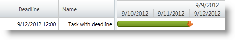

////

|metadata|
{
    "name": "xamgantt-configuring-deadlines",
    "controlName": ["xamGantt"],
    "tags": ["Data Presentation","How Do I","Scheduling"],
    "guid": "9ed6bd35-c0de-4ae0-bd73-e7644cdc0eaa",  
    "buildFlags": [],
    "createdOn": "2016-05-25T18:21:55.3801704Z"
}
|metadata|
////

= Configuring Deadlines

== Topic Overview

=== Purpose

This topic explains how to configure task deadlines using the  _xamGantt™_   control.

=== Required background

The following topics are prerequisites to understanding this topic:

[options="header", cols="a,a"]
|====
|Topic|Purpose

| link:xamgantt-binding-to-data-using-project.html[Binding to Data Using Project]
|This topic describes how the _xamGantt_ control can be bound to data via Project property.

|====

=== In this topic

This topic contains the following sections:

* <<_Ref335060784, Configuring Task Deadline >>
* <<_Ref335060788, Related Content >>

** <<_Ref335060792,Topics>>
** <<_Ref335060796,Samples>>

[[_Ref335060784]]
== Configuring Task Deadline

=== Overview

You can assign a deadline date to any project task. The deadline date specifies when a task should be finished.

The deadline is a low priority late finish constraint. It affects the tasks with  *AsLateAsPossible*  constraint type so their latest finish date is the deadline date.

.Note
[NOTE]
====
It can affect the calculation of the task’s total slack.
====

The deadline is indicated both in the grid and chart  _xamGantt_   sections.

* In the grid section, the deadline date appears in the  *Deadline*  column. If the task passes its deadline date, a notification appears in the Indicators column.
* In the chart section, the deadline appears as an arrow on the taskbar

=== Property settings

The following table maps the desired configuration to property settings.

[options="header", cols="a,a,a"]
|====
|In order to:|Use this property:|And set it to:

|Set a task deadline
| link:{ApiPlatform}controls.schedules.xamgantt{ApiVersion}~infragistics.controls.schedules.projecttask~deadline.html[Deadline]
|`Nullable<DateTime>`

|====

=== Example

The screenshot below illustrates how a task deadline is set using the following settings:

[options="header", cols="a,a"]
|====
|Property|Value

|`Deadline`
|`DateTime.Today.ToUniversalTime().AddDays(2)`

|====

*In C#:*

[source,csharp]
----
XamGantt gantt = new XamGantt();
Project project = new Project();
ProjectTask task = new ProjectTask();
task.TaskName = "Task with deadline";
task.IsManual = false;
task.Deadline = DateTime.Today.ToUniversalTime().AddDays(2);
task.Duration = TimeSpan.FromHours(16);
task.Start = DateTime.Today.ToUniversalTime();
project.RootTask.Tasks.Add(task);
gantt.Project = project;
----

*In Visual Basic:*

[source,vb]
----
Dim gantt As New XamGantt()
Dim project As New Project()
Dim task As New ProjectTask()
task.TaskName = "Task with deadline"
task.IsManual = False
task.Deadline = DateTime.Today.ToUniversalTime().AddDays(2)
task.Duration = TimeSpan.FromHours(16)
task.Start = DateTime.Today.ToUniversalTime()
project.RootTask.Tasks.Add(task)
gantt.Project = project
----

[[_Ref335060788]]
== Related Content

[[_Ref335060792]]

=== Topics

The following topics provide additional information related to this topic.

[options="header", cols="a,a"]
|====
|Topic|Purpose

| link:xamgantt-configuring-tasks.html[Configuring Tasks]
|The topics in this group explain the _xamGantt_ ProjectTask class, its configurable aspects and the main features it provides.

|====

[[_Ref335060796]]

=== Samples

The following samples provide additional information related to this topic.

[options="header", cols="a,a"]
|====
|Sample|Purpose

| pick:[sl=" link:{SamplesURL}/gantt/#/deadlines[Deadlines]"] pick:[wpf=" link:{SamplesURL}/gantt/deadlines[Deadlines]"] 
|This sample demonstrates how the _xamGantt_ control can manage deadlines that you add in your project plan.

|====