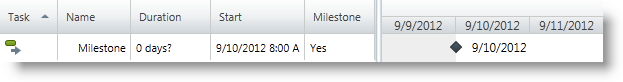

////

|metadata|
{
    "name": "xamgantt-configuring-milestones",
    "controlName": ["xamGantt"],
    "tags": [],
    "guid": "08183f9c-a9b4-4522-912a-3ee6ef4e3cb3",  
    "buildFlags": [],
    "createdOn": "2016-05-25T18:21:55.3851716Z"
}
|metadata|
////

= Configuring Milestones

== Topic Overview

=== Purpose

This topic explains how you create a milestone using the  _xamGantt™_   control.

=== Required background

The following topics are prerequisites to understanding this topic:

[options="header", cols="a,a"]
|====
|Topic|Purpose

| link:xamgantt-binding-to-data-using-project.html[Binding to Data Using Project]
|This topic describes how the _xamGantt_ control can be bound to data via Project property.

|====

=== In this topic

This topic contains the following sections:

* <<_Ref335079036, Creating a Milestone >>

** <<_Ref335257386,Overview>>
** <<_Ref335257399,Property settings>>
** <<_Ref335257406,Example>>

* <<_Ref335079042, Related Content >>

** <<_Ref335079072,Topics>>
** <<_Ref335079078,Samples>>

[[_Ref335079036]]
== Creating a Milestone

[[_Ref335257386]]

=== Overview

The milestone is a special project task with a duration of zero days.

Usually, milestones marks a major event or an important deliverable in the project plan.

You configure a task to be a milestone either:

* by setting the link:{ApiPlatform}controls.schedules.xamgantt{ApiVersion}~infragistics.controls.schedules.projecttask_members.html[ProjectTask] link:{ApiPlatform}controls.schedules.xamgantt{ApiVersion}~infragistics.controls.schedules.projecttask~ismilestone.html[IsMilestone] property to `true`
* or by setting the link:{ApiPlatform}controls.schedules.xamgantt{ApiVersion}~infragistics.controls.schedules.projecttask_members.html[ProjectTask] link:{ApiPlatform}controls.schedules.xamgantt{ApiVersion}~infragistics.controls.schedules.projecttask~duration.html[Duration] property to zero

The milestone is indicated both in the grid and chart  _xamGantt_   section.

* In the grid section, the  *Milestone*  column indicates whether or not a task is a milestone
* In the chart section, the milestone appears as a diamond symbol

[[_Ref335257399]]

=== Property settings

The following table maps the desired configuration to property settings.

[options="header", cols="a,a,a"]
|====
|In order to:|Use this property:|And set it to:

|Set a milestone
|`IsMilestone`
|`true`

|
|`Duration`
|`TimeSpan.Zero`

|====

[[_Ref335257406]]

=== Example

The example below demonstrates how to set a milestone:

*In C#:*

[source,csharp]
----
XamGantt gantt = new XamGantt();
Project project = new Project();
ProjectTask task = new ProjectTask();
task.TaskName = "Milestone";
task.IsManual = false;
//Setting a milestone
task.IsMilestone = true;
task.Start = DateTime.Today.ToUniversalTime();
project.RootTask.Tasks.Add(task);
gantt.Project = project;
----

*In Visual Basic:*

[source,vb]
----
Dim gantt As New XamGantt()
Dim project As New Project()
Dim task As New ProjectTask()
task.TaskName = "Milestone"
task.IsManual = False
'Setting a milestone
task.IsMilestone = True
task.Start = DateTime.Today.ToUniversalTime()
project.RootTask.Tasks.Add(task)
gantt.Project = project
----

[[_Ref335079042]]
== Related Content

[[_Ref335079072]]

=== Topics

The following topics provide additional information related to this topic.

[options="header", cols="a,a"]
|====
|Topic|Purpose

| link:xamgantt-configuring-tasks.html[Configuring Tasks]
|The topics in this group explain the _xamGantt_ ProjectTask class, its configurable aspects and the main features it provides.

|====

[[_Ref335079078]]

=== Samples

The following samples provide additional information related to this topic.

[options="header", cols="a,a"]
|====
|Sample|Purpose

| pick:[sl=" link:{SamplesURL}/gantt/#/milestone-and-summary-tasks[Milestone and Summary Tasks]"] pick:[wpf=" link:{SamplesURL}/gantt/milestone-and-summary-tasks[Milestone and Summary Tasks]"] 
|This sample demonstrates how you can add milestones and summary tasks.

|====