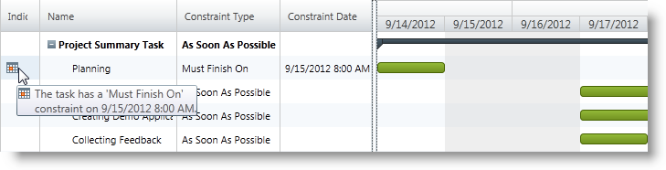

////
|metadata|
{
    "name": "xamgantt-configuring-task-constraint",
    "controlName": ["xamGantt"],
    "tags": ["Data Presentation","How Do I","Scheduling"],
    "guid": "263d5a61-fcba-4a19-8d8a-c8858063e1f7",
    "buildFlags": [],
    "createdOn": "2016-05-25T18:21:55.4571753Z"
}
|metadata|
////

= Configuring Tasks Constraints

== Topic Overview

=== Purpose

This topic explains how to configure tasks constraints using the  _xamGantt™_   control.

=== Required background

The following topics are prerequisites to understanding this topic:

[options="header", cols="a,a"]
|====
|Topic|Purpose

| link:xamgantt-binding-to-data-using-project.html[Binding to Data Using Project]
|This topic describes how the _xamGantt_ control can be bound to data via Project property.

|====

=== In this topic

This topic contains the following sections:

* <<_Ref335486138, Configuring Tasks Constrains Configuration Summary >>
* <<_Ref335486144, Setting a Task Constraint >>
* <<_Ref335486148, Related Content >>

** <<_Ref335486152,Topics>>
** <<_Ref335486158,Samples>>

[[_Ref335486138]]
== Configuring Tasks Constrains Configuration Summary

=== Tasks constrains configuration summary chart

The following table lists the configurable aspects when setting a task constraint in the  _xamGantt_   control. Additional details follow later in the topic.

[options="header", cols="a,a,a"]
|====
|Configurable aspect|Details|Property

|Configuring a task’s constraint type
|Returns or sets the type of a task’s constraint.
| link:{ApiPlatform}controls.schedules.xamgantt{ApiVersion}~infragistics.controls.schedules.projecttask~constrainttype.html[ConstraintType]

|Configuring a task’s constraint date
|Returns or sets the task’s constraint date. 

This property is not used when the constraint type is set to As Late As Possible or As Soon As Possible.
| link:{ApiPlatform}controls.schedules.xamgantt{ApiVersion}~infragistics.controls.schedules.projecttask~constraintdate.html[ConstraintDate]

|Configuring the priority in case of a conflict between task’s dependencies and constraints
|Returns or sets a Boolean value indicating whether the task’s constraint is considered with higher priority than the task’s dependencies.
| link:{ApiPlatform}controls.schedules.xamgantt{ApiVersion}~infragistics.controls.schedules.projectsettings~alwayshonortaskconstraintdates.html[AlwaysHonorTaskConstraintDates]

|====

[[_Ref335486144]]
== Setting a Task Constraint

=== Overview

The  _xamGantt_   control provides functionality for configuring tasks constraints and supports the constraint types available in Microsoft Project 2010.

The constraint types are following:

*As Soon As Possible* 

The task starts on or after the project’s start date and the start date of any ancestor summary tasks that are manually scheduled.

*As Late As Possible* 

The task finishes on or before the project’s finish date, task deadline (if specified), the finish date of any manually scheduled ancestor summary tasks, and the deadlines of any automatically scheduled ancestor summary tasks.

The following semi flexible and inflexible constraints depend on the link:{ApiPlatform}controls.schedules.xamgantt{ApiVersion}~infragistics.controls.schedules.projectsettings_members.html[ProjectSettings] link:{ApiPlatform}controls.schedules.xamgantt{ApiVersion}~infragistics.controls.schedules.projectsettings~alwayshonortaskconstraintdates.html[AlwaysHonorTaskConstraintDates] property specifying the priority of the constraints over dependencies:

*Must Start On*

The task must/should start on the specified constraint date.

*Must Finish On*

The task must/should finish on the specified constraint date.

*Start No Earlier Than*

The task must/should start no earlier than the specified constraint date.

*Start No Later Than*

The task must/should start no later than the specified constraint date.

*Finish No Earlier Than*

The task must/should finish no earlier than the specified constraint date.

*Finish No Later Than*

The task must/should finish no later than the specified constraint date.

By default, for projects scheduled from start date, the tasks constraint type is As Soon As Possible. For projects scheduled from finish date, the tasks constraint type is As Late As Possible.

The constraint type of the manually scheduled tasks is not editable.

=== Property settings

The following table maps the task constraint configuration to property settings.

[options="header", cols="a,a,a"]
|====
|In order to:|Use this property:|And set it to:

|Configure a task constraint type
| link:{ApiPlatform}controls.schedules.xamgantt{ApiVersion}~infragistics.controls.schedules.projecttask~constrainttype.html[ConstraintType]
| link:{ApiPlatform}controls.schedules.xamgantt{ApiVersion}~infragistics.controls.schedules.projecttaskconstrainttype.html[ProjectTaskConstraintType]

|Configure a task constraint date
| link:{ApiPlatform}controls.schedules.xamgantt{ApiVersion}~infragistics.controls.schedules.projecttask~constraintdate.html[ConstraintDate]
|`Nullable<DateTime>`

|====

=== Example

The example code below demonstrates how to set an inflexible constraint type “Must Finish On” to a task:

*In C#:*

[source,csharp]
----
ProjectTask planniningTask = this.gantt.Project.RootTask.Tasks[0].Tasks[0];
planniningTask.ConstraintType = ProjectTaskConstraintType.MustFinishOn;
planniningTask.ConstraintDate = DateTime.Today.AddHours(8).ToUniversalTime();
----

*In Visual Basic:*

[source,vb]
----
Dim planniningTask As ProjectTask = Me.gantt.Project.RootTask.Tasks(0).Tasks(0)
planniningTask.ConstraintType = ProjectTaskConstraintType.MustFinishOn
planniningTask.ConstraintDate = DateTime.Today.AddHours(8).ToUniversalTime()
----

[[_Ref335486148]]
== Related Content

[[_Ref335486152]]

=== Topics

The following topics provide additional information related to this topic.

[options="header", cols="a,a"]
|====
|Topic|Purpose

| link:xamgantt-configuring-tasks.html[Configuring Tasks]
|The topics in this group explain the _xamGantt_ ProjectTask class, its configurable aspects and the main features it provides.

|====

[[_Ref335486158]]

=== Samples

The following samples provide additional information related to this topic.

[options="header", cols="a,a"]
|====
|Sample|Purpose

| pick:[sl=" link:{SamplesURL}/gantt/#/task-constraints[Task Constraints]"] pick:[wpf=" link:{SamplesURL}/gantt/task-constraints[Task Constraints]"] 
|This sample demonstrates how a constraint can be set to a task and how this affects the project scheduling.

|====