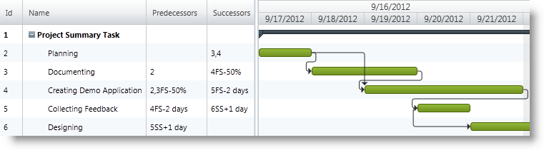

////

|metadata|
{
    "name": "xamgantt-configuring-task-dependencies",
    "controlName": ["xamGantt"],
    "tags": ["Data Presentation","Editing","How Do I","Scheduling"],
    "guid": "86cbd53b-79c0-4f0d-97a2-f19196efaa1a",  
    "buildFlags": [],
    "createdOn": "2016-05-25T18:21:55.433169Z"
}
|metadata|
////

= Configuring Task Dependencies

== Topic Overview

=== Purpose

This topic explains how to configure tasks dependencies using the  _xamGantt™_   control.

=== Required background

The following topics are prerequisites to understanding this topic:

[options="header", cols="a,a"]
|====
|Topic|Purpose

| link:xamgantt-binding-to-data-using-project.html[Binding to Data Using Project]
|This topic describes how the _xamGantt_ control can be bound to data via Project property.

|====

=== In this topic

This topic contains the following sections:

* <<_Ref335427291, Configuring Tasks Dependencies Configuration Summary >>
* <<_Ref335723199, Specifying Tasks Dependencies Using Predecessors and Successors Collections >>
* <<_Ref335723204, Specifying Tasks Dependencies Using PredecessorsIdText and SuccessorsIdText Properties >>
* <<_Ref335427310, Related Content >>

** <<_Ref335427315,Topics>>
** <<_Ref335427321,Samples>>

[[_Ref335427291]]
== Configuring Tasks Dependencies Configuration Summary

=== Tasks dependencies configuration summary chart

The following table lists possible options for configuring tasks dependencies in the  _xamGantt_   control. Additional details follow later in this topic.

[options="header", cols="a,a,a"]
|====
|Configurable aspect|Details|Property

|Specifying a task’s predecessors
|Returns or sets a string representing the task predecessors ID, link type and lead/lag time.
| link:{ApiPlatform}controls.schedules.xamgantt{ApiVersion}~infragistics.controls.schedules.projecttask~predecessorsidtext.html[PredecessorsIdText]

|Specifying a task’s predecessors
|Returns a collection of link:{ApiPlatform}controls.schedules.xamgantt{ApiVersion}~infragistics.controls.schedules.projecttaskdependency.html[ProjectTaskDependency] objects representing the task predecessors.
| link:{ApiPlatform}controls.schedules.xamgantt{ApiVersion}~infragistics.controls.schedules.projecttask~predecessors.html[Predecessors]

|Specifying a task’s successors
|Returns or sets a string representing the task successors ID, link type and lead/lag time.
| link:{ApiPlatform}controls.schedules.xamgantt{ApiVersion}~infragistics.controls.schedules.projecttask~successorsidtext.html[SuccessorsIdText]

|Specifying task’s successors
|Returns a collection of link:{ApiPlatform}controls.schedules.xamgantt{ApiVersion}~infragistics.controls.schedules.projecttaskdependency_members.html[ProjectTaskDependency] objects representing the task successors.
| link:{ApiPlatform}controls.schedules.xamgantt{ApiVersion}~infragistics.controls.schedules.projecttask~successors.html[Successors]

|Specify a dependency line type
|Returns or sets a value of type link:{ApiPlatform}controls.schedules.xamgantt{ApiVersion}~infragistics.controls.schedules.projecttaskdependencylinetype.html[ProjectTaskDependencyLineType] indicating the type of line connecting dependent tasks.
| link:{ApiPlatform}controls.schedules.xamgantt{ApiVersion}~infragistics.controls.schedules.xamgantt~taskdependencylinetype.html[TaskDependencyLineType]

|====

Supported dependency link types:

[options="header", cols="a,a,a"]
|====
|Link type notation in editor|Link type|Description

|FS
|Finish To Start
|If not otherwise specified this is the default link type. 

The successor's Start date is dependent upon the predecessor's Finish date.

|FF
|Finish To Finish
|The successor's Finish date is dependent upon the predecessor's Finish date.

|SF
|Start To Finish
|The successor's Finish date is dependent upon the predecessor's Start date.

|SS
|Start To Start
|The successor's Start date is dependent upon the predecessor's Start date.

|====

[[_Ref335723199]]
[[_Ref335427296]]
== Specifying Tasks Dependencies Using Predecessors and Successors Collections

=== Overview

The  _xamGantt_   control provides functionality for creating dependency links between tasks within a project and supports the link types available in Microsoft Project 2010. You can specify a lead and lag time of the dependency as well.

You create tasks dependencies programmatically using collections of tasks’ predecessors and successors. Use the link:{ApiPlatform}controls.schedules.xamgantt{ApiVersion}~infragistics.controls.schedules.projecttask_members.html[ProjectTask] link:{ApiPlatform}controls.schedules.xamgantt{ApiVersion}~infragistics.controls.schedules.projecttask~predecessors.html[Predecessors] and link:{ApiPlatform}controls.schedules.xamgantt{ApiVersion}~infragistics.controls.schedules.projecttask~successors.html[Successors] properties to create a collection of link:{ApiPlatform}controls.schedules.xamgantt{ApiVersion}~infragistics.controls.schedules.projecttaskdependency_members.html[ProjectTaskDependency] objects.

The `Successors` and `Predecessors` collections expose two overload methods of the Add method.

The first one takes as parameters link:{ApiPlatform}controls.schedules.xamgantt{ApiVersion}~infragistics.controls.schedules.projecttask_members.html[ProjectTask] and link:{ApiPlatform}controls.schedules.xamgantt{ApiVersion}~infragistics.controls.schedules.projecttasklinktype.html[ProjectTaskLinkType].

The second one takes as parameters link:{ApiPlatform}controls.schedules.xamgantt{ApiVersion}~infragistics.controls.schedules.projecttask_members.html[ProjectTask], link:{ApiPlatform}controls.schedules.xamgantt{ApiVersion}~infragistics.controls.schedules.projecttasklinktype.html[ProjectTaskLinkType] and link:{ApiPlatform}controls.schedules.xamgantt{ApiVersion}~infragistics.controls.schedules.projectduration_members.html[ProjectDuration].

See the link:xamgantt-columns-editing.html[xamGantt Columns Editing] topic for more information about tasks dependencies, their string representation and acceptable duration formats.

=== Property settings

The following table maps the tasks dependencies configuration to property settings.

[options="header", cols="a,a,a,a"]
|====
|In order to:|Use this property:|And method:|And set it to:

|Set a task’s successors collection
| link:{ApiPlatform}controls.schedules.xamgantt{ApiVersion}~infragistics.controls.schedules.projecttask~successors.html[Successors]
|`Add`
| link:{ApiPlatform}controls.schedules.xamgantt{ApiVersion}~infragistics.controls.schedules.projecttaskdependency_members.html[ProjectTaskDependency]

|Set a task’s predecessors collection
| link:{ApiPlatform}controls.schedules.xamgantt{ApiVersion}~infragistics.controls.schedules.projecttask~predecessors.html[Predecessors]
|`Add`
| link:{ApiPlatform}controls.schedules.xamgantt{ApiVersion}~infragistics.controls.schedules.projecttaskdependency_members.html[ProjectTaskDependency]

|====

=== Example

The code example below demonstrates how to create tasks dependencies using the `Predecessors` and `Successors` collections :

*In C#:*

[source,csharp]
----
ProjectTask firstTask = this.gantt.Project.RootTask.Tasks[0];
// Setting two dependencies for a task
// firstTask.Tasks[0].SuccessorsIdText = "3,4";
firstTask.Tasks[0].Successors.Add(firstTask.Tasks[1]);
firstTask.Tasks[0].Successors.Add(firstTask.Tasks[2]);
// Setting Finish-to-Start dependency 
// and a lead time of 50% between dependent tasks 
// The overlap between the tasks is 50% percent of the predecessor task duration
// firstTask.Tasks[1].SuccessorsIdText = "4FS-50%";
firstTask.Tasks[1].Successors.Add(firstTask.Tasks[2], ProjectTaskLinkType.FinishToStart, ProjectDuration.FromFormatUnits(-50, ProjectDurationFormat.Percent));
// Setting a lead time of two days
// firstTask.Tasks[3].PredecessorsIdText = "4FS-2 days";
firstTask.Tasks[3].Predecessors.Add(firstTask.Tasks[2], ProjectTaskLinkType.FinishToStart, ProjectDuration.FromFormatUnits(-2, ProjectDurationFormat.Days));
// Setting delay (lag time) of 1 day between dependent tasks
// firstTask.Tasks[4].PredecessorsIdText = "5SS+1d";
firstTask.Tasks[4].Predecessors.Add(firstTask.Tasks[3], ProjectTaskLinkType.StartToStart, ProjectDuration.FromFormatUnits(1, ProjectDurationFormat.Days));
----

*In Visual Basic:*

[source,vb]
----
Dim firstTask As ProjectTask = Me.gantt.Project.RootTask.Tasks(0)
' Setting two dependencies for a task
' firstTask.Tasks[0].SuccessorsIdText = "3,4";
firstTask.Tasks(0).Successors.Add(firstTask.Tasks(1))
firstTask.Tasks(0).Successors.Add(firstTask.Tasks(2))
' Setting Finish-to-Start dependency 
' and a lead time of 50% between dependent tasks 
' The overlap between the tasks is 50% percent of the predecessor task duration
' firstTask.Tasks[1].SuccessorsIdText = "4FS-50%";
firstTask.Tasks(1).Successors.Add(firstTask.Tasks(2), ProjectTaskLinkType.FinishToStart, ProjectDuration.FromFormatUnits(-50, ProjectDurationFormat.Percent))
' Setting a lead time of two days
' firstTask.Tasks[3].PredecessorsIdText = "4FS-2 days";
firstTask.Tasks(3).Predecessors.Add(firstTask.Tasks(2), ProjectTaskLinkType.FinishToStart, ProjectDuration.FromFormatUnits(-2, ProjectDurationFormat.Days))
' Setting delay (lag time) of 1 day between dependent tasks
' firstTask.Tasks[4].PredecessorsIdText = "5SS+1d";
firstTask.Tasks(4).Predecessors.Add(firstTask.Tasks(3), ProjectTaskLinkType.StartToStart, ProjectDuration.FromFormatUnits(1, ProjectDurationFormat.Days))
----

[[_Ref335723204]]
== Specifying Tasks Dependencies Using PredecessorsIdText and SuccessorsIdText Properties

=== Overview

In order to set a task’s dependencies, use the link:{ApiPlatform}controls.schedules.xamgantt{ApiVersion}~infragistics.controls.schedules.projecttask_members.html[ProjectTask] link:{ApiPlatform}controls.schedules.xamgantt{ApiVersion}~infragistics.controls.schedules.projecttask~successorsidtext.html[SuccessorsIdText] and link:{ApiPlatform}controls.schedules.xamgantt{ApiVersion}~infragistics.controls.schedules.projecttask~successorsidtext.html[SuccessorsIdText] properties. These properties accept a string representation of the dependency including dependent task ID, link type and lag or lead-time.

See the link:xamgantt-columns-editing.html[xamGantt Columns Editing] topic for more information about tasks dependencies and their string representation.

=== Property settings

The following table maps the task dependencies configuration to property settings.

[options="header", cols="a,a,a"]
|====
|In order to:|Use this property:|And set it to:

|Set a task successors
| link:{ApiPlatform}controls.schedules.xamgantt{ApiVersion}~infragistics.controls.schedules.projecttask~successorsidtext.html[SuccessorsIdText]
|`string`

|Set a task predecessors
| link:{ApiPlatform}controls.schedules.xamgantt{ApiVersion}~infragistics.controls.schedules.projecttask~predecessorsidtext.html[PredecessorsIdText]
|`string`

|====

=== Example

The screenshot below illustrates how to establish task dependencies using the following code example. Observe in the  _xamGantt_   chart area uses dependencies links to represent the defined dependencies.

*In C#:*

[source,csharp]
----
ProjectTask firstTask = this.gantt.Project.RootTask.Tasks[0];
// Setting two dependencies for a task
firstTask.Tasks[0].SuccessorsIdText = "3,4";
// Setting Finish-to-Start dependency 
// and a lead time of 50% between dependent tasks 
// The overlap between the tasks is 50% percent of the predecessor task duration
firstTask.Tasks[1].SuccessorsIdText = "4FS-50%";
// Setting a lead time of two days
firstTask.Tasks[3].PredecessorsIdText = "4FS-2 days";
// Setting delay (lag time) of 1 day between dependent tasks
firstTask.Tasks[4].PredecessorsIdText = "5SS+1d";
----

*In Visual Basic:*

[source,vb]
----
Dim firstTask As ProjectTask = Me.gantt.Project.RootTask.Tasks(0)
' Setting two dependencies for a task
firstTask.Tasks(0).SuccessorsIdText = "3,4"
' Setting Finish-to-Start dependency 
' and a lead time of 50% between dependent tasks 
' The overlap between the tasks is 50% percent of the predecessor task duration
firstTask.Tasks(1).SuccessorsIdText = "4FS-50%"
' Setting a lead time of two days
firstTask.Tasks(3).PredecessorsIdText = "4FS-2 days"
' Setting delay (lag time) of 1 day between dependent tasks
firstTask.Tasks(4).PredecessorsIdText = "5SS+1d"
----

[[_Ref335427310]]
== Related Content

[[_Ref335427315]]

=== Topics

The following topics provide additional information related to this topic.

[options="header", cols="a,a"]
|====
|Topic|Purpose

| link:xamgantt-configuring-tasks.html[Configuring Tasks]
|The topics in this group explain the _xamGantt_ ProjectTask class, its configurable aspects and the main features it provides.

|====

[[_Ref335427321]]

=== Samples

The following samples provide additional information related to this topic.

[options="header", cols="a,a"]
|====
|Sample|Purpose

| pick:[sl=" link:{SamplesURL}/gantt/#/task-dependencies[Task Dependencies]"] pick:[wpf=" link:{SamplesURL}/gantt/task-dependencies[Task Dependencies]"] 
|This sample demonstrates how to edit and display task dependencies using the _xamGantt_ control.

|====