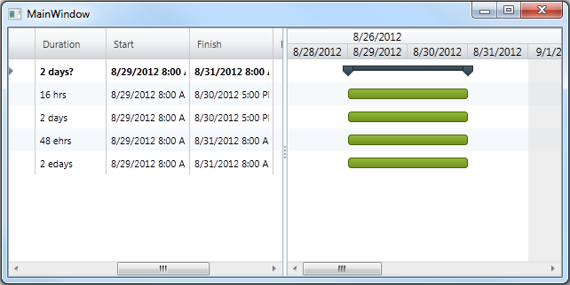

////
|metadata|
{
    "name": "xamgantt-configuring-task-duration-duration-format",
    "controlName": ["xamGantt"],
    "tags": ["Data Binding","Data Presentation","Grids","Patterns and Practices","Scheduling"],
    "guid": "a313ad7f-ff32-4f52-95b4-fd5625dc6401",
    "buildFlags": [],
    "createdOn": "2016-05-25T18:21:55.4271386Z"
}
|metadata|
////

= Configuring the Task Duration and Duration Format

== Topic Overview

=== Purpose

This topics describes how you can set task duration and task duration unit using  _xamGantt™._

=== In this topic

This topic contains the following sections:

* <<_Task_Duration_And_Format, Task Duration and Format >>

** <<_Introduction,Introduction>>

** <<_Duration_Unit_Types,Duration Unit types>>

** <<_Estimated_Duration_Value,Estimated Duration value>>

* <<_Code_Example_Setting_Task_Durations, Code Example: Setting Task Durations >>

** <<_Ref333763526,Description>>

** <<_Ref333763533,Code>>

* <<_Related_Content, Related Content >>

** <<_Ref333763550,Topics>>

** <<_Ref333763850,Samples>>

[[_Task_Duration_And_Format]]
== Task Duration and Format

[[_Introduction]]

=== Introduction

The duration of a task is the amount of time that the task requires. The task duration value represents a fixed amount of working time.

Task duration may be expressed in various units. The available units for task duration are defined in the link:{ApiPlatform}controls.schedules.xamgantt{ApiVersion}~infragistics.controls.schedules.projectdurationformat.html[ProjectDurationFormat] enumeration. Supported unit types are the same that Microsoft Project 2010 supports.

link:{ApiPlatform}controls.schedules.xamgantt{ApiVersion}~infragistics.controls.schedules.xamgantt_members.html[XamGantt] assembly defines two custom types for programmatically setting the task duration – link:{ApiPlatform}controls.schedules.xamgantt{ApiVersion}~infragistics.controls.schedules.projectduration_members.html[ProjectDuration] and link:{ApiPlatform}controls.schedules.xamgantt{ApiVersion}~infragistics.controls.schedules.manualprojectduration_members.html[ManualProjectDuration]. A convenient way of setting the project duration is to use the static link:{ApiPlatform}controls.schedules.xamgantt{ApiVersion}~infragistics.controls.schedules.projectduration~fromformatunits.html[FromFormatUnits] method of `ProjectDuration` structure.

[[_Duration_Unit_Types]]

=== Duration Unit types

Task duration units can be classified as normal duration units and elapsed duration units. Normal duration units base their calculations on the number of working hours per day. Elapsed duration units base their calculations on 24 hours clock and 7 day week. In other words, when calculating the duration of a 24 hour task using Normal duration units (assuming an 8 hour workday) would be 3 days while the same calculation using Elapsed duration units would be 1 day.

[[_Estimated_Duration_Value]]

=== Estimated Duration value

Estimated duration is a current best guess on a task’s duration value. You can set a duration value as an estimate and this will indicate that there is still information pending about the duration of this task.

.Note
[NOTE]
====
You can identify estimated duration values by the question mark displayed in the grid cell.
====

=== Project Duration

`ProjectDuration` represents an amount of time for the duration of a task (stored in minutes, as TimeSpan), duration unit (stored as `ProjectDurationFormat`) and optionally, whether the value is estimated or not.

Project duration depends on several properties of the link:{ApiPlatform}controls.schedules.xamgantt{ApiVersion}~infragistics.controls.schedules.projectsettings_members.html[ProjectSettings] class.These properties are used to calculate the number of minutes that a duration represents. They are summarized in the table below:

[options="header", cols="a,a"]
|====
|Property|Description

| link:{ApiPlatform}controls.schedules.xamgantt{ApiVersion}~infragistics.controls.schedules.projectsettings~dayspermonth.html[DaysPerMonth]
|Gets or sets the value indicating the number of days used when calculating a day unit.

| link:{ApiPlatform}controls.schedules.xamgantt{ApiVersion}~infragistics.controls.schedules.projectsettings~minutesperday.html[MinutesPerDay]
|Gets or sets the value indicating the number of minutes used when calculating a day unit.

| link:{ApiPlatform}controls.schedules.xamgantt{ApiVersion}~infragistics.controls.schedules.projectsettings~minutesperweek.html[MinutesPerWeek]
|Gets or sets the value indicating the number of minutes used when calculating a week unit.

|====

.Note
[NOTE]
====

Changing the value of those properties does not change the duration of tasks already created. Those properties should be set before creating tasks.

Those properties affect the way that duration is displayed.
====

[[_Code_Example_Setting_Task_Durations]]
== Code Example: Setting Task Durations

[[_Ref333763526]]

=== Description

This code example demonstrates how to use the `ProjectDuration` `FromFormatUnits` static method to programmatically set the task’s durations. It demonstrates how to set different duration units and values.

=== Prerequisites

To complete the procedure, you need the following:

* A project with the following required references:

** {ApiPlatform}Controls.Editors.XamCalendar.dll

** {ApiPlatform}Controls.Grids.XamGrid.dll

** {ApiPlatform}Controls.Menus.XamMenu.dll

** {ApiPlatform}Controls.Schedules.dll

** {ApiPlatform}Controls.Schedules.XamGantt.dll

** {ApiPlatform}DataManager.dll

** {ApiPlatform}dll

=== Preview

You can see the preview of both compiled and run sample project. It shows  _xamGantt_   with four sample tasks created by specifying values for duration and duration units for each of these tasks.

=== Code explanation

You can set the project task duration using the `FromFormatUnits` method. The code snippet below shows how to create a project task and set its duration.

*In C#:*
[source,csharp]
----
…
new ProjectTask {
    TaskName = "Task 01",
    IsManual = false,
    ManualDuration = ProjectDuration.FromFormatUnits(16, ProjectDurationFormat.Hours)
}…
----

*In Visual Basic:*
[source,vb]
----
…
New ProjectTask() With { _
    .TaskName = "Task 01", _
    .IsManual = False, _
    .ManualDuration = ProjectDuration.FromFormatUnits(16, ProjectDurationFormat.Hours) _
}
…
----

[[_Ref333763533]]
=== Code

*In XAML:*
[source,xaml]
----
<Grid>
    <ig:XamGantt x:Name="xamGantt" Project="{Binding}" />
</Grid>
----

*In C#:*
[source,csharp]
----
public Main()
{
    InitializeComponent();
    Loaded += OnMainLoaded;
}

void OnMainLoaded(object sender, RoutedEventArgs rea)
{
    DataContext = GenerateProject();
}

private static Project GenerateProject()
{
    Project project = new Project();
    ProjectTask root = new ProjectTask { TaskName = "Summary", IsManual = false };
    project.RootTask.Tasks.Add(root);
    root.Tasks.Add(new ProjectTask 
    { TaskName = "Task 01", IsManual=false, ManualDuration = 
        ProjectDuration.FromFormatUnits(16, ProjectDurationFormat.Hours) } );
    root.Tasks.Add(new ProjectTask 
    { TaskName = "Task 02", IsManual=false, ManualDuration = 
        ProjectDuration.FromFormatUnits(2, ProjectDurationFormat.Days) } );
    root.Tasks.Add(new ProjectTask 
    { TaskName = "Task 03", IsManual = false, ManualDuration = 
        ProjectDuration.FromFormatUnits(48, ProjectDurationFormat.ElapsedHours) } );
    root.Tasks.Add(new ProjectTask 
    { TaskName = "Task 04", IsManual=false, ManualDuration = 
        ProjectDuration.FromFormatUnits(2, ProjectDurationFormat.ElapsedDays) } );
    return project;
}
----

*In Visual Basic:*
[source,vb]
----
Public Sub New()
      InitializeComponent()
      Loaded = AddressOf OnMainLoaded
End Sub

Private Sub OnMainLoaded(sender As Object, rea As RoutedEventArgs)
      DataContext = GenerateProject()
End Sub

Private Shared Function GenerateProject() As Project
    Dim project As New Project()
    Dim root As New ProjectTask() With { 
        .TaskName = "Summary", 
        .IsManual = False 
    }
    project.RootTask.Tasks.Add(root)
    root.Tasks.Add(New ProjectTask() With { 
        .TaskName = "Task 01", 
        .IsManual = False, 
        .ManualDuration = ProjectDuration.FromFormatUnits(16, ProjectDurationFormat.Hours) 
    })
    root.Tasks.Add(New ProjectTask() With { 
        .TaskName = "Task 02", 
        .IsManual = False, 
        .ManualDuration = ProjectDuration.FromFormatUnits(2, ProjectDurationFormat.Days) 
    })
    root.Tasks.Add(New ProjectTask() With { 
        .TaskName = "Task 03", 
        .IsManual = False, 
        .ManualDuration = ProjectDuration.FromFormatUnits(48, ProjectDurationFormat.ElapsedHours) 
    })
    root.Tasks.Add(New ProjectTask() With { 
        .TaskName = "Task 04", 
        .IsManual = False, 
        .ManualDuration = ProjectDuration.FromFormatUnits(2, ProjectDurationFormat.ElapsedDays) 
    })
    Return project
End Function
----

[[_Related_Content]]
== Related Content

[[_Ref333763550]]
=== Topics

The following topics provide additional information related to this topic.

[options="header", cols="a,a"]
|====
|Topic|Purpose

| link:xamgantt-configuring-tasks.html[Configuring Tasks]
|The topics in this group explain the _xamGantt_ ProjectTask class, its configurable aspects and the main features it provides.

| link:xamgantt-xamgantt-user-interactions-in-the-grid-section.html[xamGantt User Interactions in the Grid Section]
|This topic describes the user interactions that can be performed in the grid section of the _xamGantt_ control.

|====

[[_Ref333763850]]
=== Samples

The following samples provide additional information related to this topic.

[options="header", cols="a,a"]
|====
|Sample|Purpose

| link:{SamplesURL}/gantt/task-durations[Task Durations]
|This sample demonstrates how you can use project tasks with different durations and different duration formats.

|====