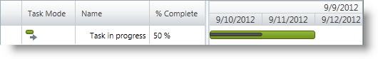

////

|metadata|
{
    "name": "xamgantt-configuring-task-progress",
    "controlName": ["xamGantt"],
    "tags": ["Data Presentation","How Do I","Scheduling"],
    "guid": "166a02cf-0d80-40c0-be53-810f14c8416e",  
    "buildFlags": [],
    "createdOn": "2016-05-25T18:21:55.3921315Z"
}
|metadata|
////

= Configuring Task Progress

== Topic Overview

=== Purpose

This topic explains how you set task progress using the  _xamGantt™_   control.

=== Required background

The following topics are prerequisites to understanding this topic:

[options="header", cols="a,a"]
|====
|Topic|Purpose

| link:xamgantt-binding-to-data-using-project.html[Binding to Data Using Project]
|This topic describes how the _xamGantt_ control can be bound to data via Project property.

|====

=== In this topic

This topic contains the following sections:

* <<_Ref335085121, Setting Task Progress >>

** <<_Ref335259255,Overview>>
** <<_Ref335259262,Property settings>>
** <<_Ref335259273,Example>>

* <<_Ref335085126, Related Content >>

** <<_Ref335085132,Topics>>
** <<_Ref335085137,Samples>>

[[_Ref335085121]]
== Setting Task Progress

[[_Ref335259255]]

=== Overview

You specify the project task’s progress as a percentage of work completed.

To specify the progress, use the link:{ApiPlatform}controls.schedules.xamgantt{ApiVersion}~infragistics.controls.schedules.projecttask_members.html[ProjectTask] link:{ApiPlatform}controls.schedules.xamgantt{ApiVersion}~infragistics.controls.schedules.projecttask~percentcomplete.html[PercentComplete] property and set it to a decimal type in the range from 0 to 100.

The control displays the task’s progress in both the grid and chart  _xamGantt_   section.

* In the grid section, the task progress appears in the  *% Complete*  column. If the task work is 100% completed, a check mark notification icon appears in the grid Indicators column.
* In the chart section, the progress appears as a progress line on the taskbar where the end of the bar represents the CompleteThrough date for the task.

[[_Ref335259262]]

=== Property settings

The following table maps the desired configuration to property settings.

[options="header", cols="a,a,a"]
|====
|In order to:|Use this property:|And set it to:

|Set task’s progress
| link:{ApiPlatform}controls.schedules.xamgantt{ApiVersion}~infragistics.controls.schedules.projecttask~percentcomplete.html[PercentComplete]
|`decimal`

|====

[[_Ref335259273]]

=== Example

The example below demonstrates how to set a task’s progress to 50%:

[options="header", cols="a,a"]
|====
|Property|Value

|`PercentComplete`
|`50`

|====

*In C#:*

[source,csharp]
----
XamGantt gantt = new XamGantt();
Project project = new Project();
ProjectTask task = new ProjectTask();
task.TaskName = "Task in progress";
task.IsManual = false;
// Set task progress
task.PercentComplete = 50;
task.Duration = TimeSpan.FromHours(16);
task.Start = DateTime.Today.ToUniversalTime();
project.RootTask.Tasks.Add(task);
gantt.Project = project;
----

*In Visual Basic:*

[source,vb]
----
Dim gantt As New XamGantt()
Dim project As New Project()
Dim task As New ProjectTask()
task.TaskName = "Task in progress"
task.IsManual = False
' Set task progress
task.PercentComplete = 50
task.Duration = TimeSpan.FromHours(16)
task.Start = DateTime.Today.ToUniversalTime()
project.RootTask.Tasks.Add(task)
gantt.Project = project
----

[[_Ref335085126]]
== Related Content

[[_Ref335085132]]

=== Topics

The following topics provide additional information related to this topic.

[options="header", cols="a,a"]
|====
|Topic|Purpose

| link:xamgantt-configuring-tasks.html[Configuring Tasks]
|The topics in this group explain the _xamGantt_ ProjectTask class, its configurable aspects and the main features it provides.

|====

[[_Ref335085137]]

=== Samples

The following samples provide additional information related to this topic.

[options="header", cols="a,a"]
|====
|Sample|Purpose

| pick:[sl=" link:{SamplesURL}/gantt/#/tasks-progress[Tasks Progress]"] pick:[wpf=" link:{SamplesURL}/gantt/tasks-progress[Tasks Progress]"] 
|This sample demonstrates how a task progress is set and displayed to visualize the completed work percent.

|====